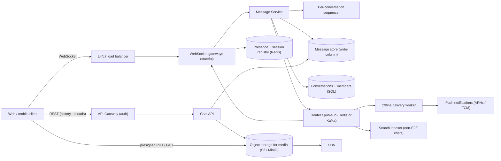
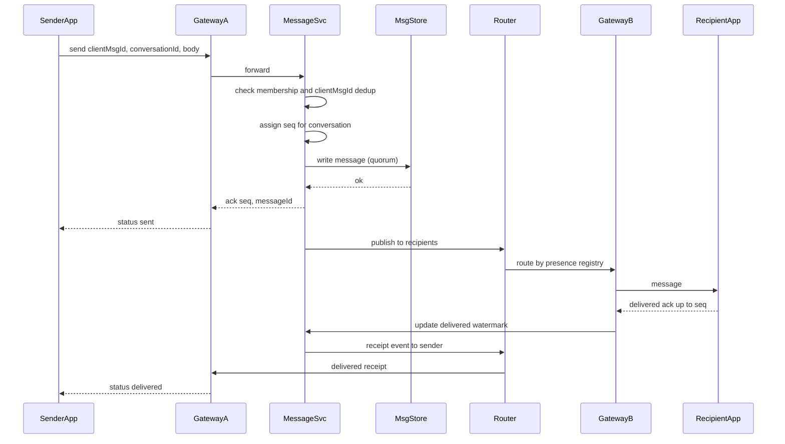

# Chat Messaging System

> **Reviewed:** 2026-09 · **Scope:** Full-stack (frontend + backend + scalability) · **Level:** Senior / Tech Lead

---

## Overview

Design a real-time chat messaging system where users can send instant messages, support one-on-one and group chats, with message delivery status, typing indicators, and media sharing.

---

## 1) Requirements

### Functional Requirements

**Core Features:**
- Real-time messaging (one-on-one and group chats)
- Message delivery status (sent, delivered, read)
- Typing indicators (show when users are typing)
- Online/offline status
- Media sharing (images, videos, files, voice messages)
- Message search
- Message reactions (emojis)
- Message editing and deletion
- Push notifications for offline users

**Advanced Features:**
- End-to-end encryption
- Message forwarding
- Chat archiving
- Voice and video calls
- Group chat management (add/remove members, roles)

### Non-Functional Requirements

**Performance:**
- Sub-100ms message delivery latency
- Real-time typing indicators
- Fast message history loading
- Efficient media handling

**Scalability:**
- Handle 2B+ users
- 100B+ messages per day
- Millions of concurrent connections
- High availability (99.9% uptime)

**Reliability:**
- 99.9% message delivery guarantee
- Message persistence and retrieval
- Offline message delivery
- Message ordering guarantee

---

## 2) Component Hierarchy

The frontend is a React application with real-time messaging. Here's the structure:

```
App
├── Layout
│   ├── Header
│   │   ├── Logo
│   │   └── UserMenu
│   └── MainContent
├── Pages
│   ├── ChatPage
│   │   ├── ChatSidebar
│   │   │   ├── ChatList
│   │   │   │   └── ChatItem
│   │   │   │       ├── Avatar
│   │   │   │       ├── ChatName
│   │   │   │       ├── LastMessage
│   │   │   │       ├── Timestamp
│   │   │   │       └── UnreadBadge
│   │   │   └── SearchBar (search chats)
│   │   └── ChatWindow
│   │       ├── ChatHeader
│   │       │   ├── ChatName
│   │       │   ├── OnlineStatus
│   │       │   └── ChatActions (Info, Mute)
│   │       ├── MessageList
│   │       │   └── MessageBubble
│   │       │       ├── MessageContent (text, media)
│   │       │       ├── MessageTime
│   │       │       ├── DeliveryStatus (sent, delivered, read)
│   │       │       ├── MessageReactions
│   │       │       └── MessageActions (Edit, Delete, Forward)
│   │       ├── TypingIndicator (shows who's typing)
│   │       └── MessageInput
│   │           ├── TextInput
│   │           ├── AttachmentButton
│   │           ├── EmojiPicker
│   │           └── SendButton
│   └── ChatInfoPage
│       ├── ChatDetails
│       ├── MediaGallery
│       └── GroupMembers (for group chats)
└── SharedComponents
    ├── Avatar
    ├── MessageBubble
    ├── TypingIndicator
    └── MediaViewer
```

### Key Components Explained

**1. ChatWindow Component**
- Main chat interface
- Manages WebSocket connection
- Handles message sending/receiving
- Real-time updates via WebSocket

**2. MessageList Component**
- Displays messages with virtual scrolling
- Infinite scroll for message history
- Groups messages by date
- Shows delivery status

**3. MessageBubble Component**
- Individual message display
- Shows sender, content, time, status
- Handles media (images, videos, files)
- Message reactions and actions

**4. MessageInput Component**
- Text input for messages
- Attachment support
- Emoji picker
- Typing indicator triggers
- Send button with validation

**5. ChatList Component**
- List of conversations
- Shows last message preview
- Unread count badges
- Search and filter functionality

---

## 3) Data Models

Here are the key data structures:

```typescript
// Conversation (chat)
interface Conversation {
  id: string;
  type: "direct" | "group";
  participants: Participant[];
  lastMessage?: Message;
  unreadCount: number;
  updatedAt: string;
  createdAt: string;
  name?: string;  // For group chats
  avatar?: string;  // For group chats
}

// Participant
interface Participant {
  id: string;
  name: string;
  avatar?: string;
  isOnline: boolean;
  lastSeen?: string;
  role?: "admin" | "member";  // For group chats
}

// Message
interface Message {
  id: string;
  conversationId: string;
  senderId: string;
  sender: Participant;
  content: string;
  type: "text" | "image" | "file" | "audio" | "video";
  timestamp: string;
  status: "sending" | "sent" | "delivered" | "read";
  readBy: string[];  // User IDs who read the message
  reactions: Reaction[];
  replyTo?: {
    id: string;
    content: string;
    senderId: string;
  };
  attachments?: Attachment[];
  editedAt?: string;
  deletedAt?: string;
}

// Reaction
interface Reaction {
  emoji: string;
  users: string[];  // User IDs who reacted
}

// Attachment
interface Attachment {
  id: string;
  type: "image" | "file" | "audio" | "video";
  url: string;
  name?: string;
  size?: number;
  mimeType?: string;
  thumbnailUrl?: string;  // For videos
}
```

### Data Flow Explanation

**When a user sends a message:**
1. User types message in MessageInput
2. Optimistic update: message appears immediately with "sending" status
3. WebSocket sends message to server
4. Server broadcasts to other participants
5. Status updates to "sent", then "delivered", then "read"
6. Other users receive message via WebSocket

**Message delivery status:**
1. "sending" - Message being sent (optimistic)
2. "sent" - Message sent to server
3. "delivered" - Message delivered to recipient's device
4. "read" - Recipient has read the message (read receipts)

**Typing indicator:**
1. User starts typing in MessageInput
2. WebSocket emits "typing" event
3. Other users see typing indicator
4. Indicator hides after 3 seconds of inactivity

**Real-time updates:**
1. WebSocket connection per user
2. Server broadcasts new messages, typing, presence
3. Frontend receives and updates UI
4. Optimistic updates for instant feedback
5. Sync with server state

---

## 4) API Design

### REST Endpoints

**GET /api/v1/conversations**
- Get user's conversations
- Query params: `page`, `limit`
- Returns: Paginated list of Conversation objects

**POST /api/v1/conversations**
- Create a conversation
- Request body: `{ type: "direct" | "group", participantIds: string[] }`
- Returns: Conversation object

**GET /api/v1/conversations/:id/messages**
- Get messages in conversation
- Query params: `cursor`, `limit`
- Returns: Paginated list of Message objects

**POST /api/v1/conversations/:id/messages**
- Send a message
- Request body: `{ content: string, type: string, attachments?: Attachment[] }`
- Returns: Message object

**PATCH /api/v1/messages/:id**
- Edit a message
- Request body: `{ content: string }`
- Returns: Updated Message object

**DELETE /api/v1/messages/:id**
- Delete a message
- Returns: Success confirmation

**POST /api/v1/messages/:id/reactions**
- Add or remove reaction
- Request body: `{ emoji: string }`
- Returns: Updated Message with reactions

**POST /api/v1/messages/:id/read**
- Mark message as read
- Returns: Success confirmation

### WebSocket Events

**Connection:** `wss://api.example.com/chat`

**Events:**
- `message` - New message received
- `message_sent` - Message sent confirmation
- `message_delivered` - Message delivered confirmation
- `message_read` - Message read confirmation
- `typing` - User is typing
- `typing_stop` - User stopped typing
- `presence` - User online/offline status
- `user_joined` - User joined conversation
- `user_left` - User left conversation

**Message Format:**
```json
{
  "type": "message",
  "data": {
    "id": "msg_123",
    "conversationId": "conv_456",
    "senderId": "user_789",
    "content": "Hello!",
    "timestamp": "2024-01-15T10:00:00Z",
    "status": "sent"
  }
}
```

### API Request/Response Examples

**Get Messages:**
```json
// GET /api/v1/conversations/conv_456/messages?cursor=abc123&limit=50
// Response
{
  "success": true,
  "data": {
    "messages": [
      {
        "id": "msg_123",
        "senderId": "user_789",
        "sender": {
          "id": "user_789",
          "name": "John Doe",
          "avatar": "https://cdn.example.com/avatar.jpg"
        },
        "content": "Hello!",
        "type": "text",
        "timestamp": "2024-01-15T10:00:00Z",
        "status": "read",
        "reactions": []
      }
    ],
    "hasMore": true,
    "nextCursor": "xyz789"
  }
}
```

**Send Message:**
```json
// POST /api/v1/conversations/conv_456/messages
{
  "content": "Hello!",
  "type": "text"
}

// Response
{
  "success": true,
  "data": {
    "id": "msg_123",
    "content": "Hello!",
    "status": "sent",
    "timestamp": "2024-01-15T10:00:00Z"
  }
}
```

---

## 5) Key Design Decisions

**1. WebSocket for Real-time Messaging**
- Instant message delivery (< 100ms)
- Real-time typing indicators
- Presence updates
- Better user experience

**2. Optimistic Updates**
- Show messages immediately (useOptimistic)
- Better perceived performance
- Rollback if send fails
- Instant user feedback

**3. Message Delivery Status**
- Track sent, delivered, read status
- Read receipts for confirmation
- Better user experience
- Privacy controls for read receipts

**4. Infinite Scroll for Message History**
- Load older messages as user scrolls up
- Cursor-based pagination
- Efficient for long conversations
- Smooth scrolling

**5. Message Persistence**
- Store all messages in database
- Enable message search
- Offline message delivery
- Message history retrieval

**6. Typing Indicators**
- Show when users are typing
- Debounce typing events (3 seconds)
- Better real-time feel
- WebSocket for instant updates

**7. Next.js App Router Considerations**
- The conversation list and the initial message page can be server-rendered (Server Components) for fast first paint; the live chat window, input, and WebSocket connection live in client components
- WebSocket connections should go to dedicated gateway services, not to Next.js route handlers or serverless functions, which are not designed for long-lived connections
- Keep a local store (IndexedDB) of recent messages for offline reading and instant reopen

---

## 6) Backend High-Level Design

Chat has two paths: a **real-time path** (long-lived WebSocket connections, low latency routing) and a **durable path** (persist every message with per-conversation ordering, sync to offline devices).



**Components**

| Component | Responsibility | Notes |
|-----------|----------------|-------|
| WebSocket gateways | Terminate connections, authenticate on connect, heartbeat, forward frames | Stateful; each holds many connections; scaled horizontally |
| Session/presence registry | `userId -> [gatewayId, deviceId]`, online/last-seen | Redis with TTL refreshed by heartbeats |
| Message Service | Validate membership, assign sequence number, persist, route | Stateless |
| Sequencer | Monotonic `seq` per conversation | See ordering below |
| Message store | Append-heavy, read by conversation range | Cassandra/ScyllaDB-style wide-column, or sharded Postgres at smaller scale |
| Router | Deliver persisted messages to the gateways holding recipients' connections | Redis pub/sub or Kafka partitioned by conversation |
| Offline worker | For recipients with no live connection, send push notification | Can reuse the [Notification System](./05-notification-system.md) |
| Object storage | Images, video, files via presigned URLs | [MinIO](../backend/minio/index.md) or S3, served via CDN |

### Message ordering per conversation

- Global ordering is unnecessary and expensive; users only need a consistent order **within a conversation**.
- Assign a monotonically increasing `seq` per conversation at write time: e.g., an atomic `INCR conv:{id}:seq` in Redis backed by the DB, or route all writes for a conversation to one partition (Kafka partition key = `conversationId`) whose consumer assigns sequence numbers.
- Clients render by `seq`, not by client timestamp (device clocks drift).
- Client-generated `clientMsgId` (UUID) makes sends idempotent: a retry after a dropped ack does not create a duplicate.

### Delivery and read receipts

- **Sent:** server persisted the message and acked the sender with `seq`.
- **Delivered:** a recipient device received it and acked; the server records `delivered_up_to_seq` per member/device.
- **Read:** recipient opened the conversation; client sends `read_up_to_seq`.
- Store receipts as **watermarks** (highest seq), not per-message rows; this collapses thousands of receipts into one update. In groups, show "read by N" by comparing members' watermarks.

### Offline sync

- Each device tracks `last_synced_seq` per conversation (or a per-user inbox cursor).
- On reconnect, the client calls `GET /sync?since=...` and receives missed messages in order, then resumes the live stream.
- For a user in many conversations, maintain a per-user "conversation updated" index so sync only touches conversations with new activity.

### End-to-end encryption (high level)

- With E2E encryption, clients encrypt message bodies with keys the server never sees; the server stores and routes ciphertext plus minimal metadata.
- Key exchange uses published identity/pre-keys per device (the Signal Protocol is the well-known reference design); each device of each participant gets its own encrypted copy or a group session key.
- Consequences to call out: server-side search, content moderation, and link previews no longer work on the server; multi-device and message history for new devices become harder; media is encrypted client-side before upload to object storage.

---

## 7) Data Model and Consistency

**Schema sketch**

```sql
-- Relational: conversations and membership
CREATE TABLE conversations (
  conversation_id BIGINT PRIMARY KEY,
  type            TEXT,          -- direct | group
  title           TEXT,
  created_at      TIMESTAMPTZ,
  last_seq        BIGINT         -- latest sequence number
);

CREATE TABLE conversation_members (
  conversation_id BIGINT,
  user_id         BIGINT,
  role            TEXT,
  delivered_up_to_seq BIGINT DEFAULT 0,
  read_up_to_seq      BIGINT DEFAULT 0,
  muted_until     TIMESTAMPTZ,
  PRIMARY KEY (conversation_id, user_id)
);
CREATE INDEX idx_members_user ON conversation_members (user_id);

-- Per-user inbox for the conversation list, sorted by recent activity
CREATE TABLE user_conversations (
  user_id BIGINT, last_activity_at TIMESTAMPTZ, conversation_id BIGINT,
  PRIMARY KEY (user_id, last_activity_at, conversation_id)
);
```

```text
-- Wide-column message store (CQL-style)
messages (
  conversation_id  bigint,
  bucket           int,        -- e.g. month or seq / 10000, bounds partition size
  seq              bigint,
  message_id       uuid,
  client_msg_id    uuid,
  sender_id        bigint,
  type             text,
  body             blob,       -- ciphertext if E2E
  attachments      list<text>, -- object storage keys
  edited_at        timestamp,
  deleted          boolean,
  PRIMARY KEY ((conversation_id, bucket), seq)
) WITH CLUSTERING ORDER BY (seq DESC);
```

**Partitioning**
- Messages partitioned by `(conversation_id, bucket)`: one conversation's recent history is one partition read, and the bucket stops very active group chats from creating unbounded partitions.
- Membership and user inbox are sharded by `user_id` for the "my chats" query, and by `conversation_id` for fan-out to members.
- WebSocket gateways are not partitioned by user; the presence registry tells the router where each user is connected.

**Consistency trade-offs**
- **Per-conversation ordering is strong:** one sequencer per conversation.
- **Cross-conversation state is eventual:** conversation list ordering, unread badges, and presence may lag briefly.
- **Presence is best-effort:** TTL-based, heartbeats every N seconds (illustrative); "last seen" can be stale by up to the TTL.
- **Durability before ack:** the sender's message is acked only after it is persisted (to a replicated store); delivery to recipients is at-least-once and deduped client-side by `message_id`.

**Idempotency**
- `clientMsgId` is unique per `(conversation_id, sender_id)`; the Message Service checks a short-lived Redis key or a lookup table before assigning a new `seq`, and returns the existing message on retry.
- Receipts are monotonic watermarks: `UPDATE ... SET read_up_to_seq = GREATEST(read_up_to_seq, :seq)`, so duplicates and reordering are harmless.

---

## 8) Scalability and Reliability

### Back-of-envelope estimate

> All numbers below are **ILLUSTRATIVE ASSUMPTIONS** for practice.

| Assumption | Value |
|------------|-------|
| Daily active users | 50M |
| Messages sent per DAU per day | 40 |
| Average stored message size (with metadata) | 200 bytes |
| Peak concurrent connected users | 20% of DAU |
| Connections per gateway instance | 50,000 |
| Peak-to-average message rate | 3x |

Arithmetic:
- Messages: 50M × 40 = 2B/day ÷ 86,400 ≈ **23,000 messages/s**, ≈ **69,000/s** peak.
- Storage: 2B × 200 B ≈ **400 GB/day** ≈ **146 TB/year** before replication (media is separate, in object storage).
- Concurrent connections: 50M × 20% = **10M**; ÷ 50,000 per gateway ≈ **200 gateway instances**, plus headroom for failover.
- Deliveries: in group chats one message fans out to every online member, so delivery rate is higher than send rate; large groups need special handling.

### Bottlenecks and how to remove them

| Bottleneck | Fix |
|------------|-----|
| Millions of long-lived connections | Horizontally scaled gateways, efficient event-loop servers, OS tuning (file descriptors), heartbeats |
| Routing a message to the right gateway | Presence registry plus pub/sub channel per gateway |
| Hot group conversation | Bucketed partitions, batch fan-out, limit group size or switch very large groups to a "channel" model with pull |
| Message store write throughput | Wide-column store designed for append-heavy writes, partitioned by conversation |
| Reconnect storms after a gateway deploy/crash | Jittered exponential backoff on clients, connection draining during deploys, rate limit connects |
| Media through app servers | Presigned URLs directly to object storage, CDN for downloads |
| Abuse and spam | Per-user send rate limits, new-account limits, reporting |

### Failure modes

| Failure | Impact | Mitigation |
|---------|--------|------------|
| Gateway instance crashes | Its users disconnect | Clients reconnect with jitter to another gateway, then sync from `last_synced_seq` |
| Ack lost after server persisted | Client retries, possible duplicate | `clientMsgId` idempotency returns existing message |
| Router/pub-sub outage | Live delivery stops | Messages are persisted; clients receive them on sync; push notifications as fallback |
| Presence registry stale | Wrong online indicator, misrouted delivery | TTL expiry, delivery falls back to offline path |
| Message store partition unavailable | Some conversations cannot send | Replication factor with quorum writes; surface "sending failed, retrying" in the UI |
| Sequencer contention in huge group | Send latency increases | Batch sequence allocation, cap group size, separate "broadcast channel" design |

### Most important flow: send, persist, deliver, receipt



---

## 9) Deep Dive Options (RADIO)

<details>
<summary>Deep dive 1: Ordering and exactly-once display</summary>

- **Requirements:** Messages appear in the same order for all members; no duplicates after retries or reconnects.
- **Architecture:** Per-conversation sequencer; persistence before ack; client dedup by `message_id`.
- **Data model:** `messages` keyed by `(conversation_id, bucket), seq`; `clientMsgId` dedup key.
- **Interface:** WebSocket `send` with `clientMsgId`, ack with `seq`; `GET /sync?conversationId&afterSeq`.
- **Optimizations:** Gap detection on client (missing seq triggers a range fetch), batch sequence allocation for hot groups.

</details>

<details>
<summary>Deep dive 2: Presence and connection management at 10M connections</summary>

- **Requirements:** Online indicators within seconds, survive gateway restarts, no reconnect storms.
- **Architecture:** Gateways publish heartbeats to Redis with TTL; subscribers only for users with that contact visible.
- **Data model:** `presence:{userId} -> {status, gatewayId, lastSeen}` with TTL.
- **Interface:** `presence` WebSocket events, rate limited and batched.
- **Optimizations:** Only fan out presence to contacts currently viewing, lazy "last seen" fetch, connection draining.

</details>

<details>
<summary>Deep dive 3: Media messages and E2E encryption</summary>

- **Requirements:** Send large files reliably, keep server blind to content in E2E mode.
- **Architecture:** Client requests presigned upload URL, uploads (encrypted if E2E) to object storage, sends message with object key and decryption key inside the encrypted payload.
- **Data model:** `attachments(object_key, size, mime, thumbnail_key)`; lifecycle rules for retention.
- **Interface:** `POST /uploads` returns presigned PUT; downloads via presigned GET or CDN.
- **Optimizations:** Multipart/resumable uploads, client-side thumbnails, dedup by content hash (not possible with per-message E2E keys).

</details>

---

## 10) Scaling with AI and Agentic Workflows

See [Agentic Workflows](../agentic-workflows/index.md) and [AI-Assisted Development](../ai/ai-assisted-development/index.md).

**Where AI and agents help in engineering**
- **Brainstorm bottlenecks, then validate:** e.g., list what breaks at 10M connections, then check file descriptor limits, memory per connection, and gateway count with the math above.
- **Generate load tests for review:** k6 (WebSocket support) or Locust scripts that open many connections, send messages with realistic group-size distributions, and simulate reconnect storms; a human reviews rates and safety limits.
- **Summarize production signals:** summarize connection churn, send latency percentiles, and traces across gateway, Message Service, and store for RCA.
- **Draft migration plans:** e.g., moving messages from Postgres to a wide-column store with dual writes and backfill, for design review.
- **Draft runbooks and manifests:** gateway drain-and-deploy runbook, Kubernetes manifests with connection-aware rollout, Terraform for Redis/Kafka (see [DevOps](../devops/index.md)).

**AI in the product**
- **Spam and abuse detection:** behavioral signals (send rate, new account, link patterns) work without reading content, which matters for E2E chats. Content classifiers are only possible where the server can see content.
- **Smart replies and summaries:** on-device models preserve privacy (and work with E2E) but are constrained by device resources; server-side models are more capable but require access to plaintext, adding latency, cost, and privacy/consent obligations.
- **Translation:** useful in cross-language groups; same privacy trade-off.

**Human approval required for**
- Any feature that sends message content to an AI model (privacy, consent, data retention)
- Changes to encryption, key management, or retention policies
- Account bans or bulk actions from automated abuse detection
- Storage migrations and applying generated infrastructure changes

**Do not trust AI for**
- Designing or reviewing cryptographic protocols; use established, audited protocols and libraries
- Connection-capacity numbers without load testing on your actual gateway stack
- Claims that a migration preserves ordering and no data loss, without verification tooling
- Final decisions on user reports involving safety

---

## 11) Interview Talking Points

**When explaining this system, I'd focus on:**

1. **Requirements First**: Start with core functionality - real-time messaging, one-on-one and group chats, delivery status, typing indicators

2. **Component Structure**: Explain the React component hierarchy - chat window, message list, message input, chat list

3. **Data Models**: Walk through Conversation, Message, Participant - and how they support messaging features

4. **API Design**: Show the REST endpoints and WebSocket protocol - conversations, messages, real-time events

5. **Key Challenges**: 
   - Real-time message delivery with low latency
   - Message ordering and delivery guarantees
   - Handling millions of concurrent connections
   - Message persistence and search
   - Typing indicators and presence tracking

**Example explanation flow:**
> "So for a chat messaging system, the core requirement is enabling real-time messaging between users. The frontend is a React app with a chat window component that displays messages and handles sending/receiving. For real-time delivery, we use WebSocket to send messages instantly (< 100ms latency). The data model centers around Conversation objects (chats) containing Message objects, with Participant objects for users. Messages have delivery status tracking (sent, delivered, read) and support reactions, replies, and media attachments. When a user sends a message, we use optimistic updates to show it immediately, then sync with the server via WebSocket. Typing indicators are shown when users are typing, and presence status shows who's online. The main API endpoints handle conversations, messages, and reactions, while WebSocket handles real-time events. Key challenges include ensuring low-latency message delivery, maintaining message ordering, handling millions of concurrent WebSocket connections, and providing reliable message persistence and search."

### Follow-up Questions

1. **How do you guarantee message order?** Per-conversation sequence numbers assigned server-side at write time; clients sort by `seq`, never by device timestamp.
2. **How do you route a message to a user connected to a different server?** A presence/session registry maps users to gateways; the router publishes to the gateway's channel.
3. **What happens when a user is offline?** The message is persisted; a push notification is sent; on reconnect the client syncs from its `last_synced_seq`.
4. **How do you avoid duplicates on retry?** Client-generated `clientMsgId` deduped server-side; clients also dedupe by `message_id` on receipt.
5. **How do read receipts scale in groups?** Store per-member watermarks (`read_up_to_seq`) instead of per-message receipt rows.
6. **How are images and videos sent?** Presigned upload to object storage, message carries the object key; downloads via CDN or presigned GET.
7. **What changes with end-to-end encryption?** The server stores ciphertext only, so server-side search, moderation, and previews go away; per-device keys complicate multi-device sync.
8. **What database for messages?** A wide-column store partitioned by conversation (plus time/seq bucket) fits append-heavy, range-read access; relational DB for membership and metadata.

### Common Mistakes

- Relying on client timestamps for ordering
- Acking "sent" before the message is durably stored
- Running WebSocket connections on serverless functions or the web app servers
- One partition per conversation with no bucketing, creating unbounded hot partitions in big groups
- Broadcasting presence to every contact on every heartbeat
- Proxying media uploads through the chat servers
- Claiming E2E encryption while also offering server-side search of message content

---

## References

- [MDN: WebSockets API](https://developer.mozilla.org/en-US/docs/Web/API/WebSockets_API)
- [RFC 6455: The WebSocket Protocol](https://www.rfc-editor.org/rfc/rfc6455)
- [Signal Protocol documentation](https://signal.org/docs/)
- [AWS S3: Sharing objects with presigned URLs](https://docs.aws.amazon.com/AmazonS3/latest/userguide/ShareObjectPreSignedURL.html)
- [Apache Cassandra documentation](https://cassandra.apache.org/doc/latest/)
- [Related case study: Real-Time Collaboration System](./10-real-time-collaboration-system.md)
- [Related case study: Notification System](./05-notification-system.md)

