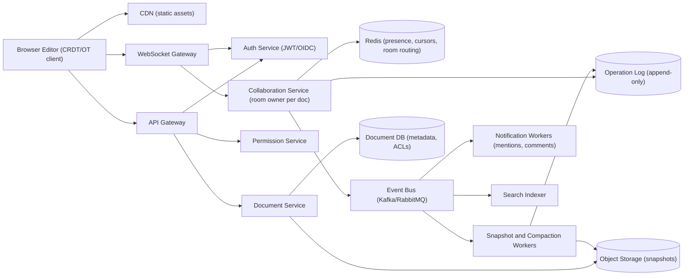
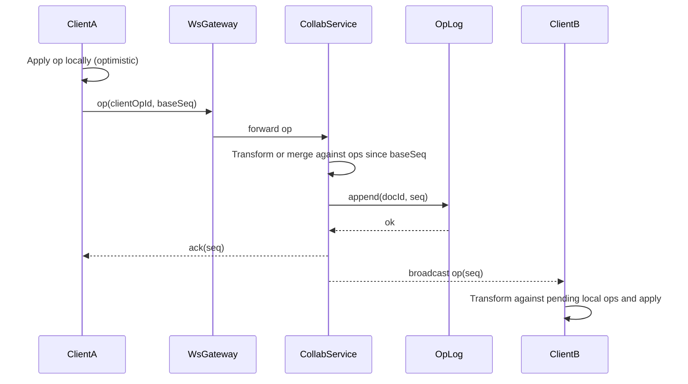

# Real-Time Collaboration System

> **Reviewed:** 2026-09 · **Scope:** Full-stack (frontend + backend + scalability) · **Level:** Senior / Tech Lead

---

## Overview

Design a real-time collaborative editing system where multiple users can edit documents simultaneously without conflicts. The system uses operational transformation for conflict resolution and provides presence indicators and version history.

---

## 1) Requirements

### Functional Requirements

**Core Features:**
- Multiple users editing documents simultaneously
- Real-time synchronization of changes
- Conflict resolution (operational transformation/CRDT)
- Presence indicators (who's viewing/editing)
- Cursor positions for active users
- Document versioning and history
- Comments and suggestions
- Document sharing and permissions

**Advanced Features:**
- Document templates
- Export/import (PDF, DOCX, Markdown)
- Offline editing with sync
- Advanced collaboration features (mentions, notifications)

### Non-Functional Requirements

**Performance:**
- Change propagation: < 100ms
- Handle 50+ concurrent editors per document
- Fast document loading and saving
- Smooth editing experience

**Reliability:**
- No data loss during conflicts
- High availability (99.9% uptime)
- Document consistency across all clients

**User Experience:**
- Responsive design (mobile and desktop)
- Accessible editing interface
- Visual feedback for changes
- Intuitive collaboration features

---

## 2) Component Hierarchy

The frontend is a React application with real-time collaborative editing. Here's the structure:

```
App
├── Layout
│   ├── Header
│   │   ├── DocumentTitle (editable)
│   │   ├── CollaborationIndicator (active users)
│   │   ├── ShareButton
│   │   └── UserMenu
│   └── MainContent
├── Pages
│   ├── DocumentEditorPage
│   │   ├── DocumentEditor
│   │   │   ├── RichTextEditor (Slate.js/Draft.js)
│   │   │   ├── SelectionOverlay
│   │   │   └── CursorIndicators (other users' cursors)
│   │   ├── PresencePanel
│   │   │   ├── ActiveUsersList
│   │   │   └── CursorPositions
│   │   ├── CommentsPanel
│   │   │   └── CommentThread
│   │   └── VersionHistory
│   │       ├── VersionList
│   │       └── VersionPreview
│   └── DocumentsPage
│       └── DocumentList
└── SharedComponents
    ├── Button
    ├── Input
    └── Toast
```

### Key Components Explained

**1. DocumentEditor Component**
- Rich text editor (Slate.js or Draft.js)
- Handles text editing with formatting
- Tracks operations (insert, delete, format)
- Applies remote operations via operational transformation

**2. PresencePanel Component**
- Shows active users in document
- Displays user avatars and names
- Tracks cursor positions for each user
- Updates in real-time via WebSocket

**3. CommentsPanel Component**
- Displays comments and suggestions
- Comment threads with replies
- Highlights commented text
- Real-time comment updates

**4. VersionHistory Component**
- Document version timeline
- Version preview before restoration
- Version metadata (author, date, changes)
- Restore functionality

---

## 3) Data Models

Here are the key data structures:

```typescript
// Document
interface Document {
  id: string;
  title: string;
  content: DocumentContent;
  version: number;
  createdAt: string;
  updatedAt: string;
  ownerId: string;
  collaborators: Collaborator[];
}

// Document content (block-based)
interface DocumentContent {
  type: "doc";
  content: Block[];
}

// Block (paragraph, heading, list, etc.)
interface Block {
  type: "paragraph" | "heading" | "list" | "table";
  id: string;
  content: InlineContent[];
  attributes?: BlockAttributes;
}

// Inline content
interface InlineContent {
  type: "text" | "link";
  text?: string;
  marks?: Mark[];  // Bold, italic, etc.
}

// Operation (for operational transformation)
interface Operation {
  type: "insert" | "delete" | "format";
  blockId: string;
  position: number;
  content?: string;
  length?: number;
  marks?: Mark[];
  version: number;
  userId: string;
  timestamp: string;
}

// Collaborator
interface Collaborator {
  userId: string;
  name: string;
  avatar?: string;
  cursorPosition?: CursorPosition;
  isActive: boolean;
}

// Cursor position
interface CursorPosition {
  blockId: string;
  offset: number;
  color: string;
}
```

### Data Flow Explanation

**When a user edits:**
1. User types in editor
2. Operation is created (insert/delete/format)
3. Operation applied locally immediately
4. Operation sent to server via WebSocket
5. Server broadcasts to other users
6. Other users apply operation using operational transformation
7. All clients see consistent document state

**Operational transformation:**
1. Two users edit simultaneously
2. Operations are transformed to maintain consistency
3. Example: User A inserts at position 5, User B inserts at position 3
4. Operations are transformed so both insertions are preserved
5. Result: Both changes appear correctly

---

## 4) API Design

### REST Endpoints

**GET /api/v1/documents/:id**
- Get document
- Returns: Document object

**PATCH /api/v1/documents/:id/content**
- Update document content
- Request body: `{ version: number, operations: Operation[] }`
- Returns: Updated document with new version

**GET /api/v1/documents/:id/versions**
- Get version history
- Returns: Array of DocumentVersion objects

**POST /api/v1/documents/:id/restore**
- Restore document to version
- Request body: `{ version: number }`
- Returns: Updated document

### WebSocket Events

**Connection:** `wss://api.example.com/documents/:id`

**Events:**
- `operation` - Document operation received
- `presence` - User joined/left or cursor moved
- `comment` - Comment added
- `conflict` - Conflict detected

**Message Format:**
```json
{
  "type": "operation",
  "data": {
    "operation": {
      "type": "insert",
      "blockId": "block_1",
      "position": 5,
      "content": "Hello"
    },
    "version": 5,
    "userId": "user_123"
  }
}
```

---

## Key Design Decisions

**1. Operational Transformation for Conflict Resolution**
- Transforms concurrent operations
- Maintains document consistency
- No data loss during conflicts
- All clients see same state

**2. Block-Based Document Structure**
- Documents structured as blocks
- Easier to handle formatting and collaboration
- Better for operational transformation

**3. Optimistic Updates**
- Apply changes locally immediately
- Better perceived performance
- Sync with server state

**4. WebSocket for Real-time**
- Instant operation propagation
- Low latency (< 100ms)
- Presence and cursor tracking

**5. OT vs CRDTs (the decision you must justify)**

| Aspect | Operational Transformation (OT) | CRDTs (e.g. Yjs, Automerge) |
|---|---|---|
| Ordering | Central server assigns a total order and transforms concurrent ops | Ops commute by construction; no central ordering required |
| Server role | Required and authoritative per document | Optional relay/persistence; peers can merge directly |
| Offline editing | Hard for long offline sessions (large transform chains) | Natural fit; merge on reconnect |
| Metadata overhead | Small ops (position + content) | Per-character IDs and tombstones; needs garbage collection |
| Correctness risk | Transform functions are notoriously hard to get right for rich text | Library-proven merge semantics, but "intent" may still surprise users |
| Typical fit | Server-centric editors with always-online clients | Offline-first, peer-to-peer, or multi-region editing |

> **Interview tip:** Say which one you pick and why. A strong default for a new build is a mature CRDT library (Yjs) with a server relay, because it lets you ship offline support and multi-region later without rewriting the merge core. OT is still a valid answer when you already have a central sequencer per document.

---

## Backend High-Level Design

The backend separates the **stateless HTTP path** (load documents, permissions, history) from the **stateful real-time path** (WebSocket sessions pinned to a per-document "room" owner).



**Components and responsibilities:**

- **API Gateway** — TLS termination, rate limiting, routing, request auth via the Auth Service.
- **WebSocket Gateway** — holds long-lived connections, validates the token on connect and periodically, and forwards frames to the Collaboration Service instance that owns the document.
- **Collaboration Service** — one logical owner per document (consistent hashing on `docId`, registered in Redis). It sequences or merges operations, appends them to the operation log, and broadcasts to connected clients. Owning a doc on a single instance avoids distributed locking on the hot path.
- **Operation Log** — append-only store keyed by `(docId, seq)`; the source of truth for recent edits.
- **Snapshot Store** — periodic full document snapshots in object storage (S3-compatible, e.g. [MinIO](../backend/minio/index.md)) so loads do not replay the full history.
- **Workers** — snapshotting, op compaction, notifications, search indexing, export (PDF/DOCX). Queue-backed; see [Messaging Systems](../backend/architecture/05-messaging-systems.md) and [RabbitMQ](../backend/rabbitmq/index.md).
- **Presence** — ephemeral data in Redis with short TTLs; never persisted to the op log.

---

## Data Model and Consistency

**Schema sketch:**

```sql
-- Metadata (relational)
documents(id PK, owner_id, title, current_seq, latest_snapshot_seq, created_at, updated_at)
document_acl(doc_id, principal_id, role, PRIMARY KEY (doc_id, principal_id))
comments(id PK, doc_id, anchor_json, author_id, body, resolved, created_at)

-- Operation log (wide-column or partitioned table)
doc_ops(doc_id, seq, client_id, client_op_id, op_bytes, author_id, created_at,
        PRIMARY KEY ((doc_id), seq))
        -- UNIQUE (doc_id, client_id, client_op_id) for idempotency

-- Snapshots
doc_snapshots(doc_id, seq, object_key, size_bytes, created_at, PRIMARY KEY (doc_id, seq))
```

**Indexes and partition keys:**
- Partition the op log by `doc_id`; cluster by `seq` so "ops after seq N" is a single range scan.
- `document_acl` is looked up by `(doc_id, principal_id)` on every connect; cache the result in Redis with short TTL and invalidate on ACL change.
- `comments` indexed by `(doc_id, resolved)`.

**Consistency trade-offs:**
- **Per-document strong ordering** (OT) or **strong eventual consistency** (CRDT). Either way, consistency is scoped to one document, so there is no cross-document transaction.
- Presence and cursors are **best-effort**; losing them is acceptable.
- Search and notifications are **eventually consistent** via the event bus.

**Idempotency:**
- Each client op carries `(clientId, clientOpId)`. The server de-duplicates on retry, so a reconnect that resends unacknowledged ops does not double-apply.
- Clients track the last acknowledged `seq`; on reconnect they request `ops since seq` and replay.

**Snapshots + op compaction:**
- Every N ops or T minutes (illustrative: 500 ops or 5 minutes), a worker loads the latest snapshot, applies ops, writes a new snapshot, and marks older ops as compactable.
- Keep ops for a retention window (for version history and undo), then compact into named versions.
- For CRDTs, compaction also garbage-collects tombstones once all known clients have seen them.

---

## Scalability and Reliability

**Back-of-envelope (ILLUSTRATIVE assumptions, not real-world figures):**

| Assumption | Value |
|---|---|
| Daily active users | 10M |
| Peak concurrent editing sessions | 5% of DAU = 500K |
| Average ops per active editor | 2 ops/second while typing (batched keystrokes) |
| Fraction actively typing at any moment | 20% |
| Average op size on the wire | 200 bytes |
| Average collaborators per active doc | 3 |

- Active typers: 500K × 0.2 = **100K editors**.
- Inbound ops: 100K × 2 = **200K ops/s**.
- Fan-out: each op goes to about 2 other collaborators → **400K messages/s** outbound.
- Outbound bandwidth: 400K × 200 B = **80 MB/s** (about 640 Mbit/s) — manageable across a gateway fleet.
- Op log writes: 200K ops/s × 200 B = 40 MB/s → about **3.5 TB/day** raw before compaction, which is why compaction and snapshots matter.
- Connections: 500K sockets; at an illustrative 50K sockets per gateway node → **10+ gateway nodes** plus headroom.

**Bottlenecks and fixes:**
- **Hot documents** (an all-hands doc with hundreds of editors): throttle cursor broadcasts, batch ops into 50–100 ms frames, and switch large audiences to view-only streaming.
- **Op log write amplification:** batch appends per document, compress op payloads, compact aggressively.
- **Slow cold loads:** load latest snapshot from object storage plus the tail of ops; never replay from zero.
- **Room owner failure:** keep ownership in Redis with a lease; a new owner rebuilds state from snapshot + op log.

**Failure modes:**

| Failure | Impact | Mitigation |
|---|---|---|
| Collaboration node crashes | Clients on that doc disconnect; in-memory state lost | Lease-based ownership, rebuild from snapshot + op log, clients resend unacked ops idempotently |
| WebSocket gateway restart | Mass reconnect storm | Jittered exponential backoff on clients, connection draining on deploy |
| Op log write latency spike | Edits appear laggy, acks delayed | Local optimistic apply, backpressure to clients, batch writes |
| Redis presence outage | No cursors or presence | Degrade gracefully; editing still works since presence is non-critical |
| Snapshot worker backlog | Slower loads, larger op tails | Autoscale workers on queue depth, alert on snapshot lag |
| Transform/merge bug | Divergent documents across clients | Periodic checksum of document state between client and server, forced resync from server snapshot |

**Key flow — concurrent edit and acknowledgement:**



---

## Deep Dive Options (RADIO)

Pick 2–3 of these when the interviewer asks you to go deeper (Requirements → Architecture → Data → Interface → Optimizations):

1. **Merge core correctness** — Walk through an OT transform for concurrent insert/insert at the same offset (tie-break by client ID) versus a CRDT where each character has a unique ID and position is derived from neighbours. Discuss rich-text marks spanning ranges and how intent can be lost.
2. **Offline editing and reconnect** — Client stores pending ops in IndexedDB; on reconnect it sends `ops since lastAckedSeq`. With OT this may require transforming a long queue; with CRDT it is a state-vector diff exchange. Discuss how long offline sessions interact with op compaction.
3. **Version history at scale** — Named versions are snapshots; "every change" history is the op log over a retention window. Restoring a version is itself a new op (not a rewind), preserving collaborators' work.

---

## Scaling with AI and Agentic Workflows

AI helps both the engineering process and the product. Treat it as a fast assistant whose output is validated by math, tests, and humans. See [Agentic Workflows](../agentic-workflows/index.md) and [AI-Assisted Development](../ai/ai-assisted-development/index.md).

**Engineering workflows:**
- **Bottleneck brainstorming:** Ask an agent to list likely hotspots (hot documents, reconnect storms, op log growth), then verify each against the back-of-envelope numbers above before investing.
- **Load-test generation:** Have an agent draft k6/Locust scripts that simulate N editors per doc with realistic typing bursts and reconnects; a human reviews the traffic model.
- **Divergence RCA:** Summarize traces and checksum-mismatch logs to cluster which op sequences cause divergence; engineers reproduce with a deterministic test.
- **Runbooks and migrations:** Draft runbooks for "collab node failover" or migration plans from OT to CRDT with dual-write and shadow-merge verification.

**Product AI:**
- **Summaries and catch-up** ("what changed since I last opened this doc"), **writing suggestions**, and **comment thread summaries**.
- Trade-offs: run suggestions asynchronously so they never block the edit path; send minimal context to control cost; respect document ACLs and tenant data-residency rules before sending content to a model; AI edits should be applied as normal ops attributed to an "assistant" author so they are undoable.

**Human approval required for:**
- Applying AI-generated edits to shared documents (show as suggestions, not direct writes).
- Changes to transform/merge logic or compaction retention.
- Data-sharing decisions about sending document content to third-party model providers.

**Do not trust AI for:**
- Proving OT/CRDT convergence — use property-based tests and formal reasoning.
- Capacity numbers without showing the arithmetic.
- Permission decisions or access checks.

---

## Interview Talking Points

**When explaining this system, I'd focus on:**

1. **Requirements First**: Start with core functionality - real-time collaborative editing, conflict resolution, presence indicators

2. **Component Structure**: Explain the React component hierarchy - document editor, presence panel, comments, version history

3. **Data Models**: Walk through Document, Block, Operation - and block-based structure

4. **API Design**: Show the REST endpoints and WebSocket protocol - document operations, real-time events

5. **Key Challenges**: 
   - Operational transformation for conflict resolution
   - Real-time synchronization with low latency
   - Handling 50+ concurrent editors
   - Maintaining document consistency

**Example explanation flow:**
> "So for a real-time collaboration system, the core requirement is allowing multiple users to edit documents simultaneously without conflicts. The frontend is a React app with a rich text editor component that tracks operations (insert, delete, format) as users type. Documents are structured as blocks (paragraphs, headings) rather than plain text, which makes collaboration easier. For conflict resolution, we use operational transformation - when two users edit simultaneously, operations are transformed so both changes are preserved correctly. Real-time updates are delivered via WebSocket for instant propagation (< 100ms). The data model includes Document objects with block-based content, Operation objects for changes, and Collaborator objects for presence tracking. The main API endpoints handle document operations and version history, while WebSocket handles real-time operation broadcasting. Key challenges include implementing operational transformation correctly, ensuring low-latency real-time updates, and maintaining document consistency across all clients."

### Follow-up Questions

<details>
<summary>How do you route all editors of one document to the same server?</summary>

Use consistent hashing on `docId` at the WebSocket gateway, or a Redis registry mapping `docId` to the owning Collaboration Service instance with a lease. Gateways forward frames to the owner; if the lease expires, another instance takes over and rebuilds from snapshot + op log.

</details>

<details>
<summary>What happens if the server acks an op but the client never receives the ack?</summary>

The client resends the op on reconnect with the same `(clientId, clientOpId)`. The server finds the existing op via the unique key and returns the original `seq` instead of appending again.

</details>

<details>
<summary>Why not just use last-write-wins on the whole document?</summary>

Concurrent editors would silently lose each other's work. LWW is acceptable for single-value fields such as the document title, but not for shared text.

</details>

<details>
<summary>How do you keep the operation log from growing forever?</summary>

Periodic snapshots plus compaction: ops older than the latest snapshot and outside the history retention window are merged into named versions or deleted. CRDTs additionally need tombstone garbage collection.

</details>

<details>
<summary>How do you detect that clients have diverged?</summary>

Clients periodically send a hash of their document state at a given `seq`. On mismatch, the server forces a resync from its snapshot and logs the op sequence for debugging.

</details>

<details>
<summary>How would you support multi-region editing?</summary>

With OT you usually home each document in one region and accept extra latency for remote editors. With CRDTs you can accept ops in multiple regions and merge asynchronously, at the cost of more metadata and harder permission revocation.

</details>

### Common Mistakes

- Treating presence and cursors as durable data and writing them to the main database.
- Broadcasting every keystroke individually instead of batching into short frames.
- Replaying the full op history on every document load instead of using snapshots.
- No idempotency key on ops, so reconnect retries duplicate text.
- Hand-rolling OT for rich text without property-based tests.
- Ignoring permission revocation for already-connected sockets.

---

## References

- [CRDT resources (crdt.tech)](https://crdt.tech/)
- [Yjs documentation](https://docs.yjs.dev/)
- [Automerge](https://automerge.org/)
- [Operational transformation (Wikipedia)](https://en.wikipedia.org/wiki/Operational_transformation)
- [MDN: WebSockets API](https://developer.mozilla.org/en-US/docs/Web/API/WebSockets_API)
- [Martin Kleppmann, Designing Data-Intensive Applications](https://dataintensive.net/)

