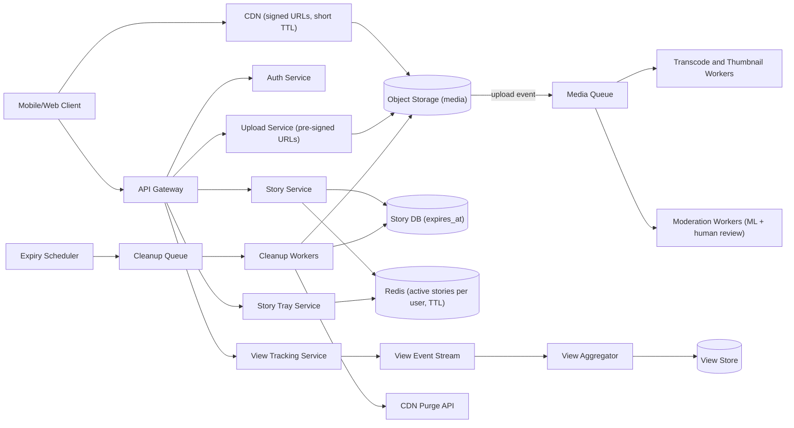
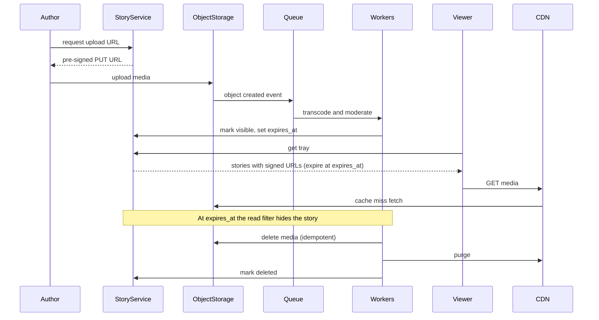

# Time-Limited Content System

> **Reviewed:** 2026-09 · **Scope:** Full-stack (frontend + backend + scalability) · **Level:** Senior / Tech Lead

---

## Overview

Design a time-limited content system like Instagram Stories where users can create content (images, videos) that automatically expires after a configurable duration (e.g., 24 hours), with view tracking and engagement features.

---

## 1) Requirements

### Functional Requirements

**Core Features:**
- Create time-limited content (images, videos, stories)
- Configurable expiration duration (default 24 hours)
- Automatic expiration and cleanup
- View content before expiration
- View tracking (who viewed and when)
- Content reactions (likes, replies)
- Content feed (browse stories)
- Expiration countdown display
- Content sharing links

**Advanced Features:**
- Multiple content types (images, videos, text)
- Content analytics (views, engagement)
- Personalized content feed
- Content moderation
- Custom expiration durations

### Non-Functional Requirements

**Performance:**
- Content upload: < 5 seconds
- Viewing latency: < 2 seconds
- Fast feed loading

**Scalability:**
- Handle 1B+ users
- 500M+ content items per day
- Millions of concurrent viewers

**Reliability:**
- 99.9% uptime
- Reliable expiration handling
- Accurate expiration timing

---

## 2) Component Hierarchy

The frontend is a React application for time-limited content. Here's the structure:

```
App
├── Layout
│   ├── Header
│   │   ├── Logo
│   │   └── UserMenu
│   └── MainContent
├── Pages
│   ├── StoriesFeedPage
│   │   ├── StoriesList (horizontal scroll)
│   │   │   └── StoryCircle
│   │   │       ├── UserAvatar
│   │   │       └── UnreadIndicator
│   │   └── StoryViewer
│   │       ├── StoryContent (image/video)
│   │       ├── CountdownTimer
│   │       ├── ViewList (who viewed)
│   │       └── ReactionButtons
│   ├── CreateStoryPage
│   │   ├── MediaUploader
│   │   ├── ExpirationSelector
│   │   └── PublishButton
│   └── StoryAnalyticsPage
│       └── AnalyticsDashboard
└── SharedComponents
    ├── StoryViewer
    ├── CountdownTimer
    └── MediaViewer
```

### Key Components Explained

**1. StoryViewer Component**
- Displays story content (image/video)
- Shows countdown timer
- Auto-advances to next story
- Swipe navigation
- View tracking

**2. StoriesList Component**
- Horizontal scrollable list
- Story circles with avatars
- Unread indicators
- Click to view story

**3. CountdownTimer Component**
- Shows time until expiration
- Updates in real-time
- Visual countdown display

---

## 3) Data Models

Here are the key data structures:

```typescript
// Story (time-limited content)
interface Story {
  id: string;
  userId: string;
  user: User;
  type: "image" | "video" | "text";
  mediaUrl: string;
  expiresAt: string;
  createdAt: string;
  viewsCount: number;
  reactionsCount: number;
  isViewed: boolean;  // By current user
}

// Story view
interface StoryView {
  id: string;
  storyId: string;
  userId: string;
  viewedAt: string;
}

// Story reaction
interface StoryReaction {
  id: string;
  storyId: string;
  userId: string;
  type: "like" | "reply";
  content?: string;  // For replies
  createdAt: string;
}
```

### Data Flow Explanation

**When a user creates a story:**
1. User uploads image/video
2. User selects expiration duration
3. Story is created with expiresAt timestamp
4. Story appears in feed
5. Automatic cleanup when expired

**When a user views a story:**
1. User clicks story circle
2. StoryViewer displays content
3. View is tracked (who, when)
4. Countdown timer shows remaining time
5. Story marked as viewed

---

## 4) API Design

### REST Endpoints

**GET /api/v1/stories**
- Get stories feed
- Returns: Array of Story objects

**POST /api/v1/stories**
- Create a story
- Request: Multipart form data with media and expiration
- Returns: Story object

**GET /api/v1/stories/:id**
- Get story details
- Returns: Story object

**POST /api/v1/stories/:id/view**
- Track story view
- Returns: StoryView object

**POST /api/v1/stories/:id/reactions**
- Add reaction (like/reply)
- Request body: `{ type: string, content?: string }`
- Returns: StoryReaction object

---

## Key Design Decisions

**1. Automatic Expiration**
- Stories expire at configured time
- Server-side cleanup of expired content
- Frontend hides expired stories
- Accurate expiration timing

**2. View Tracking**
- Track who viewed and when
- Privacy controls for view tracking
- Analytics for creators

**3. Countdown Timer**
- Real-time countdown display
- Updates every second
- Visual indicator of remaining time

---

## Backend High-Level Design

The core idea: **expiry is enforced on read, and cleanup happens asynchronously.** Never rely on a cleanup job being on time for correctness.



**Components and responsibilities:**

- **Upload Service** — issues pre-signed PUT URLs so large media goes straight to object storage (S3 or [MinIO](../backend/minio/index.md)), not through app servers.
- **Transcode / Moderation workers** — queue-driven (see [Celery](../backend/celery/index.md) and [RabbitMQ](../backend/rabbitmq/index.md)); a story becomes `visible` only after transcoding and a moderation pass.
- **Story Service** — writes story metadata with `expires_at = created_at + duration`. Every read filters `expires_at > now()`.
- **Story Tray Service** — builds "who has active stories" for a viewer from Redis sets whose TTL matches the latest story expiry.
- **View Tracking** — high-volume, append-only events aggregated asynchronously.
- **Expiry Scheduler + Cleanup Workers** — delete media objects, CDN-cached copies, metadata, and derived data after expiry (plus a grace window if the product supports "archive" or legal hold).

---

## Data Model and Consistency

**Schema sketch:**

```sql
stories(id PK, author_id, media_key, media_type, status,       -- status: processing, visible, expired, deleted, held
        created_at, expires_at, audience, deleted_at)
INDEX stories_author_active (author_id, expires_at)
INDEX stories_expiry (expires_at) WHERE status = 'visible'

story_views(story_id, viewer_id, first_viewed_at,
            PRIMARY KEY ((story_id), viewer_id))              -- dedupes repeat views
story_reactions(story_id, user_id, reaction, created_at)
deletion_jobs(story_id PK, due_at, attempts, last_error, completed_at)
```

**Partition keys:**
- `stories` partitioned by `author_id` (tray and profile reads are per author).
- `story_views` partitioned by `story_id`, which makes "who viewed my story" one partition scan and makes dropping a story's views cheap.

**TTL expiry — three layers:**
1. **Read-time filter** (`expires_at > now()`) is the correctness guarantee. Expired content is invisible the moment it expires, even if nothing has been deleted yet.
2. **Store-native TTL** (e.g. Redis `EXPIRE`, DynamoDB/Cassandra TTL) removes cache entries and rows automatically but is *not* on time — treat it as garbage collection.
3. **Scheduled cleanup workers** do the multi-system deletion: object storage, CDN purge, thumbnails, views, search index.

**Deletion guarantees:**
- Define the promise precisely: "not viewable after expiry" (strong, enforced on read) versus "physically erased within X hours" (eventual, enforced by workers and monitored).
- Deletion jobs are **idempotent** (deleting a missing object is success) and retried with backoff; a sweeper re-enqueues anything with `due_at` in the past and no `completed_at`.
- Legal hold or abuse-report state overrides deletion; the worker checks `status = 'held'` before erasing.

**CDN caching of expiring media:**
- Serve media through **signed URLs whose expiry is no later than the story's `expires_at`**, and set `Cache-Control: max-age` to `min(remaining_lifetime, cap)`.
- Signed URL expiry gives a hard cutoff even if the CDN still holds bytes; CDN purge on deletion clears the edge copy.
- Use unguessable object keys; never serve stories from public, permanent URLs.

**Idempotency:**
- Upload finalize is keyed by `uploadId`, so client retries do not create duplicate stories.
- View events are deduped by `(story_id, viewer_id)`.

---

## Scalability and Reliability

**Back-of-envelope (ILLUSTRATIVE assumptions, not real-world figures):**

| Assumption | Value |
|---|---|
| Daily active users | 100M |
| Users posting per day | 20% |
| Stories per posting user | 3 |
| Average media size after transcode | 2 MB |
| Story views per DAU per day | 50 |
| Story lifetime | 24 hours |

- Stories created per day: 100M × 0.2 × 3 = **60M/day** → 60M / 86,400 ≈ **700 writes/s** average; assume 5× peak ≈ **3,500/s**.
- Media ingest: 60M × 2 MB = **120 TB/day**. Because stories live 24 h, live storage is roughly one day's worth (**about 120 TB**), plus any archive.
- Views: 100M × 50 = **5B/day** → about **58K views/s** average, about **290K/s** at 5× peak. This is the dominant load and is mostly served by the CDN.
- Deletions: also **60M/day**, about 700/s, spiky if many stories were created at the same time of day.

**Bottlenecks and fixes:**
- **View write amplification:** buffer view events in a stream, aggregate in batches, and dedupe in memory before writing.
- **Tray fan-out for users with many followees:** precompute per-viewer trays for active users; fall back to pull for celebrity accounts.
- **Cleanup thundering herd:** bucket deletion jobs by minute and rate-limit workers; object deletes are cheap but CDN purge APIs are often rate-limited, which is why short cache TTLs and signed URLs do most of the work.
- **Origin load after purge:** only purge expired objects, which no one should be requesting anyway.

**Failure modes:**

| Failure | Impact | Mitigation |
|---|---|---|
| Cleanup workers down for hours | Expired media still stored (compliance risk) | Read-time filter still hides it, signed URLs already expired, sweeper catches up, alert on deletion lag |
| CDN purge fails | Edge copy remains | Signed URL expiry and short `max-age` bound exposure, retry purge |
| Clock skew between services | Stories expire early or late | Use a single time source (DB `now()` or NTP-synced), store UTC, add small tolerance |
| Transcoder backlog | New stories stuck in processing | Autoscale on queue depth, show "processing" state to author |
| Moderation model outage | Unsafe content goes live or queue stalls | Fail closed for high-risk signals, queue for human review |
| View store overload | View counts lag | Counts are eventually consistent; buffer and backfill |

**Key flow — publish, view, expire:**



---

## Deep Dive Options (RADIO)

1. **Deletion guarantees end to end** — Enumerate every copy (original, transcodes, thumbnails, CDN, caches, search, backups, analytics). Decide which are erased by workers, which by TTL, and how backups honour deletion (e.g. crypto-shredding with per-story keys).
2. **Expiring media on the CDN** — Signed URL design, cache-key strategy, `max-age` derived from remaining lifetime, and what happens when a viewer opens a story one second before expiry.
3. **View tracking at scale** — Dedup strategy, exact viewer lists for the author versus approximate counts (HyperLogLog) for large audiences, and privacy rules for who can see the list.

---

## Scaling with AI and Agentic Workflows

See [Agentic Workflows](../agentic-workflows/index.md) and [AI-Assisted Development](../ai/ai-assisted-development/index.md).

**Engineering workflows:**
- **Bottleneck brainstorming:** have an agent list every place an expired story could still be served, then check each against the data flow and signed-URL rules.
- **Load-test generation:** generate scripts that create stories at a synchronized time and verify that deletion lag stays within the target when they all expire together.
- **RCA summarization:** summarize worker logs and metrics when deletion lag alerts fire (which step failed, which bucket, which error class).
- **Runbooks and migrations:** draft runbooks for "cleanup backlog" and migration plans such as moving to per-object encryption keys.

**Product AI — content moderation:**
- Run image/video classifiers and OCR/text classifiers during processing, before the story becomes visible. This adds latency to publish (acceptable if bounded, e.g. a few seconds target) and cost per upload.
- Use risk-tiered routing: auto-approve low-risk, block clear violations, queue ambiguous content for human review.
- Data trade-offs: moderation models may need to retain evidence beyond the story's lifetime for appeals or legal reasons — document this explicitly because it conflicts with "ephemeral" expectations.

**Human approval required for:**
- Account-level enforcement (bans, strikes) based on model output.
- Changes to retention/deletion policy or legal-hold logic.
- Tuning moderation thresholds that change what is auto-blocked.

**Do not trust AI for:**
- Confirming that deletion actually happened — verify with storage listings and audits.
- Final decisions on borderline or legally sensitive content.
- Retention and privacy compliance interpretations.

---

## Interview Talking Points

**When explaining this system, I'd focus on:**

1. **Requirements First**: Start with core functionality - create time-limited content, automatic expiration, view tracking

2. **Component Structure**: Explain the React component hierarchy - stories feed, story viewer, countdown timer

3. **Data Models**: Walk through Story, StoryView, StoryReaction - and expiration handling

4. **API Design**: Show the REST endpoints - create story, view story, track views, reactions

5. **Key Challenges**: 
   - Automatic expiration and cleanup
   - Accurate expiration timing
   - View tracking and privacy
   - Handling millions of concurrent viewers

**Example explanation flow:**
> "So for a time-limited content system like Stories, the core requirement is allowing users to create content that automatically expires after a set duration. The frontend is a React app with a stories feed showing story circles for each user, and a story viewer that displays content with a countdown timer. When a user creates a story, they upload media and set an expiration duration (default 24 hours). The story has an expiresAt timestamp, and the frontend shows a countdown timer. When expired, stories are hidden and cleaned up. View tracking records who viewed each story and when. The data model centers around Story objects with expiration timestamps, StoryView objects for tracking, and StoryReaction objects for engagement. The main API endpoints handle creating stories, viewing stories, tracking views, and reactions. Key challenges include ensuring accurate expiration timing, automatic cleanup of expired content, and handling millions of concurrent viewers during popular stories."

### Follow-up Questions

<details>
<summary>Why not just rely on database TTL to expire stories?</summary>

Native TTL deletion is typically lazy and can lag. Use it for garbage collection, but enforce visibility with an `expires_at > now()` filter on every read.

</details>

<details>
<summary>How do you ensure the CDN does not serve expired media?</summary>

Signed URLs expire at or before `expires_at`, `max-age` is capped at the remaining lifetime, and cleanup workers purge the edge copy after expiry.

</details>

<details>
<summary>What if the cleanup job fails halfway?</summary>

Each deletion step is idempotent and tracked in `deletion_jobs`. A sweeper retries anything overdue, and an alert fires if the oldest pending deletion exceeds the target lag.

</details>

<details>
<summary>How do you handle backups for deleted content?</summary>

Either keep backup retention shorter than the promise window or encrypt each story with its own key and destroy the key on deletion (crypto-shredding), making backup copies unreadable.

</details>

<details>
<summary>How would you add "highlights" (keep a story forever)?</summary>

Model it as a separate, explicit copy or a status that clears `expires_at` for that story; the cleanup worker checks status before deleting.

</details>

<details>
<summary>How do you scale view counts for very popular accounts?</summary>

Aggregate events in a stream, keep exact viewer lists only up to a limit, and use approximate counters beyond that.

</details>

### Common Mistakes

- Making correctness depend on a cron job running exactly on time.
- Serving media from permanent public URLs.
- Forgetting derived copies (thumbnails, transcodes, search, analytics) when deleting.
- Writing each view synchronously to the primary database.
- Using client clocks for expiry decisions.
- Not defining the deletion SLA precisely (hidden vs physically erased).

---

## References

- [Redis EXPIRE command](https://redis.io/docs/latest/commands/expire/)
- [Amazon DynamoDB Time to Live](https://docs.aws.amazon.com/amazondynamodb/latest/developerguide/TTL.html)
- [Amazon CloudFront: serving private content with signed URLs](https://docs.aws.amazon.com/AmazonCloudFront/latest/DeveloperGuide/PrivateContent.html)
- [Amazon S3 Lifecycle configuration](https://docs.aws.amazon.com/AmazonS3/latest/userguide/object-lifecycle-mgmt.html)
- [MDN: Cache-Control](https://developer.mozilla.org/en-US/docs/Web/HTTP/Headers/Cache-Control)

