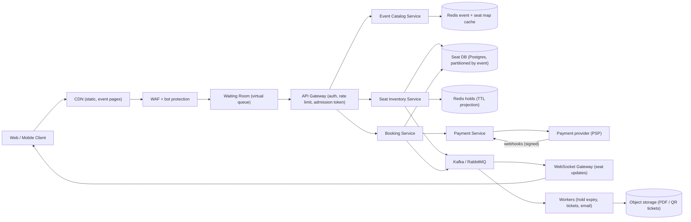
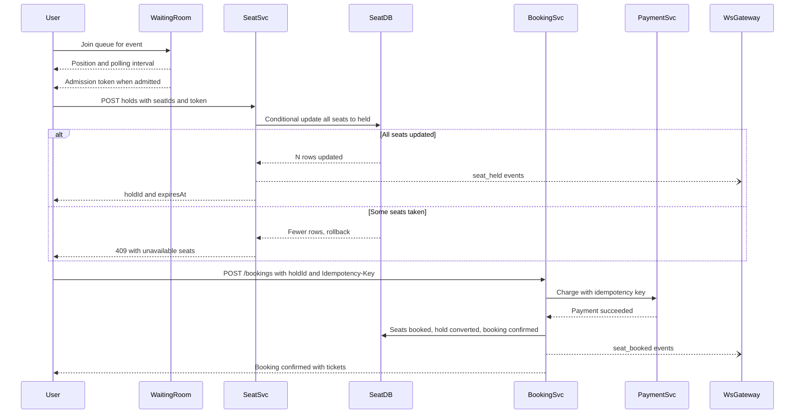

# Ticket Booking System

> **Reviewed:** 2026-09 · **Scope:** Full-stack (frontend + backend + scalability) · **Level:** Senior / Tech Lead

---

## Overview

Design a ticket booking system for events, movies, or shows where users can browse available seats, select seats, and complete bookings while preventing double booking through seat locking and real-time availability updates.

---

## 1) Requirements

### Functional Requirements

**Core Features:**
- Browse events, movies, or shows
- Visual seat map with availability (available, occupied, locked)
- Real-time seat availability updates
- Seat selection and locking during booking
- Booking flow with payment processing
- Booking confirmation and tickets
- Booking management (view, cancel, modify)
- Prevent double booking

**Advanced Features:**
- Waitlist for sold-out events
- Group booking discounts
- Seat recommendations
- Booking analytics
- Refund processing

### Non-Functional Requirements

**Performance:**
- Booking latency: < 2 seconds
- Fast seat availability updates
- Real-time seat status updates

**Scalability:**
- Handle 10M+ users
- 1M+ bookings per day
- Millions of concurrent seat selections during popular events

**Reliability:**
- 99.9% uptime
- Zero double bookings
- Handle high concurrency

---

## 2) Component Hierarchy

The frontend is a React application for ticket booking. Here's the structure:

```
App
├── Layout
│   ├── Header
│   │   ├── Logo
│   │   └── UserMenu
│   └── MainContent
├── Pages
│   ├── EventsPage
│   │   └── EventList
│   │       └── EventCard
│   ├── EventDetailPage
│   │   ├── EventInfo
│   │   └── BookTicketsButton
│   ├── SeatSelectionPage
│   │   ├── SeatMap
│   │   │   ├── SeatGrid
│   │   │   │   └── Seat (available/occupied/locked/selected)
│   │   │   └── Legend (seat status colors)
│   │   ├── SelectedSeatsSummary
│   │   └── ContinueButton
│   ├── BookingPage
│   │   ├── BookingSummary
│   │   ├── PaymentForm
│   │   └── ConfirmBookingButton
│   └── BookingConfirmationPage
│       ├── BookingDetails
│       └── DownloadTicketsButton
└── SharedComponents
    ├── SeatMap
    ├── Seat
    └── Toast
```

### Key Components Explained

**1. SeatMap Component**
- Visual representation of venue
- Shows seat grid with status
- Real-time availability updates via WebSocket
- Seat selection handling
- Legend for seat status

**2. Seat Component**
- Individual seat in grid
- Status: available, occupied, locked, selected
- Color-coded by status
- Clickable to select/deselect
- Disabled when occupied or locked

**3. SeatSelectionPage Component**
- Main seat selection interface
- Seat map with real-time updates
- Selected seats summary
- Continue to booking button

---

## 3) Data Models

Here are the key data structures:

```typescript
// Event
interface Event {
  id: string;
  name: string;
  description: string;
  venue: Venue;
  date: string;
  time: string;
  price: number;
  availableSeats: number;
  totalSeats: number;
}

// Venue
interface Venue {
  id: string;
  name: string;
  address: string;
  seatLayout: SeatLayout;
}

// Seat layout
interface SeatLayout {
  rows: number;
  seatsPerRow: number;
  sections: Section[];
}

// Section
interface Section {
  id: string;
  name: string;
  rows: string[];  // ["A", "B", "C"]
  seatsPerRow: number;
  price: number;
}

// Seat
interface Seat {
  id: string;
  sectionId: string;
  row: string;
  number: number;
  status: "available" | "occupied" | "locked" | "selected";
  lockedBy?: string;  // User ID if locked
  lockedUntil?: string;  // Lock expiration time
  price: number;
}

// Booking
interface Booking {
  id: string;
  eventId: string;
  userId: string;
  seats: Seat[];
  totalAmount: number;
  status: "pending" | "confirmed" | "cancelled";
  createdAt: string;
  paymentId?: string;
}
```

### Data Flow Explanation

**When a user selects seats:**
1. User clicks available seat
2. Seat status changes to "selected" (client-side)
3. Lock seat: POST /api/v1/seats/:id/lock
4. Seat status changes to "locked" (server-side)
5. Lock expires after timeout (e.g., 5 minutes)
6. Other users see seat as locked
7. On booking completion, seat becomes occupied

**Seat locking mechanism:**
1. User selects seat
2. Frontend sends lock request
3. Server locks seat for user (with timeout)
4. Other users see seat as locked
5. Lock expires if booking not completed
6. Seat becomes available again

---

## 4) API Design

### REST Endpoints

**GET /api/v1/events**
- Get events
- Query params: `date`, `category`, `page`, `limit`
- Returns: Paginated list of Event objects

**GET /api/v1/events/:id/seats**
- Get seat map for event
- Returns: SeatLayout with seat statuses

**POST /api/v1/seats/:id/lock**
- Lock a seat
- Request body: `{ timeout: number }` (minutes)
- Returns: Locked Seat object

**POST /api/v1/seats/:id/unlock**
- Unlock a seat
- Returns: Updated Seat object

**POST /api/v1/bookings**
- Create a booking
- Request body: `{ eventId: string, seatIds: string[], paymentMethodId: string }`
- Returns: Booking object

**GET /api/v1/bookings**
- Get user's bookings
- Returns: Paginated list of Booking objects

### WebSocket Events

**Connection:** `wss://api.example.com/events/:id/seats`

**Events:**
- `seat_locked` - Seat was locked
- `seat_unlocked` - Seat was unlocked
- `seat_occupied` - Seat was booked
- `seat_available` - Seat became available

---

## Key Design Decisions

**1. Seat Locking Mechanism**
- Lock seats during booking process
- Prevent double booking
- Lock expires after timeout
- Real-time updates via WebSocket

**2. Real-time Availability**
- WebSocket for instant seat status updates
- All users see same seat status
- Prevents race conditions

**3. Visual Seat Map**
- Color-coded seat status
- Easy seat selection
- Clear availability indication
- Accessible alternative (list/section picker, keyboard navigation) because a canvas/SVG grid alone is not screen-reader friendly

**4. Server-Authoritative Holds**
- The client's "selected" state is only a request; the server decides who holds a seat
- The UI shows a countdown from the server's `expiresAt`, not a local timer
- A batch hold for all selected seats (all or nothing) avoids partial selections

---

## Backend High-Level Design

The hard parts are **correctness under contention** (no double booking) and **surviving on-sale spikes** (fairness and availability). The design puts a waiting room in front, keeps seat state in a strongly consistent store, and treats Redis/WebSockets as fast projections, not the source of truth.



| Component | Responsibility |
|-----------|----------------|
| WAF + bot protection | Rate limits, IP/device reputation, challenge (CAPTCHA or proof-of-work) for suspicious clients |
| Waiting Room | Queues users before on-sale, admits them at a controlled rate, issues signed admission tokens with expiry |
| Event Catalog | Events, venues, sections, prices; heavily cached |
| Seat Inventory | Holds, releases, and seat status; the only writer of seat state |
| Booking Service | Converts a hold into a confirmed booking after payment; idempotent |
| Payment Service | PSP integration with idempotency keys and webhook handling (see [Payment System](./04-payment-system.md)) |
| WebSocket Gateway | Fans out `seat_held`, `seat_released`, `seat_booked` events per event channel; clients reconcile with a snapshot on reconnect |
| Workers | Expire holds (backup to TTL), generate tickets, send emails. Node workers or [Celery](../backend/celery/index.md) on [RabbitMQ](../backend/rabbitmq/index.md); see [messaging systems](../backend/architecture/05-messaging-systems.md) |

> **Interview tip:** Say "Redis and WebSockets are for speed; the database decides." Then show the conditional update that makes double booking impossible.

---

## Data Model and Consistency

```sql
CREATE TABLE seats (
  event_id        BIGINT NOT NULL,
  seat_id         TEXT NOT NULL,          -- e.g., "A-12-7" (section-row-number)
  section_id      TEXT NOT NULL,
  price_cents     BIGINT NOT NULL,
  status          TEXT NOT NULL,          -- available | held | booked
  hold_id         BIGINT,
  hold_expires_at TIMESTAMPTZ,
  booking_id      BIGINT,
  version         BIGINT NOT NULL DEFAULT 0,
  PRIMARY KEY (event_id, seat_id)
);
CREATE INDEX idx_seats_hold ON seats (event_id, hold_id);

CREATE TABLE holds (
  hold_id     BIGINT PRIMARY KEY,
  event_id    BIGINT NOT NULL,
  user_id     BIGINT NOT NULL,
  seat_ids    TEXT[] NOT NULL,
  status      TEXT NOT NULL,              -- active | converted | expired | released
  expires_at  TIMESTAMPTZ NOT NULL
);

CREATE TABLE bookings (
  booking_id      BIGINT PRIMARY KEY,
  hold_id         BIGINT NOT NULL UNIQUE,  -- one booking per hold
  user_id         BIGINT NOT NULL,
  event_id        BIGINT NOT NULL,
  status          TEXT NOT NULL,           -- pending_payment | confirmed | cancelled | refunded
  total_cents     BIGINT NOT NULL,
  idempotency_key TEXT NOT NULL,
  UNIQUE (user_id, idempotency_key)
);
```

**Placing a hold (all-or-nothing, optimistic):**

```sql
BEGIN;
UPDATE seats
SET status = 'held', hold_id = :holdId,
    hold_expires_at = now() + interval '8 minutes',
    version = version + 1
WHERE event_id = :eventId
  AND seat_id = ANY(:seatIds)
  AND (status = 'available' OR (status = 'held' AND hold_expires_at < now()));
-- If rows updated <> number of requested seats: ROLLBACK and return 409 with the unavailable seats
COMMIT;
```

**Preventing double booking, options compared:**

| Approach | How | Trade-off |
|----------|-----|-----------|
| Conditional update (optimistic) | `UPDATE ... WHERE status = 'available'`, check affected rows | No long locks, great under moderate contention; losers retry or pick other seats |
| Version column (optimistic concurrency) | Read version, `UPDATE ... WHERE version = :v` | Same idea; useful when the client edits richer state |
| `SELECT ... FOR UPDATE` (pessimistic) | Lock seat rows in a transaction | Simple reasoning; lock waits under heavy contention; always lock in sorted seat order to avoid deadlocks |
| Redis `SET key value NX PX ttl` | Fast distributed hold per seat | Very fast, but Redis is not the source of truth; failover can lose keys, so the DB must still enforce uniqueness |
| General admission counter | Atomic decrement of remaining capacity | For unreserved seating there is no per-seat row; same pattern as flash-sale inventory |

**Hold expiry with TTL:**
- The condition `hold_expires_at < now()` makes an expired hold reclaimable immediately, even if the cleanup worker is late. The worker only exists to publish `seat_released` events and tidy rows.
- Redis keys with TTL mirror holds for fast seat-map reads; keyspace notifications are not reliable enough to be the only expiry mechanism.
- Hold TTL must exceed the payment authorization timeout; otherwise a slow payment can succeed after the seat was released.

**Partitioning:**
- Partition seats and holds by **`event_id`**. A single mega-event is a hot partition, but its write rate is bounded by the waiting room (see estimate below). If needed, sub-partition by section.
- Bookings shard by `user_id` for "my tickets"; keep an `event_id` index for venue operations.

**Consistency trade-offs:**
- Seat state: **strongly consistent**, single writer (Seat Inventory Service).
- Seat map shown to users: **eventually consistent** snapshot + WebSocket deltas. Users can still see a seat as available that was just taken; the hold call is the real check, so the UI must handle 409 gracefully.

**Idempotent payments:**
- `POST /bookings` takes an `Idempotency-Key`; `bookings.hold_id` is unique, so one hold can never produce two bookings.
- The Payment Service sends its own idempotency key to the PSP, and webhooks are deduped by PSP event ID.
- If payment succeeds after the hold expired and the seat was resold, auto-refund and notify; this should be rare if TTLs are set correctly.

---

## Scalability and Reliability

### Back-of-envelope estimate

> **ILLUSTRATIVE assumptions** (not real-world figures): one on-sale for a 50,000-seat venue, 1,000,000 users arrive in the first 10 minutes, average 2.5 tickets per order, waiting room admits 2,000 users/minute, 60% of admitted users complete a purchase, each admitted user makes about 2 hold attempts and 30 seat-map/API reads.

**Without a waiting room:**
- Arrivals: 1,000,000 / 600 s = **~1,667 new users/s**, each making ~30 reads = **~50,000 RPS** of API traffic plus WebSocket connections for 1M clients, all contending for the same 50,000 rows.

**With a waiting room:**
- Orders needed to sell out: 50,000 / 2.5 = **20,000 orders**
- Orders per minute: 2,000 admitted x 60% = **1,200 orders/min**
- Time to sell out: 20,000 / 1,200 = **~17 minutes**
- Hold writes: 2,000 users/min x 2 attempts = 4,000/min = **~67 hold transactions/s**, which a single Postgres primary handles comfortably
- Active users in the booking flow (about 5 minutes each): 2,000 x 5 = **~10,000 concurrent**, so only ~10,000 WebSocket connections need live seat updates
- Queue page traffic: 1M users polling the queue status every 30 s = **~33,000 RPS**, served by a lightweight, CDN-friendly queue service rather than the booking backend

The waiting room converts an uncontrolled spike into a flow rate you choose, and that rate can be tuned to backend capacity.

### Bottlenecks and fixes

| Bottleneck | Fix |
|-----------|-----|
| On-sale thundering herd | Waiting room with randomized position for early arrivals, then FIFO; admission rate tuned to capacity |
| Hot rows for best seats | Best-available selection server-side (spread requests), short holds, quick 409 feedback |
| Seat-map reads | Cache per section in Redis; send deltas over WebSocket; snapshot + sequence number for reconnect |
| WebSocket fan-out | Channel per event/section, pub/sub via broker, horizontal WS gateways |
| Payment latency | Hold covers payment; async webhook confirmation; circuit breaker to PSP |
| Bots and scalpers | WAF, device fingerprinting, challenges, per-account/per-card limits, verified-fan presale lists |

### Failure modes

| Failure | Impact | Mitigation |
|---------|--------|-----------|
| Two users click the same seat | Race | Conditional update: exactly one wins, other gets 409 and a refreshed map |
| Hold cleanup worker down | Seats appear held longer in the UI | Expiry is enforced in the `WHERE` clause; worker only publishes events |
| Redis failover loses hold keys | Seat map briefly wrong | DB is source of truth; rebuild projection from DB |
| Payment succeeds, booking service crashes | Charged without ticket | Webhook-driven completion + reconciliation job; idempotent booking creation |
| Duplicate booking submit | Double charge risk | Idempotency key + unique `hold_id` on bookings |
| WebSocket disconnect | Stale seat map | Reconnect with last sequence number; fall back to snapshot fetch |
| Waiting room failure | Stampede hits backend | Fail closed (pause admissions) rather than open; static "high demand" page at CDN |
| Seat DB primary failure during on-sale | Holds and bookings fail | Synchronous replica with fast failover; pause admissions during failover; idempotent retries |

### Key flow: queue, hold, pay, confirm



---

## Deep Dive Options (RADIO)

<details>
<summary>Deep dive 1: Seat holds and zero double booking</summary>

- **Requirements:** Zero double bookings, holds expire automatically, all-or-nothing multi-seat holds, fast feedback when a seat is taken.
- **Architecture:** Seat Inventory Service is the single writer; Postgres conditional updates in one transaction per hold; Redis TTL keys as a read projection; broker events drive WebSocket updates.
- **Data model:** `seats` with status, `hold_id`, `hold_expires_at`, `version`; `holds` table; unique `bookings.hold_id`.
- **Interface:** `POST /api/v1/events/:id/holds { seatIds }` returns `{ holdId, expiresAt }` or 409 with conflicts; `DELETE /api/v1/holds/:id` releases. The existing per-seat `/seats/:id/lock` endpoints can remain for single-seat flows but should delegate to the same logic.
- **Optimizations:** Sort seat IDs before updates to avoid deadlocks under pessimistic locking, "best available" allocation server-side, short TTL with one extension allowed.

</details>

<details>
<summary>Deep dive 2: Waiting room for high demand</summary>

- **Requirements:** Fair ordering, protect the backend, clear feedback on position and wait time, resist queue-jumping.
- **Architecture:** Users who arrive before on-sale get randomized positions; later arrivals are FIFO. A queue service (Redis sorted set by position) admits the next batch each tick and issues signed, short-lived admission tokens verified at the gateway.
- **Data model:** `queue:{eventId}` sorted set of session IDs by position; admitted set with expiry; token claims `{ eventId, sessionId, exp }`.
- **Interface:** `POST /queue/:eventId/join`, `GET /queue/:eventId/status` (cacheable, polled with jitter), admission token in a header or cookie.
- **Optimizations:** Adjust admission rate from backend health signals (error rate, DB latency), bind tokens to session/device to stop sharing, serve the queue page from the CDN.

</details>

<details>
<summary>Deep dive 3: Idempotent payments and bot protection</summary>

- **Requirements:** No double charges, no ticket without payment, scalpers and bots limited without blocking real fans.
- **Architecture:** Booking Service drives payment with idempotency keys; PSP webhooks confirm; reconciliation job compares PSP records with bookings. Bot defenses layered at the edge (WAF, rate limits, challenges), at the queue (one position per verified account), and at checkout (per-account/card limits).
- **Data model:** `bookings` unique on `hold_id` and `(user_id, idempotency_key)`; `payments` unique on PSP reference; risk score per session.
- **Interface:** `POST /bookings` with Idempotency-Key; webhook endpoint with signature verification.
- **Optimizations:** Invisible challenges for low-risk traffic and explicit ones for high-risk, verified-fan presales, and delayed ticket transfer for suspicious purchases.

</details>

---

## Scaling with AI and Agentic Workflows

See [agentic workflows](../agentic-workflows/index.md) and [AI-assisted development](../ai/ai-assisted-development/index.md).

**Engineering workflows:**
- **Brainstorm bottlenecks, then validate with math.** Ask an agent to stress-test the on-sale plan ("1M users, 50k seats"); check every claim against the waiting-room arithmetic and a rehearsal load test.
- **Generate load tests for review.** Agents can draft k6 scripts where virtual users join the queue, poll, get admitted, race for the same seats, and pay against a PSP sandbox. Humans review contention patterns and target rates before running.
- **Summarize metrics and traces for RCA.** After an on-sale, an assistant can summarize 409 rates, hold expiry rates, payment failures, and queue admission rate over time into a first-draft incident timeline; engineers verify against dashboards.
- **Draft runbooks and IaC.** On-sale readiness checklists, pre-scaling configs, and a "pause admissions" runbook are good agent drafts for human review (see [DevOps](../devops/index.md)).

**Product AI features:**

| Feature | Value | Latency / cost / data trade-off |
|---------|-------|--------------------------------|
| Bot and scalper detection | Fairer access for real fans | Behavioral models on request timing, device, and account signals; run mostly async or at the queue so checkout is not slowed; false positives block real customers |
| Payment fraud scoring | Fewer chargebacks | Synchronous call with a strict timeout and fallback rule |
| Demand forecasting for admission rates and pre-scaling | Better capacity planning | Forecasts are inputs to a human plan, not autopilot |
| Seat recommendations ("best available for 4 together") | Faster selection, less contention | Deterministic algorithms often suffice; ML adds value for preference-based suggestions |
| Support assistant for booking questions | Lower support load | Must read booking state from APIs, never invent refund policies |

**Human approval required for:**
- Cancelling bookings or banning accounts flagged as bots
- Changing admission rates or queue policy during a live on-sale
- Refund decisions outside the standard policy
- Production changes to hold, booking, or payment logic

**Do not trust AI for:**
- Deciding seat availability or whether a booking exists
- Payment or refund state
- Capacity plans without load-test evidence
- Treating a bot score as proof; it is a signal to combine with rules and review

---

## Interview Talking Points

**When explaining this system, I'd focus on:**

1. **Requirements First**: Start with core functionality - browse events, select seats, prevent double booking

2. **Component Structure**: Explain the React component hierarchy - seat map, seat selection, booking flow

3. **Data Models**: Walk through Event, Seat, Booking - and seat locking mechanism

4. **API Design**: Show the REST endpoints and WebSocket protocol - seat locking, booking, real-time updates

5. **Key Challenges**: 
   - Preventing double booking with seat locking
   - Real-time seat availability updates
   - Handling high concurrency during popular events
   - Seat locking timeout management

**Example explanation flow:**
> "So for a ticket booking system, the core requirement is allowing users to select seats and book tickets while preventing double booking. The frontend is a React app with a seat map component that displays the venue layout with color-coded seats (available, occupied, locked, selected). When a user selects a seat, we lock it on the server for a few minutes to prevent others from booking it. The lock expires if the booking isn't completed. Real-time seat availability is updated via WebSocket so all users see the same seat status. The data model includes Event objects, Seat objects with status tracking, and Booking objects for completed bookings. The main API endpoints handle seat locking, unlocking, and booking creation. Key challenges include preventing double booking through proper seat locking, handling high concurrency during popular events, and ensuring real-time seat availability updates so users see accurate seat status."

**Full-stack extension:**
> "On the backend, a waiting room with signed admission tokens turns an on-sale spike into a controlled flow. The Seat Inventory Service is the single writer of seat state in Postgres, partitioned by event. A hold is one transaction with a conditional update that only succeeds if every seat is available or its hold has expired, so double booking is impossible even if caches are wrong. Holds carry a TTL longer than payment authorization. Booking is idempotent via an idempotency key and a unique hold ID, payment uses PSP idempotency keys and webhooks, and a reconciliation job catches anything in between. Bot protection is layered at the edge, the queue, and checkout."

### Follow-up Questions

1. **Why not rely on Redis locks alone?** Redis is fast but can lose keys on failover; the database constraint or conditional update must be the final guard.
2. **Optimistic or pessimistic locking for seats?** Optimistic conditional updates work well because each seat has one winner and losers pick another seat; pessimistic locks are fine with sorted lock order and short transactions.
3. **How long should a hold last?** Long enough to complete payment (longer than the PSP authorization timeout), short enough to recycle abandoned seats; a few minutes with one extension is typical.
4. **What if payment succeeds after the hold expired?** Try to re-hold the same seats; if they were resold, refund automatically and notify the user. Make this rare by sizing TTLs correctly.
5. **How do you keep the seat map consistent across 10,000 clients?** Snapshot plus sequenced WebSocket deltas; clients resync from a snapshot on gaps or reconnects. The hold API remains the real check.
6. **How is the waiting room fair?** Randomize positions for pre-sale arrivals, FIFO afterward, one position per verified account, and tokens bound to the session.
7. **How do you handle general admission?** No per-seat rows; use an atomic capacity counter with reservations, like flash-sale inventory.

### Common Mistakes

- Trusting the client's "selected" state or a client-side countdown
- Check-then-set seat updates without a conditional write or lock
- Relying on a cleanup job for correctness of hold expiry
- Hold TTL shorter than payment processing time
- No idempotency on booking creation, leading to double charges on retry
- Letting the full on-sale spike hit the booking backend with no waiting room
- Treating bot protection as a single CAPTCHA instead of layered defenses

---

## References

- PostgreSQL, *Explicit Locking*: https://www.postgresql.org/docs/current/explicit-locking.html
- Redis, *SET command* (NX and PX options): https://redis.io/docs/latest/commands/set/
- Stripe, *Idempotent requests*: https://docs.stripe.com/api/idempotent_requests
- microservices.io, *Saga pattern*: https://microservices.io/patterns/data/saga.html
- OWASP, *Automated Threats to Web Applications*: https://owasp.org/www-project-automated-threats-to-web-applications/
- Related case studies: [Payment System](./04-payment-system.md), [E-commerce App](./08-e-commerce-app.md), [Real-Time Poker Game](./17-real-time-poker-game.md)

