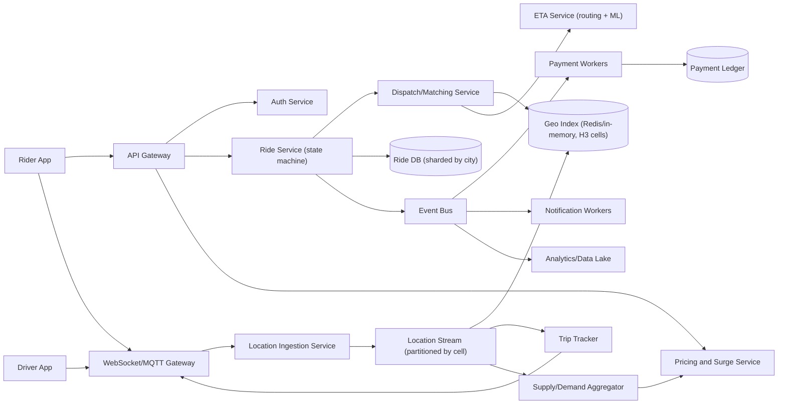
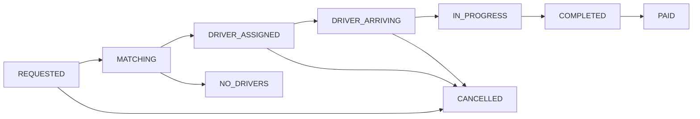
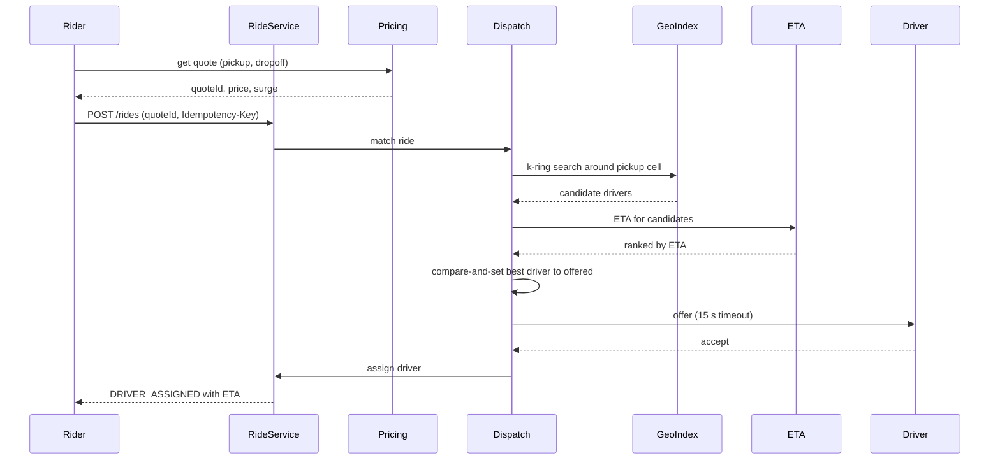

# Ride-Sharing System

> **Reviewed:** 2026-09 · **Scope:** Full-stack (frontend + backend + scalability) · **Level:** Senior / Tech Lead

---

## Overview

Design a ride-sharing platform like Uber where users can request rides, get matched with nearby drivers, track rides in real-time, and process payments. The system handles geospatial matching, dynamic pricing, and real-time location tracking.

---

## 1) Requirements

### Functional Requirements

**Core Features:**
- Request rides (pickup and dropoff locations)
- Real-time driver matching (nearest available driver)
- Real-time location tracking (driver and rider)
- Ride status updates (requested, matched, arriving, in-progress, completed)
- ETA calculation and display
- Dynamic pricing (surge pricing during peak hours)
- Payment processing
- Ride history and receipts
- Rating and review system

**Advanced Features:**
- Ride scheduling (book rides in advance)
- Multiple ride types (economy, premium, XL)
- Ride sharing (pool/group rides)
- Driver earnings dashboard
- Route optimization

### Non-Functional Requirements

**Performance:**
- Ride matching: < 5 seconds
- Real-time location updates: every 5 seconds
- Low-latency ride requests

**Scalability:**
- Handle 100M+ users
- 10M+ rides per day
- Millions of concurrent users during peak hours

**Reliability:**
- 99.9% uptime
- Accurate location tracking
- Reliable ride matching

---

## 2) Component Hierarchy

The frontend is a React application with map integration. Here's the structure:

```
App
├── Layout
│   └── MainContent
├── Pages
│   ├── HomePage
│   │   ├── MapView (Google Maps/Mapbox)
│   │   │   ├── PickupMarker
│   │   │   ├── DropoffMarker
│   │   │   ├── DriverMarker (if matched)
│   │   │   └── RoutePolyline
│   │   ├── RideRequestPanel
│   │   │   ├── PickupInput
│   │   │   ├── DropoffInput
│   │   │   ├── RideTypeSelector
│   │   │   ├── PriceEstimate
│   │   │   └── RequestRideButton
│   │   └── ActiveRidePanel (when ride active)
│   │       ├── RideStatus
│   │       ├── DriverInfo
│   │       ├── ETA
│   │       ├── CancelButton
│   │       └── ContactDriverButton
│   ├── RideHistoryPage
│   │   └── RideList
│   │       └── RideCard
│   └── DriverDashboard (for drivers)
│       ├── DriverStatusToggle
│       └── RideRequests
└── SharedComponents
    ├── MapView
    ├── LocationPicker
    └── Toast
```

### Key Components Explained

**1. MapView Component**
- Google Maps or Mapbox integration
- Shows pickup/dropoff locations
- Displays driver location (when matched)
- Shows route between locations
- Real-time location updates

**2. RideRequestPanel Component**
- Pickup and dropoff location inputs
- Autocomplete for addresses
- Ride type selection
- Price estimate display
- Request ride button

**3. ActiveRidePanel Component**
- Shows active ride status
- Driver information and ETA
- Real-time location updates
- Cancel ride button
- Contact driver button

---

## 3) Data Models

Here are the key data structures:

```typescript
// Ride
interface Ride {
  id: string;
  riderId: string;
  driverId?: string;
  driver?: Driver;
  pickupLocation: Location;
  dropoffLocation: Location;
  status: "requested" | "matched" | "arriving" | "in_progress" | "completed" | "cancelled";
  rideType: "economy" | "premium" | "xl";
  price: number;
  estimatedDuration: number;  // Minutes
  estimatedDistance: number;  // Kilometers
  actualDuration?: number;
  actualDistance?: number;
  requestedAt: string;
  matchedAt?: string;
  startedAt?: string;
  completedAt?: string;
  rating?: number;
  review?: string;
}

// Location
interface Location {
  latitude: number;
  longitude: number;
  address: string;
}

// Driver
interface Driver {
  id: string;
  name: string;
  avatar?: string;
  vehicle: Vehicle;
  rating: number;
  currentLocation: Location;
  isAvailable: boolean;
}

// Vehicle
interface Vehicle {
  make: string;
  model: string;
  licensePlate: string;
  color: string;
}

// Price estimate
interface PriceEstimate {
  rideType: string;
  estimatedPrice: number;
  estimatedDuration: number;
  estimatedDistance: number;
  surgeMultiplier?: number;  // For surge pricing
}
```

### Data Flow Explanation

**When a user requests a ride:**
1. User enters pickup and dropoff locations
2. System calculates price estimate
3. User confirms and requests ride
4. System matches with nearest available driver
5. Ride status: "requested" → "matched"
6. Driver accepts and status: "matched" → "arriving"
7. Driver arrives and status: "arriving" → "in_progress"
8. Ride completes and status: "in_progress" → "completed"
9. Payment processed and receipt generated

**Real-time location tracking:**
1. Driver location updated every 5 seconds
2. WebSocket broadcasts location to rider
3. Map updates driver marker position
4. ETA recalculated based on current location
5. Route updated if driver takes different path

---

## 4) API Design

### REST Endpoints

**POST /api/v1/rides/estimate**
- Get price estimate
- Request body: `{ pickupLocation: Location, dropoffLocation: Location, rideType: string }`
- Returns: PriceEstimate object

**POST /api/v1/rides**
- Request a ride
- Request body: `{ pickupLocation: Location, dropoffLocation: Location, rideType: string }`
- Returns: Ride object

**GET /api/v1/rides/:id**
- Get ride details
- Returns: Ride object

**PATCH /api/v1/rides/:id/cancel**
- Cancel a ride
- Returns: Updated Ride object

**POST /api/v1/rides/:id/rate**
- Rate a completed ride
- Request body: `{ rating: number, review?: string }`
- Returns: Updated Ride object

**GET /api/v1/rides**
- Get ride history
- Query params: `page`, `limit`
- Returns: Paginated list of Ride objects

### WebSocket Events

**Connection:** `wss://api.example.com/rides/:id`

**Events:**
- `ride_matched` - Driver matched to ride
- `driver_location` - Driver location update
- `ride_status` - Ride status changed
- `eta_update` - ETA updated

**Message Format:**
```json
{
  "type": "driver_location",
  "data": {
    "driverId": "driver_123",
    "location": {
      "latitude": 37.7749,
      "longitude": -122.4194
    },
    "eta": 5  // Minutes
  }
}
```

---

## Key Design Decisions

**1. Geospatial Matching**
- Match riders with nearest available drivers
- Use geospatial indexing for fast queries
- Consider driver availability and rating

**2. Real-time Location Tracking**
- Update driver location every 5 seconds
- WebSocket for instant updates
- Update map and ETA in real-time

**3. Dynamic Pricing**
- Calculate base price from distance/time
- Apply surge multiplier during peak hours
- Show price estimate before booking

**4. Ride Status Management**
- Clear status transitions
- Real-time status updates
- Handle cancellations gracefully

---

## Backend High-Level Design

Split the system into a **high-frequency location path** (driver pings, in-memory geo index) and a **transactional ride path** (ride state machine, payments).



**Components and responsibilities:**

- **Location Ingestion** — receives driver GPS pings (illustrative: every 4 s), validates, and publishes to a stream partitioned by geo cell. It does *not* write each ping to the primary DB.
- **Geo Index** — current driver positions keyed by cell. Options:
  - **Geohash** — string prefixes; easy with Redis `GEOSEARCH`, but cells are rectangular and neighbours across prefix boundaries need care.
  - **H3** (hexagonal) — uniform neighbour distances, good for k-ring searches and surge zones.
  - **S2** (spherical quad-tree cells) — good for region covering and variable resolution.
- **Dispatch/Matching** — queries nearby available drivers, ranks by ETA (not straight-line distance), sends offers, and handles accept/decline/timeout.
- **ETA Service** — road-graph routing plus learned corrections for traffic.
- **Pricing and Surge** — computes a multiplier per zone from demand/supply ratios over a short window, with smoothing and caps.
- **Ride Service** — owns the ride state machine and is the source of truth for ride status.
- **Workers** — payments, receipts, notifications via a queue; see [Messaging Systems](../backend/architecture/05-messaging-systems.md).

---

## Data Model and Consistency

**Ride state machine:**



**Schema sketch:**

```sql
rides(id PK, city_id, rider_id, driver_id, status, version,
      pickup_lat, pickup_lng, dropoff_lat, dropoff_lng,
      quoted_price, surge_multiplier, quote_id, idempotency_key UNIQUE,
      requested_at, completed_at)
INDEX rides_rider (rider_id, requested_at DESC)
INDEX rides_driver (driver_id, requested_at DESC)

ride_events(ride_id, seq, from_status, to_status, actor, created_at, PRIMARY KEY (ride_id, seq))
driver_state(driver_id PK, status, current_ride_id, last_cell, updated_at)   -- available, offered, on_trip, offline
price_quotes(id PK, rider_id, zone_id, multiplier, amount, expires_at)
trip_path(ride_id, ts, lat, lng)   -- sampled, cold storage after completion
```

**Partitioning:**
- Shard `rides` by `city_id` (or region): most queries and matching are local to a city.
- Partition the location stream and geo index by H3 cell (resolution chosen so a cell holds a manageable number of drivers).

**Consistency trade-offs:**
- **Driver assignment must be exactly-once:** a driver must not be assigned to two rides. Use a conditional update (`UPDATE driver_state SET status='offered' WHERE driver_id=? AND status='available'`) or a short Redis lock with TTL.
- **Ride transitions** use optimistic concurrency on `version`; illegal transitions are rejected.
- **Locations are eventually consistent and lossy** — dropping a ping is fine; the next one arrives in seconds.
- **Price quotes** are locked: the rider accepts a `quote_id` that expires; the ride stores the quoted price so surge changes do not alter an accepted fare.

**Idempotency:**
- `POST /rides` requires an `Idempotency-Key` so a retry on a flaky mobile network does not request two cars.
- Payment capture is keyed by `ride_id`.

---

## Scalability and Reliability

**Back-of-envelope (ILLUSTRATIVE assumptions, not real-world figures):**

| Assumption | Value |
|---|---|
| Online drivers at peak (one large region) | 500K |
| Location ping interval | every 4 s |
| Ping payload | 100 bytes |
| Ride requests per day | 10M |
| Peak-to-average ratio | 3× |

- Location writes: 500K / 4 = **125K pings/s** → 125K × 100 B = **12.5 MB/s** inbound.
- Ride requests: 10M / 86,400 ≈ **116/s** average → about **350/s** peak. Matching is low QPS but latency-sensitive and fan-out heavy (each request queries the geo index and ETA for several candidates).
- ETA calls: if each match evaluates 10 candidates → about **3,500 ETA computations/s** at peak, plus rider-facing ETA polling.
- Geo index memory: 500K drivers × about 200 bytes per entry = **about 100 MB** — fits in memory easily; the challenge is write rate, not size.

**Bottlenecks and fixes:**
- **Ping write rate:** keep only the latest position in memory; sample trip paths for storage; batch writes to the stream.
- **Hot zones** (stadium after an event): split hot cells to a finer resolution, shard the cell's partition, and cap candidate search radius.
- **Double dispatch:** conditional updates on driver state plus offer timeouts.
- **ETA latency:** cache road-segment travel times, precompute for popular pickup cells.

**Failure modes:**

| Failure | Impact | Mitigation |
|---|---|---|
| Geo index node lost | Dispatch cannot see drivers in some cells | Replicas, rebuild from the stream in seconds since drivers re-ping |
| Driver app loses connectivity | Stale position, missed offers | Mark stale after N missed pings, exclude from matching, buffer pings on device |
| Two dispatchers offer the same driver | Driver double-booked | Atomic compare-and-set on `driver_state` |
| Payment provider outage | Rides complete but uncharged | Queue captures with retries, ride remains `COMPLETED` until `PAID` |
| Surge service down | No price quote | Fall back to base price with a cap, or last-known multiplier with short TTL |
| Region/city DB shard down | New rides fail in that city | Replicated shard with failover, cities isolated from each other |

**Key flow — request and match:**



---

## Deep Dive Options (RADIO)

1. **Geo-indexing choice** — Compare geohash vs H3 vs S2 for neighbour search, zone definition for surge, and hot-cell splitting. Explain why the index is in memory and rebuilt from pings rather than persisted.
2. **Matching and dispatch** — Greedy nearest-ETA versus batched matching (collect requests for a short window, solve an assignment problem for better global efficiency). Cover offer timeouts, declines, and fairness to drivers.
3. **Surge pricing concept** — Per-zone demand/supply ratio over a sliding window, smoothing to avoid oscillation, caps and regulatory limits, and locking the quoted price at request time.

---

## Scaling with AI and Agentic Workflows

See [Agentic Workflows](../agentic-workflows/index.md) and [AI-Assisted Development](../ai/ai-assisted-development/index.md).

**Engineering workflows:**
- **Bottleneck brainstorming:** ask an agent for hotspots (ping ingestion, hot cells, ETA fan-out), then check each against the 125K pings/s and 3,500 ETA/s estimates above.
- **Load-test generation:** generate simulators that replay synthetic driver trajectories and request bursts around a venue.
- **RCA summarization:** summarize dispatch traces to explain spikes in `NO_DRIVERS` or offer timeouts by zone.
- **Runbooks and migrations:** draft runbooks for geo-index rebuilds, or migration plans from geohash to H3 with shadow reads comparing candidate sets.

**Product AI — ETA prediction and dispatch:**
- **ETA models** correct routing-engine estimates using traffic, time of day, and historical segments. They must answer within the matching latency budget (tens of milliseconds per batch), so use lightweight models served near the dispatch service with cached features.
- **Demand forecasting** helps position drivers and pre-warm surge zones; runs offline or every few minutes, so cost is modest.
- **Dispatch optimization** can use ML-predicted acceptance probability; keep a deterministic fallback when the model is unavailable.
- Data trade-offs: location data is sensitive; minimize retention, aggregate for training, and apply regional privacy rules.

**Human approval required for:**
- Changes to surge caps, pricing formulas, or driver pay logic.
- Rolling out a new dispatch or ETA model (A/B with guardrail metrics first).
- Driver deactivation decisions based on model flags.

**Do not trust AI for:**
- Safety-critical decisions without deterministic checks.
- Capacity numbers without shown arithmetic.
- Fairness claims about pricing or dispatch without measured audits.

---

## Interview Talking Points

**When explaining this system, I'd focus on:**

1. **Requirements First**: Start with core functionality - request rides, driver matching, real-time tracking, payments

2. **Component Structure**: Explain the React component hierarchy - map view, ride request panel, active ride panel

3. **Data Models**: Walk through Ride, Location, Driver - and ride status flow

4. **API Design**: Show the REST endpoints and WebSocket protocol - ride requests, location tracking, status updates

5. **Key Challenges**: 
   - Geospatial matching for driver assignment
   - Real-time location tracking and updates
   - Dynamic pricing calculation
   - Handling peak hour traffic

**Example explanation flow:**
> "So for a ride-sharing system, the core requirement is connecting riders with nearby drivers and tracking rides in real-time. The frontend is a React app with a map component (Google Maps/Mapbox) that shows pickup/dropoff locations and driver location. When a user requests a ride, they enter pickup and dropoff locations, and the system matches them with the nearest available driver. Real-time location tracking updates the driver's position every 5 seconds via WebSocket, and the map and ETA update accordingly. The data model includes Ride objects with status tracking (requested, matched, arriving, in_progress, completed), Location objects for geospatial data, and Driver objects with availability status. Dynamic pricing calculates the fare based on distance, time, and surge multipliers during peak hours. The main API endpoints handle ride requests, price estimates, and ride management, while WebSocket handles real-time location and status updates. Key challenges include geospatial matching for efficient driver assignment, real-time location tracking at scale, and handling traffic spikes during peak hours."

### Follow-up Questions

<details>
<summary>Why not store every GPS ping in the main database?</summary>

The write rate is high and most pings are only useful for seconds. Keep the latest position in memory, stream pings for consumers, and store a sampled trip path for receipts and disputes.

</details>

<details>
<summary>How do you prevent a driver from being assigned two rides?</summary>

An atomic compare-and-set on the driver's state (`available` to `offered`) before sending an offer, with a timeout that returns the driver to `available` if they do not respond.

</details>

<details>
<summary>Geohash, H3, or S2?</summary>

Geohash is simplest and built into Redis. H3 gives uniform hexagonal neighbours, which suits k-ring searches and surge zones. S2 is strong for region covering. Any works if you handle cell boundaries and hot-cell splitting.

</details>

<details>
<summary>How is surge price kept fair to the rider who already accepted?</summary>

The rider accepts a quote with a `quoteId` and expiry. The ride stores the quoted amount, so later surge changes do not affect it.

</details>

<details>
<summary>How do you handle a city-wide spike after a concert?</summary>

Finer geo cells for the hot zone, batched matching, surge to balance supply, and queueing requests with honest ETAs rather than failing them.

</details>

<details>
<summary>What happens if the rider's app retries POST /rides?</summary>

The `Idempotency-Key` returns the existing ride instead of creating a new one.

</details>

### Common Mistakes

- Ranking drivers by straight-line distance instead of road ETA.
- Persisting every location ping synchronously.
- No atomic driver reservation, leading to double dispatch.
- Recomputing price after the rider accepted.
- One global database instead of city/region sharding.
- Ignoring stale driver locations when the app goes offline.

---

## References

- [H3: Uber's hexagonal hierarchical spatial index](https://h3geo.org/)
- [S2 Geometry](https://s2geometry.io/)
- [Redis geospatial indexes](https://redis.io/docs/latest/develop/data-types/geospatial/)
- [Geohash (Wikipedia)](https://en.wikipedia.org/wiki/Geohash)
- [MDN: WebSockets API](https://developer.mozilla.org/en-US/docs/Web/API/WebSockets_API)

