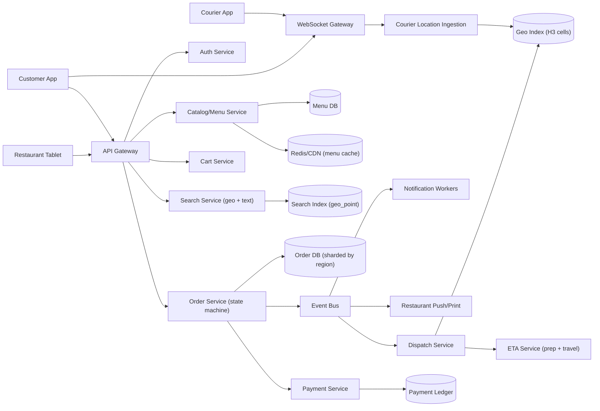
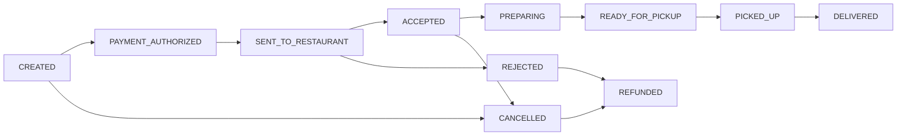
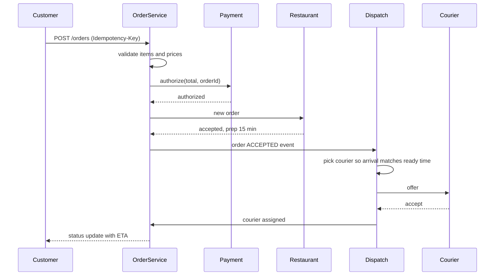

# Food Delivery System

> **Reviewed:** 2026-09 · **Scope:** Full-stack (frontend + backend + scalability) · **Level:** Senior / Tech Lead

---

## Overview

Design a food delivery platform where users can browse restaurants and menus, place orders, track deliveries in real-time, and process payments. The system handles order management, delivery partner matching, and real-time tracking.

---

## 1) Requirements

### Functional Requirements

**Core Features:**
- Browse restaurants and menus
- Place orders with customization
- Real-time order tracking
- Delivery partner assignment
- Payment processing
- Order history
- Restaurant ratings and reviews
- Order scheduling (book in advance)

**Advanced Features:**
- Multiple payment methods
- Order recommendations
- Loyalty programs
- Group ordering
- Order cancellation and refunds

### Non-Functional Requirements

**Performance:**
- Order placement: < 3 seconds
- Real-time location tracking
- Fast restaurant and menu browsing

**Scalability:**
- Handle 50M+ users
- 10M+ orders per day
- Thousands of restaurants
- Millions of concurrent users during peak hours

**Reliability:**
- 99.9% uptime
- Accurate order processing
- Real-time tracking accuracy

---

## 2) Component Hierarchy

The frontend is a React application with map integration. Here's the structure:

```
App
├── Layout
│   ├── Header
│   │   ├── Logo
│   │   ├── LocationSelector
│   │   └── UserMenu
│   └── MainContent
├── Pages
│   ├── HomePage
│   │   ├── RestaurantList
│   │   │   └── RestaurantCard
│   │   └── CategoryFilters
│   ├── RestaurantPage
│   │   ├── RestaurantInfo
│   │   ├── MenuList
│   │   │   └── MenuItem
│   │   │       ├── ItemImage
│   │   │       ├── ItemName
│   │   │       ├── ItemPrice
│   │   │       ├── CustomizationOptions
│   │   │       └── AddToCartButton
│   │   └── CartSummary
│   ├── CheckoutPage
│   │   ├── OrderSummary
│   │   ├── DeliveryAddress
│   │   ├── PaymentMethod
│   │   └── PlaceOrderButton
│   ├── OrderTrackingPage
│   │   ├── OrderStatus (preparing, out for delivery, delivered)
│   │   ├── TrackingMap
│   │   │   ├── RestaurantMarker
│   │   │   ├── DeliveryPartnerMarker
│   │   │   └── RoutePolyline
│   │   ├── ETA
│   │   └── DeliveryPartnerInfo
│   └── OrderHistoryPage
│       └── OrderList
└── SharedComponents
    ├── RestaurantCard
    ├── MenuItem
    └── TrackingMap
```

### Key Components Explained

**1. RestaurantList Component**
- Displays restaurants in grid/list
- Filters by category, cuisine, rating
- Shows delivery time and minimum order
- Clickable to view restaurant

**2. MenuList Component**
- Displays restaurant menu
- Menu items with customization options
- Add to cart functionality
- Cart summary sidebar

**3. OrderTrackingPage Component**
- Real-time order status
- Map showing restaurant and delivery partner
- ETA calculation
- Delivery partner information

---

## 3) Data Models

Here are the key data structures:

```typescript
// Restaurant
interface Restaurant {
  id: string;
  name: string;
  cuisine: string;
  rating: number;
  deliveryTime: number;  // Minutes
  minimumOrder: number;
  deliveryFee: number;
  imageUrl: string;
  address: string;
  isOpen: boolean;
}

// Menu item
interface MenuItem {
  id: string;
  restaurantId: string;
  name: string;
  description: string;
  price: number;
  imageUrl?: string;
  category: string;
  customizationOptions?: CustomizationOption[];
  isAvailable: boolean;
}

// Customization option
interface CustomizationOption {
  id: string;
  name: string;
  type: "single" | "multiple";
  options: Option[];
  required: boolean;
}

// Order
interface Order {
  id: string;
  userId: string;
  restaurantId: string;
  restaurant: Restaurant;
  items: OrderItem[];
  deliveryAddress: Address;
  status: "pending" | "confirmed" | "preparing" | "out_for_delivery" | "delivered" | "cancelled";
  deliveryPartnerId?: string;
  deliveryPartner?: DeliveryPartner;
  totalAmount: number;
  estimatedDeliveryTime: string;
  createdAt: string;
}

// Order item
interface OrderItem {
  id: string;
  menuItemId: string;
  menuItem: MenuItem;
  quantity: number;
  price: number;
  customizations: Record<string, string[]>;  // Selected options
}

// Delivery partner
interface DeliveryPartner {
  id: string;
  name: string;
  phone: string;
  currentLocation: Location;
  vehicle: Vehicle;
  rating: number;
}
```

### Data Flow Explanation

**When a user places an order:**
1. User browses restaurants and selects items
2. User customizes items (if options available)
3. User proceeds to checkout
4. User selects delivery address and payment method
5. Order is placed: POST /api/v1/orders
6. Order status: "pending" → "confirmed" → "preparing"
7. Delivery partner assigned
8. Order status: "preparing" → "out_for_delivery"
9. Real-time tracking of delivery partner
10. Order status: "out_for_delivery" → "delivered"

**Real-time tracking:**
1. Delivery partner location updated every 5 seconds
2. WebSocket broadcasts location to user
3. Map updates delivery partner marker
4. ETA recalculated based on current location
5. Route updated as delivery partner moves

---

## 4) API Design

### REST Endpoints

**GET /api/v1/restaurants**
- Get restaurants
- Query params: `location`, `cuisine`, `rating`, `page`, `limit`
- Returns: Paginated list of Restaurant objects

**GET /api/v1/restaurants/:id/menu**
- Get restaurant menu
- Returns: Array of MenuItem objects

**POST /api/v1/orders**
- Create an order
- Request body: `{ restaurantId: string, items: OrderItem[], deliveryAddressId: string, paymentMethodId: string }`
- Returns: Order object

**GET /api/v1/orders/:id**
- Get order details
- Returns: Order object

**GET /api/v1/orders/:id/tracking**
- Get order tracking info
- Returns: Order with delivery partner location

**GET /api/v1/orders**
- Get order history
- Query params: `page`, `limit`, `status`
- Returns: Paginated list of Order objects

### WebSocket Events

**Connection:** `wss://api.example.com/orders/:id`

**Events:**
- `order_status` - Order status changed
- `delivery_location` - Delivery partner location update
- `eta_update` - ETA updated

---

## Key Design Decisions

**1. Real-time Order Tracking**
- Track delivery partner location in real-time
- Update map and ETA continuously
- Better user experience
- WebSocket for instant updates

**2. Order Status Management**
- Clear status transitions
- Real-time status updates
- Handle cancellations gracefully

**3. Menu Customization**
- Support item customization options
- Store selected customizations
- Calculate price with customizations

---

## Backend High-Level Design

Food delivery is a **three-sided marketplace** (customer, restaurant, courier). Compared with ride-sharing, the extra complexity is **food preparation time**: dispatch must time courier arrival to when the food is ready.



**Components and responsibilities:**

- **Catalog/Menu Service** — read-heavy; menus cached at CDN/Redis with invalidation on restaurant edits. Item availability ("sold out") uses a short TTL.
- **Search** — restaurants by delivery radius (geo filter), cuisine, rating, and open hours.
- **Order Service** — owns the order state machine and is the source of truth; emits events for everyone else.
- **Dispatch** — assigns couriers using geo-index candidates, predicted food-ready time, and batching (one courier, multiple orders).
- **ETA Service** — combines prep-time prediction, courier travel to restaurant, wait, and travel to customer.
- **Workers** — notifications, receipts, restaurant payouts; queue-backed via [RabbitMQ](../backend/rabbitmq/index.md) or [Celery](../backend/celery/index.md).

---

## Data Model and Consistency

**Order state machine:**



Courier assignment is a **parallel sub-state** (`UNASSIGNED`, `OFFERED`, `ASSIGNED`, `AT_RESTAURANT`) so a courier can be dispatched while food is being prepared.

**Schema sketch:**

```sql
orders(id PK, region_id, customer_id, restaurant_id, courier_id, status, courier_status, version,
       subtotal, fees, total, idempotency_key UNIQUE, placed_at, promised_at, delivered_at)
INDEX orders_customer (customer_id, placed_at DESC)
INDEX orders_restaurant_active (restaurant_id, status) WHERE status NOT IN ('DELIVERED','CANCELLED','REFUNDED')

order_items(order_id, line_no, menu_item_id, name_snapshot, price_snapshot, options_json, qty)
order_events(order_id, seq, from_status, to_status, actor, created_at, PRIMARY KEY (order_id, seq))
menu_items(id PK, restaurant_id, name, price, available, updated_at)
couriers(id PK, status, current_cell, active_order_ids, updated_at)
outbox(id PK, aggregate_id, event_type, payload, published_at)
```

**Partitioning:** shard orders by `region_id` (city/metro); restaurant-active index serves the tablet dashboard.

**Consistency trade-offs:**
- **Price snapshots:** `order_items` copy name and price at order time so menu edits never change a placed order.
- **Order + payment:** authorize payment first, capture on delivery (or on restaurant acceptance, per policy). Use a **saga** with compensations (void authorization, refund) rather than a distributed transaction.
- **Transactional outbox:** status change and event are written in the same DB transaction; a relay publishes events, so dispatch and notifications never miss a transition.
- **Menu and search are eventually consistent**; the order service re-validates item availability and price at checkout.
- **Courier assignment** uses compare-and-set on courier status, as in ride-sharing.

**Idempotency:** `POST /orders` with an `Idempotency-Key`; event consumers dedupe on `(order_id, seq)`; payment calls pass the order ID as the provider idempotency key.

---

## Scalability and Reliability

**Back-of-envelope (ILLUSTRATIVE assumptions, not real-world figures):**

| Assumption | Value |
|---|---|
| Orders per day | 5M |
| Share of daily orders in lunch + dinner peaks (4 hours total) | 60% |
| Menu/search reads per order placed | 30 |
| Active couriers at peak | 200K |
| Courier ping interval | every 5 s |

- Peak orders: 5M × 0.6 = 3M over 4 h = 14,400 s → **about 210 orders/s** at peak (versus about 58/s daily average).
- Menu/search reads at peak: 210 × 30 = **about 6,300 reads/s** — cache-friendly.
- Courier pings: 200K / 5 = **40K pings/s**.
- Order events: each order has about 10 transitions → 210 × 10 = **about 2,100 events/s** at peak, fanned out to several consumers.

**Bottlenecks and fixes:**
- **Lunch/dinner spikes:** autoscale on schedule ahead of peaks; cache menus aggressively; queue restaurant notifications.
- **Restaurant capacity**, not servers, is often the real bottleneck: throttle orders or extend promised times when a kitchen's queue is long.
- **Dispatch quality at peak:** batch orders from the same restaurant or nearby restaurants to one courier.
- **Hot restaurants:** per-restaurant order-rate limits and dynamic "busy" status.

**Failure modes:**

| Failure | Impact | Mitigation |
|---|---|---|
| Restaurant tablet offline | Orders not seen, food never prepared | Acceptance timeout triggers phone call/SMS fallback, then auto-cancel and refund |
| Payment authorization timeout | Unknown payment state | Idempotent retry with same key, reconcile with provider before re-charging |
| Event relay (outbox) lag | Dispatch delayed | Monitor outbox age, scale relay, dispatch also polls for stale unassigned orders |
| No courier available | Food waits and goes cold | Widen search radius, incentives, honest updated ETA to customer |
| Menu cache stale | Customer orders sold-out item | Re-validate at checkout, restaurant can reject with auto-refund |
| Region DB failover | Orders in region briefly unavailable | Replicated primary with fast failover, region isolation |

**Key flow — place order to courier assignment:**



---

## Deep Dive Options (RADIO)

1. **Order state machine and saga** — Transitions, who is allowed to trigger each, compensations (refund on rejection), timeouts (restaurant does not accept in N minutes), and the outbox pattern for reliable events.
2. **Dispatch with prep time** — Assign too early and couriers wait; too late and food gets cold. Discuss batching, predicted ready time, and re-dispatch when a courier cancels.
3. **Geo search and delivery radius** — H3 or geohash cells for restaurants and couriers, delivery zones as polygons, and caching "restaurants deliverable to cell X".

---

## Scaling with AI and Agentic Workflows

See [Agentic Workflows](../agentic-workflows/index.md) and [AI-Assisted Development](../ai/ai-assisted-development/index.md).

**Engineering workflows:**
- **Bottleneck brainstorming:** let an agent propose peak-hour failure points, then validate them against the 210 orders/s and 40K pings/s estimates.
- **Load-test generation:** generate lunch-peak scenarios with realistic funnel ratios (browse → cart → order) and slow restaurant acceptance.
- **RCA summarization:** summarize order-event traces to find where late deliveries accumulate (acceptance, prep, courier wait, travel).
- **Runbooks and migrations:** draft runbooks for "restaurant tablet outage" and migration plans for re-sharding a growing region.

**Product AI — ETA and dispatch:**
- **Prep-time prediction** per restaurant and item mix, and **delivery ETA** combining prep, wait, and travel. Serve with low latency in the dispatch loop; recompute on each state change.
- **Dispatch optimization** with ML-scored courier acceptance and batching suggestions; keep a rule-based fallback.
- **Menu understanding** (tagging dishes, dietary labels) and search ranking run offline or asynchronously, keeping cost low.
- Data trade-offs: courier location privacy, fairness in courier pay, and clear communication when ETAs are predictions.

**Human approval required for:**
- Changes to courier pay, fees, or promised-time policies.
- Deploying new ETA/dispatch models (A/B with guardrails on late rate and cold-food complaints).
- Automated refunds above a threshold.

**Do not trust AI for:**
- Allergen or dietary claims without restaurant-confirmed data.
- Capacity numbers without arithmetic.
- Final decisions on courier deactivation.

---

## Interview Talking Points

**When explaining this system, I'd focus on:**

1. **Requirements First**: Start with core functionality - browse restaurants, place orders, real-time tracking, payments

2. **Component Structure**: Explain the React component hierarchy - restaurant list, menu, order tracking

3. **Data Models**: Walk through Restaurant, MenuItem, Order - and order status flow

4. **API Design**: Show the REST endpoints and WebSocket protocol - orders, tracking, real-time updates

5. **Key Challenges**: 
   - Real-time delivery tracking
   - Order status management
   - Handling peak hours (lunch/dinner)
   - Delivery partner matching

**Example explanation flow:**
> "So for a food delivery system, the core requirement is allowing users to browse restaurants, place orders, and track deliveries in real-time. The frontend is a React app with a restaurant list showing available restaurants, a menu view for selecting items with customization options, and an order tracking page with a map showing the delivery partner's location. When a user places an order, it goes through status transitions (pending, confirmed, preparing, out_for_delivery, delivered). Real-time tracking updates the delivery partner's location every 5 seconds via WebSocket, and the map and ETA update accordingly. The data model includes Restaurant objects, MenuItem objects with customization options, and Order objects with status tracking. The main API endpoints handle restaurant browsing, order creation, and order tracking, while WebSocket handles real-time location and status updates. Key challenges include real-time delivery tracking, handling traffic spikes during peak meal times, and ensuring accurate order status updates."

### Follow-up Questions

<details>
<summary>How is food delivery dispatch different from ride-sharing?</summary>

The pickup is not ready immediately. Dispatch must predict when food will be ready and time the courier's arrival, and it can batch multiple orders per courier.

</details>

<details>
<summary>Why copy menu prices into order items?</summary>

So later menu edits do not change what the customer agreed to pay; the order is a historical record.

</details>

<details>
<summary>How do you keep order status changes and events in sync?</summary>

Use a transactional outbox: write the status and event in one DB transaction, then publish asynchronously. Consumers are idempotent.

</details>

<details>
<summary>What if the restaurant never accepts?</summary>

A timeout escalates (call/SMS), then auto-cancels and voids the payment authorization, notifying the customer.

</details>

<details>
<summary>How do you handle the lunch spike?</summary>

Scheduled pre-scaling, aggressive menu caching, queueing restaurant notifications, throttling orders per restaurant, and batching deliveries.

</details>

<details>
<summary>When do you charge the customer?</summary>

Authorize at checkout and capture at delivery or acceptance, depending on policy; adjustments (missing items) become refunds against the capture.

</details>

### Common Mistakes

- Ignoring restaurant preparation time in ETA and dispatch.
- Using a distributed transaction across order, payment, and dispatch instead of a saga.
- Not snapshotting prices on the order.
- No timeout path when the restaurant does not respond.
- Treating the search index as the source of truth for availability.
- Scaling servers but ignoring kitchen capacity.

---

## References

- [H3: hexagonal hierarchical spatial index](https://h3geo.org/)
- [Transactional outbox pattern (microservices.io)](https://microservices.io/patterns/data/transactional-outbox.html)
- [Saga pattern (microservices.io)](https://microservices.io/patterns/data/saga.html)
- [Stripe: Idempotent requests](https://docs.stripe.com/api/idempotent_requests)
- [Redis geospatial indexes](https://redis.io/docs/latest/develop/data-types/geospatial/)

