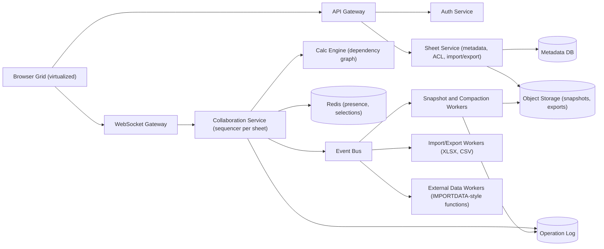
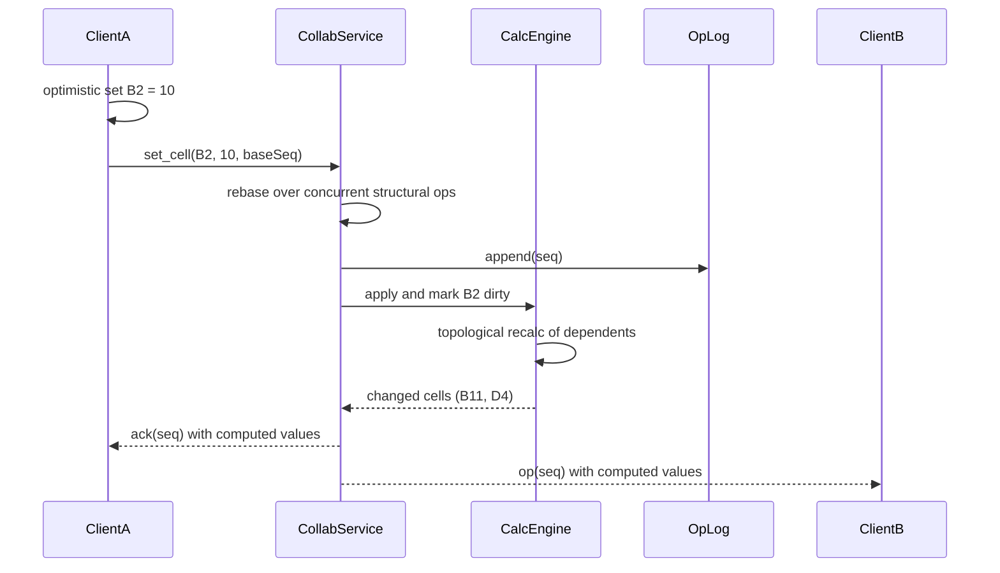

# Collaborative Spreadsheet System

> **Reviewed:** 2026-09 · **Scope:** Full-stack (frontend + backend + scalability) · **Level:** Senior / Tech Lead

---

## Overview

Design a collaborative spreadsheet application where multiple users can edit spreadsheets in real-time, similar to Google Sheets or Microsoft Excel Online. The system needs to handle formulas, cell formatting, and real-time synchronization.

---

## 1) Requirements

### Functional Requirements

**Core Features:**
- Create, edit, and delete spreadsheets
- Real-time collaborative editing with multiple users (50+ concurrent editors)
- Formula engine supporting common functions (SUM, AVERAGE, IF, VLOOKUP, etc.)
- Cell formatting (bold, italic, colors, borders, alignment, number formats)
- Multiple sheets per workbook (tabs)
- Data import/export (CSV, Excel, JSON)
- Charts and graphs visualization
- Freeze panes and cell merging
- Undo/redo functionality
- Search and find/replace

**Collaboration Features:**
- Real-time cell updates visible to all users
- Presence indicators (who's viewing/editing)
- Cursor positions for active users
- Conflict resolution for simultaneous edits

### Non-Functional Requirements

**Performance:**
- Cell updates: < 100ms latency
- Formula recalculation: < 200ms
- Support spreadsheets with 10K+ rows and 1K+ columns
- Fast scrolling and rendering for large datasets

**Scalability:**
- Handle millions of spreadsheets
- Support 50+ concurrent editors per sheet
- Billions of cells in storage

**Reliability:**
- High availability (99.9% uptime)
- Auto-save functionality
- Version history

**User Experience:**
- Responsive design (mobile and desktop)
- Keyboard shortcuts
- Accessible interface (keyboard navigation, screen readers)

---

## 2) Component Hierarchy

The frontend is built as a React application with a clear component hierarchy. Here's how I'd structure it:

```
App
├── Layout
│   ├── Header
│   │   ├── SpreadsheetTitle (editable)
│   │   ├── CollaborationIndicator (shows active users)
│   │   └── UserMenu
│   ├── Toolbar
│   │   ├── FormatButtons (Bold, Italic, Underline, Colors)
│   │   ├── AlignmentButtons (Left, Center, Right)
│   │   ├── NumberFormatButtons (Currency, Percentage, Date)
│   │   ├── InsertButtons (Chart, Image, Link)
│   │   └── ActionButtons (Undo, Redo, Save)
│   ├── FormulaBar
│   │   ├── CellReference (shows active cell like "A1")
│   │   ├── FormulaInput (where user types formulas)
│   │   └── FunctionList (autocomplete for functions)
│   └── MainContent
│       ├── SheetTabs (multiple sheets in workbook)
│       └── SpreadsheetGrid
│           ├── RowHeaders (1, 2, 3...)
│           ├── ColumnHeaders (A, B, C...)
│           ├── Cell (Virtualized - only renders visible cells)
│           │   ├── CellValue (displays value or formula result)
│           │   ├── CellEditor (inline editing)
│           │   └── CellFormatting (applies styles)
│           ├── SelectionOverlay (highlights selected cells)
│           └── CursorIndicators (other users' cursors)
└── Sidebar (optional)
    ├── FormatPanel (detailed formatting options)
    ├── ChartPanel (chart creation/editing)
    └── CollaborationPanel (list of active users)
```

### Key Components Explained

**1. SpreadsheetGrid Component**
- Uses virtualization (react-window) to render only visible cells
- Handles cell selection (single cell or range)
- Manages keyboard navigation (arrow keys, Tab, Enter)
- Optimized with React.memo to prevent unnecessary re-renders

**2. Cell Component**
- Displays cell value or formula result
- Handles inline editing (double-click to edit)
- Applies formatting (styles, colors, borders)
- Shows formula errors if any

**3. FormulaBar Component**
- Shows active cell reference (e.g., "A1")
- Displays cell value or formula
- Allows formula editing with syntax highlighting
- Provides function autocomplete

**4. FormulaEngine (Business Logic)**
- Parses formulas into Abstract Syntax Tree (AST)
- Evaluates formulas with dependency tracking
- Detects circular references
- Recalculates dependent cells when dependencies change

**5. CollaborationManager**
- WebSocket connection for real-time updates
- Operational transformation for conflict resolution
- Presence tracking (who's viewing, cursor positions)
- Broadcasts cell changes to all connected clients

---

## 3) Data Models

Here are the key data structures I'd use:

```typescript
// Main spreadsheet structure
interface Spreadsheet {
  id: string;
  name: string;
  sheets: Sheet[];  // Multiple sheets in one workbook
  createdAt: string;
  updatedAt: string;
  ownerId: string;
  collaborators: Collaborator[];
}

// Individual sheet within a workbook
interface Sheet {
  id: string;
  name: string;  // "Sheet1", "Sheet2", etc.
  rows: number;
  columns: number;
  cells: Map<string, Cell>;  // Key: "A1", "B2", etc.
  frozenRows: number;  // Freeze panes feature
  frozenColumns: number;
}

// Individual cell
interface Cell {
  id: string;  // "A1", "B2", etc.
  row: number;
  column: number;
  value: string | number | null;  // Displayed value
  formula: string | null;  // Formula if any (e.g., "=SUM(A1:A10)")
  format: CellFormat;
  type: 'text' | 'number' | 'formula' | 'date';
  dependencies: string[];  // Cell IDs this cell depends on (for formulas)
  dependents: string[];  // Cell IDs that depend on this cell
}

// Cell formatting
interface CellFormat {
  bold: boolean;
  italic: boolean;
  underline: boolean;
  fontSize: number;
  fontFamily: string;
  textColor: string;
  backgroundColor: string;
  alignment: 'left' | 'center' | 'right';
  border: BorderStyle;
  numberFormat: 'general' | 'number' | 'currency' | 'percentage' | 'date';
}

// Formula representation
interface Formula {
  id: string;
  cellId: string;
  expression: string;  // "=SUM(A1:A10)"
  ast: ASTNode;  // Parsed Abstract Syntax Tree
  dependencies: string[];  // ["A1", "A2", ..., "A10"]
  result: any;  // Calculated result
  error: string | null;  // Error message if formula is invalid
}

// AST node for formula parsing
interface ASTNode {
  type: 'function' | 'reference' | 'literal' | 'operator';
  value: string;
  children: ASTNode[];
}

// Collaboration
interface Collaborator {
  userId: string;
  email: string;
  role: 'owner' | 'editor' | 'viewer';
  cursorPosition: CursorPosition | null;
}

interface CursorPosition {
  cellId: string;
  row: number;
  column: number;
  color: string;  // User's cursor color
}

// Update operation for real-time sync
interface SpreadsheetUpdate {
  type: 'cell_update' | 'cell_format' | 'formula_change' | 'sheet_add';
  cellId?: string;
  sheetId: string;
  data: any;
  timestamp: string;
  userId: string;
  version: number;  // For conflict resolution
}
```

### Data Flow Explanation

**When a user edits a cell:**
1. Cell value/formula is updated in the `Cell` object
2. If it's a formula, dependencies are calculated and stored
3. Dependent cells are identified and queued for recalculation
4. Update is broadcasted via WebSocket to other users
5. All clients update their local state

**Formula Dependency Graph:**
- If cell B1 has formula `=A1*2`, then B1 depends on A1
- When A1 changes, B1 needs to recalculate
- We maintain a dependency graph to track these relationships
- Circular references are detected using graph traversal

---

## 4) API Design

### REST Endpoints

**GET /api/v1/spreadsheets/:id**
- Fetch spreadsheet data
- Returns spreadsheet with all sheets and cells
- Response includes metadata (owner, collaborators, timestamps)

**PATCH /api/v1/spreadsheets/:id/cells**
- Update one or more cells
- Request body contains array of cell updates
- Returns updated cells and list of cells that need recalculation

**POST /api/v1/spreadsheets/:id/formulas/evaluate**
- Evaluate a formula (useful for validation)
- Takes formula string and cell context
- Returns result and dependencies

**POST /api/v1/spreadsheets/:id/export**
- Export spreadsheet to CSV/Excel
- Request specifies format and optional range
- Returns file download

**POST /api/v1/spreadsheets/:id/import**
- Import data from CSV/Excel file
- Uploads file via FormData
- Returns import summary (rows/columns imported)

### API Request/Response Examples

**Update Cell:**
```json
// PATCH /api/v1/spreadsheets/:id/cells
{
  "sheetId": "sheet_1",
  "updates": [
    {
      "cellId": "A1",
      "value": "Hello",
      "formula": null
    },
    {
      "cellId": "B1",
      "value": null,
      "formula": "=A1*2"
    }
  ]
}

// Response
{
  "success": true,
  "data": {
    "updatedCells": ["A1", "B1"],
    "recalculatedCells": ["B1"]  // B1 recalculated because it depends on A1
  }
}
```

**Get Spreadsheet:**
```json
// GET /api/v1/spreadsheets/:id
// Response
{
  "success": true,
  "data": {
    "id": "spreadsheet_123",
    "name": "My Spreadsheet",
    "sheets": [
      {
        "id": "sheet_1",
        "name": "Sheet1",
        "cells": {
          "A1": {
            "id": "A1",
            "row": 1,
            "column": 1,
            "value": "Hello",
            "formula": null,
            "format": { "bold": true, "fontSize": 12 }
          },
          "B1": {
            "id": "B1",
            "row": 1,
            "column": 2,
            "value": 20,
            "formula": "=A1*2",
            "format": {}
          }
        }
      }
    ]
  }
}
```

### WebSocket Protocol

**Connection:** `wss://api.example.com/spreadsheets/:id`

**Events:**
- `cell_update` - Cell value or formula changed
- `cell_format` - Cell formatting changed
- `presence_update` - User joined/left or cursor moved
- `conflict` - Conflict detected, requires resolution

**Message Format:**
```json
{
  "type": "cell_update",
  "data": {
    "cellId": "A1",
    "sheetId": "sheet_1",
    "value": "New Value",
    "userId": "user_123",
    "timestamp": "2024-01-15T12:00:00Z",
    "version": 5
  }
}
```

### Conflict Resolution Strategy

**Version-based approach:**
- Each update includes a version number
- Server maintains current version
- If client sends update with outdated version, server returns 409 Conflict
- Client must fetch latest version and retry

**Operational Transformation (OT):**
- For real-time collaboration, use OT to transform concurrent operations
- When two users edit simultaneously, operations are transformed to maintain consistency
- Example: User A inserts at position 5, User B inserts at position 3
  - Operations are transformed so both insertions are preserved correctly
- In a spreadsheet the most important transforms are **structural**: if User A inserts a row above row 5 while User B edits `B7`, B's edit must be shifted to `B8`, and formulas referencing moved cells must be rewritten
- Concurrent edits to the **same cell** are usually resolved by last-writer-wins in server order (with the losing value visible in cell history), because merging two scalar values is not meaningful

---

## Key Design Decisions

**1. Virtualization for Performance**
- Only render visible cells (react-window)
- For 10K rows, we don't render all 10K cells at once
- Only render what's visible in viewport + small buffer

**2. Formula Dependency Graph**
- Maintain a graph of formula dependencies
- When a cell changes, only recalculate dependent cells
- Prevents unnecessary recalculations

**3. Optimistic Updates**
- Apply changes locally immediately (optimistic)
- Send to server in background
- If server rejects, rollback and show error

**4. WebSocket for Real-time**
- WebSocket connection per spreadsheet
- Broadcast changes to all connected clients
- Use operational transformation for conflict resolution

**5. Cell Storage Strategy**
- Store only non-empty cells (sparse storage)
- Don't store empty cells to save space
- Use Map data structure: key is cell ID ("A1"), value is Cell object

---

## Backend High-Level Design

A spreadsheet is a collaborative editor whose "document" is a sparse grid **plus a computation graph**. The backend must sequence edits, recalculate formulas authoritatively, and keep large sheets loadable quickly.



**Components and responsibilities:**

- **Collaboration Service** — one owner per sheet (consistent hashing on `sheetId`) that assigns a total order (`seq`) to ops, applies structural transforms (row/column insert/delete), and broadcasts.
- **Calc Engine** — co-located with the sheet owner; holds the dependency graph in memory and recalculates affected cells after each op. The server result is authoritative; clients may compute optimistically for instant feedback.
- **Operation Log + Snapshots** — same pattern as the [real-time collaboration system](./10-real-time-collaboration-system.md): append ops, snapshot periodically, compact.
- **Workers** — XLSX/CSV import-export, external data fetches, and snapshotting run asynchronously (see [Celery](../backend/celery/index.md) and [MinIO](../backend/minio/index.md) for object storage).

---

## Data Model and Consistency

**Schema sketch:**

```sql
spreadsheets(id PK, owner_id, title, current_seq, latest_snapshot_seq, updated_at)
sheet_acl(sheet_id, principal_id, role, PRIMARY KEY (sheet_id, principal_id))
tabs(spreadsheet_id, tab_id, name, row_count, col_count, position)

-- Sparse cell storage in snapshots (object storage), chunked by row block
-- key: {spreadsheetId}/{tabId}/{snapshotSeq}/rows-{0000-0999}.bin

ops(spreadsheet_id, seq, client_id, client_op_id, op_type, payload, author_id, created_at,
    PRIMARY KEY ((spreadsheet_id), seq))
    -- op_type: set_cell, set_format, insert_rows, delete_rows, insert_cols, delete_cols, rename_tab
    -- UNIQUE (spreadsheet_id, client_id, client_op_id)
```

**Stable IDs vs A1 addresses:** internally, store rows and columns with **stable IDs** and map them to positions. A formula like `=SUM(B2:B10)` is stored as references to row/column IDs, so inserting a row does not require rewriting every cell — only the ID-to-position mapping changes. The A1 string is a rendering.

**Formula dependency graph recalculation:**
- Maintain `precedents` (cells a formula reads) and `dependents` (cells that read this cell).
- On edit to cell X: collect the transitive dependents of X, **topologically sort** them, and recalculate in order. Only dirty cells are recomputed.
- **Cycle detection:** during topological sort (or on formula entry via DFS), a back edge means a circular reference; mark cells `#REF!`/`#CIRCULAR` rather than looping.
- **Volatile functions** (`NOW()`, `RAND()`) are recalculated on a schedule or on any change, and flagged so they do not trigger unbounded recomputation.
- **Range dependencies** (`SUM(A:A)`) are stored as interval edges, not one edge per cell, to keep the graph small.
- For very large recalculations, recalc incrementally and stream results; cap per-op compute time and push the remainder to a background job.

**Consistency trade-offs:**
- **Per-sheet total order** from the sequencer; clients rebase pending ops on receipt of remote ops.
- **Same-cell conflicts:** last-writer-wins in server order, with history. Structural conflicts (delete row that another user is editing) resolve in favour of the delete, with the edit dropped and surfaced in history.
- **Formula results are derived data:** clients may show optimistic values, but the server's recalculation wins.
- Why not a CRDT here? CRDTs work for the grid, but the calc engine needs a single consistent snapshot to evaluate formulas, which favours a server sequencer. Some systems use CRDTs for cell values and still recalculate on a server.

**Idempotency:** `(clientId, clientOpId)` dedupe; clients resume from last acknowledged `seq`.

---

## Scalability and Reliability

**Back-of-envelope (ILLUSTRATIVE assumptions, not real-world figures):**

| Assumption | Value |
|---|---|
| Concurrently open spreadsheets | 1M |
| Sheets with active editing at a moment | 10% |
| Ops per active sheet | 1 op/s |
| Average sheet size | 50K non-empty cells |
| Average bytes per stored cell | 50 bytes |
| Average dependents per edit | 20 cells |

- Active sheets: 1M × 0.1 = **100K**, producing **100K ops/s**.
- Recalc work: 100K × 20 = **2M cell evaluations/s** across the fleet — fine when spread over many sheet owners, but one sheet with a huge dependency fan-out can dominate its owner.
- Memory per loaded sheet: 50K × 50 B = **2.5 MB** plus graph overhead (say 2×) = **about 5 MB**; 1M open sheets = **about 5 TB** — too much to keep everything hot, so load on demand and evict idle sheets.
- Snapshot storage: 2.5 MB per snapshot; chunking by row block means an edit rewrites only the affected chunk at snapshot time.

**Bottlenecks and fixes:**
- **Giant sheets or deep formula chains:** incremental recalc, interval-based range edges, time-sliced computation, and web-worker recalculation on the client.
- **Slow cold loads:** chunked snapshots, load the visible row range first (matches the virtualized grid), stream the rest.
- **Bulk paste / import of 100K cells:** treat as one batched op; recalc once at the end.
- **Hot sheet with many viewers:** separate viewers onto a read-only fan-out tier.

**Failure modes:**

| Failure | Impact | Mitigation |
|---|---|---|
| Sheet owner crashes | Editing pauses, in-memory graph lost | Lease failover, rebuild graph from snapshot + op tail, clients resend unacked ops |
| Runaway recalculation | Owner CPU pegged, other sheets slow | Per-sheet compute budget, cycle detection, move to background job |
| Client and server formula results differ | Users see flicker or wrong values | Server result authoritative, shared function library tested for parity |
| Structural transform bug | References point to wrong cells | Stable row/column IDs, property-based tests on insert/delete sequences |
| Export worker backlog | Downloads delayed | Queue-based autoscaling, notify when ready |
| External data fetch failures | Stale imported values | Cache last good value, show error state in cell |

**Key flow — edit with recalculation:**



---

## Deep Dive Options (RADIO)

1. **Formula dependency graph** — Data structures (adjacency maps with interval trees for ranges), topological recalculation, cycle detection, volatile functions, and splitting heavy recalcs off the hot path.
2. **Structural edits and references** — Stable row/column IDs, transforming concurrent row inserts and deletes, and rewriting formula references so collaborators never see references drift.
3. **Snapshots and op compaction for large sheets** — Chunked snapshots by row block, loading the viewport first, and compaction policy versus version-history retention.

---

## Scaling with AI and Agentic Workflows

See [Agentic Workflows](../agentic-workflows/index.md) and [AI-Assisted Development](../ai/ai-assisted-development/index.md).

**Engineering workflows:**
- **Bottleneck brainstorming:** have an agent propose worst-case sheets (deep chains, whole-column ranges, volatile functions) and then measure them with benchmarks, not intuition.
- **Load-test generation:** generate synthetic sheets and op streams (bulk paste, concurrent row inserts) for load and fuzz testing.
- **RCA summarization:** summarize traces of slow recalcs to find the formula patterns responsible.
- **Runbooks and migrations:** draft migration plans such as moving from A1-addressed storage to stable IDs with dual-read validation.

**Product AI:**
- **Formula suggestions** ("sum sales by region"), **natural-language queries** over a table, **data cleaning suggestions**, and **summaries of changes**.
- Trade-offs: suggestions are advisory and applied as normal ops so they are undoable and attributed; send only the relevant range (not the whole workbook) to limit cost and data exposure; latency budget of seconds is fine for an explicit request but not for inline autocomplete.

**Human approval required for:**
- Applying AI-generated bulk edits or formulas across many cells.
- Sending sheet contents to external model providers (tenant policy).
- Changes to calc engine semantics.

**Do not trust AI for:**
- Numerical correctness of generated formulas without checking against sample data.
- Proving that the transform logic converges.
- Financial or compliance conclusions from spreadsheet data.

---

## Interview Talking Points

**When explaining this system, I'd focus on:**

1. **Requirements First**: Start with what the system needs to do - real-time collaboration, formulas, formatting

2. **Component Structure**: Explain the React component hierarchy - how the grid, cells, and formula bar work together

3. **Data Models**: Walk through the key data structures - Spreadsheet, Sheet, Cell, Formula - and how they relate

4. **API Design**: Show the REST endpoints and WebSocket protocol for real-time updates

5. **Key Challenges**: 
   - Formula dependency tracking and recalculation
   - Real-time conflict resolution
   - Performance with large spreadsheets (virtualization)
   - Circular reference detection

**Example explanation flow:**
> "So for a collaborative spreadsheet, I'd start with the requirements: we need real-time editing, formulas, and formatting. The frontend would be a React app with a virtualized grid component that only renders visible cells for performance. Each cell is a component that can display values or formula results. The data model centers around a Spreadsheet containing Sheets, which contain Cells. Cells can have formulas that depend on other cells, so we maintain a dependency graph. For real-time collaboration, we use WebSockets to broadcast changes, and operational transformation to resolve conflicts when multiple users edit simultaneously."

### Follow-up Questions

<details>
<summary>How do you recalculate only what changed?</summary>

Keep a dependency graph of precedents and dependents. On edit, collect transitive dependents, topologically sort them, and recompute only those cells.

</details>

<details>
<summary>How do you detect circular references?</summary>

Run a DFS or topological sort when a formula is entered; a back edge means a cycle. Mark the involved cells with an error instead of computing.

</details>

<details>
<summary>What happens when one user inserts a row while another edits below it?</summary>

With stable row IDs the edit targets the row ID, not the position, so it lands in the right place. With position-based ops the server transforms the edit's row index.

</details>

<details>
<summary>Should formulas be computed on the client or server?</summary>

Both: the client computes optimistically for responsiveness, and the server is authoritative so all collaborators converge on the same values.

</details>

<details>
<summary>How do you load a 1M-row sheet quickly?</summary>

Chunked snapshots, load the visible range first, virtualize rendering, and stream remaining chunks in the background.

</details>

<details>
<summary>How do you handle a bulk paste of 100K cells?</summary>

Send it as one batched op, recalculate once after applying it, and broadcast a compact diff.

</details>

### Common Mistakes

- Recalculating the whole sheet on every edit.
- Storing formulas with A1 strings only, so row inserts corrupt references.
- One dependency edge per cell for whole-column ranges.
- Treating cells as text and borrowing text-OT without structural transforms.
- No compute budget for runaway formulas.
- Loading the entire sheet before rendering anything.

---

## References

- [CRDT resources (crdt.tech)](https://crdt.tech/)
- [Operational transformation (Wikipedia)](https://en.wikipedia.org/wiki/Operational_transformation)
- [Topological sorting (Wikipedia)](https://en.wikipedia.org/wiki/Topological_sorting)
- [react-window](https://github.com/bvaughn/react-window)
- [MDN: WebSockets API](https://developer.mozilla.org/en-US/docs/Web/API/WebSockets_API)

