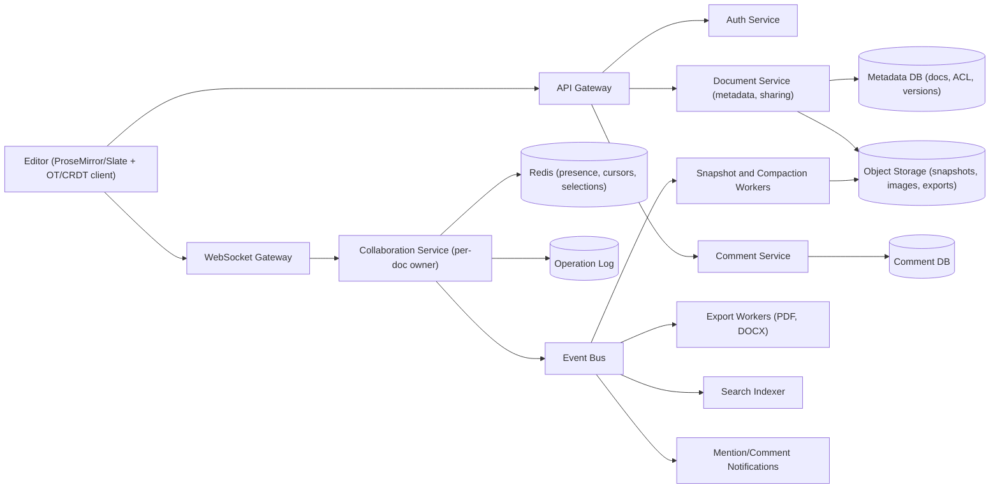
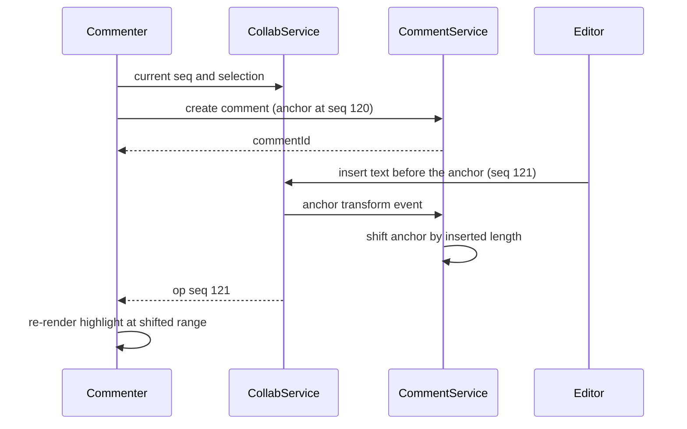

# Collaborative Word Processor System

> **Reviewed:** 2026-09 · **Scope:** Full-stack (frontend + backend + scalability) · **Level:** Senior / Tech Lead

---

## Overview

Design a collaborative word processor where multiple users can edit documents in real-time, similar to Google Docs or Microsoft Word Online. The system needs to handle rich text editing, formatting, comments, and real-time synchronization.

---

## 1) Requirements

### Functional Requirements

**Core Features:**
- Create, edit, and delete documents
- Real-time collaborative editing with multiple users (50+ concurrent editors)
- Rich text formatting (bold, italic, headings, lists, tables, links, images)
- Comments and suggestions system
- Version history and document restoration
- Document sharing and permissions (viewer, editor, commenter, owner)
- Export/import (PDF, DOCX, Markdown, HTML)
- Document templates
- Search and find/replace
- Undo/redo functionality
- Document organization (folders, tags)

**Collaboration Features:**
- Real-time text changes visible to all users
- Presence indicators (who's viewing/editing)
- Cursor positions for active users
- Operational transformation for conflict resolution
- Comments with replies and resolution

### Non-Functional Requirements

**Performance:**
- Character updates: < 100ms latency
- Document rendering: < 200ms
- Support documents with 100K+ words
- Fast scrolling and rendering for long documents

**Scalability:**
- Handle millions of documents
- Support 50+ concurrent editors per document
- Billions of characters in storage

**Reliability:**
- High availability (99.9% uptime)
- Auto-save functionality
- Version history with restoration

**User Experience:**
- Responsive design (mobile and desktop)
- Keyboard shortcuts
- Accessible interface (keyboard navigation, screen readers)

---

## 2) Component Hierarchy

The frontend is built as a React application with a rich text editor. Here's how I'd structure it:

```
App
├── Layout
│   ├── Header
│   │   ├── DocumentTitle (editable)
│   │   ├── CollaborationIndicator (shows active users)
│   │   ├── ShareButton
│   │   └── UserMenu
│   ├── Toolbar
│   │   ├── FormatButtons (Bold, Italic, Underline)
│   │   ├── HeadingButtons (H1, H2, H3)
│   │   ├── ListButtons (Bulleted, Numbered)
│   │   ├── InsertButtons (Image, Link, Table)
│   │   └── ActionButtons (Undo, Redo, Comment)
│   ├── MainContent
│   │   ├── RichTextEditor
│   │   │   ├── EditorContent (the actual editable area)
│   │   │   ├── SelectionOverlay (highlights selected text)
│   │   │   └── CursorIndicators (other users' cursors with colors)
│   │   └── Sidebar
│   │       ├── CommentPanel
│   │       │   ├── CommentThread (comment with replies)
│   │       │   └── CommentHighlight (highlighted text in document)
│   │       ├── VersionHistory
│   │       │   ├── VersionList (timeline of versions)
│   │       │   └── VersionPreview (preview before restore)
│   │       └── DocumentOutline (table of contents)
│   └── Footer
│       ├── WordCount
│       └── LastSaved (auto-save indicator)
└── Modals
    ├── ShareDialog (document sharing and permissions)
    ├── ExportDialog (export format selection)
    └── SuggestionPanel (review mode for suggestions)
```

### Key Components Explained

**1. RichTextEditor Component**
- Uses a rich text editor library (Slate.js or Draft.js)
- Handles text editing with formatting
- Manages text selection and cursor tracking
- Renders document content as blocks (paragraphs, headings, lists, etc.)

**2. FormatToolbar Component**
- Displays formatting options based on selection
- Shows active formatting state (bold is active if selected text is bold)
- Applies formatting to selected text
- Updates in real-time as selection changes

**3. CommentPanel Component**
- Displays comments and suggestions
- Shows comment threads with replies
- Highlights commented text in the document
- Handles comment creation, replies, and resolution

**4. VersionHistory Component**
- Displays document version timeline
- Shows version metadata (author, date, change summary)
- Allows version preview before restoration
- Handles version restoration

**5. CollaborationManager**
- WebSocket connection for real-time updates
- Operational transformation for conflict resolution
- Presence tracking (who's viewing, cursor positions)
- Broadcasts document changes to all connected clients

**6. Operational Transformation Engine**
- Transforms concurrent operations to maintain consistency
- Handles insert-insert, insert-delete, delete-delete conflicts
- Ensures all clients see the same document state

---

## 3) Data Models

Here are the key data structures I'd use:

```typescript
// Main document structure
interface Document {
  id: string;
  title: string;
  content: DocumentContent;
  createdAt: string;
  updatedAt: string;
  ownerId: string;
  collaborators: Collaborator[];
  permissions: DocumentPermissions;
  version: number;  // For conflict resolution
}

// Document content structure (block-based)
interface DocumentContent {
  type: 'doc';
  content: Block[];  // Array of blocks (paragraphs, headings, etc.)
}

// A block is a structural element (paragraph, heading, list, table, etc.)
interface Block {
  type: 'paragraph' | 'heading' | 'list' | 'table' | 'image' | 'quote';
  id: string;  // Unique block ID
  content: InlineContent[];  // Text and inline elements
  attributes?: BlockAttributes;  // Block-level formatting
}

// Inline content (text, links, mentions)
interface InlineContent {
  type: 'text' | 'link' | 'mention';
  text?: string;
  marks?: Mark[];  // Formatting marks (bold, italic, etc.)
  attributes?: InlineAttributes;  // Link href, mention userId, etc.
}

// Formatting marks
interface Mark {
  type: 'bold' | 'italic' | 'underline' | 'strikethrough' | 'code';
}

// Block attributes
interface BlockAttributes {
  level?: number;  // For headings (1-6)
  listType?: 'ordered' | 'unordered';
  alignment?: 'left' | 'center' | 'right' | 'justify';
}

// Comment structure
interface Comment {
  id: string;
  documentId: string;
  blockId: string;  // Which block the comment is on
  text: string;
  authorId: string;
  authorName: string;
  createdAt: string;
  resolved: boolean;
  replies: CommentReply[];
  selection?: TextSelection;  // Which text is commented on
}

interface CommentReply {
  id: string;
  text: string;
  authorId: string;
  authorName: string;
  createdAt: string;
}

// Suggestion (for review mode)
interface Suggestion {
  id: string;
  documentId: string;
  blockId: string;
  originalText: string;  // Original text
  suggestedText: string;  // Suggested replacement
  authorId: string;
  authorName: string;
  createdAt: string;
  status: 'pending' | 'accepted' | 'rejected';
  selection: TextSelection;
}

// Text selection for comments/suggestions
interface TextSelection {
  start: number;  // Character offset in block
  end: number;
  blockId: string;
}

// Document version
interface DocumentVersion {
  id: string;
  documentId: string;
  version: number;
  content: DocumentContent;
  authorId: string;
  authorName: string;
  createdAt: string;
  changeSummary: string;  // Brief description of changes
}

// Collaboration
interface Collaborator {
  userId: string;
  email: string;
  role: 'owner' | 'editor' | 'viewer' | 'commenter';
  cursorPosition: CursorPosition | null;
}

interface CursorPosition {
  blockId: string;
  offset: number;  // Character offset in block
  color: string;  // User's cursor color
}

// Document permissions
interface DocumentPermissions {
  canView: string[];  // User IDs
  canEdit: string[];
  canComment: string[];
  isPublic: boolean;
  shareLink?: string;
}

// Update operation for real-time sync
interface DocumentUpdate {
  type: 'insert' | 'delete' | 'format' | 'comment_add' | 'comment_resolve';
  blockId: string;
  position: number;  // Character position in block
  content?: string;  // For insert operations
  length?: number;  // For delete operations
  marks?: Mark[];  // For format operations
  timestamp: string;
  userId: string;
  version: number;  // For conflict resolution
}
```

### Data Flow Explanation

**Document Structure:**
- Documents are block-based (not just plain text)
- Each block is a structural element: paragraph, heading, list item, table, etc.
- Blocks contain inline content: text with formatting, links, mentions
- This structure makes it easier to handle formatting, comments, and collaboration

**When a user types:**
1. Text is inserted into the current block at cursor position
2. Update operation is created (type: 'insert')
3. Operation is applied locally immediately (optimistic update)
4. Operation is broadcasted via WebSocket to other users
5. Other users apply the operation using operational transformation

**When a user adds a comment:**
1. User selects text (creates TextSelection)
2. Comment is created with selection information
3. Comment is saved to server
4. Comment is broadcasted to all users
5. Comment highlight appears in document for all users

**Version History:**
- Each significant change creates a new version
- Versions store the full document content at that point
- Users can preview and restore any version
- Restoration creates a new version (doesn't delete history)

---

## 4) API Design

### REST Endpoints

**GET /api/v1/documents/:id**
- Fetch document data
- Returns document with content, metadata, collaborators
- Response includes current version number

**PATCH /api/v1/documents/:id/content**
- Update document content
- Request contains array of operations (insert, delete, format)
- Uses version number for conflict detection
- Returns new version number and any conflicts

**POST /api/v1/documents/:id/comments**
- Add a comment to the document
- Request includes block ID, text, and selection
- Returns created comment with ID

**GET /api/v1/documents/:id/comments**
- Get all comments for a document
- Returns array of comments with replies

**PATCH /api/v1/documents/:id/comments/:commentId/resolve**
- Resolve a comment (mark as resolved)
- Returns updated comment

**POST /api/v1/documents/:id/export**
- Export document to PDF/DOCX/Markdown
- Request specifies format and options
- Returns file download

**GET /api/v1/documents/:id/versions**
- Get version history
- Returns array of versions with metadata

**POST /api/v1/documents/:id/restore**
- Restore document to a specific version
- Creates new version from restored content
- Returns new version number

### API Request/Response Examples

**Update Document Content:**
```json
// PATCH /api/v1/documents/:id/content
{
  "version": 5,
  "operations": [
    {
      "type": "insert",
      "blockId": "block_1",
      "position": 5,
      "content": " Beautiful"
    },
    {
      "type": "format",
      "blockId": "block_1",
      "position": 0,
      "length": 5,
      "marks": [{"type": "bold"}]
    }
  ]
}

// Response
{
  "success": true,
  "data": {
    "version": 6,
    "appliedOperations": 2,
    "conflicts": []  // Empty if no conflicts
  }
}
```

**Add Comment:**
```json
// POST /api/v1/documents/:id/comments
{
  "blockId": "block_1",
  "text": "This needs revision",
  "selection": {
    "start": 0,
    "end": 5,
    "blockId": "block_1"
  }
}

// Response
{
  "success": true,
  "data": {
    "id": "comment_123",
    "text": "This needs revision",
    "authorId": "user_123",
    "authorName": "John Doe",
    "createdAt": "2024-01-15T12:00:00Z",
    "resolved": false,
    "replies": []
  }
}
```

**Get Document:**
```json
// GET /api/v1/documents/:id
// Response
{
  "success": true,
  "data": {
    "id": "doc_123",
    "title": "My Document",
    "content": {
      "type": "doc",
      "content": [
        {
          "type": "paragraph",
          "id": "block_1",
          "content": [
            {
              "type": "text",
              "text": "Hello World",
              "marks": [{"type": "bold"}]
            }
          ]
        }
      ]
    },
    "version": 5,
    "createdAt": "2024-01-15T10:00:00Z",
    "updatedAt": "2024-01-15T12:00:00Z"
  }
}
```

### WebSocket Protocol

**Connection:** `wss://api.example.com/documents/:id`

**Events:**
- `content_update` - Document content changed (insert, delete, format)
- `comment_add` - Comment added
- `comment_resolve` - Comment resolved
- `presence_update` - User joined/left or cursor moved
- `conflict` - Conflict detected, requires resolution

**Message Format:**
```json
{
  "type": "content_update",
  "data": {
    "operation": {
      "type": "insert",
      "blockId": "block_1",
      "position": 5,
      "content": " Beautiful"
    },
    "version": 5,
    "userId": "user_123",
    "timestamp": "2024-01-15T12:00:00Z"
  }
}
```

### Conflict Resolution Strategy

**Operational Transformation (OT):**
- When two users edit simultaneously, operations are transformed
- Example: User A inserts "Hello" at position 5, User B inserts "World" at position 3
  - Operations are transformed so both insertions are preserved
  - Result: B's insert applies at position 3; A's insert is shifted to position 10 (5 + length of "World") so both words appear intact. Only inserts at the *same* position need a tie-break rule (e.g. lower client ID first)

**Version-based Conflict Detection:**
- Each operation includes current document version
- If version mismatch, server returns 409 Conflict
- Client must fetch latest version and retry operation

**Transformation Rules:**
- Insert-Insert: If positions are different, adjust positions
- Insert-Delete: Adjust insert position based on delete
- Delete-Delete: Handle overlapping deletes
- Format operations: Commutative when they set different attributes; conflicting values on overlapping ranges (e.g. two colors) need a deterministic rule such as server order

---

## Key Design Decisions

**1. Block-Based Document Structure**
- Documents are structured as blocks (paragraphs, headings, lists)
- Makes formatting, comments, and collaboration easier
- Similar to how Google Docs and Notion work

**2. Operational Transformation for Collaboration**
- Transforms concurrent operations to maintain consistency
- Ensures all users see the same document state
- Handles conflicts automatically

**3. Optimistic Updates**
- Apply changes locally immediately (optimistic)
- Send to server in background
- If server rejects, rollback and show error

**4. WebSocket for Real-time**
- WebSocket connection per document
- Broadcast changes to all connected clients
- Low latency for real-time feel

**5. Version History**
- Store periodic snapshots plus the operation log between them (storing full content for every change does not scale)
- Allows restoration to any point in time by loading the nearest snapshot and replaying ops
- Useful for undo/redo and document recovery

**6. Comment System**
- Comments are anchored to specific text selections
- Comments persist even if text is edited (selection updates)
- Supports threaded replies

---

## Backend High-Level Design

The word processor shares the collaboration core with the [real-time collaboration system](./10-real-time-collaboration-system.md), but adds rich-text semantics, anchored comments, suggestion mode (track changes), and heavy import/export.



**Components and responsibilities:**

- **Collaboration Service** — sequences (OT) or relays and persists (CRDT) ops per document; validates schema (e.g. no list item outside a list) after applying.
- **Comment Service** — stores threads separately from the document body; each comment references an **anchor** that moves with the text.
- **Export/Import Workers** — CPU-heavy PDF/DOCX conversion off the request path, results written to object storage ([MinIO](../backend/minio/index.md)) with a signed download link; queued via [Celery](../backend/celery/index.md) or [RabbitMQ](../backend/rabbitmq/index.md).
- **Search Indexer** — consumes snapshots/ops and indexes plain text, respecting ACLs at query time.
- **Images/attachments** — uploaded directly to object storage via pre-signed URLs; the document holds only references.

---

## Data Model and Consistency

**Schema sketch:**

```sql
documents(id PK, owner_id, title, current_seq, latest_snapshot_seq, schema_version, updated_at)
document_acl(doc_id, principal_id, role, PRIMARY KEY (doc_id, principal_id))   -- role: owner, editor, commenter, viewer
doc_ops(doc_id, seq, client_id, client_op_id, op_bytes, author_id, kind, created_at,
        PRIMARY KEY ((doc_id), seq))                                       -- kind: edit, suggestion, accept, reject
doc_snapshots(doc_id, seq, object_key, created_at)
named_versions(doc_id, version_id, seq, name, created_by, created_at)
comments(id PK, doc_id, thread_id, anchor_start, anchor_end, anchor_seq, author_id, body, resolved)
```

**Comment anchoring:** store anchors as positions **relative to the document model** rather than absolute character offsets:
- With OT, store offsets at `anchor_seq` and transform them forward through later ops (or update anchors in the collaboration service as ops apply).
- With CRDTs, anchor to the **unique IDs of the start and end characters** (Yjs "relative positions"); anchors survive concurrent edits naturally.
- If anchored text is deleted, the comment becomes "orphaned" and is shown in the sidebar with its original quote.

**OT vs CRDT for rich text:**
- OT (as in the API section above) is proven with a central server and small op payloads, but rich-text transforms (split paragraph, merge lists, overlapping marks) multiply the number of transform cases.
- CRDTs for rich text (Yjs with ProseMirror bindings, Peritext-style mark handling) give offline editing and simpler server logic, with higher metadata and tombstone overhead.

**Suggestion mode:** a suggestion is an op tagged `kind = suggestion` that renders as a tracked change. Accepting produces a normal op; rejecting produces an inverse op. Both are recorded in the log, so history is complete.

**Snapshots + compaction:** snapshot every N ops (illustrative: 1,000) or on idle; named versions pin a snapshot so compaction never deletes it.

**Consistency:** strong per-document ordering or strong eventual consistency; comments, search, and notifications are eventually consistent. **Idempotency** via `(clientId, clientOpId)`; exports keyed by `(docId, seq, format)` so repeated requests reuse the same artifact.

---

## Scalability and Reliability

**Back-of-envelope (ILLUSTRATIVE assumptions, not real-world figures):**

| Assumption | Value |
|---|---|
| Documents opened per day | 50M |
| Average document size (snapshot) | 100 KB |
| Share of opens that edit | 30% |
| Average ops per editing session | 500 |
| Exports per day | 2M |
| CPU seconds per export | 2 s |

- Snapshot reads: 50M × 100 KB = **5 TB/day** (about 58 MB/s average) — serve from object storage with a hot cache for recently opened docs.
- Ops: 50M × 0.3 × 500 = **7.5B ops/day** → about **87K ops/s** average.
- Exports: 2M × 2 s = **4M CPU-seconds/day** ≈ 4M / 86,400 ≈ **46 cores busy on average**; with a 4× peak about 185 cores — clearly a separate autoscaled worker pool.
- Comments are a small fraction of traffic; notifications fan out asynchronously.

**Bottlenecks and fixes:**
- **Very long documents (hundreds of pages):** load and render sections lazily, keep per-block versioning so ops touch small subtrees.
- **Export spikes** (end of term, reporting deadlines): queue with priority, cache exports by `seq`.
- **Tombstone growth in CRDTs:** periodic garbage collection once all clients have synced past a state.
- **Permission change fan-out:** on revoke, the collaboration service force-closes affected sockets.

**Failure modes:**

| Failure | Impact | Mitigation |
|---|---|---|
| Collaboration owner crash | Temporary disconnect | Lease failover, rebuild from snapshot + op tail, idempotent resend |
| Schema-invalid op after merge | Corrupt structure (e.g. orphaned list item) | Schema normalization after every apply, reject invalid ops |
| Comment anchor lost | Comment shows in wrong place | Relative-position anchors, orphaned-comment fallback with quoted text |
| Export worker crash | User waits indefinitely | Job timeout and retry, status polling endpoint, notify on completion |
| Snapshot corruption | Document fails to load | Keep previous snapshots, rebuild from older snapshot + ops, checksums |
| Search index lag | New text not searchable | Acceptable eventual consistency, monitor indexing lag |

**Key flow — comment on text while others edit:**



---

## Deep Dive Options (RADIO)

1. **Rich-text merge semantics** — Split/merge paragraphs, lists, tables, and overlapping marks under OT versus a rich-text CRDT. Discuss user intent (bold applied while someone types at the boundary).
2. **Comments and suggestion mode** — Anchors that survive edits, orphaned comments, and representing suggestions as tagged ops with accept/reject.
3. **Version history and compaction** — Snapshot cadence, named versions pinning snapshots, restore-as-new-op, and storage cost over years of history.

---

## Scaling with AI and Agentic Workflows

See [Agentic Workflows](../agentic-workflows/index.md) and [AI-Assisted Development](../ai/ai-assisted-development/index.md).

**Engineering workflows:**
- **Bottleneck brainstorming:** ask an agent for failure scenarios (huge docs, export spikes, tombstone growth), then check each against the arithmetic above.
- **Load-test generation:** generate editing sessions with realistic mixes of typing, pasting, formatting, and commenting, plus reconnect storms.
- **RCA summarization:** summarize traces and client error reports when documents fail to load or diverge.
- **Runbooks and migrations:** draft plans for document schema migrations (e.g. new block type) with a lazy upgrade-on-load path and rollback.

**Product AI:**
- **Summaries**, **rewrite/tone suggestions**, **comment thread summaries**, and **"catch me up" digests** of edits since last visit.
- Trade-offs: deliver AI output as **suggestions** (suggestion-mode ops) so authors accept or reject; stream results for perceived latency; limit context to the selection or section to control cost; honour document ACLs and data-residency settings.

**Human approval required for:**
- Accepting AI rewrites into the shared document.
- Sending document content to external model providers.
- Changes to merge logic, schema, or retention policies.

**Do not trust AI for:**
- Factual accuracy of generated text in the document.
- Guaranteeing convergence of merge logic — use property-based and fuzz tests.
- Legal or compliance judgements on document content.

---

## Interview Talking Points

**When explaining this system, I'd focus on:**

1. **Requirements First**: Start with what the system needs to do - real-time collaboration, rich text editing, comments, version history

2. **Component Structure**: Explain the React component hierarchy - rich text editor, toolbar, comment panel, version history

3. **Data Models**: Walk through the key data structures - Document, Block, InlineContent, Comment - and the block-based structure

4. **API Design**: Show the REST endpoints and WebSocket protocol for real-time updates

5. **Key Challenges**: 
   - Operational transformation for conflict resolution
   - Real-time synchronization with low latency
   - Comment anchoring to text that might be edited
   - Version history storage and restoration

**Example explanation flow:**
> "So for a collaborative word processor, I'd start with the requirements: we need real-time editing, rich text formatting, comments, and version history. The frontend would be a React app with a rich text editor component (like Slate.js) that handles the editing. Documents are structured as blocks - paragraphs, headings, lists - rather than plain text, which makes formatting and comments easier. Each block contains inline content with formatting marks. For real-time collaboration, we use WebSockets to broadcast changes, and operational transformation to resolve conflicts when multiple users edit simultaneously. Comments are anchored to text selections, and we maintain version history so users can restore previous versions."

### Follow-up Questions

<details>
<summary>OT or CRDT for a new word processor?</summary>

Either can work. OT fits a server-centric model with small ops; a mature rich-text CRDT (e.g. Yjs with a ProseMirror binding) makes offline and multi-region easier. Justify by your offline and latency requirements.

</details>

<details>
<summary>How do comments stay attached to text that changes?</summary>

Store anchors as relative positions: transformed through ops under OT, or tied to character IDs under CRDTs. Deleted anchors become orphaned comments that keep the quoted text.

</details>

<details>
<summary>How do you implement suggestion mode?</summary>

Suggestions are tagged ops rendered as tracked changes. Accept emits a normal op, reject emits the inverse, and both are logged.

</details>

<details>
<summary>How do you restore an old version without losing others' work?</summary>

Compute the diff from the current state to the old snapshot and apply it as a new op, so it is itself undoable and collaborators stay in sync.

</details>

<details>
<summary>How do you handle PDF/DOCX export at scale?</summary>

Asynchronous workers, results cached by `(docId, seq, format)` in object storage, and a signed download link.

</details>

<details>
<summary>What happens when someone loses edit permission mid-session?</summary>

The ACL change event makes the collaboration service reject further ops from that user and close or downgrade their socket.

</details>

### Common Mistakes

- Storing the full document on every change instead of snapshots plus ops.
- Anchoring comments to absolute character offsets.
- Ignoring schema validation after merges (broken lists and tables).
- Doing PDF/DOCX export on the request thread.
- Assuming format operations always commute.
- Letting AI edits write directly to the shared document.

---

## References

- [CRDT resources (crdt.tech)](https://crdt.tech/)
- [Yjs documentation](https://docs.yjs.dev/)
- [ProseMirror guide (collaborative editing)](https://prosemirror.net/docs/guide/#collab)
- [Peritext: A CRDT for rich-text collaboration (Ink & Switch)](https://www.inkandswitch.com/peritext/)
- [Operational transformation (Wikipedia)](https://en.wikipedia.org/wiki/Operational_transformation)
- [MDN: WebSockets API](https://developer.mozilla.org/en-US/docs/Web/API/WebSockets_API)

