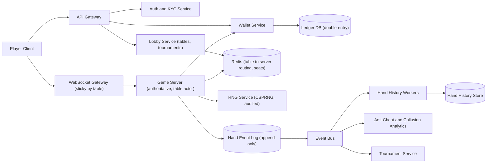
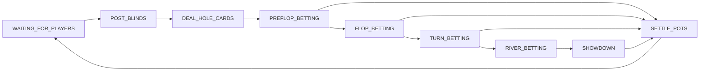
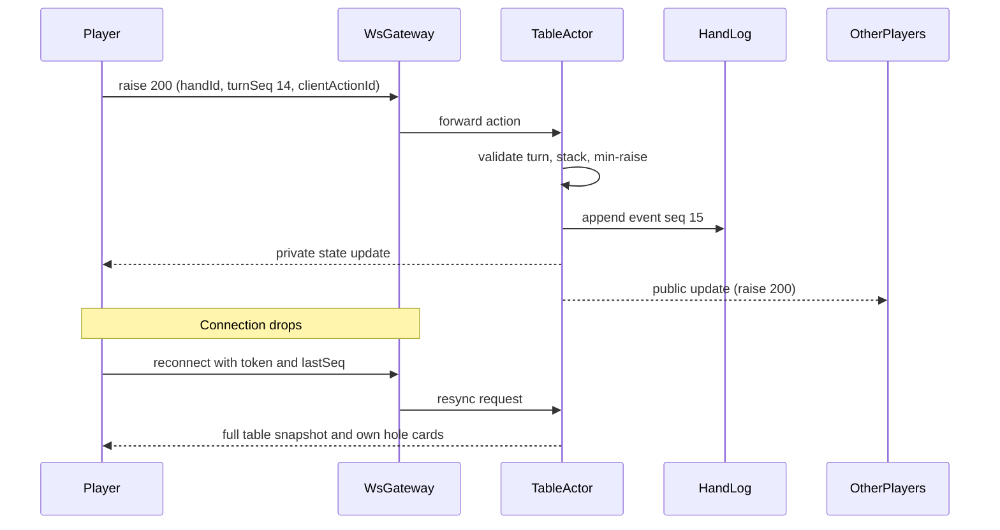

# Real-Time Poker Game

> **Reviewed:** 2026-09 · **Scope:** Full-stack (frontend + backend + scalability) · **Level:** Senior / Tech Lead

---

## Overview

Design a real-time multiplayer poker game where multiple players can join tables, play Texas Hold'em poker with synchronized game state, and handle player actions in real-time with minimal latency.

---

## 1) Requirements

### Functional Requirements

**Core Features:**
- User registration and authentication
- Create and join game rooms (2-9 players)
- Texas Hold'em poker gameplay
- Player actions (fold, check, call, raise, all-in)
- Real-time card dealing
- Betting rounds (Pre-flop, Flop, Turn, River)
- Hand rankings and winner determination
- Real-time pot updates
- Player status tracking (active, folded, all-in)
- Chat functionality during games
- Game history and replay

**Advanced Features:**
- Multiple game variants (No-Limit, Pot-Limit, Fixed-Limit)
- Tournament support
- Spectator mode
- Player statistics and leaderboards
- Reconnection to active games

### Non-Functional Requirements

**Performance:**
- Minimal latency for game state synchronization
- Smooth animations (60fps)
- Fast player action processing
- Real-time updates: < 100ms

**Scalability:**
- Support thousands of concurrent game tables
- Millions of players
- Real-time synchronization across all players

**Reliability:**
- 99.9% uptime
- Fair gameplay (no cheating)
- Game state consistency
- Handle player disconnections gracefully

---

## 2) Component Hierarchy

The frontend is a React application for real-time poker. Here's the structure:

```
App
├── Layout
│   ├── Header
│   │   ├── Logo
│   │   ├── Balance (chips)
│   │   └── UserMenu
│   └── MainContent
├── Pages
│   ├── LobbyPage
│   │   ├── RoomList
│   │   │   └── RoomCard
│   │   │       ├── RoomName
│   │   │       ├── PlayersCount
│   │   │       ├── Blinds
│   │   │       └── JoinButton
│   │   └── CreateRoomButton
│   ├── GameRoomPage
│   │   ├── GameTable
│   │   │   ├── PlayerSeats (circular arrangement)
│   │   │   │   └── PlayerSeat
│   │   │   │       ├── PlayerInfo (name, avatar, chips)
│   │   │   │       ├── PlayerCards (face down or face up)
│   │   │   │       ├── PlayerBet (chips in pot)
│   │   │   │       └── PlayerStatus (active, folded, all-in)
│   │   │   ├── CommunityCards (center of table)
│   │   │   │   ├── FlopCards (3 cards)
│   │   │   │   ├── TurnCard (1 card)
│   │   │   │   └── RiverCard (1 card)
│   │   │   ├── PotDisplay (total pot amount)
│   │   │   ├── DealerButton
│   │   │   └── ActionTimer (countdown for current player)
│   │   ├── PlayerActions
│   │   │   ├── FoldButton
│   │   │   ├── CheckButton
│   │   │   ├── CallButton
│   │   │   ├── RaiseButton
│   │   │   │   └── RaiseAmountInput
│   │   │   └── AllInButton
│   │   ├── HandInfo (current hand strength)
│   │   └── ChatPanel
│   │       ├── ChatMessages
│   │       └── ChatInput
│   └── GameHistoryPage
│       └── HandHistoryList
└── SharedComponents
    ├── Card (playing card component)
    ├── ChipStack
    └── Timer
```

### Key Components Explained

**1. GameTable Component**
- Main game interface
- Circular player seats arrangement
- Community cards in center
- Pot display
- Dealer button indicator
- Action timer for current player

**2. PlayerSeat Component**
- Individual player seat
- Player info (name, avatar, chip count)
- Player cards (face down for others, face up for user)
- Bet amount display
- Status indicator (active, folded, all-in)

**3. PlayerActions Component**
- Action buttons for current player
- Fold, Check, Call, Raise, All-in
- Raise amount input
- Disabled when not player's turn
- Timer countdown

**4. CommunityCards Component**
- Flop (3 cards), Turn (1 card), River (1 card)
- Card dealing animations
- Face up display

---

## 3) Data Models

Here are the key data structures:

```typescript
// Game room
interface GameRoom {
  id: string;
  name: string;
  type: "cash" | "tournament";
  maxPlayers: number;
  currentPlayers: number;
  blinds: {
    smallBlind: number;
    bigBlind: number;
  };
  buyIn: number;
  status: "waiting" | "active" | "finished";
  players: Player[];
  currentHand?: Hand;
}

// Player (in game)
interface Player {
  id: string;
  userId: string;
  name: string;
  avatar?: string;
  seatNumber: number;
  chips: number;
  status: "active" | "folded" | "all_in" | "sitting_out";
  cards?: Card[];  // Only visible to player or when hand ends
  currentBet: number;
  isDealer: boolean;
  isSmallBlind: boolean;
  isBigBlind: boolean;
  isTurn: boolean;  // Is it this player's turn to act
}

// Card
interface Card {
  suit: "hearts" | "diamonds" | "clubs" | "spades";
  rank: "2" | "3" | "4" | "5" | "6" | "7" | "8" | "9" | "10" | "J" | "Q" | "K" | "A";
}

// Hand (current game hand)
interface Hand {
  id: string;
  roomId: string;
  stage: "pre_flop" | "flop" | "turn" | "river" | "showdown" | "finished";
  pot: number;
  communityCards: Card[];
  currentPlayerId: string;  // Player whose turn it is
  actionTimer: number;  // Seconds remaining
  lastRaiseAmount: number;
  minimumRaise: number;
  winners?: Winner[];  // After showdown
}

// Winner
interface Winner {
  playerId: string;
  handRank: string;  // "Royal Flush", "Straight Flush", etc.
  prize: number;
}

// Player action
interface PlayerAction {
  type: "fold" | "check" | "call" | "raise" | "all_in";
  amount?: number;  // For raise
  playerId: string;
  handId: string;
  timestamp: string;
}
```

### Data Flow Explanation

**When a player joins a game:**
1. User selects or creates game room
2. User joins room and takes a seat
3. User buys in (adds chips)
4. Game starts when enough players join
5. Dealer button assigned
6. Blinds posted
7. Cards dealt

**Gameplay flow:**
1. Pre-flop: Each player receives 2 cards
2. Betting round: Players act (fold, call, raise)
3. Flop: 3 community cards dealt
4. Betting round: Players act
5. Turn: 1 community card dealt
6. Betting round: Players act
7. River: 1 community card dealt
8. Betting round: Players act
9. Showdown: Players reveal cards, winner determined
10. Pot distributed to winner(s)

**Real-time synchronization:**
1. Player action sent via WebSocket
2. Server validates action
3. Server updates game state
4. Server broadcasts to all players
5. All clients update UI simultaneously
6. Next player's turn begins

---

## 4) API Design

### REST Endpoints

**GET /api/v1/rooms**
- Get available game rooms
- Query params: `type`, `status`, `page`, `limit`
- Returns: Paginated list of GameRoom objects

**POST /api/v1/rooms**
- Create a game room
- Request body: `{ name: string, type: string, maxPlayers: number, blinds: Blinds, buyIn: number }`
- Returns: GameRoom object

**POST /api/v1/rooms/:id/join**
- Join a game room
- Request body: `{ buyIn: number }`
- Returns: Updated GameRoom object

**GET /api/v1/rooms/:id**
- Get game room details
- Returns: GameRoom object with current hand

**GET /api/v1/rooms/:id/history**
- Get hand history
- Returns: Array of Hand objects

### WebSocket Events

**Connection:** `wss://api.example.com/rooms/:id`

**Events:**
- `player_joined` - Player joined room
- `player_left` - Player left room
- `hand_started` - New hand started
- `cards_dealt` - Cards dealt to players
- `community_cards` - Community cards dealt
- `player_action` - Player made action
- `hand_finished` - Hand completed, winners announced
- `game_state` - Full game state update

**Message Format:**
```json
{
  "type": "player_action",
  "data": {
    "action": {
      "type": "raise",
      "amount": 100,
      "playerId": "player_123"
    },
    "hand": {
      "stage": "flop",
      "pot": 500,
      "currentPlayerId": "player_456"
    }
  }
}
```

---

## Key Design Decisions

**1. Real-time Game State Synchronization**
- WebSocket for instant updates
- All players see same game state
- Minimal latency (< 100ms)
- Fair gameplay

**2. Action Validation**
- Server validates all actions
- Prevents cheating
- Enforces game rules
- Time limits for actions

**3. Card Dealing Animation**
- Smooth card dealing animations
- Face down for other players
- Face up for user
- Reveal animations at showdown

**4. Turn Management**
- Clear turn indicators
- Action timer countdown
- Disable actions when not player's turn
- Auto-fold on timeout

**5. Hand History**
- Store all hands for replay
- Show hand history
- Winner determination
- Fair dispute resolution

---

## Backend High-Level Design

The golden rule: **the client is a view; the server is the game.** Clients send intents ("raise 200"), the authoritative game server validates, updates state, and sends each player only what they are allowed to see.



**Components and responsibilities:**

- **Game Server (table actor)** — each table is a single-threaded actor owned by one process. All actions for a table are processed sequentially, so there are no race conditions within a hand. Tables are assigned via the registry and can migrate between processes.
- **Deterministic state machine** — given the initial state (seat stacks, button, shuffled deck) and the ordered list of player actions, replaying the hand always produces the same result. This enables recovery, audits, and dispute resolution.
- **RNG Service** — cryptographically secure shuffle (Fisher–Yates driven by a CSPRNG), with seeds/commitments logged for audit.
- **Wallet + Ledger** — chips move from wallet to table on buy-in and back on leave; double-entry ledger entries per hand settlement.
- **Anti-cheat analytics** — consumes hand events asynchronously to detect collusion, bots, and chip dumping.
- **Private state delivery** — the server sends hole cards only to their owner; broadcast messages never contain other players' hidden cards.

---

## Data Model and Consistency

**Hand state machine:**



Any betting round can jump to `SETTLE_POTS` when all but one player folds.

**Schema sketch:**

```sql
tables(id PK, game_type, stakes, max_seats, server_id, status)
seats(table_id, seat_no, player_id, stack, status, PRIMARY KEY (table_id, seat_no))   -- status: active, sitting_out, disconnected
hands(id PK, table_id, hand_no, button_seat, deck_commitment, rng_seed_ref, started_at, ended_at)
hand_events(hand_id, seq, type, seat_no, amount, payload, created_at, PRIMARY KEY (hand_id, seq))
    -- type: post_blind, deal, check, bet, call, raise, fold, all_in, reveal, award
player_actions_inbox(table_id, player_id, client_action_id, hand_id, turn_seq, UNIQUE (table_id, player_id, client_action_id))
wallet_accounts(id PK, player_id, currency, balance)
ledger_entries(id PK, txn_id, account_id, amount, direction, ref_type, ref_id, created_at)
```

**Consistency trade-offs:**
- **Within a table:** strict serial order via the single-threaded actor; the hand event log is the source of truth.
- **Chip movements:** table stacks are in-memory during a hand, but buy-ins, cash-outs, and hand settlements are written to the ledger transactionally. Invariant: sum of stacks + pot equals chips bought in.
- **Hand history and analytics:** eventually consistent.

**Idempotency and turn validation:** every action includes `clientActionId`, `handId`, and `turnSeq`. The server rejects actions for a stale turn and ignores duplicates, so a retried "call" never calls twice.

**Fairness / RNG:**
- Use a CSPRNG and an unbiased Fisher–Yates shuffle; never `Math.random()` or modulo-biased mapping.
- Log a commitment (hash of the shuffled deck plus a secret) at hand start and reveal after the hand so auditors can verify the deck was not changed mid-hand.
- Deck order lives only on the server; the client receives cards only when they are dealt to that player or revealed.

---

## Scalability and Reliability

**Back-of-envelope (ILLUSTRATIVE assumptions, not real-world figures):**

| Assumption | Value |
|---|---|
| Concurrent players at peak | 200K |
| Players per table | 6 |
| Hands per table per hour | 60 |
| Actions per hand | 20 |
| Outbound messages per action | 1 per seated player + observers (assume 8) |

- Tables: 200K / 6 ≈ **33K active tables**.
- Hands: 33K × 60 / 3,600 ≈ **550 hands/s**.
- Actions: 550 × 20 = **11K actions/s** inbound.
- Outbound: 11K × 8 = **88K messages/s**.
- Tables per game server: if one process handles an illustrative 2,000 tables → **17 processes** plus headroom. CPU is modest; the design challenge is correctness, isolation, and failover rather than throughput.

**Bottlenecks and fixes:**
- **Tournament start** (thousands of players seated at once): pre-create tables, stagger seating in waves, balance tables with a dedicated tournament service.
- **Wallet contention** on popular accounts: ledger writes only at buy-in/settlement, not per bet.
- **Observer-heavy tables** (featured games): broadcast through a fan-out tier with a delay to prevent "ghosting" via stream watching.

**Failure modes:**

| Failure | Impact | Mitigation |
|---|---|---|
| Player disconnects | Misses turn | Reconnect grace window with time bank, then auto-check/fold, full state resync on reconnect |
| Game server process crashes | Tables on it pause mid-hand | Rebuild table state by replaying hand events from the log on a new owner, or void the hand and refund bets per house rules |
| Duplicate or late action | Wrong bet applied | `turnSeq` validation and `clientActionId` dedupe |
| Wallet service slow at buy-in | Players cannot sit | Timeouts with clear error, idempotent buy-in, no seat until funds confirmed |
| RNG service unavailable | Hands cannot start | Local CSPRNG per game server with the same audit logging as fallback |
| Collusion or bot activity | Unfair games, financial loss | Async detection, account review, withhold payouts pending investigation |

**Key flow — player action and reconnect:**



---

## Deep Dive Options (RADIO)

1. **Authoritative server and deterministic replay** — Single-threaded table actors, event-sourced hand log, replay for crash recovery and disputes, and table migration between processes.
2. **Fairness and RNG** — CSPRNG shuffles, commitment schemes, third-party audits, and ensuring hidden information never leaves the server.
3. **Reconnect handling and anti-cheat** — Grace windows, time banks, full-state resync by `lastSeq`, and detection of collusion (players soft-playing each other), chip dumping, multi-accounting, and bots.

---

## Scaling with AI and Agentic Workflows

See [Agentic Workflows](../agentic-workflows/index.md) and [AI-Assisted Development](../ai/ai-assisted-development/index.md).

**Engineering workflows:**
- **Bottleneck brainstorming:** have an agent list stress points (tournament starts, reconnect storms), then check them against the table and action estimates above.
- **Load-test generation:** generate bot clients that play legal random strategies to load-test tables, including disconnect/reconnect and duplicate actions.
- **State-machine test generation:** generate property-based tests (pot conservation, side-pot correctness, turn order) — reviewed by engineers because correctness matters more than coverage numbers.
- **RCA and runbooks:** summarize hand logs for disputes, draft runbooks for "game server crash mid-hand".

**Product AI — fraud and collusion detection:**
- Models over hand histories flag suspicious patterns: players who never raise each other, chip transfers to one account, bot-like timing, shared devices/IPs.
- Runs **asynchronously** on the event stream (seconds to hours latency is fine), never in the action path. Cost scales with hand volume, so sample low-risk tables and score high-stakes ones fully.
- Data trade-offs: behavioural and device data are sensitive; follow gambling regulations and privacy law on retention and use.

**Human approval required for:**
- Account bans, confiscating winnings, or withholding payouts.
- Changes to RNG, shuffle, or payout logic.
- Tuning collusion thresholds that trigger automated restrictions.

**Do not trust AI for:**
- Randomness or fairness claims — rely on certified RNG and audits.
- Settling disputes; use deterministic replay of the hand log.
- Deciding legal compliance by jurisdiction.

---

## Interview Talking Points

**When explaining this system, I'd focus on:**

1. **Requirements First**: Start with core functionality - multiplayer poker, real-time synchronization, player actions, game state management

2. **Component Structure**: Explain the React component hierarchy - game table, player seats, community cards, action buttons

3. **Data Models**: Walk through GameRoom, Player, Hand, Card - and game state management

4. **API Design**: Show the REST endpoints and WebSocket protocol - rooms, player actions, real-time game events

5. **Key Challenges**: 
   - Real-time game state synchronization with minimal latency
   - Fair gameplay and action validation
   - Handling player disconnections and reconnections
   - Smooth animations and user experience

**Example explanation flow:**
> "So for a real-time poker game, the core requirement is allowing multiple players to join tables and play poker with synchronized game state. The frontend is a React app with a game table component showing player seats in a circular arrangement, community cards in the center, and action buttons for the current player. When a player makes an action (fold, call, raise), it's sent via WebSocket to the server, which validates the action, updates the game state, and broadcasts to all players. The data model includes GameRoom objects for game tables, Player objects with chips and status, Hand objects tracking the current hand with betting rounds, and Card objects for the deck. Real-time synchronization ensures all players see the same game state simultaneously with minimal latency (< 100ms). The main API endpoints handle room management and hand history, while WebSocket handles all real-time game events (actions, card dealing, pot updates). Key challenges include ensuring fair gameplay through server-side validation, maintaining game state consistency across all clients, handling player disconnections gracefully, and providing smooth animations for card dealing and betting."

### Follow-up Questions

<details>
<summary>Why must the server be authoritative?</summary>

Clients can be modified. If the client decided outcomes or held the deck, cheating would be trivial. The server validates every action and holds all hidden information.

</details>

<details>
<summary>How do you avoid race conditions when two players act at once?</summary>

Each table is a single-threaded actor that processes actions in order, and each action carries the `turnSeq` it was made for, so out-of-turn actions are rejected.

</details>

<details>
<summary>How do you prove the shuffle was fair?</summary>

Use a CSPRNG with an unbiased Fisher–Yates shuffle, publish a commitment hash at hand start, reveal after, and get the RNG independently audited.

</details>

<details>
<summary>What happens if a player disconnects on their turn?</summary>

A grace period and time bank run; then the server auto-checks or folds. On reconnect the client sends its last seen `seq` and receives a full snapshot including its own hole cards.

</details>

<details>
<summary>What if the game server crashes mid-hand?</summary>

A new owner replays the hand event log to rebuild state, or the hand is voided and bets returned per house rules, with ledger entries reconciling chips.

</details>

<details>
<summary>How do you detect collusion?</summary>

Offline and streaming analytics over hand histories: soft-play between specific players, chip dumping, correlated devices or IPs, and bot-like timing, followed by human review.

</details>

### Common Mistakes

- Sending all players' cards to every client and hiding them in the UI.
- Using `Math.random()` for shuffling.
- Processing a table's actions concurrently across threads.
- Writing every bet to the wallet ledger synchronously instead of settling per hand.
- No idempotency on actions, so retries double-bet.
- Treating anti-cheat as a real-time blocking check in the action path.

---

## References

- [Fisher–Yates shuffle (Wikipedia)](https://en.wikipedia.org/wiki/Fisher%E2%80%93Yates_shuffle)
- [MDN: Crypto.getRandomValues()](https://developer.mozilla.org/en-US/docs/Web/API/Crypto/getRandomValues)
- [Event Sourcing (Martin Fowler)](https://martinfowler.com/eaaDev/EventSourcing.html)
- [MDN: WebSockets API](https://developer.mozilla.org/en-US/docs/Web/API/WebSockets_API)
- [Actor model (Wikipedia)](https://en.wikipedia.org/wiki/Actor_model)

