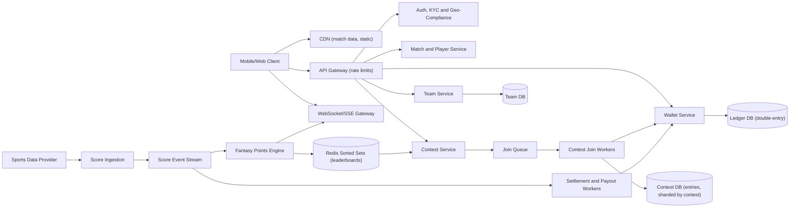
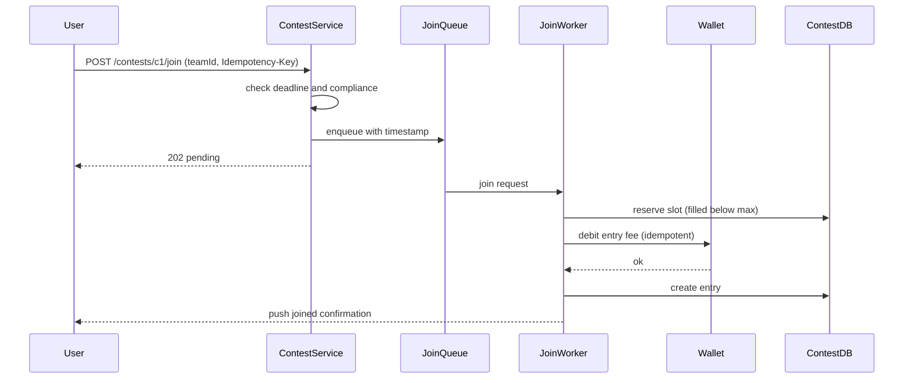

# Fantasy Sports Platform

> **Reviewed:** 2026-09 · **Scope:** Full-stack (frontend + backend + scalability) · **Level:** Senior / Tech Lead

---

## Overview

Design a fantasy sports platform where users create teams, join contests, and compete based on real-world sports match performance. The system handles team selection, real-time match data, player points calculation, and dynamic leaderboards.

---

## 1) Requirements

### Functional Requirements

**Core Features:**
- User registration and authentication
- Create teams for matches (select players within budget)
- Join contests (free or paid)
- Real-time match score updates
- Real-time player points calculation
- Dynamic leaderboard updates
- Wallet management (deposit, withdraw)
- Contest creation (B2B - businesses can create private contests)
- Multiple sports support (Cricket, Football, Basketball)

**Advanced Features:**
- Multiple teams per match
- Team editing before match deadline
- Contest analytics
- Player statistics and recent performance
- Tournament support

### Non-Functional Requirements

**Performance:**
- Real-time match updates: < 1 second
- Fast player points calculation
- Low-latency leaderboard updates
- Fast page loads: < 2 seconds

**Scalability:**
- Handle millions of users
- Thousands of concurrent contests
- Millions of team selections during major events
- Real-time connections for live matches

**Reliability:**
- 99.9% uptime (critical during matches)
- Accurate points calculation
- Fair contest management

---

## 2) Component Hierarchy

The frontend is a React application for fantasy sports. Here's the structure:

```
App
├── Layout
│   ├── Header
│   │   ├── Logo
│   │   ├── WalletBalance
│   │   └── UserMenu
│   └── MainContent
├── Pages
│   ├── MatchesPage
│   │   └── MatchList
│   │       └── MatchCard
│   ├── TeamBuilderPage
│   │   ├── MatchInfo
│   │   ├── PlayerList
│   │   │   ├── PlayerCard
│   │   │   │   ├── PlayerInfo (name, team, position)
│   │   │   │   ├── PlayerPrice
│   │   │   │   ├── PlayerStats
│   │   │   │   └── AddToTeamButton
│   │   │   └── Filters (position, team, price)
│   │   ├── SelectedTeam
│   │   │   ├── TeamSummary (selected players, budget used)
│   │   │   ├── TeamValidation (rules check)
│   │   │   └── SaveTeamButton
│   │   └── BudgetIndicator
│   ├── ContestsPage
│   │   ├── ContestList
│   │   │   └── ContestCard
│   │   │       ├── ContestInfo (size, entry fee, prize pool)
│   │   │       ├── JoinedCount
│   │   │       └── JoinButton
│   │   └── ContestFilters (free, paid, private)
│   ├── LiveMatchPage
│   │   ├── MatchScore (real-time updates)
│   │   ├── PlayerPoints (real-time calculation)
│   │   ├── Leaderboard (dynamic updates)
│   │   └── MatchEvents (goals, wickets, etc.)
│   └── WalletPage
│       ├── WalletBalance
│       ├── DepositButton
│       ├── WithdrawButton
│       └── TransactionHistory
└── SharedComponents
    ├── PlayerCard
    ├── Leaderboard
    └── MatchScore
```

### Key Components Explained

**1. TeamBuilderPage Component**
- Main team building interface
- Player list with filters
- Selected team display
- Budget tracking
- Team validation (rules check)

**2. PlayerCard Component**
- Individual player display
- Player info, price, stats
- Add to team button
- Disabled if budget exceeded or position limit reached

**3. LiveMatchPage Component**
- Real-time match updates
- Player points calculation
- Dynamic leaderboard
- Match events (goals, wickets, etc.)

**4. Leaderboard Component**
- Shows contest rankings
- Real-time position updates
- User's position highlighted
- Prize distribution display

---

## 3) Data Models

Here are the key data structures:

```typescript
// Match
interface Match {
  id: string;
  sport: "cricket" | "football" | "basketball";
  team1: Team;
  team2: Team;
  date: string;
  status: "upcoming" | "live" | "completed";
  score?: MatchScore;
}

// Team (sports team)
interface Team {
  id: string;
  name: string;
  logo?: string;
}

// Player
interface Player {
  id: string;
  name: string;
  teamId: string;
  team: Team;
  position: string;  // "Batsman", "Bowler", "Forward", etc.
  price: number;
  points: number;  // Current match points
  stats: PlayerStats;
}

// Player stats
interface PlayerStats {
  recentPerformance: number[];  // Last 5 matches points
  averagePoints: number;
  totalMatches: number;
}

// Fantasy team
interface FantasyTeam {
  id: string;
  userId: string;
  matchId: string;
  players: FantasyPlayer[];
  totalPoints: number;
  budgetUsed: number;
  budgetLimit: number;
  createdAt: string;
}

// Fantasy player (player in user's team)
interface FantasyPlayer {
  playerId: string;
  player: Player;
  position: string;
  isCaptain: boolean;  // Captain gets 2x points
  isViceCaptain: boolean;  // Vice-captain gets 1.5x points
}

// Contest
interface Contest {
  id: string;
  matchId: string;
  name: string;
  type: "free" | "paid" | "private";
  size: number;  // Max participants
  entryFee: number;
  prizePool: number;
  joinedCount: number;
  createdBy?: string;  // For private contests (B2B)
  prizeDistribution: PrizeDistribution[];
}

// Prize distribution
interface PrizeDistribution {
  rank: string;  // "1", "2-3", "4-10"
  prize: number;
  percentage?: number;
}

// Leaderboard entry
interface LeaderboardEntry {
  rank: number;
  teamId: string;
  team: FantasyTeam;
  totalPoints: number;
  prize?: number;
}
```

### Data Flow Explanation

**When a user creates a team:**
1. User selects match
2. User selects players within budget
3. Team validation (budget, position limits, team rules)
4. User sets captain and vice-captain
5. Team is saved
6. User can join contests with this team

**Real-time points calculation:**
1. Match events occur (goal, wicket, point)
2. Player points calculated based on event
3. Fantasy team points updated (sum of player points)
4. Leaderboard updated in real-time
5. WebSocket broadcasts updates to all users

**Contest flow:**
1. User creates team for match
2. User browses available contests
3. User joins contest (free or paid)
4. Contest fills up to size limit
5. Match starts, points calculated in real-time
6. Leaderboard updates dynamically
7. Contest ends, prizes distributed

---

## 4) API Design

### REST Endpoints

**GET /api/v1/matches**
- Get matches
- Query params: `sport`, `status`, `date`
- Returns: Array of Match objects

**GET /api/v1/matches/:id/players**
- Get players for match
- Returns: Array of Player objects

**POST /api/v1/teams**
- Create a fantasy team
- Request body: `{ matchId: string, players: FantasyPlayer[] }`
- Returns: FantasyTeam object

**GET /api/v1/contests**
- Get contests
- Query params: `matchId`, `type`, `page`, `limit`
- Returns: Paginated list of Contest objects

**POST /api/v1/contests/:id/join**
- Join a contest
- Request body: `{ teamId: string }`
- Returns: Updated Contest object

**GET /api/v1/contests/:id/leaderboard**
- Get contest leaderboard
- Returns: Array of LeaderboardEntry objects

**GET /api/v1/matches/:id/live**
- Get live match data
- Returns: Match with real-time score and player points

### WebSocket Events

**Connection:** `wss://api.example.com/matches/:id`

**Events:**
- `match_event` - Match event occurred (goal, wicket, etc.)
- `player_points` - Player points updated
- `leaderboard_update` - Leaderboard updated

**Message Format:**
```json
{
  "type": "player_points",
  "data": {
    "playerId": "player_123",
    "points": 25,
    "event": "goal"
  }
}
```

---

## Key Design Decisions

**1. Real-time Points Calculation**
- Calculate points immediately on match events
- Update leaderboard in real-time
- WebSocket for instant updates
- Fair and transparent scoring

**2. Team Validation**
- Validate team rules (budget, positions, limits)
- Client-side validation for immediate feedback
- Server-side validation for security
- Clear error messages

**3. Dynamic Leaderboard**
- Update leaderboard in real-time
- Show user's position
- Prize distribution display
- Efficient ranking calculation

**4. Budget Management**
- Track budget used as players selected
- Disable players if budget exceeded
- Clear budget indicator
- Prevent invalid team creation

---

## Backend High-Level Design

Traffic is extremely **spiky**: most team creation and contest joins happen in the minutes before a match deadline, and most leaderboard reads happen during the match. Design for those two peaks separately.



**Components and responsibilities:**

- **Team Service** — validates budget, squad composition, and per-club limits server-side (the client-side validation is only UX). Teams lock at the match deadline.
- **Contest Service + Join Workers** — accepts join requests, reserves a slot and debits the entry fee atomically. Under deadline spikes, requests are queued and processed by workers; the client receives a pending status and a push when confirmed.
- **Wallet Service + Ledger** — double-entry ledger; balances are derived from entries (or maintained with the entries in one transaction). All money movement goes through here.
- **Score Ingestion** — consumes the sports data provider feed, dedupes and orders events, and handles corrections (e.g. a stat reassigned after review).
- **Fantasy Points Engine** — maps real events to fantasy points per player, then updates every affected team's score.
- **Leaderboards** — Redis sorted sets per contest (`ZINCRBY`, `ZREVRANGE`, `ZREVRANK`).
- **Settlement Workers** — after the match is final, compute ranks, apply the prize distribution, and credit winners idempotently. Queue-backed; see [Messaging Systems](../backend/architecture/05-messaging-systems.md).
- **Compliance** — KYC, age checks, geolocation restrictions by jurisdiction, deposit limits, and tax reporting hooks.

---

## Data Model and Consistency

**Schema sketch:**

```sql
matches(id PK, sport, start_time, deadline, status)                       -- status: upcoming, locked, live, completed, abandoned
fantasy_teams(id PK, user_id, match_id, players_json, captain_id, vice_captain_id, locked_at,
              INDEX (match_id, user_id))
contests(id PK, match_id, entry_fee, max_entries, filled, prize_pool, status, version)
contest_entries(contest_id, entry_id, user_id, team_id, idempotency_key, joined_at,
                PRIMARY KEY ((contest_id), entry_id), UNIQUE (contest_id, idempotency_key))
wallet_accounts(id PK, user_id, kind, currency)                          -- kind: deposit, winnings, bonus
ledger_entries(id PK, txn_id, account_id, amount, direction, ref_type, ref_id, created_at,
               UNIQUE (ref_type, ref_id, account_id, direction))
player_points(match_id, player_id, points, last_event_seq, PRIMARY KEY (match_id, player_id))
```

**Contest joining under deadline spikes:**
- The slot counter is the contention point. Options: `UPDATE contests SET filled = filled + 1 WHERE id = ? AND filled < max_entries` (single-row hot spot), or pre-split the contest into **slot shards** / use a Redis counter with `INCR` and compensate on overflow.
- **Mega contests** (very large caps) concentrate contention on one counter, so shard the counter into N slot buckets that each own `max_entries / N` slots. **Small contests** (2–10 players) are numerous and each is only lightly contended — auto-create a new identical contest when one fills.
- Debit and entry creation happen in **one ledger transaction** (or a saga with compensation: refund if entry creation fails).
- Hard deadline enforced server-side using server time; requests arriving after the deadline are rejected even if queued before — or accepted only if the enqueue timestamp is before the deadline (decide and document).

**Live score ingestion and points:** score events carry a provider sequence number; the ingestor dedupes and applies in order. Corrections are applied as **delta events** (reverse the old points, apply new), so leaderboards stay consistent.

**Leaderboard with sorted sets:**
- Key per contest: `lb:{contestId}`, member = `entryId`, score = team points.
- On a player's points change, every entry that contains that player needs an update. Precompute the inverted index `player → entries` per match at lock time and apply `ZINCRBY` in pipelined batches.
- Rank lookups use `ZREVRANK`; top N uses `ZREVRANGE 0 N-1 WITHSCORES`. Ties are broken by a secondary key (e.g. earlier join time) encoded into the score or resolved at settlement.
- Redis is a **derived view**; the source of truth is `player_points` + team composition, so leaderboards can be rebuilt.

**Wallet/ledger consistency:**
- Strong consistency, double-entry: every transaction has balanced debits and credits.
- **Idempotency:** join requests use an `Idempotency-Key`; payouts use the unique `(ref_type, ref_id, account_id, direction)` constraint so a retried settlement never pays twice.
- Separate deposit, winnings, and bonus balances because withdrawal and tax rules differ.

---

## Scalability and Reliability

**Back-of-envelope (ILLUSTRATIVE assumptions, not real-world figures):**

| Assumption | Value |
|---|---|
| Users active for a major match | 10M |
| Teams per user | 2 |
| Contest entries per user | 3 |
| Share of joins in the last 10 minutes before deadline | 50% |
| Entries per mega contest | 2M |
| Fantasy point events per match | 1,000 |

- Joins: 10M × 3 = **30M entries**; 50% in 600 s → 15M / 600 = **25K joins/s** at the deadline peak (each one a wallet debit plus entry write).
- Team saves: 10M × 2 = 20M; if 50% land in the same window → **about 17K writes/s**.
- Leaderboard updates: one point event affects every entry holding that player. If a popular player is in 60% of 2M mega-contest entries → **1.2M `ZINCRBY` operations for one event** in one contest. With 1,000 events per match, that fan-out is the main computational bottleneck.
- Leaderboard reads during the live match: 10M users refreshing every 30 s → **about 330K reads/s**, served from cache/CDN snapshots of top N plus a per-user rank lookup.

**Bottlenecks and fixes:**
- **Deadline join spike:** queue joins, pre-scale before the deadline, shard contest counters, and auto-clone full small contests.
- **Wallet hot rows:** per-user account rows are naturally spread; avoid a single "house" account row by sharding it or aggregating house-side entries asynchronously.
- **Leaderboard fan-out:** instead of updating each entry, compute team score on read for the small number of changed players, or batch updates per event across entries with pipelining; for the mega contest, publish a ranked snapshot every few seconds rather than real-time exact ranks.
- **Read storm:** cache top N per contest for a few seconds; push deltas over WebSocket/SSE.

**Failure modes:**

| Failure | Impact | Mitigation |
|---|---|---|
| Join queue backlog at deadline | Users unsure if they joined | Pending status with push confirmation, enqueue timestamp honoured, idempotent retries |
| Contest overfilled | Payout pool mismatch | Conditional increment or sharded counters with compensating refunds |
| Score feed delay or outage | Stale leaderboards | Secondary provider, show "last updated" time, backfill on recovery |
| Score correction after match | Ranks change | Delta events, settlement waits for "final" status plus a correction window |
| Settlement worker crash mid-payout | Some winners unpaid | Idempotent ledger inserts, resume from checkpoint, reconciliation job |
| Redis leaderboard lost | Ranks unavailable | Rebuild from `player_points` and teams, replica failover |
| Match abandoned | Entries in limbo | Automated refund workflow per contest rules |

**Key flow — contest join at the deadline:**



---

## Deep Dive Options (RADIO)

1. **Contest joining under deadline spikes** — Slot reservation strategies, queue-based admission, the deadline semantics, and wallet debit atomicity.
2. **Live scoring and leaderboards** — Ordered, deduped ingestion with corrections; points fan-out to entries; sorted-set design, tie-breaking, and approximate versus exact ranks for mega contests.
3. **Wallet, settlement, and compliance** — Double-entry ledger, separate balance types, idempotent payouts, reconciliation, KYC, geo-restrictions, responsible-gaming limits, and tax reporting.

---

## Scaling with AI and Agentic Workflows

See [Agentic Workflows](../agentic-workflows/index.md) and [AI-Assisted Development](../ai/ai-assisted-development/index.md).

**Engineering workflows:**
- **Bottleneck brainstorming:** have an agent list deadline-time hotspots, then validate each with the 25K joins/s and leaderboard fan-out arithmetic above.
- **Load-test generation:** generate deadline-spike scenarios (ramp to peak in minutes), score-event bursts, and duplicate join retries.
- **RCA summarization:** summarize traces and queue metrics after a big match to explain join failures or leaderboard lag.
- **Runbooks and migrations:** draft runbooks for "score provider outage" and "settlement rerun", and migration plans for ledger schema changes with reconciliation checks.

**Product AI — fraud and collusion detection:**
- Detect **multi-accounting** (shared devices, payment instruments, near-identical teams across accounts), **bonus abuse**, and **coordinated entries** in small contests.
- Score asynchronously at join and before payout; hold suspicious payouts for review rather than blocking joins at the deadline (latency budget there is tight).
- Other product AI: team suggestions and player insights, clearly labelled and compliant with local rules on advice.
- Data trade-offs: KYC and payment data are highly sensitive; keep models in-region and limit features to what regulation allows.

**Human approval required for:**
- Withholding payouts, account closure, or bonus revocation.
- Changes to prize distribution, scoring rules, or ledger logic.
- Compliance rule changes per jurisdiction.

**Do not trust AI for:**
- Ledger balances or reconciliation results — verify with deterministic sums.
- Legal and regulatory interpretation.
- Capacity estimates without shown arithmetic.

---

## Interview Talking Points

**When explaining this system, I'd focus on:**

1. **Requirements First**: Start with core functionality - create teams, join contests, real-time match updates, leaderboards

2. **Component Structure**: Explain the React component hierarchy - team builder, player list, live match, leaderboard

3. **Data Models**: Walk through Match, Player, FantasyTeam, Contest - and team validation rules

4. **API Design**: Show the REST endpoints and WebSocket protocol - teams, contests, live match data, leaderboard

5. **Key Challenges**: 
   - Real-time points calculation and leaderboard updates
   - Team validation and budget management
   - Handling millions of team selections during major events
   - Fair contest management and prize distribution

**Example explanation flow:**
> "So for a fantasy sports platform, the core requirement is allowing users to create teams by selecting players within a budget, join contests, and compete based on real-world match performance. The frontend is a React app with a team builder component where users select players, a budget tracker that shows remaining budget, and team validation that checks rules (budget limits, position requirements). When matches are live, real-time match events (goals, wickets) trigger player points calculation, which updates fantasy team points and leaderboards instantly via WebSocket. The data model includes Match objects, Player objects with prices and stats, FantasyTeam objects with selected players and budget tracking, and Contest objects with prize pools. The main API endpoints handle team creation, contest joining, and leaderboard retrieval, while WebSocket handles real-time match events and points updates. Key challenges include real-time points calculation during live matches, ensuring fair team validation, handling traffic spikes during major sporting events, and maintaining accurate leaderboards with thousands of participants."

### Follow-up Questions

<details>
<summary>How do you handle millions of joins just before the deadline?</summary>

Queue join requests with their enqueue timestamp, return 202 pending, process with autoscaled workers, shard slot counters, and pre-scale ahead of known deadlines.

</details>

<details>
<summary>How do you prevent a contest from overfilling?</summary>

Conditional increment (`filled < max_entries`) in the same transaction as the entry, or sharded counters with compensation. Auto-clone small contests when full.

</details>

<details>
<summary>Why Redis sorted sets for leaderboards?</summary>

They keep members ordered by score with logarithmic updates and fast rank/range queries. Redis is a derived view, rebuildable from points and team data.

</details>

<details>
<summary>How do you handle score corrections?</summary>

Apply corrections as delta events that reverse and reapply points, and delay settlement until the match is final plus a correction window.

</details>

<details>
<summary>How do you make payouts safe to retry?</summary>

Double-entry ledger with a unique constraint on the payout reference, so a retried settlement cannot insert a second credit. A reconciliation job checks totals against the prize pool.

</details>

<details>
<summary>What compliance concerns shape the design?</summary>

KYC and age checks, geolocation restrictions by jurisdiction, deposit and responsible-gaming limits, separate balance types, and tax reporting — enforced server-side before joins and withdrawals.

</details>

### Common Mistakes

- Trusting client-side budget and squad validation.
- Updating a single contest counter row for a mega contest without considering contention.
- Storing wallet balance as a mutable number without a ledger.
- Non-idempotent payouts.
- Treating Redis as the source of truth for scores.
- Ignoring score corrections and settling too early.

---

## References

- [Redis sorted sets](https://redis.io/docs/latest/develop/data-types/sorted-sets/)
- [Redis ZINCRBY command](https://redis.io/docs/latest/commands/zincrby/)
- [Stripe: Idempotent requests](https://docs.stripe.com/api/idempotent_requests)
- [Double-entry bookkeeping (Wikipedia)](https://en.wikipedia.org/wiki/Double-entry_bookkeeping)
- [MDN: Server-sent events](https://developer.mozilla.org/en-US/docs/Web/API/Server-sent_events)

