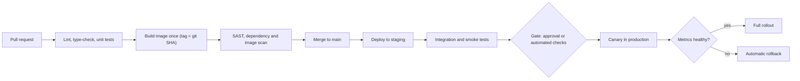
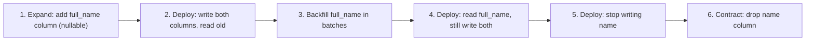

# Pipeline Design & Release Strategies

> **Reviewed:** 2026-09 · **Level:** Senior / Tech Lead · **Type:** Foundational

The basics (pipeline stages, blue-green vs canary, zero-downtime techniques) are in [Git, Docker, CI/CD, Tooling](./01-git-docker-ci-cd-tooling.md). This page is about **designing** a delivery system you'd be happy to own as a Tech Lead.

---

## Q1. How would you design a CI/CD pipeline for a service from scratch?

**Short answer:** I design it around fast feedback first and safety second: cheap checks run early, the artifact is built **once**, and that same artifact is promoted through environments with gates between them. Production deploys are automated, progressive and easy to roll back.

**How it works:**



| Stage | Goal | Typical time budget (illustrative) |
| --- | --- | --- |
| PR checks | Catch obvious breakage | A few minutes |
| Build and scan | Produce a trusted, immutable artifact | Minutes |
| Staging deploy + tests | Verify integration | Minutes to tens of minutes |
| Progressive prod rollout | Limit blast radius | Depends on traffic and bake time |

**Trade-offs and pitfalls:**

- Rebuilding per environment means production runs something that was never tested.
- Putting slow end-to-end suites on every PR kills flow — run a smoke subset on PRs and the full suite post-merge or nightly.
- Manual approval gates feel safe but often become rubber stamps; prefer automated checks plus a human gate only where regulation or risk demands it.

<details>
<summary>Follow-up questions</summary>

- Where do you put security scans without slowing everyone down?
- How do you handle a flaky test that blocks the pipeline?
- What DORA metrics would you track for this pipeline?

</details>

**Remember:** Fast checks early, build once, promote the same artifact, roll out progressively.

---

## Q2. What is artifact promotion and why does "build once, deploy many" matter?

**Short answer:** Artifact promotion means the exact binary or image built from a commit moves through dev, staging and production unchanged — only configuration differs per environment. This guarantees what you tested is what you ship, makes rollbacks trivial (redeploy the previous artifact), and gives an audit trail from commit to production.

**How it works:**

- Tag images with the git SHA; record the digest.
- Keep environment-specific config outside the artifact (env vars, ConfigMaps, secret managers).
- "Promotion" is a metadata change: update the image reference in the staging/prod deployment config (often a GitOps repo).
- Sign the artifact and attach provenance so production can verify where it came from (see [DevSecOps & Supply Chain](../security-and-supply-chain/01-devsecops-and-supply-chain.md)).

**Trade-offs and pitfalls:** Build-time environment variables (common in frontend bundles, for example values inlined at build time) break "build once". Solve it by loading runtime config (a `/config.json` fetched at startup) or accept per-environment builds consciously.

<details>
<summary>Follow-up questions</summary>

- How would you apply build-once to a Next.js or React app that inlines environment variables?
- How do you prove which commit is running in production right now?

</details>

**Remember:** Promote artifacts, not source code.

---

## Q3. How do you make pipelines fast?

**Short answer:** Measure first, then attack the slowest stages: cache dependencies and build layers, run jobs in parallel, only build and test what changed, split test suites across runners, and avoid doing the same work twice. Pipeline speed directly controls how often people integrate.

**How it works:**

- **Dependency caching:** key caches on the lockfile hash.
- **Docker layer caching:** BuildKit with a remote cache backend.
- **Parallelism and sharding:** split tests by timing data across several runners.
- **Affected-only builds:** in monorepos, use path filters or a build graph (Nx, Turborepo, Bazel).
- **Fail fast:** run the cheapest checks first; cancel superseded runs on the same branch.
- **Right-sized runners:** larger runners for heavy builds, self-hosted where network or caching matters.

**Example (monorepo path filter):**

```yaml
on:
  pull_request:
    paths:
      - "services/orders/**"
      - "packages/shared/**"      # shared code also affects orders
```

**Trade-offs and pitfalls:** Path filters can miss hidden dependencies (shared config, root lockfile). A build-graph tool is more accurate for large monorepos. Caches can hide problems — run a clean build periodically.

<details>
<summary>Follow-up questions</summary>

- A required check is skipped by a path filter and now blocks merges. How do you handle it?
- How do you find which step is the bottleneck?

</details>

**Remember:** Cache, parallelise, and only build what changed.

---

## Q4. Show a realistic GitHub Actions workflow.

**Short answer:** A good workflow runs PR checks, builds and pushes an image tagged with the commit SHA, authenticates to the cloud with **OIDC** (no long-lived keys), and deploys through protected environments.

**Example:**

```yaml
# .github/workflows/orders.yml
name: orders-service

on:
  pull_request:
    paths: ["services/orders/**"]
  push:
    branches: [main]
    paths: ["services/orders/**"]

concurrency:
  group: orders-${{ github.ref }}
  cancel-in-progress: true          # cancel older runs on the same branch

permissions:
  contents: read                    # least privilege by default

jobs:
  test:
    runs-on: ubuntu-latest
    defaults:
      run:
        working-directory: services/orders
    steps:
      - uses: actions/checkout@v4
      - uses: actions/setup-node@v4
        with:
          node-version: 20
          cache: npm
          cache-dependency-path: services/orders/package-lock.json
      - run: npm ci
      - run: npm run lint
      - run: npm test

  build-and-push:
    if: github.ref == 'refs/heads/main'
    needs: test
    runs-on: ubuntu-latest
    permissions:
      contents: read
      id-token: write               # needed to request an OIDC token
    steps:
      - uses: actions/checkout@v4
      - uses: aws-actions/configure-aws-credentials@v4
        with:
          role-to-assume: arn:aws:iam::123456789012:role/gha-orders-push   # placeholder
          aws-region: eu-west-1
      - uses: aws-actions/amazon-ecr-login@v2
        id: ecr
      - uses: docker/setup-buildx-action@v3
      - uses: docker/build-push-action@v6
        with:
          context: services/orders
          push: true
          tags: ${{ steps.ecr.outputs.registry }}/orders:${{ github.sha }}
          cache-from: type=gha
          cache-to: type=gha,mode=max

  deploy-staging:
    needs: build-and-push
    runs-on: ubuntu-latest
    environment: staging            # environment-scoped secrets and rules
    steps:
      - run: echo "Update image tag to ${{ github.sha }} in the staging GitOps repo"

  deploy-production:
    needs: deploy-staging
    runs-on: ubuntu-latest
    environment: production         # can require reviewers / wait timers
    steps:
      - run: echo "Promote ${{ github.sha }} to production"
```

**Trade-offs and pitfalls:**

- Pin third-party actions to a full commit SHA for supply-chain safety (tags can be moved).
- `pull_request_target` runs with repository secrets on untrusted fork code — avoid unless you know exactly why you need it.
- Keep deploy logic in scripts or GitOps, not deeply nested YAML, so it can be tested.

<details>
<summary>Follow-up questions</summary>

- Why use OIDC instead of storing AWS keys in secrets?
- How do reusable workflows help across many services?

</details>

**Remember:** Least-privilege permissions, OIDC to the cloud, SHA-tagged images, protected environments.

---

## Q5. Compare release strategies: rolling, blue-green, canary, feature flags, dark launches.

**Short answer:** They all reduce risk by limiting blast radius or making rollback instant. Rolling updates replace instances gradually; blue-green keeps two full environments and flips traffic; canary sends a small percentage of real traffic to the new version and watches metrics; feature flags separate *deploying* code from *releasing* features; dark launches run new code paths on real traffic without showing results to users.

| Strategy | Rollback speed | Extra cost | Best for | Watch out for |
| --- | --- | --- | --- | --- |
| Rolling | Medium (roll back again) | Low | Default for stateless services | Mixed versions during rollout |
| Blue-green | Instant (flip back) | Double capacity briefly | Big-bang changes, strict cutover | DB shared by both colours |
| Canary | Fast (shift traffic back) | Low to medium | High-traffic services with good metrics | Needs automated analysis and enough traffic |
| Feature flags | Instant (toggle) | Flag platform + code complexity | Gradual feature exposure, A/B tests | Flag debt, untested combinations |
| Dark launch / shadow traffic | N/A (users unaffected) | Duplicate load | Validating performance of new paths | Side effects (writes, emails) must be disabled |

**Example:** Rolling out a new pricing engine: deploy via canary at a small percentage (illustrative: 5%) with automated analysis on error rate and p99 latency; the new engine itself is behind a flag, first enabled for internal users, then one region, then everyone. Before that, the engine ran in shadow mode comparing results against the old one.

**Trade-offs and pitfalls:**

- Canary only works if you can tell healthy from unhealthy quickly — it's an observability problem as much as a deployment one.
- Blue-green does not solve database schema changes.
- Feature flags need ownership, expiry dates and cleanup.

<details>
<summary>Follow-up questions</summary>

- How do you choose canary metrics and thresholds?
- How do you do canary for a mobile app? (staged rollouts in app stores, remote config)

</details>

**Remember:** Deploy is not release — use progressive delivery and flags to control exposure.

---

## Q6. How do feature flags work, and how do you prevent flag debt?

**Short answer:** A feature flag is a runtime switch evaluated in code, usually from a flag service (LaunchDarkly, Unleash, Flagsmith, OpenFeature-compatible providers, or a homegrown config). Flags let you merge unfinished work, target specific users, and kill a bad feature instantly. Flag debt is prevented by typing flags (release, ops/kill-switch, experiment, permission), assigning owners and expiry dates, and removing release flags soon after full rollout.

**Example:**

```ts
// Using an OpenFeature-style client (provider-agnostic API)
const showNewCheckout = await flags.getBooleanValue('new-checkout', false, {
  targetingKey: user.id,
  country: user.country,
});

if (showNewCheckout) {
  return renderNewCheckout();
}
return renderLegacyCheckout();   // delete this branch once the flag is at 100%
```

**Trade-offs and pitfalls:** Each flag doubles possible code paths. Flags evaluated on the client can leak unreleased features. Flag service outages must fall back to safe defaults.

<details>
<summary>Follow-up questions</summary>

- How do you test code with many flags?
- Kill switch vs release flag — what's the difference in lifecycle?

</details>

**Remember:** Flags decouple deploy from release; every release flag needs an owner and an end date.

---

## Q7. How do you handle rollbacks when a release goes bad?

**Short answer:** First restore service, then investigate. The fastest options, in order: turn off the feature flag, shift traffic back (canary/blue-green), or redeploy the previous artifact. Rollbacks are only safe if the previous version is still compatible with the current data and schema — which is why migrations must be backward compatible.

**How it works:**

- **Roll back vs roll forward:** roll back when the cause isn't obvious; roll forward only when the fix is small, understood, and faster than rollback.
- Automate rollback triggers from SLO-based metrics during canary analysis.
- Practise rollbacks — an untested rollback path is a hope, not a plan.

**Trade-offs and pitfalls:** Irreversible changes (destructive migrations, sent emails, external API calls, data format changes in queues) can't be undone by redeploying. Identify these in the PR's rollout plan.

<details>
<summary>Follow-up questions</summary>

- When would you choose to roll forward?
- What makes a change "irreversible", and how do you de-risk it?

</details>

**Remember:** Mitigate first, debug later; keep the previous version compatible so rollback is always an option.

---

## Q8. How do you run database migrations safely with zero downtime? (expand/contract)

**Short answer:** Use the **expand/contract** (parallel change) pattern: first make additive, backward-compatible schema changes; deploy code that works with both old and new shapes; migrate data in the background; switch reads; and only then remove the old structure in a later release. At every step, both the current and previous app versions must work, so rollbacks remain safe.

**How it works (rename `name` to `full_name`):**



**Example SQL (Postgres, illustrative):**

```sql
-- Expand (safe, fast): nullable column, no table rewrite
ALTER TABLE users ADD COLUMN full_name text;

-- Backfill in small batches to avoid long locks
UPDATE users SET full_name = name
WHERE id IN (SELECT id FROM users WHERE full_name IS NULL LIMIT 1000);

-- Index without blocking writes
CREATE INDEX CONCURRENTLY idx_users_full_name ON users (full_name);

-- Contract, weeks later, after all readers/writers moved
ALTER TABLE users DROP COLUMN name;
```

**Trade-offs and pitfalls:**

- Running migrations inside app startup across many replicas causes races; run them as a separate pipeline step or Job with a lock.
- Operations that rewrite or lock large tables (adding a column with certain defaults in older DB versions, changing types, adding NOT NULL without care) can cause outages — know your database's locking behaviour.
- Expand/contract takes several releases; track the contract step so it isn't forgotten.

<details>
<summary>Follow-up questions</summary>

- How do you change a column type on a very large table?
- How does this pattern apply to event schemas in a message queue?

</details>

**Remember:** Expand, migrate, switch, contract — every step backward compatible.

---

## Q9. How do you model environments, and when are preview environments worth it?

**Short answer:** A typical setup is dev → staging → production, where staging is as production-like as affordable (same artifact, same IaC, smaller scale). Preview (ephemeral) environments spin up per PR so reviewers and QA can test real deployments; they're worth it when UI or integration changes are frequent and review needs a running app.

**How it works:**

- Same IaC modules for every environment, parameterised by variables.
- Separate cloud accounts/projects per environment for blast-radius and IAM isolation.
- Production-like data in staging should be synthetic or anonymised — never raw production PII.
- Preview environments need automatic teardown and shared, cheap dependencies to control cost.

**Trade-offs and pitfalls:** "Staging is broken again" usually means it's a shared, drifted, manually-changed environment. Treat it as code. Some confidence can only come from production — use canaries and flags rather than trying to make staging perfect.

<details>
<summary>Follow-up questions</summary>

- How do you test against third-party services in staging?
- How would you control the cost of preview environments?

</details>

**Remember:** Environments come from the same code; production confidence comes from progressive delivery.

---

## Q10. Which metrics show whether your delivery process is healthy?

**Short answer:** The DORA metrics: deployment frequency, lead time for changes, change failure rate, and time to restore service (recent DORA reports also discuss rework and reliability). They balance speed and stability, so you can't game one without the other showing it. I use them for team improvement, not for comparing individuals.

**How it works:**

| Metric | Question it answers |
| --- | --- |
| Deployment frequency | How often do we ship to production? |
| Lead time for changes | How long from commit to running in production? |
| Change failure rate | What share of deploys cause incidents or rollbacks? |
| Time to restore | How quickly do we recover from failures? |

**Trade-offs and pitfalls:** Metrics used as targets get gamed (tiny meaningless deploys). Pair them with developer experience feedback.

<details>
<summary>Follow-up questions</summary>

- Your lead time is long. How do you find where time goes? (PR wait time, CI duration, approval queues)

</details>

**Remember:** Measure speed and stability together; improve the system, not individuals.

---

## References

- [GitHub Actions documentation](https://docs.github.com/en/actions)
- [Security hardening for GitHub Actions](https://docs.github.com/en/actions/security-for-github-actions/security-guides/security-hardening-for-github-actions)
- [OpenFeature](https://openfeature.dev/)
- [Argo Rollouts](https://argoproj.github.io/argo-rollouts/)
- [DORA research](https://dora.dev/)
- [Martin Fowler: Parallel Change](https://martinfowler.com/bliki/ParallelChange.html)
