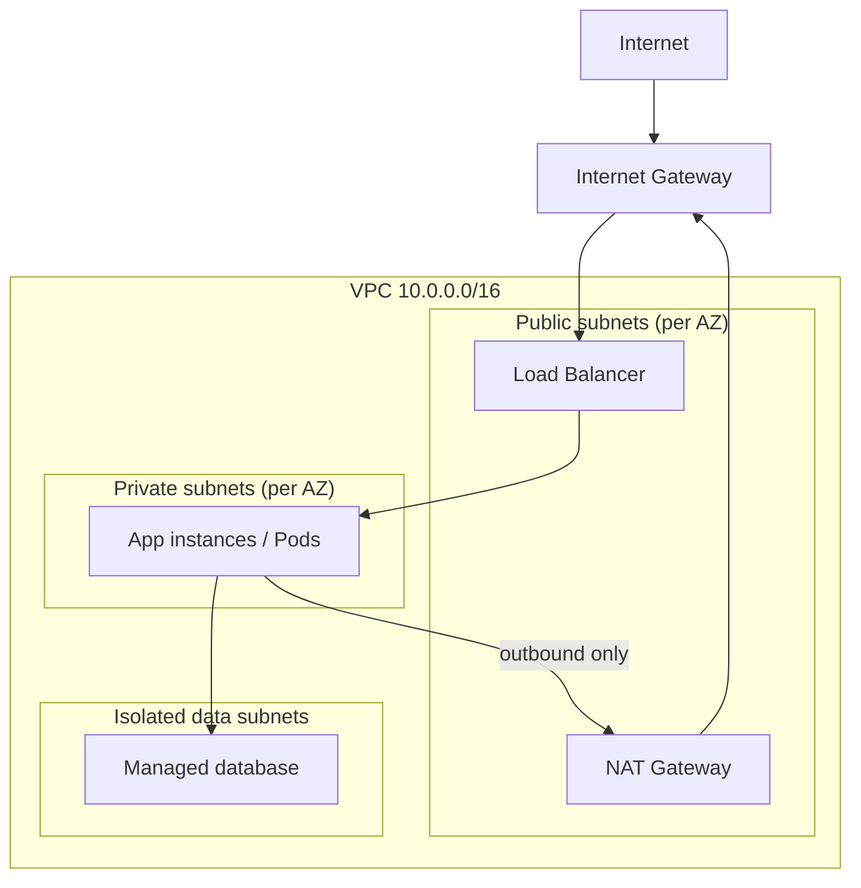

# Multi-Cloud, Networking & Cost

> **Reviewed:** 2026-09 · **Level:** Senior / Tech Lead · **Type:** Foundational

This page stays comparative and practical — enough to reason about architecture on any major cloud, not certification-level detail. AWS-specific deep dives are in [AWS Cloud Architecture](./01-aws-cloud-architecture.md).

---

## Q1. Map the core services across AWS, GCP and Azure.

**Short answer:** The major clouds offer the same building blocks under different names: virtual machines, managed Kubernetes, serverless functions and containers, object storage, managed relational and NoSQL databases, queues and pub/sub, and an identity system. If you understand the category and its trade-offs, you can transfer knowledge between clouds quickly.

| Category | AWS | Google Cloud | Azure |
| --- | --- | --- | --- |
| Virtual machines | EC2 | Compute Engine | Virtual Machines |
| Managed Kubernetes | EKS | GKE | AKS |
| Serverless containers | ECS on Fargate, App Runner | Cloud Run | Azure Container Apps |
| Functions | Lambda | Cloud Run functions | Azure Functions |
| Object storage | S3 | Cloud Storage | Blob Storage |
| Block storage | EBS | Persistent Disk / Hyperdisk | Managed Disks |
| Shared file storage | EFS | Filestore | Azure Files |
| Managed relational DB | RDS, Aurora | Cloud SQL, AlloyDB, Spanner | Azure SQL Database, Azure Database for PostgreSQL / MySQL |
| Key-value / document DB | DynamoDB | Firestore, Bigtable | Cosmos DB |
| In-memory cache | ElastiCache | Memorystore | Azure Cache for Redis / Azure Managed Redis |
| Message queue | SQS | Pub/Sub, Cloud Tasks | Service Bus, Queue Storage |
| Pub/sub and events | SNS, EventBridge | Pub/Sub, Eventarc | Event Grid, Service Bus topics |
| Event streaming | Kinesis, MSK (Kafka) | Pub/Sub, Managed Service for Apache Kafka | Event Hubs |
| Identity and access | IAM (+ IAM Identity Center) | Cloud IAM | Microsoft Entra ID + Azure RBAC |
| Secrets | Secrets Manager, Parameter Store | Secret Manager | Key Vault |
| Private network | VPC | VPC (global, regional subnets) | Virtual Network (VNet) |
| Load balancing | ELB (ALB, NLB) | Cloud Load Balancing | Load Balancer, Application Gateway, Front Door |
| CDN | CloudFront | Cloud CDN | Azure Front Door |
| DNS | Route 53 | Cloud DNS | Azure DNS |
| Monitoring and logs | CloudWatch | Cloud Monitoring, Cloud Logging | Azure Monitor |
| Native IaC | CloudFormation, CDK | Infrastructure Manager (Terraform-based) | ARM templates, Bicep |
| Data warehouse | Redshift | BigQuery | Synapse Analytics, Microsoft Fabric |

**Trade-offs and pitfalls:** "Equivalent" never means identical. Examples: GCP VPCs are global while AWS VPCs and Azure VNets are regional; Pub/Sub combines queue and fan-out semantics that AWS splits into SQS and SNS; Cosmos DB offers several APIs and consistency levels. Product names change — confirm current names before an interview.

Follow-up questions

- How would you port a Lambda + SQS + DynamoDB design to GCP?
- For messaging trade-offs in depth, see [Messaging Systems](../../backend/architecture/05-messaging-systems.md).

**Remember:** Learn categories and trade-offs; names are just translations.

---

## Q2. How do IAM models differ across the clouds?

**Short answer:** All three follow "identity + permissions + scope", but the shape differs. AWS attaches JSON policies to users, groups and roles, and workloads assume roles for temporary credentials. GCP grants roles to principals on a resource hierarchy (organisation → folder → project → resource), and permissions inherit downward. Azure uses Microsoft Entra ID for identity and Azure RBAC role assignments at management group, subscription, resource group or resource scope.

| Concept | AWS | Google Cloud | Azure |
| --- | --- | --- | --- |
| Workload identity | IAM role (instance profile, IRSA/Pod Identity) | Service account (Workload Identity) | Managed identity (Workload ID) |
| Permission unit | Policy document (allow/deny statements) | Role (bundle of permissions) bound via IAM policy | Role definition + role assignment |
| Isolation boundary | Account (grouped in AWS Organizations) | Project (in folders/organisation) | Subscription / resource group |
| Guardrails | Service Control Policies | Organization Policy Service | Azure Policy |

**Trade-offs and pitfalls:** Broad inherited grants at the top of a hierarchy (org-level "Editor" in GCP, subscription-level "Contributor" in Azure) are common over-permissions. Prefer short-lived, federated credentials over long-lived keys everywhere.

Follow-up questions

- How would a CI pipeline authenticate to each cloud without static keys? (OIDC federation)
- What's the difference between an allow and an explicit deny in AWS?

**Remember:** Same idea everywhere — prefer roles and workload identities over keys, and scope grants low in the hierarchy.

---

## Q3. When is multi-cloud actually worth it?

**Short answer:** Rarely as a default. Multi-cloud adds cost, complexity and lowest-common-denominator architecture. It makes sense for specific reasons: regulatory or customer requirements, acquisitions that brought another cloud, using a best-in-class service (for example a particular data or AI platform), or negotiating leverage. "Avoiding lock-in" alone usually costs more than the lock-in it prevents.

**How it works:** Distinguish:

- **Multi-cloud by workload:** different systems on different clouds (common and reasonable).
- **Portable workloads:** containers + Kubernetes + Terraform so moving is *possible* (moderate cost).
- **Active-active across clouds:** the same system live on two clouds (very expensive; justify carefully).

**Trade-offs and pitfalls:** Egress costs between clouds, duplicated IAM and networking, two sets of on-call knowledge, and skills spread thin.

Follow-up questions

- Your CTO wants to be "cloud-agnostic". How do you respond?
- What parts of a stack are cheap to keep portable, and which are not?

**Remember:** Multi-cloud is a business decision with a real engineering bill.

---

## Q4. Explain VPC networking basics: subnets, route tables, internet and NAT gateways.

**Short answer:** A VPC is your private network in the cloud with an IP range (CIDR). You split it into **subnets**, usually public and private in each availability zone. **Route tables** decide where traffic goes: public subnets route `0.0.0.0/0` to an internet gateway; private subnets route outbound traffic through a **NAT gateway**, so instances can reach the internet (for updates, third-party APIs) without being reachable from it.

**How it works:**

- Put only load balancers and NAT in public subnets; apps and databases stay private.
- Spread subnets across at least two, usually three, availability zones.
- Plan CIDRs so they don't overlap with other VPCs or on-prem networks you may need to peer with later.
- Use private endpoints (AWS PrivateLink / VPC endpoints, GCP Private Service Connect, Azure Private Link) to reach managed services without going through NAT or the public internet.

**Trade-offs and pitfalls:** One NAT gateway is a single-AZ dependency; one per AZ is more resilient but costs more. NAT data processing charges can be surprisingly large for chatty workloads (for example pulling images or calling object storage through NAT instead of an endpoint).

Follow-up questions

- How would you connect two VPCs? (peering vs transit gateway / hub-and-spoke)
- How does a Pod in Kubernetes get an IP in the VPC? (VPC-native CNI)

**Remember:** Public subnets for entry points, private subnets for apps and data, NAT for outbound, endpoints for cloud services.

---

## Q5. Security groups vs network ACLs vs firewall rules — what's the difference?

**Short answer:** In AWS, **security groups** are stateful, allow-only firewalls attached to network interfaces — return traffic is automatically allowed. **Network ACLs** are stateless, subnet-level rules with allow and deny, evaluated in order, so you must allow return traffic explicitly. GCP uses VPC firewall rules (stateful, applied via tags or service accounts), and Azure uses Network Security Groups (stateful, attached to subnets or NICs).

| | AWS Security Group | AWS NACL | GCP firewall rule | Azure NSG |
| --- | --- | --- | --- | --- |
| Stateful | Yes | No | Yes | Yes |
| Attach to | ENI / instance | Subnet | VPC, targeted by tag or service account | Subnet or NIC |
| Deny rules | No | Yes | Yes | Yes |

**Example:** The database security group allows port 5432 only *from the app security group* (by reference), not from a CIDR range — so new app instances automatically get access and nothing else does.

Follow-up questions

- When would you use a NACL at all? (coarse subnet-level deny, compliance)
- How do Kubernetes NetworkPolicies relate to security groups?

**Remember:** Security groups are your main, stateful tool; NACLs are a coarse, stateless backstop.

---

## Q6. How do you design for high availability and disaster recovery in the cloud?

**Short answer:** Start with the business targets: **RTO** (how long can we be down) and **RPO** (how much data can we lose). Multi-AZ within a region handles most failures cheaply. Multi-region is for region-level outages or latency, and it's much more expensive — pick a DR pattern that matches the targets: backup and restore, pilot light, warm standby, or active-active.

| Pattern | RTO / RPO (relative) | Cost |
| --- | --- | --- |
| Backup and restore | Hours / hours | Lowest |
| Pilot light (core data replicated, compute off) | Tens of minutes / minutes | Low |
| Warm standby (scaled-down copy running) | Minutes / seconds to minutes | Medium |
| Active-active multi-region | Near zero / near zero | Highest, plus data-consistency complexity |

**Trade-offs and pitfalls:** Untested DR doesn't exist — run game days. Replication doesn't protect against logical corruption or deletion; you still need point-in-time backups. Watch for hidden single-region dependencies (auth provider, DNS config, CI system, container registry).

Follow-up questions

- How do you handle writes in an active-active setup?
- What's the difference between high availability and disaster recovery?

**Remember:** RTO/RPO decide the pattern; multi-AZ is the baseline, multi-region is a deliberate investment.

---

## Q7. How do you choose between VMs, containers and serverless?

**Short answer:** Choose by operational ownership and workload shape. Serverless functions or containers (Lambda, Cloud Run, Container Apps) for spiky or event-driven workloads where you want zero server management. Managed Kubernetes when you run many services and want a common platform. VMs when you need full control, special hardware, or software that isn't container-friendly.

| Option | You manage | Good for | Watch out for |
| --- | --- | --- | --- |
| VMs | OS, patching, scaling | Legacy apps, special kernels/hardware | Toil, slower scaling |
| Kubernetes | Workloads, add-ons, upgrades | Many services, platform teams | Operational complexity |
| Serverless containers | Container image only | HTTP services, workers, spiky traffic | Cold starts, request time limits, per-request cost at high volume |
| Functions | Code only | Event glue, light APIs | Execution limits, local testing, vendor-specific triggers |

Follow-up questions

- At what point does serverless become more expensive than containers? (depends on sustained utilisation — model it)

**Remember:** Pick the least operational burden that meets the workload's constraints.

---

## Q8. What drives cloud cost, and how do engineers keep it under control?

**Short answer:** The big drivers are compute that's over-provisioned or idle, data transfer (especially egress and cross-AZ/region traffic, and NAT processing), storage that grows forever, and managed services left running in non-production. Engineers control cost by tagging ownership, right-sizing, autoscaling, lifecycle policies, using commitments or spot for the right workloads, and making cost visible per team.

**How it works:**

- **Visibility:** mandatory tags/labels (team, service, environment); cost dashboards per team; budgets and anomaly alerts.
- **Right-sizing:** compare requested vs used CPU/memory; Kubernetes requests drive node count.
- **Pricing models:** on-demand for spiky, commitments (Savings Plans / Reserved Instances, committed use discounts, Azure reservations/savings plans) for steady baseline, spot/preemptible for fault-tolerant batch.
- **Data transfer:** keep chatty services in the same AZ where safe, use private endpoints, cache at the CDN.
- **Storage:** lifecycle rules to move old objects to colder tiers; delete orphaned volumes and snapshots.
- **Non-prod:** schedule dev/staging to scale down at night; TTLs on preview environments.

**Trade-offs and pitfalls:** Cost optimisation can hurt reliability (single NAT, no headroom, spot for stateful work). Treat cost as a non-functional requirement alongside latency and availability — this is the FinOps mindset.

Follow-up questions

- Your cloud bill jumped noticeably last month. How do you investigate?
- How do you make teams care about cost without slowing them down?

**Remember:** Tag everything, right-size continuously, and watch data transfer.

---

## Q9. What is the shared responsibility model?

**Short answer:** The cloud provider secures the infrastructure *of* the cloud — data centres, hardware, hypervisors, and the managed parts of services. You secure what you put *in* the cloud — IAM, data, network configuration, OS patching on VMs, application code. The more managed the service, the more the provider owns, but identity, data classification and configuration are always yours.

**Example:** On a VM you patch the OS; on a managed database you don't patch the engine but you still configure network access, encryption, backups retention and who can connect.

Follow-up questions

- What are the most common cloud security failures? (misconfigured public storage, over-permissive IAM, leaked keys)

**Remember:** The provider secures the cloud; you secure your configuration, identities and data in it.

---

## References

- [AWS documentation](https://docs.aws.amazon.com/)
- [Google Cloud documentation](https://cloud.google.com/docs)
- [Microsoft Azure documentation](https://learn.microsoft.com/en-us/azure/)
- [AWS Well-Architected Framework](https://aws.amazon.com/architecture/well-architected/)
- [Google Cloud Architecture Center](https://cloud.google.com/architecture)
- [Azure Architecture Center](https://learn.microsoft.com/en-us/azure/architecture/)
- [FinOps Foundation](https://www.finops.org/)
