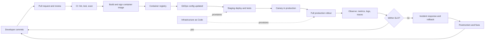

# DevOps & Production Engineering

> **Reviewed:** 2026-09 · **Level:** Senior / Tech Lead · **Type:** Foundational (Platform Engineering is Emerging)

Senior and Tech Lead interviews increasingly expect you to own the path from a merged PR to a healthy production system. This section covers that path end to end: how teams collaborate in Git, how code is packaged and shipped, where it runs, how it's provisioned, how you see what it's doing, how you respond when it breaks, and how you keep it secure.

## What this section covers

- **Collaboration:** branching strategies, ownership, PR hygiene, repository layout.
- **Packaging and delivery:** containers, CI/CD pipeline design, progressive delivery, rollbacks and safe migrations.
- **Runtime:** cloud building blocks and networking, Kubernetes architecture, operations and debugging.
- **Provisioning:** Infrastructure as Code with Terraform and alternatives.
- **Operations:** observability with OpenTelemetry, SLOs, incident response and postmortems.
- **Security:** secrets, least privilege, supply-chain security and pipeline hardening.
- **Scaling the organisation:** platform engineering, golden paths and GitOps.

## From code to production

## Recommended learning order

1. **Git** — [Git & Collaboration](./git-and-collaboration/index.md)
2. **Docker** — [Containers (Docker)](./containers/index.md)
3. **CI/CD** — [CI/CD & Releases](./ci-cd-and-releases/index.md)
4. **Cloud** — [Cloud](./cloud/index.md)
5. **Kubernetes** — [Kubernetes](./orchestration/index.md)
6. **IaC** — [Infrastructure as Code](./infrastructure-as-code/index.md)
7. **Telemetry** — [Telemetry & Observability](./telemetry/index.md)
8. **Reliability** — [Reliability & Incidents](./reliability-and-incidents/index.md)
9. **Security** — [Security & Supply Chain](./security-and-supply-chain/index.md)
10. **Platform** — [Platform Engineering](./platform-engineering/index.md) (emerging)

Finish with the [DevOps Cheatsheet](./cheatsheet.md) for revision.

## Pages at a glance

| Topic | Pages | Questions |
| --- | --- | --- |
| Git & Collaboration | [Branching & Team Workflows](./git-and-collaboration/01-branching-and-team-workflows.md) | 10 |
| Containers | [Docker in Production](./containers/01-docker-in-production.md) | 10 |
| CI/CD & Releases | [Git, Docker, CI/CD, Tooling](./ci-cd-and-releases/01-git-docker-ci-cd-tooling.md), [Pipeline Design & Release Strategies](./ci-cd-and-releases/02-pipeline-design-and-release-strategies.md) | 20 + 10 |
| Cloud | [AWS Cloud Architecture](./cloud/01-aws-cloud-architecture.md), [Multi-Cloud, Networking & Cost](./cloud/02-multi-cloud-networking-and-cost.md) | 23 + 9 |
| Kubernetes | [Architecture & Workloads](./orchestration/01-kubernetes-architecture-and-workloads.md), [Operations & Debugging](./orchestration/02-kubernetes-operations-and-debugging.md) | 8 + 9 |
| Infrastructure as Code | [Terraform & IaC Practices](./infrastructure-as-code/01-terraform-and-iac-practices.md) | 10 |
| Telemetry | [CloudWatch and New Relic](./telemetry/01-cloudwatch-and-new-relic.md), [Observability & OpenTelemetry](./telemetry/02-observability-with-opentelemetry.md) | 15 + 10 |
| Reliability & Incidents | [SLOs, Incidents & Postmortems](./reliability-and-incidents/01-slos-incidents-and-postmortems.md) | 12 |
| Security & Supply Chain | [DevSecOps & Supply Chain](./security-and-supply-chain/01-devsecops-and-supply-chain.md) | 10 |
| Platform Engineering | [Platform Engineering & GitOps](./platform-engineering/01-platform-engineering-and-gitops.md) | 7 |

## How to use this section

- For each question, practise the **Short answer** out loud until it takes under a minute.
- Use the **Follow-up questions** to rehearse going one level deeper.
- Tie answers to real experience: "At my last company we..." is more convincing than a definition.
- Pair with system design practice in [Case Studies](../case-studies/index.md) — most designs end with "how would you deploy, monitor and operate this?".

> **Interview tip:** Tech Lead interviews reward trade-off thinking. For almost every tool question, say when you would *not* use it.
