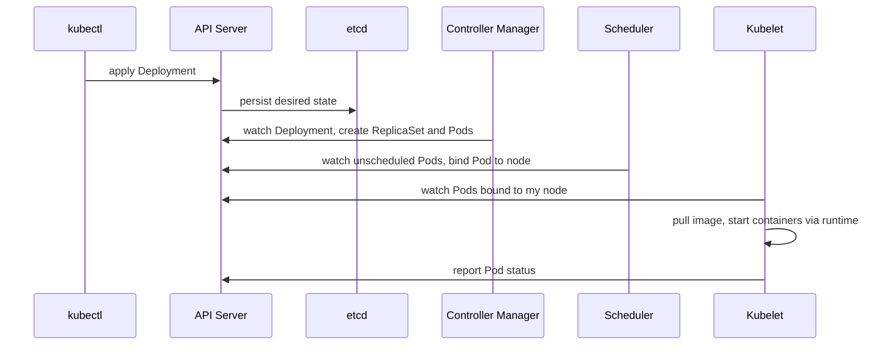
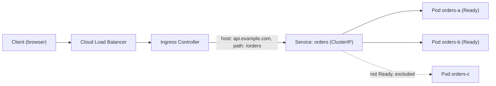

# Kubernetes Architecture & Workloads

> **Reviewed:** 2026-09 · **Level:** Senior / Tech Lead · **Type:** Foundational

This page covers how Kubernetes is built and the objects you use every day. Operations and debugging continue in [Kubernetes Operations & Debugging](./02-kubernetes-operations-and-debugging.md).

---

## Q1. Explain the Kubernetes architecture.

**Short answer:** Kubernetes is a declarative system: you store the *desired state* in the API, and controllers continuously work to make the *actual state* match. The **control plane** has the API server (the only component that talks to etcd), etcd (the consistent key-value store), the scheduler (picks a node for each new Pod), and the controller manager (runs reconciliation loops). Each **worker node** runs the kubelet (makes sure the Pods assigned to it are running), a container runtime such as containerd, and usually kube-proxy for Service networking.

**How it works:** Everything is a reconciliation loop: watch, compare, act. When you `kubectl apply` a Deployment:



| Component | Role | If it fails |
| --- | --- | --- |
| kube-apiserver | Front door; authn, authz, admission, validation | No changes possible; running Pods keep running |
| etcd | Source of truth for cluster state | Cluster state lost if not backed up |
| kube-scheduler | Places Pods on nodes (resources, affinity, taints) | New Pods stay Pending |
| kube-controller-manager | Deployment, ReplicaSet, Node, Job controllers, etc. | No self-healing or scaling |
| cloud-controller-manager | Cloud load balancers, nodes, routes | Cloud integrations stop updating |
| kubelet | Runs Pods on a node, executes probes | Node's Pods not managed |
| kube-proxy / CNI | Service routing and Pod networking | Traffic routing breaks |

**Trade-offs and pitfalls:** The data plane keeps running if the control plane is briefly down — a key resilience property. etcd needs an odd number of members (3 or 5) for quorum and regular backups; managed services handle this for you.

<details>
<summary>Follow-up questions</summary>

- What happens, step by step, when a node dies?
- What are admission controllers and webhooks used for?
- Why is etcd sensitive to disk latency?

</details>

**Remember:** Desired state in etcd via the API server; controllers reconcile; kubelets execute.

---

## Q2. Explain Pods, Deployments, Services and Ingress, and how a request reaches your app.

**Short answer:** A **Pod** is the smallest deployable unit: one or more containers sharing a network namespace and volumes. A **Deployment** manages ReplicaSets to keep N identical Pods running and handles rolling updates. A **Service** gives a stable virtual IP and DNS name that load-balances across healthy Pods selected by labels. An **Ingress** (or the newer Gateway API) routes external HTTP(S) traffic by host and path to Services.

**How it works:**



- The Service selects Pods by labels; only **Ready** Pods appear in its EndpointSlices.
- kube-proxy (iptables/IPVS) or an eBPF-based CNI implements the virtual IP on every node.
- Service types: `ClusterIP` (internal), `NodePort`, `LoadBalancer` (provisions a cloud LB), `ExternalName`, and headless (`clusterIP: None`) for direct Pod DNS.
- An Ingress resource does nothing on its own — you need an **Ingress controller** (for example NGINX-based, Traefik, or a cloud controller).

**Example:**

```yaml
apiVersion: apps/v1
kind: Deployment
metadata:
  name: orders
spec:
  replicas: 3
  selector:
    matchLabels: { app: orders }
  template:
    metadata:
      labels: { app: orders }           # the Service selects on this label
    spec:
      containers:
        - name: orders
          image: registry.example.com/orders:3f9c2a1
          ports:
            - containerPort: 8080
---
apiVersion: v1
kind: Service
metadata:
  name: orders
spec:
  selector: { app: orders }
  ports:
    - port: 80          # port clients call
      targetPort: 8080  # container port
---
apiVersion: networking.k8s.io/v1
kind: Ingress
metadata:
  name: api
spec:
  ingressClassName: nginx
  tls:
    - hosts: [api.example.com]
      secretName: api-tls
  rules:
    - host: api.example.com
      http:
        paths:
          - path: /orders
            pathType: Prefix
            backend:
              service:
                name: orders
                port: { number: 80 }
```

**Trade-offs and pitfalls:**

- Never create bare Pods in production — nothing recreates them if they die.
- A label typo between Service selector and Pod template gives a Service with zero endpoints.
- Gateway API separates infrastructure (Gateway) from app routing (HTTPRoute) and supports richer traffic splitting; evaluate it for new platforms.

<details>
<summary>Follow-up questions</summary>

- When would you put two containers in one Pod? (sidecars: proxies, log shippers)
- How does in-cluster DNS resolve `orders.default.svc.cluster.local`?
- Ingress vs Service of type LoadBalancer — when would you use each?

</details>

**Remember:** Deployment keeps Pods alive, Service gives them a stable address, Ingress brings in outside traffic.

---

## Q3. ConfigMaps vs Secrets — what's the difference and how do you manage secrets properly?

**Short answer:** Both inject configuration into Pods as environment variables or mounted files. ConfigMaps are for non-sensitive config. Secrets are for sensitive values, but by default they are only **base64-encoded**, not encrypted. To be safe you enable encryption at rest for etcd, restrict access with RBAC, and ideally source secrets from an external manager via the External Secrets Operator or the Secrets Store CSI driver.

**Example:**

```yaml
apiVersion: v1
kind: ConfigMap
metadata:
  name: orders-config
data:
  LOG_LEVEL: "info"
  FEATURE_NEW_CHECKOUT: "false"
---
apiVersion: v1
kind: Secret
metadata:
  name: orders-db
type: Opaque
stringData:                     # written as plain text, stored base64-encoded
  DATABASE_URL: "postgres://..."   # in real life, synced from a secret manager
---
# In the Pod spec
envFrom:
  - configMapRef: { name: orders-config }
  - secretRef: { name: orders-db }
```

**Trade-offs and pitfalls:**

- Environment variables are read once at startup; mounted files update in place (with a delay), but your app must re-read them.
- Committing Secret YAML to Git is a leak. Use Sealed Secrets, SOPS, or external secret managers for GitOps.
- A common pattern: add a hash of the config to Pod annotations so config changes trigger a rollout.

<details>
<summary>Follow-up questions</summary>

- How do you rotate a secret used by 50 Pods without downtime?
- Who in your cluster can read Secrets? How would you check? (`kubectl auth can-i`)

</details>

**Remember:** Kubernetes Secrets are encoded, not encrypted — add encryption at rest, RBAC and an external source of truth.

---

## Q4. Explain liveness, readiness and startup probes.

**Short answer:** **Readiness** decides whether a Pod receives traffic — failing removes it from Service endpoints without restarting it. **Liveness** decides whether the container is stuck — failing makes the kubelet restart it. **Startup** protects slow-starting apps: liveness and readiness checks are held off until the startup probe succeeds.

**How it works:**

| Probe | On failure | Use for | Avoid |
| --- | --- | --- | --- |
| Startup | Keep waiting, then restart after threshold | Slow boot, migrations, cache warm-up | Leaving it out for slow apps (liveness kills them during boot) |
| Readiness | Remove from load balancing | Warm-up, temporary overload, draining | Checking deep dependency chains aggressively |
| Liveness | Restart container | Deadlocks, unrecoverable hangs | Checking the database (restart storms) |

**Example:**

```yaml
containers:
  - name: orders
    image: registry.example.com/orders:3f9c2a1
    startupProbe:
      httpGet: { path: /healthz, port: 8080 }
      periodSeconds: 5
      failureThreshold: 30        # up to ~150s to start
    readinessProbe:
      httpGet: { path: /ready, port: 8080 }
      periodSeconds: 5
      failureThreshold: 3
    livenessProbe:
      httpGet: { path: /healthz, port: 8080 }
      periodSeconds: 10
      failureThreshold: 3         # restart after ~30s of failures
```

**Trade-offs and pitfalls:**

- Liveness that depends on a shared database: DB blips, every Pod restarts, the outage gets worse.
- Using the same endpoint for readiness and liveness removes the useful distinction.
- Tight timeouts under CPU throttling cause false failures.

<details>
<summary>Follow-up questions</summary>

- Your Pods restart every few minutes under load, but logs show no crash. What do you suspect?
- How do readiness probes help during rolling updates?

</details>

**Remember:** Readiness gates traffic, liveness restarts, startup buys time.

---

## Q5. Explain resource requests, limits and QoS classes.

**Short answer:** **Requests** are what the scheduler reserves for a container — they decide placement. **Limits** are the maximum it can use at runtime. Going over the CPU limit causes **throttling**; going over the memory limit gets the container **OOM-killed**. From these settings Kubernetes assigns a QoS class — Guaranteed, Burstable or BestEffort — which decides eviction order under node pressure.

**How it works:**

| QoS class | Rule | Eviction priority |
| --- | --- | --- |
| Guaranteed | Every container has CPU and memory requests equal to limits | Evicted last |
| Burstable | At least one request or limit set, not Guaranteed | Middle |
| BestEffort | No requests or limits at all | Evicted first |

**Example:**

```yaml
resources:
  requests:
    cpu: "250m"        # a quarter of a core reserved for scheduling
    memory: "256Mi"
  limits:
    memory: "512Mi"    # hard cap; exceeding it means OOMKilled (exit code 137)
    # CPU limit intentionally omitted in this example to avoid throttling;
    # a common choice, but a team/platform policy decision
```

**Trade-offs and pitfalls:**

- Requests set too high waste money (nodes look full but are idle); too low causes noisy neighbours and evictions.
- CPU limits can throttle latency-sensitive apps even when the node has spare CPU. Many teams set memory limits but think carefully about CPU limits.
- Runtimes need to respect container limits (modern JVMs and Node do, but check heap settings such as `--max-old-space-size`).
- Use LimitRanges and ResourceQuotas per namespace to enforce defaults.

<details>
<summary>Follow-up questions</summary>

- How would you right-size requests for a service? (observe real usage, VPA recommendations)
- Why can a Pod be Pending even when nodes show low actual usage? (scheduling is based on requests)

</details>

**Remember:** Requests schedule, limits enforce; CPU throttles, memory kills.

---

## Q6. How does the Horizontal Pod Autoscaler work?

**Short answer:** The HPA periodically reads metrics (CPU or memory utilisation relative to requests, or custom/external metrics like queue depth or requests per second) and adjusts a Deployment's replica count to hit a target. Roughly: desired replicas = current replicas × current metric ÷ target metric. It needs metrics-server for resource metrics and a metrics adapter for custom metrics.

**Example:**

```yaml
apiVersion: autoscaling/v2
kind: HorizontalPodAutoscaler
metadata:
  name: orders
spec:
  scaleTargetRef:
    apiVersion: apps/v1
    kind: Deployment
    name: orders
  minReplicas: 3
  maxReplicas: 20
  metrics:
    - type: Resource
      resource:
        name: cpu
        target:
          type: Utilization
          averageUtilization: 70     # % of CPU *requests*
  behavior:
    scaleDown:
      stabilizationWindowSeconds: 300  # avoid flapping when load dips briefly
```

**How it works together:**

- **HPA** adds Pods; **Cluster Autoscaler** or **Karpenter** adds nodes when Pods can't be scheduled.
- **VPA** adjusts requests (don't let HPA and VPA fight over the same CPU/memory metric).
- **KEDA** scales on event sources (queues, streams) and can scale to zero.

**Trade-offs and pitfalls:** CPU is a poor signal for I/O-bound services — scale on queue lag or concurrency. Without requests, utilisation can't be computed. Scaling takes time (image pull, node provisioning), so keep headroom for sudden spikes.

<details>
<summary>Follow-up questions</summary>

- How would you autoscale a queue consumer? (KEDA on queue depth; see [Messaging Systems](../../backend/architecture/05-messaging-systems.md))
- Why might HPA not scale up during a traffic spike?

</details>

**Remember:** HPA scales Pods on a metric relative to a target; node autoscalers make room for them.

---

## Q7. Deployment vs StatefulSet vs DaemonSet vs Job/CronJob — when do you use each?

**Short answer:** Deployments for stateless, interchangeable replicas. StatefulSets for Pods that need stable identity and their own storage, like databases or Kafka brokers. DaemonSets for one Pod per node, such as log shippers and node agents. Jobs for run-to-completion tasks, and CronJobs for scheduled Jobs.

| Workload | Identity | Storage | Typical use |
| --- | --- | --- | --- |
| Deployment | Random names, interchangeable | Usually none or shared | APIs, web apps, workers |
| StatefulSet | Stable names (`db-0`, `db-1`), ordered start/stop | Per-Pod PVC via `volumeClaimTemplates` | Databases, brokers, consensus systems |
| DaemonSet | One per (matching) node | Often host paths | Log/metrics agents, CNI, storage drivers |
| Job | Runs until success | Optional | Migrations, batch processing |
| CronJob | Creates Jobs on a schedule | Optional | Nightly reports, cleanups |

**Example (CronJob):**

```yaml
apiVersion: batch/v1
kind: CronJob
metadata:
  name: nightly-report
spec:
  schedule: "0 2 * * *"
  concurrencyPolicy: Forbid     # don't start a new run if the last is still going
  jobTemplate:
    spec:
      backoffLimit: 2
      template:
        spec:
          restartPolicy: OnFailure
          containers:
            - name: report
              image: registry.example.com/reports:1.2.0
```

**Trade-offs and pitfalls:** Running databases on Kubernetes is possible with StatefulSets and operators, but a managed database is often less operational work. StatefulSets need a headless Service for stable DNS names.

<details>
<summary>Follow-up questions</summary>

- Should you run your production Postgres on Kubernetes? What would you consider?
- How do you make a CronJob idempotent?

</details>

**Remember:** Stateless → Deployment, identity + storage → StatefulSet, per-node → DaemonSet, run-once → Job.

---

## Q8. Explain PersistentVolumes, PersistentVolumeClaims and StorageClasses.

**Short answer:** A **PersistentVolume** (PV) is a piece of storage in the cluster. A **PersistentVolumeClaim** (PVC) is a Pod's request for storage ("20 GiB, ReadWriteOnce"). A **StorageClass** describes how to provision storage dynamically — when a PVC references it, the CSI driver creates a matching PV (for example an EBS volume or a GCE persistent disk) automatically.

**How it works:**

- **Access modes:** `ReadWriteOnce` (one node), `ReadOnlyMany`, `ReadWriteMany` (needs shared filesystems like EFS/NFS/Filestore/Azure Files), `ReadWriteOncePod`.
- **Reclaim policy:** `Delete` removes the disk when the PVC is deleted; `Retain` keeps it for manual recovery.
- **Topology:** block volumes are usually zonal, so a Pod must be scheduled in the same zone as its disk — use `volumeBindingMode: WaitForFirstConsumer`.

**Example:**

```yaml
apiVersion: v1
kind: PersistentVolumeClaim
metadata:
  name: uploads
spec:
  accessModes: [ReadWriteOnce]
  storageClassName: gp3          # class name depends on your cluster
  resources:
    requests:
      storage: 20Gi
```

**Trade-offs and pitfalls:** A Pod stuck Pending with "volume node affinity conflict" usually means its disk is in another zone. Prefer object storage (S3/GCS/Blob) for files that many Pods need; PVCs are best for single-writer state.

<details>
<summary>Follow-up questions</summary>

- What happens to a StatefulSet's PVCs when you scale it down?
- How would you back up volumes? (CSI snapshots, Velero)

</details>

**Remember:** PVC asks, StorageClass provisions, PV is the actual disk.

---

## References

- [Kubernetes documentation](https://kubernetes.io/docs/home/)
- [Kubernetes components](https://kubernetes.io/docs/concepts/overview/components/)
- [Configure liveness, readiness and startup probes](https://kubernetes.io/docs/tasks/configure-pod-container/configure-liveness-readiness-startup-probes/)
- [Horizontal Pod Autoscaling](https://kubernetes.io/docs/tasks/run-application/horizontal-pod-autoscale/)
- [Gateway API](https://gateway-api.sigs.k8s.io/)
