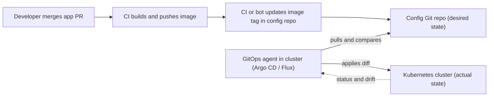

# Platform Engineering & GitOps

> **Reviewed:** 2026-09 · **Level:** Senior / Tech Lead · **Type:** Emerging

Platform engineering is a newer discipline and terminology varies between companies. In interviews, focus on the problems it solves and the trade-offs, not on buzzwords.

---

## Q1. What is platform engineering and why has it emerged?

**Short answer:** Platform engineering is building and running an internal product — an internal developer platform — that gives application teams self-service access to infrastructure, delivery and operations capabilities. It emerged because "you build it, you run it" pushed a lot of cognitive load onto every team: Kubernetes, Terraform, CI, observability, security. A platform team absorbs that complexity once and offers it as well-designed, paved paths.

**How it works:** The platform team treats developers as customers: it does user research, has a roadmap, measures adoption and satisfaction, and optimises for developer experience — not for control.

**Trade-offs and pitfalls:**

- A platform built without user input becomes a mandatory ticket queue with a new name.
- Too early: a small company with five services may not need a dedicated platform team; shared templates may be enough.
- Rebranding an ops team as "platform" without changing how it works gains nothing.

<details>
<summary>Follow-up questions</summary>

- How is platform engineering different from DevOps and SRE?
- When would you create a platform team, and how big should it be?

</details>

**Remember:** A platform is an internal product that reduces cognitive load for product teams.

---

## Q2. What are golden paths (paved roads)?

**Short answer:** A golden path is the recommended, well-supported way to do a common task — create a new service, add a database, set up a pipeline — with the best practices built in. It's opinionated but **optional**: teams can go off-road when they have a good reason, but then they own the extra work. The goal is that the easy way and the right way are the same way.

**Example:** "Create a new Node.js service" in the developer portal generates a repo with a Dockerfile, CI workflow using OIDC, Kubernetes manifests with probes and resource settings, OpenTelemetry instrumentation, a dashboard, SLO alerts, CODEOWNERS, and registration in the service catalog. The first deploy to staging happens within the hour.

**Trade-offs and pitfalls:** Templates that are copied once and never updated drift quickly. Prefer shared, versioned building blocks (reusable workflows, base charts, libraries) that can be upgraded centrally.

<details>
<summary>Follow-up questions</summary>

- How do you keep services created from a template up to date?
- What happens when a team needs something the golden path doesn't support?

</details>

**Remember:** Golden paths make the right way the easy way, without forbidding other ways.

---

## Q3. What does an internal developer platform (IDP) typically include?

**Short answer:** Usually a developer portal as the front door (for example Backstage-based), a service catalog showing ownership and dependencies, software templates for golden paths, self-service infrastructure (databases, queues, environments) via APIs or GitOps, standard CI/CD, built-in observability and security guardrails, and documentation in one place.

| Layer | Examples |
| --- | --- |
| Portal and catalog | Backstage or commercial portals; service ownership, docs, scorecards |
| Delivery | Reusable CI workflows, GitOps (Argo CD / Flux), progressive delivery |
| Infrastructure self-service | Terraform modules behind a portal, Crossplane compositions, operators |
| Runtime | Managed Kubernetes or serverless with sane defaults |
| Observability and security | Default OTel setup, dashboards, SLO templates, policy engines |

**Trade-offs and pitfalls:** Building everything in-house is expensive; assemble existing tools and add thin glue. The portal is not the platform — the capabilities behind it are.

**Remember:** The portal is the front door; the platform is the self-service capabilities behind it.

---

## Q4. What is GitOps and how does pull-based reconciliation work?

**Short answer:** GitOps means Git is the source of truth for the desired state of your systems, and an agent running inside the cluster — such as Argo CD or Flux — continuously **pulls** that state and reconciles the cluster to match. Deploying becomes a Git commit; rolling back becomes a Git revert; and drift from manual changes is detected or automatically corrected.

**How it works:**



**Push vs pull:**

| | Push (CI runs `kubectl apply`) | Pull (GitOps agent) |
| --- | --- | --- |
| Cluster credentials | Held by CI | Stay inside the cluster |
| Drift detection | None after deploy | Continuous |
| Audit trail | CI logs | Git history |
| Multi-cluster | CI must reach every cluster | Each cluster pulls its own config |

**Example (Argo CD Application):**

```yaml
apiVersion: argoproj.io/v1alpha1
kind: Application
metadata:
  name: orders-prod
  namespace: argocd
spec:
  project: default
  source:
    repoURL: https://github.com/acme/deploy-config.git
    targetRevision: main
    path: apps/orders/overlays/prod        # Kustomize overlay for production
  destination:
    server: https://kubernetes.default.svc
    namespace: team-orders
  syncPolicy:
    automated:
      prune: true      # delete resources removed from Git
      selfHeal: true   # revert manual changes in the cluster
```

**Trade-offs and pitfalls:**

- Secrets can't live in Git as plain text — use SOPS, Sealed Secrets or External Secrets.
- Many separate repos and environments can make "what's deployed where" hard to follow without good conventions.
- Emergency manual fixes get reverted by self-heal — have a documented break-glass process.

<details>
<summary>Follow-up questions</summary>

- App repo and config repo: same repo or separate? Why?
- How do you promote a version from staging to production with GitOps?
- How does progressive delivery (Argo Rollouts, Flagger) fit with GitOps?

</details>

**Remember:** Git holds desired state; an in-cluster agent pulls and reconciles continuously.

---

## Q5. How do you design self-service without losing control?

**Short answer:** Offer self-service through well-defined interfaces — templates, APIs, custom resources — with guardrails built in: policy as code, quotas, cost tags, secure defaults. Teams get what they need in minutes without tickets, and the platform team keeps consistency by owning the building blocks rather than approving each request.

**Example:** A team requests a Postgres database by adding a small YAML file (size, environment, owner) to their repo. The platform turns that into a managed database with backups, encryption, network rules, monitoring and credentials in the secret manager, and rejects anything violating policy with a clear message.

**Trade-offs and pitfalls:** Too many knobs recreate the complexity you meant to hide; too few force teams off the path. Start with the most common requests and expand based on demand.

**Remember:** Guardrails, not gates — self-service with policy built in.

---

## Q6. How do you measure whether a platform is succeeding?

**Short answer:** Measure outcomes for developers, not the platform's output. Useful signals include voluntary adoption of golden paths, time to first deploy for a new service, DORA metrics for teams on the platform, developer satisfaction surveys, support ticket volume, and how much time teams spend on undifferentiated infrastructure work. Voluntary adoption is the strongest signal — if teams avoid the platform, it isn't solving their problems.

**How it works:**

| Dimension | Example metrics |
| --- | --- |
| Adoption | Services on golden paths, teams using self-service vs tickets |
| Speed | Time to first production deploy, lead time for changes |
| Stability | Change failure rate, time to restore for platform users |
| Experience | Satisfaction or NPS-style surveys, qualitative interviews |
| Efficiency | Tickets to the platform team, cost per service |

Frameworks such as DORA and SPACE help pick balanced metrics.

**Trade-offs and pitfalls:** Mandated adoption makes adoption metrics meaningless. Vanity metrics (number of templates) don't show value.

**Remember:** Voluntary adoption and developer outcomes, not features shipped.

---

## Q7. How does AI change platform and developer workflows? (Emerging)

**Short answer:** AI assistants and agents are increasingly part of the developer workflow — generating code, reviewing PRs, summarising incidents, or proposing infrastructure changes. For a platform team, the key point is that the same guardrails apply: AI-generated changes go through the same pipelines, reviews, policy checks and least-privilege identities as human changes. Well-structured golden paths, catalogs and docs also make AI tooling more useful because context is consistent.

See [Agentic Workflows](../../agentic-workflows/index.md) and [AI section](../../ai/index.md) for deeper coverage.

**Trade-offs and pitfalls:** Giving an agent broad production credentials is the same mistake as giving them to a CI job. Keep humans in the loop for risky changes.

**Remember:** AI changes flow through the same guardrails as human changes.

---

## References

- [Argo CD documentation](https://argo-cd.readthedocs.io/)
- [Flux documentation](https://fluxcd.io/flux/)
- [OpenGitOps principles](https://opengitops.dev/)
- [Backstage documentation](https://backstage.io/docs/overview/what-is-backstage)
- [CNCF Platforms White Paper](https://tag-app-delivery.cncf.io/whitepapers/platforms/)
- [DORA research](https://dora.dev/)
