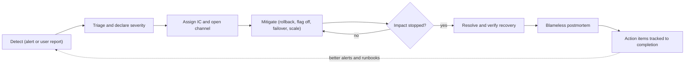

# SLOs, Incidents & Postmortems

> **Reviewed:** 2026-09 · **Level:** Senior / Tech Lead · **Type:** Foundational

---

## Q1. Explain SLI, SLO and SLA.

**Short answer:** An **SLI** (service level indicator) is a measurement of user-visible behaviour, such as the proportion of requests that succeed within 300 ms. An **SLO** (objective) is the internal target for that SLI over a window, like 99.9% over 28 days. An **SLA** (agreement) is an external contract with consequences — usually credits — if a promised level isn't met. SLAs should be looser than SLOs so you get warned before you breach a contract.

**How it works:**

| Term | Owner | Example (illustrative) | If missed |
| --- | --- | --- | --- |
| SLI | Engineering | Good requests ÷ valid requests | — it's just a measurement |
| SLO | Engineering + product | 99.9% of checkout requests succeed in under 500 ms, over 28 days | Error budget policy kicks in |
| SLA | Business / legal | 99.5% monthly availability | Customer credits, contractual penalties |

A good SLI is expressed as a ratio of good events to valid events, measured as close to the user as practical (load balancer or client, not just the server's own view).

**Trade-offs and pitfalls:**

- 100% is the wrong target: it's unachievable and stops all change.
- Too many SLOs dilute focus — start with a few per critical user journey.
- Availability of a dependency limits yours: you can't be more available than the things you hard-depend on without redundancy.

<details>
<summary>Follow-up questions</summary>

- How would you pick SLIs for a batch pipeline? (freshness, correctness, coverage)
- Why measure at the load balancer rather than inside the app?

</details>

**Remember:** SLI measures, SLO targets, SLA promises — and SLA sits below SLO.

---

## Q2. What is an error budget and how do you use an error budget policy?

**Short answer:** The error budget is the allowed unreliability: 100% minus the SLO. A 99.9% SLO over 30 days allows roughly 43 minutes of full unavailability (or the equivalent in failed requests). The budget turns reliability into a shared, data-driven decision: while budget remains, teams ship freely; when it's exhausted, the policy shifts effort to reliability work until it recovers.

**How it works:**

| SLO | Allowed downtime per 30 days (approx.) |
| --- | --- |
| 99% | 7.2 hours |
| 99.9% | 43.2 minutes |
| 99.95% | 21.6 minutes |
| 99.99% | 4.3 minutes |

Example policy (agreed by engineering and product in advance):

- Budget healthy: normal release cadence.
- Budget burning fast: page on-call (burn-rate alert).
- Budget exhausted: freeze non-critical feature releases; prioritise fixes from postmortems; resume when back within SLO.
- A single incident consuming a large share of budget requires a postmortem.

**Trade-offs and pitfalls:** A policy nobody enforces is decoration — get leadership sign-off before the first freeze. Budgets also say "you're too reliable": consistently unused budget can mean you could ship faster or take more risk.

<details>
<summary>Follow-up questions</summary>

- Product wants to launch a feature, but the error budget is exhausted. How do you handle it?
- How does error budget burn rate alerting work?

</details>

**Remember:** The error budget turns "reliability vs features" into an agreed rule instead of an argument.

---

## Q3. How do you set good SLOs for a new service?

**Short answer:** Start from user journeys, not infrastructure. Pick the few interactions that matter (log in, search, checkout), choose SLIs that reflect user success for each (availability, latency, freshness), look at historical performance, and set an initial target slightly below what you achieve today. Review it after a few weeks and adjust.

**Example:** For a food-delivery app: "Place order" availability 99.9%; "Restaurant menu loads under 1 s" for 99% of requests; "Order status updates within 30 s" for 99% of events. (Targets illustrative.)

**Trade-offs and pitfalls:** Setting aspirational SLOs you never meet means constant alerting and a meaningless budget. Setting them too loose makes users unhappy while dashboards stay green — validate against support tickets and user feedback.

**Remember:** SLOs come from user journeys and history, then get tuned.

---

## Q4. What does a healthy on-call setup look like?

**Short answer:** A sustainable rotation (enough people that each person is on call infrequently), a primary and secondary, clear escalation paths, actionable alerts with runbooks, a handover at each shift change, and compensation or time off for out-of-hours work. The team that builds a service should share on-call for it, so they feel the pain of unreliable code.

**How it works:**

- Track pages per shift and out-of-hours pages; treat noisy weeks as a bug.
- Every page gets reviewed: was it actionable? If not, fix or remove the alert.
- New joiners shadow before joining the rotation.
- Follow-the-sun rotations across time zones reduce night pages for distributed teams.

**Trade-offs and pitfalls:** Hero culture (one person always fixes everything) creates burnout and a single point of failure. Rotations that are too small mean too-frequent on-call.

<details>
<summary>Follow-up questions</summary>

- Your team gets paged several times every night. What do you do in your first month as lead?

</details>

**Remember:** On-call should be rare, actionable and shared by the people who own the code.

---

## Q5. What roles exist in incident response?

**Short answer:** In a significant incident, you separate coordination from hands-on fixing. The **Incident Commander** coordinates, makes decisions and keeps the big picture — they don't debug. The **Operations or technical lead** drives the investigation and mitigation. The **Communications lead** updates stakeholders and status pages on a regular cadence. A **Scribe** keeps a timeline. For small incidents one person may hold several roles.

| Role | Responsibility | Anti-pattern it prevents |
| --- | --- | --- |
| Incident Commander | Coordinates, assigns work, decides, escalates | Everyone debugging, nobody deciding |
| Ops / tech lead | Investigates and mitigates | Too many cooks changing prod at once |
| Communications | Internal and external updates | Executives interrupting responders for status |
| Scribe | Timeline of actions and findings | Lost information for the postmortem |
| Subject-matter experts | Pulled in as needed | — |

**Trade-offs and pitfalls:** The most senior person shouldn't automatically be IC — the IC role is a skill. Handoffs must be explicit ("I am now IC").

<details>
<summary>Follow-up questions</summary>

- How do you decide incident severity?
- How often should stakeholders get updates during an incident?

</details>

**Remember:** One person coordinates, others fix, someone communicates, someone writes it down.

---

## Q6. Walk through the lifecycle of an incident.

**Short answer:** Detect, triage and declare, mitigate, resolve, then learn. The critical mindset shift is: **mitigate first, root-cause later**. Rolling back, failing over, or disabling a feature flag restores users quickly; deep investigation happens after impact stops.



**Example severity scale (illustrative):**

| Severity | Definition | Response |
| --- | --- | --- |
| SEV1 | Major user-facing outage or data loss | All hands, IC, exec comms, status page |
| SEV2 | Significant degradation or partial outage | IC, on-call team, stakeholder updates |
| SEV3 | Minor impact, workaround exists | Handled in normal hours |

**Trade-offs and pitfalls:** Declaring late is worse than declaring and downgrading. Changing many things at once during mitigation makes it impossible to know what helped.

**Remember:** Stop the bleeding first; understand it afterwards.

---

## Q7. What makes a good runbook?

**Short answer:** A runbook is a short, practical guide linked directly from an alert: what the alert means, the user impact, how to confirm it, and step-by-step mitigation with exact commands or dashboard links. It is written for a tired engineer at 3 a.m. who didn't build the service.

**Example structure:**

```markdown
# Alert: CheckoutHighErrorRate
Impact: Users cannot complete purchases.
Dashboard: <link to checkout RED dashboard>
Confirm: 5xx rate on /checkout above SLO burn threshold; check recent deploys.
Mitigate:
  1. If a deploy happened in the last hour, roll back (link to pipeline).
  2. If payment provider errors dominate, enable the "fallback-provider" flag.
  3. If DB connections are saturated, scale read replicas (command).
Escalate: #payments-oncall, then payments lead.
```

**Trade-offs and pitfalls:** Stale runbooks are dangerous — review them after each incident. Steps that are always identical should become automation.

**Remember:** Linked from the alert, written for a stranger, turned into automation over time.

---

## Q8. How do you run a blameless postmortem?

**Short answer:** A postmortem documents what happened, the impact, the timeline, contributing factors and concrete action items — without blaming individuals. The premise is that people made reasonable decisions with the information and tools they had, so the fixes target the system: missing guardrails, confusing tooling, poor alerting. Action items need owners and deadlines, or the same incident will repeat.

**How it works — typical sections:**

- Summary and impact (users affected, duration, SLO/budget consumed).
- Timeline (detection, key decisions, mitigation, resolution).
- Contributing factors (usually several; avoid a single "root cause" story).
- What went well, what went poorly, where we got lucky.
- Action items: prevent, detect faster, mitigate faster — each with an owner and due date.

**Trade-offs and pitfalls:**

- "Human error" is never a root cause — ask why the system allowed the error.
- A postmortem with only "be more careful" action items is a failed postmortem.
- Share postmortems widely; other teams learn from them.

<details>
<summary>Follow-up questions</summary>

- How do you keep postmortems blameless when leadership wants someone accountable?
- How do you make sure action items actually get done?

</details>

**Remember:** Blame the system, not the person, and track the fixes to completion.

---

## Q9. How do you approach capacity planning?

**Short answer:** Forecast demand (organic growth plus known events such as launches or seasonal peaks), measure how much load a unit of capacity handles through load testing, and keep enough headroom to absorb spikes and the loss of a zone. Autoscaling handles short-term variation, but you still plan for limits autoscaling can't fix: database capacity, quotas, third-party rate limits, and cold-start times.

**How it works:**

1. Establish per-instance capacity with load tests (for example, max RPS at acceptable p99).
2. Forecast peak demand with a safety margin.
3. Plan for N+1 or zone-loss: if one of three zones fails, can the remaining two carry peak?
4. Check hard limits: DB connections, cloud quotas, partitions, licences, rate limits.
5. Revisit regularly and before big events.

**Trade-offs and pitfalls:** Load tests against unrealistic data or traffic mixes give false confidence. Autoscaling doesn't help if the bottleneck is a single primary database.

**Remember:** Forecast, measure unit capacity, plan headroom for zone loss, and check the hard limits.

---

## Q10. What is chaos engineering?

**Short answer:** Chaos engineering is running controlled experiments that inject failure — killing instances, adding latency, failing a dependency — to verify the system behaves as you expect. You state a hypothesis about steady state, limit the blast radius, run the experiment, and stop immediately if things go badly. It finds weaknesses before real incidents do.

**How it works:** Start in staging with game days, then move to small, well-monitored production experiments. Tools include Chaos Mesh, LitmusChaos, AWS Fault Injection Service, Azure Chaos Studio, and Gremlin.

**Example hypothesis:** "If one of three order-service Pods is killed, p99 latency stays under target and no requests fail, because retries and readiness probes handle it."

**Trade-offs and pitfalls:** Chaos without solid observability and rollback is just causing outages. Get stakeholder agreement and run during staffed hours.

**Remember:** Chaos engineering is hypothesis-driven, blast-radius-limited failure testing.

---

## Q11. Scenario: p99 latency spiked right after a deploy. Walk me through it.

**Short answer:** First, mitigate: if the spike correlates with the deploy and it's hurting users, roll back or turn off the new flag — don't debug while users suffer. Then investigate with the rollback as a controlled experiment: if latency recovers, the change is confirmed as the trigger, and I compare old and new versions using traces, profiles and diffs.

**How it works (spoken walkthrough):**

1. **Confirm and scope:** Which endpoints? All regions or one? All users or a segment? Is it p99 only or median too? Check error rates and saturation alongside latency.
2. **Correlate:** Deploy markers on dashboards — does the spike start exactly at rollout? Did anything else change (config, traffic, a dependency, infra)?
3. **Mitigate:** Roll back or disable the flag. Watch the graph recover. Communicate.
4. **Investigate:**
   - Compare traces before and after: which span got slower — the app, the DB, or an external call?
   - A new N+1 query or a missing index shows as many or slow DB spans.
   - Resource changes: higher CPU → throttling against limits; memory → GC pauses.
   - Connection pool or thread pool saturation shows as time waiting before work starts.
   - Cold caches after deploy: latency recovers over minutes without a rollback.
5. **Fix and verify:** Reproduce in staging with a load test, fix, and re-release behind a canary with latency in the analysis.
6. **Learn:** Postmortem — why didn't the canary catch it? Add latency SLO checks to canary analysis, add a query-count test, etc.

**Trade-offs and pitfalls:** Rolling forward with a guess extends the outage. Averages may look fine while p99 is terrible — always look at the distribution.

<details>
<summary>Follow-up questions</summary>

- The rollback didn't fix latency. What next? (look for non-deploy changes: traffic, dependency, infra, data growth)
- How would you design canary analysis to catch this next time?

</details>

**Remember:** Mitigate, then use the rollback as evidence, then compare traces between versions.

---

## Q12. What goes into a production readiness review?

**Short answer:** A checklist a service must pass before taking real traffic: SLOs defined and alerting on them, dashboards, runbooks, on-call ownership, capacity tested, graceful degradation for dependencies, backups and restore tested, security review, rollback plan, and documentation. As a Tech Lead I make it lightweight enough that teams actually use it.

**Example checklist:**

- Ownership: team, on-call rotation, escalation path.
- Observability: RED metrics, traces, structured logs, SLOs with burn-rate alerts.
- Resilience: timeouts, retries with backoff, circuit breakers, health probes, multi-AZ.
- Delivery: automated pipeline, canary or progressive rollout, tested rollback.
- Data: backups, restore test, migration plan.
- Security: secrets in a manager, least-privilege IAM, dependency scanning.

**Remember:** Readiness reviews turn operational lessons into a repeatable gate.

---

## References

- [Google SRE book](https://sre.google/sre-book/table-of-contents/)
- [Google SRE Workbook](https://sre.google/workbook/table-of-contents/)
- [Principles of Chaos Engineering](https://principlesofchaos.org/)
- [PagerDuty Incident Response documentation](https://response.pagerduty.com/)
- [Atlassian Incident Management handbook](https://www.atlassian.com/incident-management)
