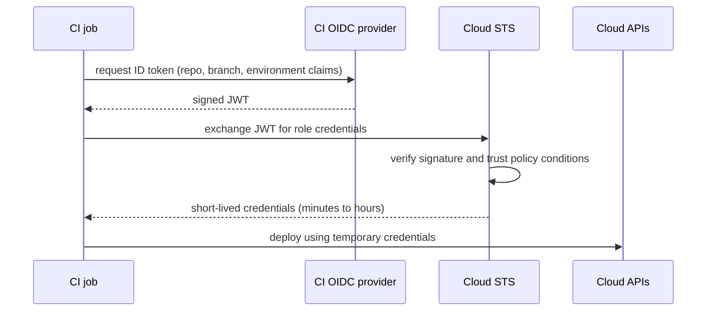

# DevSecOps & Supply Chain

> **Reviewed:** 2026-09 · **Level:** Senior / Tech Lead · **Type:** Foundational (Q7–Q8 touch Emerging practices)

---

## Q1. What does DevSecOps and "shift left" mean in practice?

**Short answer:** DevSecOps means security is part of everyday delivery, owned by the team, rather than a gate at the end. "Shift left" means catching issues as early as possible — in the IDE, pre-commit hooks and PR checks — where they're cheapest to fix. But you also "shield right": runtime protections and monitoring still matter, because not everything can be caught before production.

**How it works — controls by stage:**

| Stage | Controls |
| --- | --- |
| Design | Threat modelling for new features, security requirements |
| Code | Linters, secret detection pre-commit, secure defaults in templates |
| PR / CI | SAST, dependency scanning (SCA), IaC scanning, secret scanning |
| Build | Image scanning, SBOM generation, signing, provenance |
| Deploy | Admission policies (signed images only, no root), least-privilege identities |
| Runtime | WAF, network policies, runtime detection, audit logs, patching |

**Trade-offs and pitfalls:** Turning on every scanner as a blocking check floods teams with false positives, and people learn to ignore them. Start with a few high-signal checks that block, and route the rest into triaged backlogs with clear severity SLAs.

<details>
<summary>Follow-up questions</summary>

- How do you get developers to care about security findings?
- Which security checks would you make blocking on day one?

</details>

**Remember:** Security built into the pipeline and owned by teams, with a small set of high-signal gates.

---

## Q2. How should applications manage secrets?

**Short answer:** Store secrets in a dedicated manager (Vault, AWS Secrets Manager, GCP Secret Manager, Azure Key Vault), fetch them at runtime using the workload's identity, and prefer short-lived or dynamically generated credentials. Never keep secrets in code, images, or plain environment files in Git. Rotation should be automated and routine, not an emergency procedure.

**How it works:**

- **Identity-based access:** the Pod or function authenticates with its cloud identity; no bootstrap secret needed.
- **Dynamic secrets:** Vault-style systems can issue per-service database credentials with a short TTL.
- **Delivery to apps:** SDK calls, a sidecar/agent, the Secrets Store CSI driver (mounted files), or External Secrets Operator (synced into Kubernetes Secrets).
- **Audit:** every read is logged.

**Trade-offs and pitfalls:**

- Secret managers become critical dependencies — cache sensibly and handle outages.
- Environment variables leak through debug endpoints, crash reports and child processes; mounted files with tight permissions are often safer.
- Detection alone isn't enough: when a secret leaks, rotate it immediately.

<details>
<summary>Follow-up questions</summary>

- How do you rotate a database password used by many services without downtime? (dual credentials, overlap window)
- How would you manage secrets in a GitOps repo? (SOPS, Sealed Secrets, or references to an external manager)

</details>

**Remember:** Central manager, identity-based access, short-lived credentials, automated rotation.

---

## Q3. How do you apply least privilege to cloud IAM?

**Short answer:** Give each workload and person only the permissions they need, scoped to specific resources, for as long as they need them. In practice: one role per service (not a shared "app" role), resource-level scoping, no wildcard actions in production, organisation-level guardrails, just-in-time elevated access for humans, and regular reviews using access analysis tools to remove unused permissions.

**Example (AWS IAM policy, scoped to one bucket prefix):**

```json
{
  "Version": "2012-10-17",
  "Statement": [
    {
      "Effect": "Allow",
      "Action": ["s3:GetObject", "s3:PutObject"],
      "Resource": "arn:aws:s3:::acme-uploads/orders/*"
    }
  ]
}
```

**Trade-offs and pitfalls:**

- `"Action": "*"` and `"Resource": "*"` during development tend to survive into production.
- Least privilege done by hand is slow; start from policies generated from observed access (for example access-analysis tools) and tighten.
- Separate accounts/projects per environment are a powerful blast-radius boundary.

<details>
<summary>Follow-up questions</summary>

- How do you give engineers production access for incidents without standing admin rights?
- What are permission boundaries or SCPs used for?

</details>

**Remember:** One identity per workload, scoped to specific resources, reviewed regularly.

---

## Q4. How do you harden a CI/CD pipeline? Why use OIDC instead of long-lived keys?

**Short answer:** CI/CD systems hold the keys to production, so they're a prime target. Harden them by replacing long-lived cloud keys with **OIDC federation** — the pipeline gets a short-lived token scoped to a specific repo, branch or environment — using least-privilege job permissions, pinning third-party actions to commit SHAs, isolating untrusted PR builds from secrets, protecting deployment environments, and keeping audit logs.

**How it works (OIDC):**



The cloud role's trust policy restricts which repository and branch or environment may assume it — for example, only `repo:acme/orders:environment:production`.

**Checklist:**

- `permissions:` minimal by default in every workflow.
- Pin actions by full SHA; review and update them with a bot.
- Don't expose secrets to workflows triggered by forks.
- Separate build and deploy identities; production deploy only from protected branches/environments.
- Ephemeral runners, so one job can't poison the next.
- Require reviews for workflow file changes (CODEOWNERS on `.github/workflows/`).

**Trade-offs and pitfalls:** Loose trust conditions (any branch of any repo in the org) undo the benefit of OIDC. Self-hosted runners on public repos can run attacker code.

<details>
<summary>Follow-up questions</summary>

- What could an attacker do with a compromised third-party action?
- How do you protect against a malicious PR modifying the workflow file?

</details>

**Remember:** Short-lived federated credentials, minimal permissions, pinned dependencies, isolated untrusted code.

---

## Q5. What are Kubernetes NetworkPolicies and why default-deny?

**Short answer:** By default, every Pod can talk to every other Pod in a cluster. NetworkPolicies restrict traffic by label, namespace and port, enforced by the CNI plugin (for example Calico or Cilium — not every CNI supports them). A **default-deny** policy per namespace, then explicit allows, limits how far an attacker can move after compromising one Pod.

**Example:**

```yaml
# 1. Deny all ingress to Pods in the namespace
apiVersion: networking.k8s.io/v1
kind: NetworkPolicy
metadata:
  name: default-deny-ingress
  namespace: team-orders
spec:
  podSelector: {}
  policyTypes: [Ingress]
---
# 2. Allow only the API Pods to reach the orders database on 5432
apiVersion: networking.k8s.io/v1
kind: NetworkPolicy
metadata:
  name: allow-api-to-db
  namespace: team-orders
spec:
  podSelector:
    matchLabels: { app: orders-db }
  ingress:
    - from:
        - podSelector:
            matchLabels: { app: orders-api }
      ports:
        - protocol: TCP
          port: 5432
```

**Trade-offs and pitfalls:** Default-deny egress also blocks DNS unless you allow it explicitly. Roll out in audit or observe mode where your CNI supports it, and verify with real traffic.

<details>
<summary>Follow-up questions</summary>

- How do NetworkPolicies differ from a service mesh's authorization policies? (L3/L4 vs L7 with identity via mTLS)

</details>

**Remember:** Default-deny, then allow the minimum paths.

---

## Q6. How do you handle dependency and image scanning without drowning in findings?

**Short answer:** Scan dependencies (SCA) and container images in CI and continuously in the registry, because new CVEs appear for old images. Then prioritise: severity plus exploitability (is it reachable, is there a known exploit, is it internet-facing), fix via automated update PRs, and set clear SLAs by severity. Base-image hygiene — minimal images, regular rebuilds — removes a large share of findings at once.

**How it works:**

- Tools: Dependabot/Renovate for updates; Trivy, Grype, Snyk, or cloud registry scanners for images; npm/pip audit-style tools.
- Use lockfiles and pin versions so builds are reproducible.
- Prioritise with signals like the CISA Known Exploited Vulnerabilities catalog and EPSS scores, plus reachability analysis where available.
- VEX documents can record "not affected" decisions so they aren't re-triaged every build.

**Trade-offs and pitfalls:** Blocking every build on any "high" CVE with no fix available halts delivery without improving security. Blocking on critical, fixable, reachable issues is more effective.

<details>
<summary>Follow-up questions</summary>

- What is dependency confusion or typosquatting, and how do you defend against it? (scoped registries, private mirrors, allow-lists)

</details>

**Remember:** Scan continuously, prioritise by exploitability, automate the updates.

---

## Q7. What is an SBOM and why does it matter?

**Short answer:** A Software Bill of Materials is a machine-readable inventory of everything inside an artifact: libraries, versions, licences, and their relationships. Standard formats are SPDX and CycloneDX. When a new critical vulnerability is announced, SBOMs let you answer "which of our services include this library?" in minutes instead of days, and many customers and regulators increasingly ask for them.

**Example:**

```bash
# Generate an SBOM for an image and scan it (Syft and Grype are open-source tools)
syft registry.example.com/orders:3f9c2a1 -o cyclonedx-json > sbom.json
grype sbom:sbom.json
```

**Trade-offs and pitfalls:** An SBOM that's generated but never stored or queried adds no value. Store it alongside the image (as an attestation) and index it centrally.

**Remember:** An SBOM is an ingredient list that makes "are we affected?" a query, not a hunt.

---

## Q8. What are artifact signing, provenance and SLSA? (Emerging)

**Short answer:** Signing proves an artifact came from you and wasn't altered. **Sigstore** makes this practical with **keyless signing**: the CI job signs using its OIDC identity, receives a short-lived certificate, and the signature is recorded in a public transparency log. **Provenance** is signed metadata saying how, where and from which source an artifact was built. **SLSA** is a framework of levels describing how trustworthy your build process is. At deploy time, admission policies verify signatures and provenance before anything runs.

**How it works:**

```bash
# Keyless signing in CI (identity comes from the CI OIDC token)
cosign sign registry.example.com/orders@sha256:ab12...

# Verification: require a signature made by our workflow on our repo
cosign verify registry.example.com/orders@sha256:ab12... \
  --certificate-identity-regexp "https://github.com/acme/orders/.*" \
  --certificate-oidc-issuer "https://token.actions.githubusercontent.com"
```

Then enforce in Kubernetes with a policy engine (for example Kyverno or Sigstore's policy-controller): only signed images from your pipeline can be deployed.

**Trade-offs and pitfalls:** Signing without verification at deploy time is theatre. Sign digests, not tags.

<details>
<summary>Follow-up questions</summary>

- What attack does provenance protect against that signing alone doesn't? (a signed artifact built from tampered source or on an untrusted builder)

</details>

**Remember:** Sign in CI, record provenance, verify at admission.

---

## Q9. How does the OWASP Top 10 fit into DevOps work?

**Short answer:** The OWASP Top 10 is a widely used awareness list of the most critical web application security risks, such as broken access control, injection, security misconfiguration, and vulnerable or outdated components. Several items map directly to DevOps responsibilities: misconfiguration (IaC scanning, hardened defaults), vulnerable components (dependency scanning), and logging and monitoring failures (observability and alerting).

**How it works:** Use it as a shared vocabulary for threat modelling and training, and map each relevant category to a control in your pipeline or platform. OWASP also publishes cheat sheets and a Top 10 for CI/CD security risks.

**Remember:** OWASP Top 10 is a vocabulary; your pipeline and platform turn it into controls.

---

## Q10. How do you enforce security policies across many teams?

**Short answer:** Encode policies as code and enforce them automatically at the right points: IaC scanning in PRs, admission control in Kubernetes (Pod Security admission, Kyverno, OPA Gatekeeper), organisation-level cloud guardrails, and secure-by-default templates. Pair enforcement with clear exception processes and good error messages, so teams know how to comply.

**Example policies:** images must come from the internal registry and be signed; containers must run as non-root; no public storage buckets; every resource tagged with an owner; production deploys only from the main branch.

**Trade-offs and pitfalls:** Roll out new policies in audit/warn mode first, measure violations, help teams fix them, then enforce. Surprise enforcement breaks deployments and erodes trust in the platform team.

**Remember:** Policy as code, audit before enforce, secure defaults make compliance the easy path.

---

## References

- [OWASP Top 10](https://owasp.org/www-project-top-ten/)
- [OWASP Top 10 CI/CD Security Risks](https://owasp.org/www-project-top-10-ci-cd-security-risks/)
- [SLSA](https://slsa.dev/)
- [Sigstore documentation](https://docs.sigstore.dev/)
- [CycloneDX](https://cyclonedx.org/)
- [SPDX](https://spdx.dev/)
- [Kubernetes Network Policies](https://kubernetes.io/docs/concepts/services-networking/network-policies/)
- [GitHub Docs: OpenID Connect in GitHub Actions](https://docs.github.com/en/actions/security-for-github-actions/security-hardening-your-deployments/about-security-hardening-with-openid-connect)
