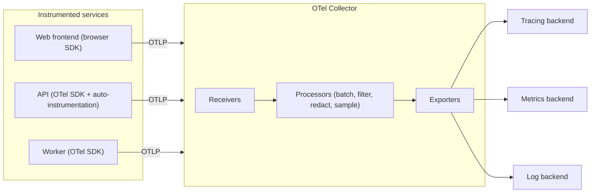

# Observability & OpenTelemetry

> **Reviewed:** 2026-09 · **Level:** Senior / Tech Lead · **Type:** Foundational

Vendor-specific questions (CloudWatch, New Relic) are in [CloudWatch and New Relic](./01-cloudwatch-and-new-relic.md). This page is vendor-neutral.

---

## Q1. Logs vs metrics vs traces — what is each for?

**Short answer:** **Metrics** are cheap numeric time series — great for dashboards and alerts ("error rate is 3%"). **Logs** are detailed, timestamped event records — great for understanding *what happened* in a specific case. **Traces** follow a single request across services as a tree of spans — great for finding *where* time or errors come from in a distributed system. You alert on metrics, navigate with traces, and confirm details with logs.

| Signal | Shape | Cost profile | Best question it answers |
| --- | --- | --- | --- |
| Metrics | Aggregated numbers over time | Cheap per data point; cost grows with cardinality | Is something wrong, and how bad? |
| Traces | Request-scoped spans with timing and attributes | Medium; usually sampled | Where in the call chain is the problem? |
| Logs | Discrete events with context | Can be very expensive at volume | What exactly happened for this request? |
| Profiles (emerging 4th signal) | CPU/memory by code path | Medium | Which function is burning CPU or memory? |

**How it works:** The signals become powerful when they are **correlated**: a metric spike links to exemplar traces, and each span links to logs carrying the same `trace_id`.

**Trade-offs and pitfalls:** Logging everything at debug level in production is expensive and noisy. Use structured (JSON) logs with consistent fields, and sample traces intelligently.

<details>
<summary>Follow-up questions</summary>

- What is the difference between monitoring and observability?
- How do you correlate a log line with a trace?

</details>

**Remember:** Metrics tell you *that*, traces tell you *where*, logs tell you *why*.

---

## Q2. Explain the four golden signals, RED and USE.

**Short answer:** They are checklists for what to measure. The **four golden signals** (from the Google SRE book) are latency, traffic, errors and saturation. **RED** — rate, errors, duration — is a simplified version for request-driven services. **USE** — utilisation, saturation, errors — is for resources like CPUs, disks, connection pools and queues.

| Framework | Apply to | Signals |
| --- | --- | --- |
| Golden signals | User-facing services | Latency, traffic, errors, saturation |
| RED | Every service / endpoint | Rate, errors, duration |
| USE | Every resource | Utilisation, saturation, errors |

**Example:** For an orders API: RED per endpoint (requests/sec, 5xx rate, p50/p95/p99 latency). For its Postgres: USE on CPU, connections in use vs max, lock waits, replication lag, disk I/O queue.

**Trade-offs and pitfalls:** Averages hide pain — use percentiles or histograms for latency. Measure latency of successful and failed requests separately, since fast errors can make latency look better.

<details>
<summary>Follow-up questions</summary>

- Why is p99 latency more important than average latency?
- What does saturation look like for a Node.js service? (event loop lag, queue depth)

</details>

**Remember:** RED for services, USE for resources, golden signals for the user's view.

---

## Q3. What is OpenTelemetry and how is it structured?

**Short answer:** OpenTelemetry (OTel) is a CNCF project that provides vendor-neutral APIs, SDKs, a wire protocol (OTLP) and a Collector for generating and exporting traces, metrics and logs. You instrument once with OTel and can send data to any backend that accepts OTLP — Jaeger, Prometheus-compatible systems, Grafana, Datadog, New Relic, Honeycomb, cloud-native tools and others.

**How it works:**



- **API:** what your code calls to create spans and metrics; stable and vendor-neutral.
- **SDK:** the implementation — sampling, resource attributes (`service.name`, version, environment), exporters.
- **Auto-instrumentation:** libraries/agents that instrument HTTP servers, clients, DB drivers automatically.
- **Collector:** a separate process (agent per node and/or gateway) that receives, processes and exports telemetry. It decouples apps from vendors and centralises redaction, sampling and routing.
- **Semantic conventions:** standard attribute names (`http.request.method`, `db.system`) so dashboards work across services.

**Example (Node.js, minimal):**

```js
// tracing.js — load before the app, e.g. node --require ./tracing.js server.js
const { NodeSDK } = require('@opentelemetry/sdk-node');
const { getNodeAutoInstrumentations } = require('@opentelemetry/auto-instrumentations-node');
const { OTLPTraceExporter } = require('@opentelemetry/exporter-trace-otlp-http');

const sdk = new NodeSDK({
  serviceName: 'orders-api',
  traceExporter: new OTLPTraceExporter({ url: 'http://otel-collector:4318/v1/traces' }),
  instrumentations: [getNodeAutoInstrumentations()],   // http, express, pg, redis...
});
sdk.start();
```

**Trade-offs and pitfalls:** Signal maturity varies by language — check the status of each SDK. A Collector adds a component to operate, but it's usually worth it for control over cost and data.

<details>
<summary>Follow-up questions</summary>

- Why run a Collector instead of exporting directly to a vendor?
- Head-based vs tail-based sampling — what's the difference?

</details>

**Remember:** Instrument once with OTel, route anywhere through the Collector.

---

## Q4. How does context propagation work in distributed tracing?

**Short answer:** Each request carries a trace ID and the current span ID across process boundaries — usually in the W3C `traceparent` HTTP header, or in message headers for queues. Each service extracts the context, creates child spans, and injects the context into outgoing calls. Without propagation you get disconnected fragments instead of one end-to-end trace.

**How it works:**

```text
traceparent: 00-4bf92f3577b34da6a3ce929d0e0e4736-00f067aa0ba902b7-01
             |  |                                |                |
          version  trace-id (whole request)   parent span-id   flags (sampled)
```

- HTTP and gRPC: auto-instrumentation injects and extracts headers for you.
- Message queues: put context into message attributes/headers; consumers start a span linked to the producer's.
- Async work in the same process: the SDK uses context managers (for example AsyncLocalStorage in Node) — custom thread pools or callbacks can lose context.
- **Baggage** carries small key-value pairs (for example tenant ID) alongside the trace; don't put sensitive data in it — it travels to downstream services.

**Trade-offs and pitfalls:** A proxy, gateway or legacy service that drops unknown headers breaks traces. Mixing propagation formats (W3C vs vendor-specific B3 headers) needs configuration.

<details>
<summary>Follow-up questions</summary>

- How would you trace a request that goes through Kafka?
- Why are my traces broken at the API gateway?

</details>

**Remember:** Traces only connect if every hop propagates `traceparent`.

---

## Q5. Why alert on symptoms, not causes?

**Short answer:** Users feel symptoms — errors, slowness, unavailability — not high CPU. Alerting on causes ("CPU above 80%") creates noisy pages that often don't matter, and misses failures that have no obvious cause metric. I page on SLO-based symptom alerts, like error-budget burn rate, and send cause-based signals to dashboards or low-urgency tickets for investigation.

**How it works:**

- **Page** (wake someone up): user-visible impact, urgent, actionable. For example, "checkout error budget burning fast".
- **Ticket** (fix during work hours): disk will be full in several days, certificate expires in two weeks.
- **Dashboard only:** CPU, GC pauses, pod restarts — context during investigation.
- **Burn-rate alerts:** alert when you're consuming error budget much faster than sustainable, using a short and a long window together to reduce noise (described in the Google SRE Workbook).

**Trade-offs and pitfalls:** Every page should have a runbook link and a clear owner. If an alert fires and nobody acts, delete or downgrade it. Alert fatigue is a reliability risk.

<details>
<summary>Follow-up questions</summary>

- How do you reduce alert fatigue on a team?
- What is a multi-window, multi-burn-rate alert?

</details>

**Remember:** Page on user pain; investigate causes with dashboards.

---

## Q6. What is cardinality and why does it blow up metrics systems?

**Short answer:** Cardinality is the number of unique time series, which is the product of all unique label-value combinations on a metric. Adding a label like `user_id`, `request_id` or a full URL path can create millions of series, making the metrics backend slow and expensive. High-cardinality detail belongs in traces and logs, not in metric labels.

**Example:**

```text
http_requests_total{method, route, status}
  method: 5 values × route: 50 templates × status: 10 codes = 2,500 series (fine)

http_requests_total{method, path, status, user_id}
  path: raw URLs with IDs (/orders/9f2c...) × user_id: every user = effectively unbounded (bad)
```

**Trade-offs and pitfalls:**

- Use route templates (`/orders/:id`), not raw paths.
- Bucket values (status class `5xx`, customer tier) instead of raw IDs.
- Kubernetes adds labels (pod name) that churn with every deploy — watch series churn.
- Some backends are designed for high-cardinality events (tracing/event stores); choose tools accordingly.

<details>
<summary>Follow-up questions</summary>

- How would you find which metric is causing a cardinality explosion?
- How do you debug per-customer issues without per-customer metric labels? (traces/logs with customer attribute)

</details>

**Remember:** Low-cardinality labels on metrics; high-cardinality detail on traces and logs.

---

## Q7. How do you connect frontend RUM with backend APM?

**Short answer:** Real User Monitoring (RUM) measures what users actually experience in the browser or app — page loads, Core Web Vitals, JS errors, slow interactions. APM measures backend services. You bridge them by propagating trace context from the frontend into API calls, so a slow page view links to the exact backend trace that made it slow.

**How it works:**

- The browser RUM or OTel web SDK starts a span for a page load or user interaction.
- It injects `traceparent` into `fetch`/XHR calls to your own APIs (configure allowed origins; CORS must allow the header).
- The backend continues the same trace, so one view shows: click → API call → database query.
- Tag everything with release version so you can compare before and after a deploy.
- Mobile apps work the same way with mobile SDKs.

**Trade-offs and pitfalls:**

- Don't send trace headers to third-party domains (privacy, CORS failures).
- Respect privacy: mask PII in session replays and URLs; follow consent requirements.
- Browser telemetry volume is huge — sample sessions.

<details>
<summary>Follow-up questions</summary>

- Users complain the app is slow, but backend latency looks fine. How do you investigate?
- Which Core Web Vitals would you alert on, if any?

</details>

**Remember:** Propagate trace context from the browser to see the user's experience end to end.

---

## Q8. What makes good structured logging?

**Short answer:** Logs should be machine-parseable (JSON), have consistent field names, include correlation IDs (`trace_id`, `span_id`, request ID), carry the right level, and never contain secrets or unnecessary PII. Log events and decisions, not every line of execution.

**Example:**

```json
{
  "timestamp": "2026-09-28T08:15:02.123Z",
  "level": "error",
  "service": "orders-api",
  "version": "3f9c2a1",
  "trace_id": "4bf92f3577b34da6a3ce929d0e0e4736",
  "message": "payment authorization failed",
  "order_id": "ord_123",
  "provider": "stripe",
  "error_code": "card_declined",
  "duration_ms": 412
}
```

**Trade-offs and pitfalls:** Log volume drives cost — drop or sample noisy info logs at the Collector, set retention per level, and move old logs to cheaper storage.

<details>
<summary>Follow-up questions</summary>

- How do you prevent PII from ending up in logs? (redaction at logger and Collector)

</details>

**Remember:** Structured, correlated, leveled, and scrubbed.

---

## Q9. How do you control observability cost?

**Short answer:** Decide what questions you need to answer, then keep the minimum data to answer them. Sample traces (keep all errors and slow requests with tail sampling), drop noisy logs, avoid high-cardinality metric labels, tier retention, and route data through a Collector so these decisions are centralised.

**Trade-offs and pitfalls:** Over-sampling away data means you can't debug rare issues. Tail-based sampling needs all spans of a trace to reach the same Collector instance, which adds architecture complexity.

**Remember:** Observability spend should follow the questions you actually ask.

---

## Q10. How do you roll out observability across many teams?

**Short answer:** Make the right thing the default: a shared instrumentation library or platform config that sets up OTel, standard resource attributes and log format; standard dashboards per service type (RED + USE); SLO templates; and runbook conventions. Then review observability as part of the production-readiness checklist.

**Example:** A new service created from the golden-path template automatically emits traces, RED metrics and structured logs, and gets a dashboard and SLO alerts without extra work (see [Platform Engineering & GitOps](../platform-engineering/01-platform-engineering-and-gitops.md)).

**Remember:** Standardise instrumentation through defaults, not documentation.

---

## References

- [OpenTelemetry documentation](https://opentelemetry.io/docs/)
- [W3C Trace Context](https://www.w3.org/TR/trace-context/)
- [Google SRE book: Monitoring Distributed Systems](https://sre.google/sre-book/monitoring-distributed-systems/)
- [Google SRE Workbook: Alerting on SLOs](https://sre.google/workbook/alerting-on-slos/)
- [Prometheus documentation](https://prometheus.io/docs/introduction/overview/)
- [web.dev: Web Vitals](https://web.dev/articles/vitals)
