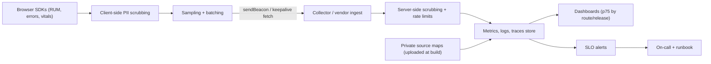

# 📊 Logging & Monitoring
> **Reviewed:** 2026-09 · Modernized; legacy topics are labeled.

---

## 1. 💡 Telemetry

Telemetry is the automatic collection of metrics, logs, and traces from your application so you can understand how it behaves in real usage. For frontend systems, it's your eyes and ears in production. Proper telemetry implementation helps you understand user behavior, identify issues quickly, and make data-driven decisions about your application.

### 🔹 End-to-End Pipeline (Numbered Stages)

1. **Instrument** – SDKs in the browser capture errors, Web Vitals, route changes, API timings, and custom events.
2. **Enrich** – attach release version, route, device class, connection type, feature flags, and an anonymous session ID.
3. **Scrub** – remove PII (emails, tokens, query strings, form values) *before* data leaves the device.
4. **Sample + batch** – decide what to keep and send in batches via `navigator.sendBeacon` / `fetch(..., { keepalive: true })`, typically on `visibilitychange` → hidden.
5. **Ingest** – a collector (vendor endpoint or your own OpenTelemetry Collector) validates, rate-limits, and applies server-side scrubbing.
6. **Store + analyze** – dashboards by route/release/device, percentiles (p75 for Web Vitals), error grouping.
7. **Alert + act** – SLO-based alerts route to owners with runbooks; fixes are verified with the same data.



### 🔹 What to Collect

### 🔹 Metrics

* **Core Web Vitals**: **LCP** (loading), **INP** (responsiveness), **CLS** (visual stability). Report the **75th percentile** of real-user data, split by mobile/desktop.

  > **Legacy note (2026):** **FID (First Input Delay)** was replaced by **INP (Interaction to Next Paint)** as a Core Web Vital in **March 2024**. FID only measured the *input delay* of the *first* interaction; INP measures the full latency (input delay + processing + presentation) across interactions on the page. Don't build new dashboards on FID.

  | Metric | Good | Needs improvement | Poor |
  |---|---|---|---|
  | LCP | ≤ 2.5 s | ≤ 4.0 s | > 4.0 s |
  | INP | ≤ 200 ms | ≤ 500 ms | > 500 ms |
  | CLS | ≤ 0.1 | ≤ 0.25 | > 0.25 |

* Supporting metrics: TTFB, FCP, long tasks / Long Animation Frames (LoAF, Chromium) for attributing slow interactions

* Error rates (per session, per route, per release)

* API latency and failure rates

### 🔹 Events

* User actions (clicks on key CTAs, form submissions)

* Page views / route changes (SPAs need explicit route-change events — there's no new page load)

* Feature usage (which components/flows are actually used)

📌 **In simple terms**: Telemetry is “numbers and events from real users that tell you how the app is doing.”

---

### 🔹 💡 RUM vs Synthetic Monitoring

* **RUM (Real User Monitoring)** – data from actual users' devices and networks. Truth for Core Web Vitals and what Google's CrUX dataset reflects. Noisy; needs large samples.
* **Synthetic / lab** – Lighthouse, WebPageTest, Playwright checks from fixed locations. Reproducible and great for CI regression gates and uptime checks, but not representative of real devices.
* Use both: synthetic to **prevent** regressions pre-merge, RUM to **detect** real-world ones.

```javascript
import { onLCP, onINP, onCLS } from 'web-vitals/attribution';

function send(metric) {
  const body = JSON.stringify({
    name: metric.name,
    value: metric.value,
    rating: metric.rating,
    route: location.pathname,
    release: __RELEASE__,
    target: metric.attribution?.interactionTarget ?? metric.attribution?.target,
  });
  navigator.sendBeacon('/rum', body) || fetch('/rum', { method: 'POST', body, keepalive: true });
}

onLCP(send);
onINP(send);
onCLS(send);
```

---

### 🔹 💡 Frontend implementation

* Use a telemetry SDK (Sentry, Datadog RUM, New Relic, Grafana Faro, OpenTelemetry, or custom)

* Standardize an event schema:
  * `event_name`, `user_id` (anonymized/pseudonymous), `session_id`, `page`, `release`, `tags`

* Batch and throttle events to reduce network overhead; flush on `visibilitychange` (not `unload`/`beforeunload`, which are unreliable and hurt bfcache)

* Record `release` on every event so you can compare versions and match source maps

---

## 2. 🐛 Error Tracking and Source Maps

### 🔹 Capturing Errors

* Global handlers: `window.addEventListener('error')` and `unhandledrejection`
* React **error boundaries** for render errors (plus framework hooks such as Next.js `error.tsx`/`global-error.tsx`)
* Wrap `fetch` to record failed API calls with status, route, and duration (never the body)
* Add **breadcrumbs** (recent clicks, navigations, console warnings) for context
* Cross-origin scripts show as `"Script error."` unless served with CORS headers and `crossorigin="anonymous"`

### 🔹 Source Maps (Numbered Stages)

1. Build emits minified bundles + `.map` files, tagged with a release ID (e.g. git SHA).
2. CI **uploads** source maps to the error tracker for that release.
3. Source maps are **not publicly served** (delete them from the deploy artifact or block them) so you don't leak source code.
4. The error tracker **symbolicates** minified stack traces back to original files/lines.
5. Errors are **grouped** by fingerprint and linked to the release that introduced them.

📌 **In simple terms**: Upload source maps privately per release so production stack traces are readable without exposing your code.

---

## 3. 🔭 OpenTelemetry in the Browser

OpenTelemetry (OTel) is the vendor-neutral CNCF standard for traces, metrics, and logs.

* **Backend OTel** is mature and widely adopted.
* **Browser OTel (JavaScript web SDK)** works for tracing — document load, `fetch`/XHR instrumentation, and propagating `traceparent` (W3C Trace Context) headers so a frontend span links to backend spans.
* **Maturity caveat:** browser support is less mature than on the server — client-side RUM semantic conventions, metrics, and logs are still evolving, and several web instrumentations are marked experimental. Many teams use a RUM vendor SDK for Web Vitals/session replay and OTel for distributed tracing, or a vendor SDK that emits OTel-compatible data.
* Send browser telemetry to an **OTel Collector** you control (CORS, auth, rate limiting, scrubbing) rather than directly to a backend.
* Only propagate `traceparent` to **your own origins** (configure allowed URLs) to avoid leaking headers to third parties and triggering CORS preflights.

---

## 4. 🎯 Sampling and Cost Control

* **Head sampling** – decide at session start (e.g. keep 10% of sessions); simple and consistent per session.
* **Tail sampling** – decide after the fact (keep all errored or slow traces); done in a collector, not the browser.
* **Always keep** errors from new releases; sample high-volume, low-value events heavily.
* Sample **consistently per session** so you can reconstruct full journeys.
* Remember sampled rates when computing counts (multiply by 1/rate).
* Session replay is expensive and privacy-sensitive — sample it low and mask by default.

---

## 5. 🔒 Privacy and PII Scrubbing

* **Never log** passwords, tokens, full card numbers, auth headers, or raw form values.
* Strip or hash **query strings and path IDs** (`/users/123` → `/users/:id`) before sending.
* Use **allowlists** for attributes rather than trying to blocklist everything.
* Session replay tools should **mask all text and inputs by default**.
* Respect **consent** (GDPR/ePrivacy, CCPA): don't initialize non-essential analytics until consent is given; honour opt-outs.
* Scrub on the **client and again on the server**; set **retention limits**.
* Pseudonymous user IDs, not emails.

📌 **In simple terms**: Collect the minimum you need, scrub it twice, and keep it only as long as necessary.

---

### 🔹 💡 Alerting

Alerting turns telemetry signals into notifications for humans when something goes wrong or drifts from expected behavior. Good alerts are rare, actionable, and clearly owned.

### 🔹 What to Alert On

* Error rate spikes (JS errors, failed API calls) — especially new error groups in the latest release

* Performance regressions (p75 LCP/INP above target, timeouts)

* Availability issues (uptime/synthetic checks failing)

📌 **In simple terms**: Alerts are “wake-up calls” based on telemetry when users are having a bad experience.

---

### 🔹 💡 Designing good alerts

* Tie each alert to:
  * **Owner** (team/on-call)
  * **Channel** (Slack, PagerDuty, email)
  * **Runbook** (what to check, how to mitigate)

* Avoid alert fatigue:
  * Use thresholds and time windows
  * Deduplicate and group similar alerts
  * Alert on **SLO burn rate** (e.g. "crash-free sessions below target, burning error budget fast") rather than on every individual error
  * Page only for user-facing impact; send everything else to a ticket/Slack

---

## ⭐ Summary — 10-second Interview Version

> "Alerting watches metrics like error rate and performance and notifies the right team when thresholds are breached. Good alerts are owned, rare, SLO-based, and come with a clear runbook."

---

## ⭐ Extra Points (If Interviewer Asks More)

### Example alert you’d set for frontend?

An alert when JS error rate or failed API calls exceed a threshold for more than 5 minutes on a key route, or when p75 INP on the checkout route regresses past 200 ms after a release.

### Why use `sendBeacon` for telemetry?

It queues a small POST that the browser delivers even if the page is being closed, without blocking navigation. Flush on `visibilitychange` to `hidden`, which fires reliably on mobile where `unload` often doesn't.

---

### 🔹 ⚡ Fixing Performance and Error Issues

Fixing issues is about turning telemetry and alerts into concrete improvements. It requires a repeatable workflow from detection to verification.

---

### 🔹 🐛 Debugging workflow

### 🔹 For errors

1. Inspect error logs and symbolicated stack traces (Sentry or similar) plus breadcrumbs

2. Reproduce locally using same route, device, or feature flag

3. Fix root cause (null checks, correct API usage, race conditions)

4. Add or improve tests to prevent regressions

### 🔹 For performance issues

1. Identify slow pages/routes via Web Vitals (use attribution data to find the slow element or interaction)

2. Use DevTools Performance panel/Lighthouse to find heavy components, long tasks, or requests

3. Apply optimizations (code splitting, yielding long tasks, memoization, caching)

4. Re-measure and compare before/after at p75 in RUM

📌 **In simple terms**: Use telemetry to find where users hurt the most, then reproduce, fix, and verify with new data.

### 🔹 Closing the Loop

* Link issues to alerts and dashboards

* Document fixes and patterns so the team learns

* Tune alert thresholds if needed

---

## ⭐ Summary — 10-second Interview Version

> "Logging and monitoring includes telemetry (RUM metrics like p75 LCP/INP/CLS, errors, and events), error tracking with privately uploaded source maps, tracing with OpenTelemetry where it fits, sampling and PII scrubbing to control cost and privacy, SLO-based alerting, and a debugging workflow from detection to verification. INP replaced FID in 2024."

---

## References

* [web.dev — Web Vitals](https://web.dev/articles/vitals)
* [web.dev — Interaction to Next Paint (INP)](https://web.dev/articles/inp)
* [GoogleChrome/web-vitals library](https://github.com/GoogleChrome/web-vitals)
* [OpenTelemetry — JavaScript (browser)](https://opentelemetry.io/docs/languages/js/getting-started/browser/)
* [MDN — Navigator.sendBeacon()](https://developer.mozilla.org/en-US/docs/Web/API/Navigator/sendBeacon)
* [W3C Trace Context](https://www.w3.org/TR/trace-context/)
