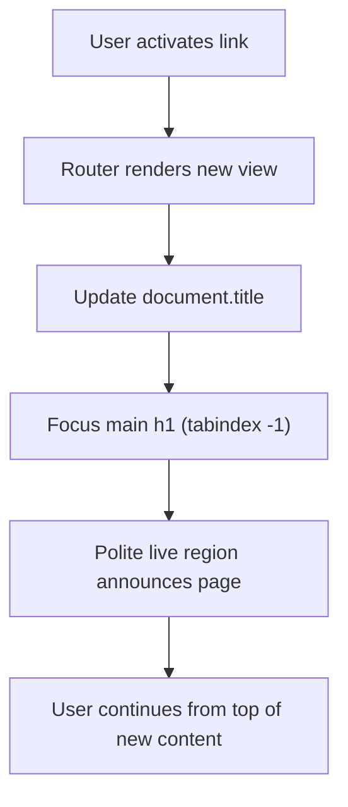
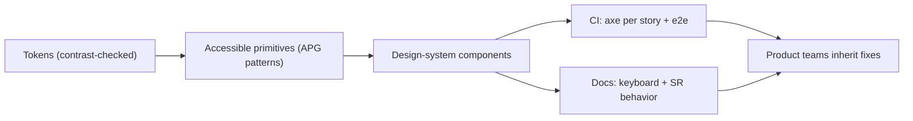

# ♿ Accessibility
> **Reviewed:** 2026-09 · Modernized; legacy topics are labeled.

---

## 0. 📏 The Target: WCAG 2.2 AA

Most teams (and most regulations/procurement requirements) target **WCAG 2.2 Level AA**. WCAG 2.2 became a W3C Recommendation in October 2023 and is backwards compatible with 2.1 (except that **4.1.1 Parsing** was removed as obsolete).

### 🔹 What WCAG 2.2 Added (AA-relevant highlights)

* **2.4.11 Focus Not Obscured (Minimum)** – a focused element must not be completely hidden by sticky headers, cookie banners, or chat widgets.
* **2.5.7 Dragging Movements** – anything done by dragging must have a single-pointer alternative (e.g. buttons to reorder).
* **2.5.8 Target Size (Minimum)** – pointer targets at least **24×24 CSS px** (or enough spacing).
* **3.2.6 Consistent Help** (A) – help links/contact placed consistently across pages.
* **3.3.7 Redundant Entry** (A) – don't make users re-type info they already entered in the same flow.
* **3.3.8 Accessible Authentication (Minimum)** – no cognitive tests (like remembering/transcribing) to log in; allow paste and password managers.

> **Legacy note (2026):** Older answers cite WCAG 2.0/2.1. Those are still valid baselines, but in 2026 say "WCAG 2.2 AA". WCAG 3 is a working draft — not a compliance target yet.

📌 **In simple terms**: Aim for WCAG 2.2 AA — perceivable, operable, understandable, robust — and know the new 2.2 criteria about focus visibility, target size, dragging, and authentication.

---

## 1. ♿ Keyboard Accessibility

Keyboard accessibility ensures that all interactive elements and flows can be used without a mouse, using only the keyboard (Tab, Shift+Tab, Enter, Space, Arrow keys). It's critical for many users with motor or visual impairments. Building keyboard-accessible interfaces is not just about compliance - it's about creating inclusive experiences that work for everyone.

### 🔹 Requirements

### 🔹 Focusable elements

* Use semantic elements: `button`, `a`, `input`, `select`, `textarea`

* Avoid `div`/`span` with click handlers unless you add:
  * `tabindex="0"` and
  * `role` + keyboard handlers (Enter **and** Space for buttons)

  In practice, just use `<button>` — you get focus, keyboard activation, and the role for free.

### 🔹 Logical tab order

* DOM order should match visual order (watch out for CSS `order`, grid placement, and `flex-direction: row-reverse`)

* Avoid positive `tabindex` values; prefer natural flow. Use `tabindex="-1"` only for elements you focus programmatically.

* Composite widgets (tabs, menus, listboxes, grids) use **roving tabindex** or `aria-activedescendant`: one Tab stop, Arrow keys inside — per the WAI-ARIA Authoring Practices Guide (APG).

📌 **In simple terms**: Users should be able to reach and operate everything using Tab and Enter.

### 🔹 Implementation Tips

* Ensure visible **focus outlines** (never remove them without replacement); use `:focus-visible` so mouse clicks don't show rings but keyboard focus does

* Provide **skip links** to jump over navigation

* Trap focus inside modals and restore on close (native `<dialog>` with `showModal()` handles this)

* Make sure sticky headers don't cover focused elements (WCAG 2.4.11) — `scroll-padding-top` helps

```css
:focus-visible {
  outline: 3px solid Highlight;
  outline-offset: 2px;
}
html { scroll-padding-top: 5rem; } /* height of sticky header */
```

---

## ⭐ Summary — 10-second Interview Version

> "Keyboard accessibility means every interactive element works with Tab and Enter in a logical order, with clear focus indicators that aren't hidden. I use semantic elements, manage focus correctly, use roving tabindex for composite widgets, and never rely only on mouse interactions."

---

## ⭐ Extra Points (If Interviewer Asks More)

### How do you test keyboard accessibility quickly?

Try using the site with only a keyboard—Tab, Shift+Tab, Enter, Space, Escape, and Arrow keys—until you complete main flows. Watch for: invisible focus, focus jumping to the top after actions, traps you can't escape, and hover-only content.

---

### 🔹 💡 Screen Reader Support

Screen readers read out the content and structure of the page to users who can’t see the screen. Good screen reader support relies on semantic HTML, meaningful labels, and ARIA only when needed.

---

### 🔹 💡 Semantic structure

* Proper heading hierarchy (`h1` → `h2` → `h3`…) — screen reader users navigate by headings

* Landmarks:
  * `header`, `nav`, `main`, `footer`, `aside` (label multiple `nav`s with `aria-label`)

* Lists (`ul`, `ol`) and tables with headers (`<th scope>`, `<caption>`)

📌 **In simple terms**: Semantic HTML gives screen readers a map of the page.

### 🔹 Labels and ARIA

* Use `<label for>` or `aria-label` / `aria-labelledby` for inputs

* Use ARIA roles and attributes only when semantics aren’t available — the first rule of ARIA is "don't use ARIA if a native element does the job". Incorrect ARIA is worse than none.

* Keep ARIA in sync with actual behavior (e.g., `aria-expanded`, `aria-selected`, `aria-current="page"`)

* Announce dynamic updates with **live regions** (`role="status"` / `aria-live="polite"` for toasts and "3 results found"; `role="alert"` sparingly for errors). The live region must exist in the DOM *before* content is inserted.

* Icon-only buttons need an accessible name (`aria-label` or visually hidden text); decorative icons get `aria-hidden="true"`.

---

### 🔹 💡 Focus Management

Focus management is about controlling which element is focused at any time, especially during dynamic UI changes like modals, drawers, and navigation.

### 🔹 Key Patterns

* **Initial focus** – when opening a modal, focus the first meaningful element (or the dialog heading)

* **Focus trap** – keep Tab focus inside the modal until it’s closed; make the background `inert`

* **Focus restoration** – return focus to the triggering element on close

📌 **In simple terms**: Focus should always “follow the user’s attention” and never get lost.

### 🔹 Focus Management in SPAs (Numbered Stages)

Client-side route changes don't trigger a page load, so screen readers may announce nothing and focus stays on the clicked link (or is lost if it unmounts).

1. **Route changes** – after navigation, move focus to the new page's `<h1>` (with `tabindex="-1"`) or to a main wrapper.
2. **Announce** – update `document.title` and/or announce "Navigated to Orders" via a polite live region. (Next.js App Router includes a built-in route announcer; React Router and others may need your own.)
3. **Deleting items** – when the focused element is removed, move focus to a sensible neighbour (next item, or list heading).
4. **Async content** – on loading → loaded, announce results with `role="status"` instead of stealing focus.
5. **Overlays** – prefer native `<dialog>.showModal()` (focus containment, Escape, top layer, `::backdrop`) and the `inert` attribute over hand-rolled traps.

```javascript
// after a client-side navigation
const heading = document.querySelector('main h1');
heading?.setAttribute('tabindex', '-1');
heading?.focus();
```



---

### 🔹 💡 Implementation tips

* Use native `<dialog>` and `inert` first; libraries (e.g., `focus-trap`, React Aria, Radix) or UI frameworks with built-in support for complex widgets

* Avoid programmatically focusing elements too often; only when context changes

---

### 🔹 💡 Color Contrast

Color contrast ensures text and important UI elements are readable for users with low vision or color vision deficiencies.

### 🔹 WCAG Contrast Ratios

* Normal text: **4.5:1** (AA)

* Large text (≥18pt / 24px regular or 14pt / ~18.66px bold): **3:1** (AA)

* UI components, focus indicators, and meaningful graphics: **3:1** (1.4.11 Non-text Contrast)

📌 **In simple terms**: Foreground and background colors must be different enough to read easily.

### 🔹 Practical Steps

* Use contrast checkers (axe, WebAIM, browser DevTools)

* Avoid relying on color alone to convey meaning (add icons, text)

* Test themes (light/dark, `forced-colors: active` / Windows High Contrast) against different backgrounds

* Respect user preferences: `prefers-reduced-motion`, `prefers-contrast`, and text zoom to 200% / reflow at 320 CSS px width

---

### 🔹 ♿ Accessibility Tools

Accessibility tools help you automatically catch many issues and manually explore others. These tools are essential for integrating accessibility into your workflow.

### 🔹 Automated Tools

* **axe DevTools** / **axe-core**, **Lighthouse**, **WAVE**

* Browser devtools accessibility panels (accessibility tree, computed name/role)

* Linting: `eslint-plugin-jsx-a11y`

* CI integrations to fail builds on critical issues

> **Important caveat:** automated tools catch only a portion of WCAG issues (things like missing names, contrast, invalid ARIA). They can't judge whether alt text is meaningful, focus order makes sense, or a flow is usable with a screen reader. Automated checks are a floor, not a certificate.

📌 **In simple terms**: Automated tools act as linting and testing for accessibility basics.

### 🔹 Automated axe Checks in CI

1. **Lint** JSX with `eslint-plugin-jsx-a11y`.
2. **Component tests**: run `jest-axe` / `vitest-axe` on rendered components, or the Storybook a11y addon (axe per story) with the Storybook test runner.
3. **E2E**: run `@axe-core/playwright` on key pages and states (modal open, error state, logged-in).
4. **Gate**: fail the build on `serious`/`critical` violations; track the rest as debt so you don't block on everything at once.

```javascript
import { test, expect } from '@playwright/test';
import AxeBuilder from '@axe-core/playwright';

test('checkout has no serious a11y violations', async ({ page }) => {
  await page.goto('/checkout');
  const results = await new AxeBuilder({ page })
    .withTags(['wcag2a', 'wcag2aa', 'wcag21aa', 'wcag22aa'])
    .analyze();
  const serious = results.violations.filter((v) => ['serious', 'critical'].includes(v.impact));
  expect(serious).toEqual([]);
});
```

Playwright can also assert on the accessibility tree (`getByRole`, ARIA snapshot assertions), which doubles as a check that elements have correct roles and names.

### 🔹 Manual Tools

* Screen readers — test the common pairings:
  * **NVDA + Firefox/Chrome** (Windows, free)
  * **JAWS + Chrome** (Windows)
  * **VoiceOver + Safari** (macOS and iOS)
  * **TalkBack + Chrome** (Android)

* Keyboard-only navigation

* Zoom to 200–400% and narrow viewports (reflow)

* Color blindness and forced-colors simulators (DevTools Rendering panel)

### 🔹 Screen Reader Testing Checklist

* Can you navigate by **headings** and **landmarks**?
* Does every control announce a sensible **name, role, and state** ("Menu, button, collapsed")?
* Are **errors** announced and associated with fields (`aria-describedby`, `aria-invalid`)?
* Are **dynamic updates** (toasts, results counts, route changes) announced?
* Can you complete the **critical flows** (sign-in, search, checkout) end to end?

---

### 🔹 ♿ Fixing Accessibility Issues

Fixing accessibility issues is an iterative process: discover problems, prioritize them by impact, and fix them using semantic HTML, ARIA, and design tweaks.

### 🔹 Typical Issues and Fixes

* Missing labels → add `<label>` or `aria-label`

* Incorrect heading order → restructure headings

* Low contrast → adjust colors (fix the design token, not the one component)

* Keyboard traps → fix focus handling and remove onclick-only interactions

* Small touch targets → meet 24×24 CSS px minimum (WCAG 2.5.8)

📌 **In simple terms**: Most fixes are about using the right HTML elements and making sure these elements are labeled and reachable.

### 🔹 Workflow

1. Run automated tools and gather issues

2. Validate with manual testing for critical flows

3. Fix issues and re-test

4. Educate team and update component library so problems don’t come back

---

## 2. 🧱 Accessibility in a Design System

The design system is the highest-leverage place for accessibility: fix a component once and every product inherits it.

### 🔹 Numbered Stages

1. **Tokens** – color tokens are validated for contrast pairs (text-on-surface ≥ 4.5:1, borders/focus ≥ 3:1) in both light and dark themes; motion tokens respect `prefers-reduced-motion`.
2. **Primitives** – build on semantic HTML or proven headless libraries (React Aria, Radix, Ariakit) that follow the WAI-ARIA APG keyboard patterns.
3. **Component API** – make accessible usage the default: require `label` props for icon buttons, wire `aria-describedby` for field errors automatically, forward refs for focus management.
4. **Documentation** – each component documents keyboard interactions, screen reader behaviour, and do/don't examples.
5. **Testing** – axe per Storybook story, keyboard interaction tests, and periodic manual screen reader passes.
6. **Governance** – a11y acceptance criteria in the definition of done; track issues with severity; design reviews check focus order and target sizes before code.



📌 **In simple terms**: Bake accessibility into tokens and components so product teams get it right by default.

---

## ⭐ Summary — 10-second Interview Version

> "I target WCAG 2.2 AA. Accessibility includes keyboard navigation (Tab, Enter, logical order, visible unobscured focus), screen reader support (semantic HTML, ARIA only when needed, live regions), focus management (native dialog, inert, route-change focus in SPAs), color contrast (4.5:1 text, 3:1 UI), automated axe checks in CI plus manual screen reader testing, and a design system that makes the accessible path the default."

---

## References

* [W3C — WCAG 2.2](https://www.w3.org/TR/WCAG22/)
* [W3C WAI — What's New in WCAG 2.2](https://www.w3.org/WAI/standards-guidelines/wcag/new-in-22/)
* [W3C WAI — ARIA Authoring Practices Guide](https://www.w3.org/WAI/ARIA/apg/)
* [MDN — Accessibility](https://developer.mozilla.org/en-US/docs/Web/Accessibility)
* [Deque — axe-core](https://github.com/dequelabs/axe-core)
* [Playwright — Accessibility testing](https://playwright.dev/docs/accessibility-testing)
