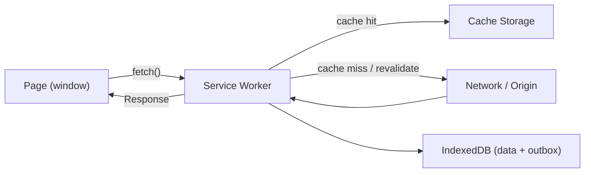
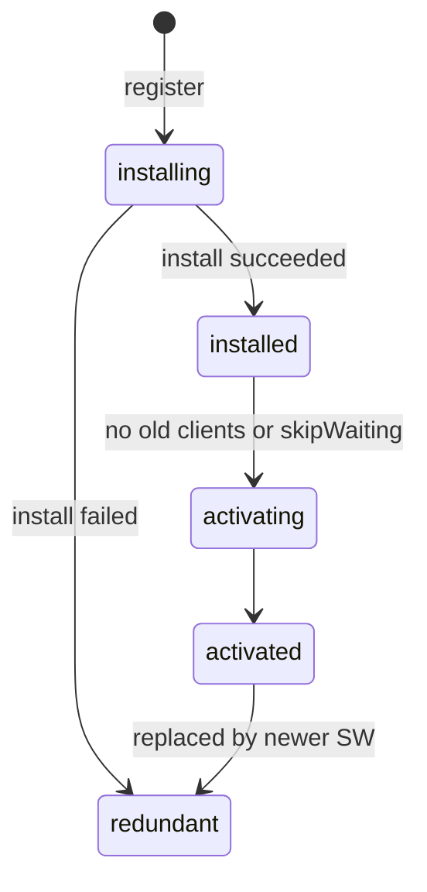
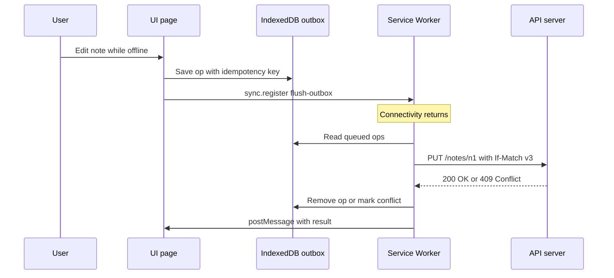

# 📱 Offline Support
> **Reviewed:** 2026-09 · Modernized; legacy topics are labeled.

---

## 1. 💡 Service Workers

Service workers are background scripts that run separately from your web page and can intercept network requests, cache resources, and handle push notifications. Service workers are the core building block for offline-first web apps. Understanding service workers is essential for building Progressive Web Apps (PWAs) and providing reliable experiences even when network connectivity is poor.

> **Legacy note (2026):** Before service workers, offline web apps used **AppCache** (`<html manifest="app.appcache">`). AppCache was deprecated and has been removed from all major browsers. If an interviewer mentions it, say it was replaced by service workers + the Cache API because AppCache was declarative, hard to update, and full of gotchas.

### 🔹 How Service Workers Work

* A service worker is registered **per origin and scope** (e.g. `/` or `/app/`).
* It runs on its own thread with **no DOM access**; it talks to pages via `postMessage` and to the network via `fetch`.
* It is **event-driven**: the browser starts it to handle an event (`install`, `activate`, `fetch`, `push`, `sync`) and may terminate it when idle — so never keep state in global variables; use the Cache API or IndexedDB.
* It only works on **secure contexts** (HTTPS, or `localhost` for development).



### 🔹 Lifecycle

1. **Register** from the page:

   ```javascript
   if ('serviceWorker' in navigator) {
     window.addEventListener('load', () => {
       navigator.serviceWorker.register('/sw.js', { scope: '/' });
     });
   }
   ```

2. **Install** – cache initial assets (the "app shell") in the `install` event. If any `cache.addAll` request fails, installation fails and the old worker keeps control.

   ```javascript
   const VERSION = 'v42';
   self.addEventListener('install', (event) => {
     event.waitUntil(
       caches.open(`shell-${VERSION}`).then((cache) =>
         cache.addAll(['/', '/index.html', '/app.js', '/styles.css', '/offline.html'])
       )
     );
   });
   ```

3. **Waiting** – a new worker waits until **all tabs** controlled by the old worker are closed. `self.skipWaiting()` skips this, but can mix old HTML with new JS if assets aren't versioned carefully.

4. **Activate** – clean up old caches in the `activate` event; optionally call `clients.claim()` so the worker controls already-open pages.

   ```javascript
   self.addEventListener('activate', (event) => {
     event.waitUntil(
       caches.keys().then((keys) =>
         Promise.all(keys.filter((k) => !k.endsWith(VERSION)).map((k) => caches.delete(k)))
       )
     );
   });
   ```

5. **Fetch** – intercept network requests and respond from cache or network.

6. **Redundant** – replaced by a newer version or failed install.



📌 **In simple terms**: A service worker is a programmable proxy between your app and the network for your origin, with a strict install → wait → activate lifecycle so updates never break open tabs.

### 🔹 Common Strategies

* **Cache-first** – for static, versioned assets (icons, hashed JS/CSS, fonts). Fast, but you must version URLs or you'll serve stale files forever.

* **Network-first** – for dynamic data and HTML navigations, with a cached/offline fallback when the network fails or times out.

* **Stale-while-revalidate** – serve from cache immediately, update the cache in the background. Great for avatars, non-critical API data, and CSS from CDNs.

* **Network-only** – for things that must never be cached (payments, auth token endpoints, analytics POSTs).

* **Cache-only** – for assets precached at install time.

```javascript
// Stale-while-revalidate, hand-written
self.addEventListener('fetch', (event) => {
  if (event.request.method !== 'GET') return;
  event.respondWith(
    caches.open('runtime').then(async (cache) => {
      const cached = await cache.match(event.request);
      const network = fetch(event.request).then((res) => {
        if (res.ok) cache.put(event.request, res.clone());
        return res;
      });
      return cached || network;
    })
  );
});
```

| Resource | Strategy |
|---|---|
| Hashed JS/CSS/fonts | Cache-first (precache) |
| HTML navigations | Network-first with offline page fallback |
| API reads (feed, profile) | Stale-while-revalidate or network-first |
| Mutations (POST/PUT) | Network-only + queue offline (background sync) |

---

## 2. 💡 Workbox (Production Service Workers)

Hand-written service workers get complicated fast (cache versioning, expiration, precache manifests). **Workbox** is Google's library that generates or simplifies service workers.

### 🔹 What Workbox Gives You

* **Precaching** with a build-time manifest of hashed files (via `workbox-build`, `workbox-webpack-plugin`, or framework plugins like `vite-plugin-pwa`).
* **Routing + strategies**: `CacheFirst`, `NetworkFirst`, `StaleWhileRevalidate`, `NetworkOnly`, `CacheOnly`.
* **Expiration** (`maxEntries`, `maxAgeSeconds`) and **cacheable response** rules.
* **Background sync** queue for failed requests.
* **Navigation preload** and offline fallbacks.

```javascript
import { precacheAndRoute } from 'workbox-precaching';
import { registerRoute, NavigationRoute } from 'workbox-routing';
import { NetworkFirst, NetworkOnly, StaleWhileRevalidate, CacheFirst } from 'workbox-strategies';
import { ExpirationPlugin } from 'workbox-expiration';
import { BackgroundSyncPlugin } from 'workbox-background-sync';

precacheAndRoute(self.__WB_MANIFEST);

registerRoute(new NavigationRoute(new NetworkFirst({ cacheName: 'pages' })));

registerRoute(
  ({ request }) => request.destination === 'image',
  new CacheFirst({
    cacheName: 'images',
    plugins: [new ExpirationPlugin({ maxEntries: 200, maxAgeSeconds: 30 * 24 * 3600 })],
  })
);

registerRoute(({ url }) => url.pathname.startsWith('/api/feed'), new StaleWhileRevalidate({ cacheName: 'api' }));

registerRoute(
  ({ url }) => url.pathname.startsWith('/api/orders'),
  new NetworkOnly({ plugins: [new BackgroundSyncPlugin('orders-queue', { maxRetentionTime: 24 * 60 })] }),
  'POST'
);
```

📌 **In simple terms**: Workbox is the "framework" for service workers — you declare routes and strategies, it handles the plumbing.

---

## 3. 💾 Storing Data Offline (IndexedDB)

The Cache API stores **HTTP responses**. For **application data** (records, drafts, an outbox of pending writes), use **IndexedDB**.

### 🔹 Storage Options Compared

* **Cache Storage** – request/response pairs; ideal for assets and GET responses.
* **IndexedDB** – async, transactional, indexed object store; works in pages and service workers; stores structured data and Blobs.
* **localStorage** – synchronous, string-only, small, **not available in service workers**; avoid for anything large or hot.
* **OPFS (Origin Private File System)** – fast file-like storage; used for things like SQLite-in-WASM.

Use a small wrapper like `idb` (Promise API) or Dexie rather than the raw callback API.

```javascript
import { openDB } from 'idb';

const db = await openDB('app', 1, {
  upgrade(db) {
    db.createObjectStore('notes', { keyPath: 'id' });
    db.createObjectStore('outbox', { keyPath: 'opId', autoIncrement: true });
  },
});

await db.put('notes', { id: 'n1', text: 'Hello', updatedAt: Date.now(), version: 3 });
```

### 🔹 Quotas and Eviction

* Browsers give each origin a quota (varies by browser and disk space); check with `navigator.storage.estimate()`.
* Storage is "best effort" and can be evicted under pressure. Call `navigator.storage.persist()` to request persistent storage for important data.
* Safari has historically been more aggressive about evicting script-writable storage for sites the user hasn't visited recently — treat local data as a cache that can be rebuilt, and sync to the server.

📌 **In simple terms**: Cache API for files and responses, IndexedDB for your data, and always assume the browser might delete it.

---

## 4. 🔄 Background Sync and Offline Writes

Reads are easy offline; **writes** are the hard part. The standard pattern is an **outbox**.

### 🔹 Outbox Pattern (Numbered Stages)

1. **User acts offline** – the UI updates optimistically and the mutation is written to an `outbox` store in IndexedDB with a client-generated ID (idempotency key).
2. **Register sync** – the page asks the service worker to retry when connectivity returns.
3. **Replay** – on the `sync` event (or on `online` / app start as a fallback), the worker replays queued operations in order.
4. **Reconcile** – on success remove from outbox and update local records with server versions; on conflict run conflict resolution; on permanent failure surface an error to the user.

```javascript
// page
const reg = await navigator.serviceWorker.ready;
if ('sync' in reg) await reg.sync.register('flush-outbox');
else flushOutboxNow(); // fallback for browsers without Background Sync

// sw.js
self.addEventListener('sync', (event) => {
  if (event.tag === 'flush-outbox') event.waitUntil(flushOutbox());
});
```

> **Browser support note:** The **Background Sync API** (`sync` event) and **Periodic Background Sync** are Chromium-only at the time of review; Safari and Firefox do not support them. Always implement a fallback: flush the outbox on `online` events, on app start, and on visibility change.



---

## 5. ⚖️ Conflict Resolution

When two devices edit the same data offline, you need a rule for who wins.

### 🔹 Strategies (Simple → Sophisticated)

* **Last-write-wins (LWW)** – compare timestamps; simple but silently loses data and depends on clock accuracy (prefer server-assigned versions).
* **Optimistic concurrency with versions/ETags** – client sends `If-Match: <version>`; server returns `409`/`412` if stale; client refetches and either auto-merges or asks the user.
* **Field-level merge** – merge non-overlapping field changes; only conflict when the same field changed.
* **Operational log / domain rules** – send intents ("add item", "increment quantity") instead of whole documents so the server can apply them in order.
* **CRDTs** (e.g. Yjs, Automerge) – data structures that merge automatically and converge; used for collaborative editors and local-first apps.
* **Ask the user** – for high-stakes records, show both versions and let the user choose.

📌 **In simple terms**: Use versions to *detect* conflicts, then choose a merge rule that fits the data — LWW for low-value fields, CRDTs for collaborative text, user prompts for important records.

---

## ⭐ Summary — 10-second Interview Version

> "Service workers run in the background and intercept fetches so we can cache assets and data, enable offline usage, and control how the app behaves when the network is slow or unavailable. I precache the app shell with Workbox, pick per-route strategies, store data and an outbox in IndexedDB, replay writes with background sync plus fallbacks, and detect conflicts with versions."

---

## ⭐ Extra Points (If Interviewer Asks More)

### How do you handle updates?

Use a versioned cache, delete old caches in `activate`, and show a "New version available" toast when a new service worker is ready to take over. On click, post a message to the waiting worker to call `skipWaiting()`, then reload once `controllerchange` fires.

```javascript
const reg = await navigator.serviceWorker.register('/sw.js');
reg.addEventListener('updatefound', () => {
  const sw = reg.installing;
  sw.addEventListener('statechange', () => {
    if (sw.state === 'installed' && navigator.serviceWorker.controller) showUpdateToast(() => sw.postMessage('SKIP_WAITING'));
  });
});
navigator.serviceWorker.addEventListener('controllerchange', () => location.reload());
```

### How do you avoid a "stuck" service worker?

* Serve `sw.js` with `Cache-Control: no-cache` (browsers also revalidate the script on navigation, capped at 24 hours).
* Keep a kill switch: deploy a worker that calls `self.registration.unregister()` and clears caches if something goes badly wrong.

### How do you detect online/offline?

`navigator.onLine` and `online`/`offline` events only tell you whether there's *a* network interface — not whether your API is reachable. Treat failed/timed-out fetches as the real signal.

---

### 🔹 💡 Progressive Web Applications (PWAs)

Progressive Web Apps are web apps that use modern capabilities like service workers and manifests to deliver an app-like experience: installable, offline-capable, and fast.

---

### 🔹 💡 Core requirements

* **HTTPS** – secure origin

* **Service worker** – offline and caching (Chromium no longer strictly requires a fetch handler for installability, but you still need one for offline support)

* **Web App Manifest** – metadata (name, icons, theme color, start URL, `display`)

* **Responsive design** – works across devices

```json
{
  "name": "Notes",
  "short_name": "Notes",
  "start_url": "/",
  "display": "standalone",
  "theme_color": "#0f172a",
  "icons": [
    { "src": "/icon-192.png", "sizes": "192x192", "type": "image/png" },
    { "src": "/icon-512.png", "sizes": "512x512", "type": "image/png", "purpose": "any maskable" }
  ]
}
```

📌 **In simple terms**: A PWA is a website that behaves like a native app—installable, offline-aware, and fast.

### 🔹 UX Characteristics

* Installable icon on home screen / app launcher

* Fullscreen or standalone window

* Works offline or on flaky networks for key flows

* Fast startup thanks to caching

### 🔹 Platform Notes (2026)

* **iOS/iPadOS**: PWAs are installed via Share → "Add to Home Screen"; Web Push works for home-screen web apps (iOS 16.4+). There's no automatic install prompt.
* **Chromium**: supports the `beforeinstallprompt` event for a custom install button.
* Offline UX matters more than install: show connection state, queued changes, and "last synced" timestamps.

---

## ⭐ Summary — 10-second Interview Version

> "Offline support includes service workers (background scripts that intercept network requests and cache resources) and PWAs (installable web apps with offline capabilities). Service workers enable caching strategies (cache-first, network-first, stale-while-revalidate) and offline functionality. Data lives in IndexedDB, writes go through an outbox replayed via background sync (with fallbacks), and conflicts are detected with versions and resolved with LWW, merges, or CRDTs. PWAs require HTTPS, a service worker, a web app manifest, and responsive design."

---

## References

* [MDN — Service Worker API](https://developer.mozilla.org/en-US/docs/Web/API/Service_Worker_API)
* [MDN — IndexedDB API](https://developer.mozilla.org/en-US/docs/Web/API/IndexedDB_API)
* [MDN — Background Synchronization API](https://developer.mozilla.org/en-US/docs/Web/API/Background_Synchronization_API)
* [Chrome for Developers — Workbox](https://developer.chrome.com/docs/workbox)
* [web.dev — Progressive Web Apps](https://web.dev/explore/progressive-web-apps)
