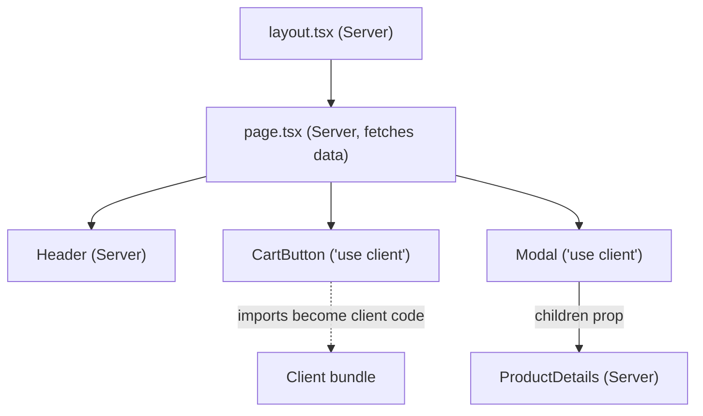
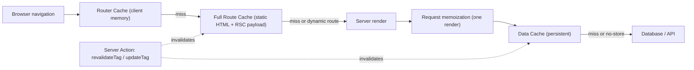

# 🌐 2. Data Fetching & Rendering (Q11–20, Q61–64)

> **Reviewed:** 2026-09 · Modernized for Next.js 15/16 App Router. Legacy (Pages Router) topics are labeled.

---

## Q11. 🎨 Different rendering strategies in Next.js

Next.js offers multiple rendering strategies across two routing paradigms: **Pages Router** (legacy, still supported) and **App Router** (Next.js 13.4+, recommended). The framework supports SSR (renders on server for each request - good for dynamic content and SEO, but slower than SSG), SSG (pre-renders at build time - fastest initial load, good for static content, but data can be stale), ISR (updates static content without rebuilding - best of both worlds), CSR (renders in browser - slower initial load due to JS execution and client-side data fetching, but poor SEO), **Streaming SSR** (sends HTML progressively), **React Server Components** (default in App Router - reduces client bundle), and **Partial Prerendering** (PPR - experimental in Next 14/15, and in Next 16 enabled through the `cacheComponents` flag; combines a static shell with streamed dynamic holes - see Q67). Choose strategy based on data freshness, performance needs, and SEO requirements, and use different strategies for different parts of your app (hybrid approach).

- **Trade-offs**: The catch is each strategy trades off between performance, SEO, and data freshness - SSR is slower but great for dynamic content, SSG is fastest but data can be stale, ISR balances both, Streaming improves perceived performance, Server Components reduce bundle size, but watch out - CSR has poor SEO and accessibility, so use it sparingly for interactive components only. App Router (Next.js 13+) is the modern approach with Server Components as default, while Pages Router uses data fetching functions.

### 📋 Rendering Strategies Overview

#### **1. Static Site Generation (SSG)**

- **When**: Content known at build time (blogs, documentation, marketing pages)
- **Performance**: Fastest (pre-rendered HTML, CDN-friendly)
- **SEO**: Excellent
- **Data Freshness**: Stale until rebuild

**Pages Router (legacy):**

```javascript
// Pre-renders at build time
export async function getStaticProps() {
  const res = await fetch('https://api.example.com/posts');
  const posts = await res.json();
  return { props: { posts } };
}

export default function Blog({ posts }) {
  return (
    <div>
      {posts.map(post => <article key={post.id}>{post.title}</article>)}
    </div>
  );
}
```

**App Router (Next.js 13+):**

```javascript
// Static rendering - route is prerendered at build if it uses no dynamic APIs
// app/blog/page.js
async function BlogPage() {
  const res = await fetch('https://api.example.com/posts', {
    cache: 'force-cache' // explicit: fetch is NOT cached by default in Next 15+
  });
  const posts = await res.json();

  return (
    <div>
      {posts.map(post => <article key={post.id}>{post.title}</article>)}
    </div>
  );
}

export default BlogPage;
```

#### **2. Server-Side Rendering (SSR)**

- **When**: Dynamic, personalized content (user dashboards, real-time data)
- **Performance**: Slower (renders on each request)
- **SEO**: Excellent
- **Data Freshness**: Always fresh

**Pages Router (legacy):**

```javascript
// Runs on every request
export async function getServerSideProps(context) {
  const { req, res } = context;
  const user = await getUserFromCookie(req.cookies);

  const data = await fetch(`https://api.example.com/user/${user.id}/dashboard`);
  const dashboard = await data.json();

  return { props: { dashboard } };
}

export default function Dashboard({ dashboard }) {
  return <div>{/* Dashboard content */}</div>;
}
```

**App Router (Next.js 13+):**

```javascript
// app/dashboard/page.js
// Reading cookies()/headers() already makes the route dynamic;
// `force-dynamic` just makes the intent explicit
export const dynamic = 'force-dynamic';

async function DashboardPage() {
  const user = await getCurrentUser(); // e.g. reads (await cookies()) internally
  const dashboard = await fetch(`https://api.example.com/user/${user.id}/dashboard`, {
    cache: 'no-store' // No caching
  });
  const data = await dashboard.json();

  return <div>{/* Dashboard content */}</div>;
}

export default DashboardPage;
```

#### **3. Incremental Static Regeneration (ISR)**

- **When**: Large sites with frequently updated content (e-commerce, news sites)
- **Performance**: Fast (static with background updates)
- **SEO**: Excellent
- **Data Freshness**: Configurable freshness window

**Pages Router (legacy):**

```javascript
// Regenerates every 60 seconds if requested
export async function getStaticProps() {
  const res = await fetch('https://api.example.com/products');
  const products = await res.json();

  return {
    props: { products },
    revalidate: 60 // Regenerate every 60 seconds
  };
}

// For dynamic routes - on-demand ISR
export async function getStaticPaths() {
  return {
    paths: [], // Don't pre-render any paths
    fallback: 'blocking' // Generate on-demand, then cache
  };
}
```

**App Router (Next.js 13+):**

```javascript
// app/products/page.js
async function ProductsPage() {
  const res = await fetch('https://api.example.com/products', {
    next: { revalidate: 60 } // ISR: revalidate every 60 seconds
  });
  const products = await res.json();

  return (
    <div>
      {products.map(product => <div key={product.id}>{product.name}</div>)}
    </div>
  );
}

export default ProductsPage;
```

#### **4. Client-Side Rendering (CSR)**

- **When**: Interactive components, dashboards behind auth (no SEO needed)
- **Performance**: Slower initial load (waits for JS)
- **SEO**: Poor (content not in HTML)
- **Data Freshness**: Always fresh (fetched client-side)

**Pages Router (legacy):**

```javascript
// No data fetching functions = page is prerendered as a shell, data fetched client-side
import { useState, useEffect } from 'react';

export default function ClientComponent() {
  const [data, setData] = useState(null);

  useEffect(() => {
    fetch('https://api.example.com/data')
      .then(res => res.json())
      .then(setData);
  }, []);

  if (!data) return <div>Loading...</div>;
  return <div>{data.message}</div>;
}
```

**App Router (Next.js 13+):**

```javascript
// app/interactive/page.js - page stays a Server Component
import { LiveTicker } from './live-ticker';
export default function InteractivePage() {
  return <LiveTicker />;
}

// app/interactive/live-ticker.js
'use client'; // Client Component directive

import { useQuery } from '@tanstack/react-query';

export function LiveTicker() {
  // Prefer a data library over ad-hoc useEffect fetching:
  // handles caching, dedupe, race conditions, and refetching
  const { data, isPending } = useQuery({
    queryKey: ['ticker'],
    queryFn: () => fetch('/api/ticker').then(r => r.json()),
    refetchInterval: 5000,
  });

  if (isPending) return <div>Loading...</div>;
  return <div>{data.message}</div>;
}
```

#### **5. Streaming SSR (Next.js 13+)**

- **When**: Pages with slow data sources, large content
- **Performance**: Fast TTFB (Time to First Byte), progressive rendering
- **SEO**: Excellent
- **Data Freshness**: Always fresh

**App Router:**

```javascript
// app/dashboard/page.js
import { Suspense } from 'react';

async function SlowData() {
  await new Promise(resolve => setTimeout(resolve, 2000));
  const data = await fetch('https://api.example.com/slow-data', {
    cache: 'no-store'
  });
  return <div>{/* Slow data content */}</div>;
}

async function FastData() {
  const data = await fetch('https://api.example.com/fast-data', {
    cache: 'no-store'
  });
  return <div>{/* Fast data content */}</div>;
}

export default function DashboardPage() {
  return (
    <div>
      <FastData />
      <Suspense fallback={<div>Loading slow data...</div>}>
        <SlowData />
      </Suspense>
    </div>
  );
}
```

#### **6. React Server Components (RSC) - App Router Default**

- **When**: Default in App Router, use for data fetching and non-interactive UI
- **Performance**: Reduces client bundle (no JS sent to client)
- **SEO**: Excellent
- **Data Freshness**: Depends on caching strategy

**App Router:**

```javascript
// app/posts/page.js
// Server Component (default - no 'use client')
async function PostsPage() {
  // Direct database access, no API needed
  const posts = await db.posts.findMany();

  return (
    <div>
      {posts.map(post => (
        <PostCard key={post.id} post={post} />
      ))}
    </div>
  );
}

// PostCard can also be Server Component
async function PostCard({ post }) {
  const author = await db.users.findById(post.authorId);
  return (
    <article>
      <h2>{post.title}</h2>
      <p>By {author.name}</p>
    </article>
  );
}

export default PostsPage;
```

#### **7. Partial Prerendering (PPR) - experimental in 14/15, via Cache Components in 16**

- **When**: Pages with mix of static and dynamic content
- **Performance**: Fast initial load (static shell) + streaming dynamic parts
- **SEO**: Excellent
- **Data Freshness**: Dynamic parts always fresh

**App Router (Next.js 16 - Cache Components):**

```javascript
// next.config.ts
const nextConfig = {
  cacheComponents: true, // Next 16: enables PPR-style rendering + "use cache"
};
// (Next 14/15 used experimental.ppr: 'incremental' + `export const experimental_ppr = true`;
//  those flags were removed in Next 16)

// app/product/[id]/page.js
import { Suspense } from 'react';

// Static shell - pre-rendered at build time
function ProductShell() {
  return (
    <div>
      <nav>Navigation</nav>
      <header>Product Header</header>
    </div>
  );
}

// Dynamic content - rendered on request
async function ProductDetails({ id }) {
  const product = await fetch(`https://api.example.com/products/${id}`, {
    cache: 'no-store'
  });
  const data = await product.json();
  return <div>{data.name} - ${data.price}</div>;
}

export default function ProductPage({ params }) {
  return (
    <>
      <ProductShell />
      <Suspense fallback={<div>Loading product...</div>}>
        {/* params is a Promise in Next 15+; resolve it inside the dynamic hole */}
        <ProductDetails id={params.then(p => p.id)} />
      </Suspense>
    </>
  );
}
// ProductDetails: `const productId = await id;` before fetching
```

#### **8. Edge Runtime**

- **When**: Low-latency requirements, simple logic (A/B testing, redirects, lightweight auth checks)
- **Performance**: Low cold-start latency, can run close to users
- **Limitations**: Web-standard APIs only (no full Node.js), many DB drivers won't work, and if your database is in one region, rendering "at the edge" can add round-trips. Node.js runtime is the default and the safer choice for most routes.

**App Router:**

```javascript
// app/api/hello/route.js
export const runtime = 'edge';

export async function GET(request) {
  // request.geo / request.ip were removed from NextRequest in Next 15;
  // on Vercel use geolocation() from @vercel/functions, elsewhere read your host's headers
  return Response.json({ message: 'Hello from Edge!' });
}
```

### 🎯 Strategy Selection Guide

| Strategy | Use Case | Performance | SEO | Data Freshness |
|----------|----------|-------------|-----|----------------|
| **SSG** | Blogs, docs, marketing | ⭐⭐⭐⭐⭐ | ✅ | Build time |
| **SSR** | User dashboards, real-time | ⭐⭐⭐ | ✅ | Always fresh |
| **ISR** | E-commerce, news sites | ⭐⭐⭐⭐ | ✅ | Configurable |
| **CSR** | Interactive apps (no SEO) | ⭐⭐ | ❌ | Always fresh |
| **Streaming** | Slow data sources | ⭐⭐⭐⭐ | ✅ | Always fresh |
| **RSC** | Default (App Router) | ⭐⭐⭐⭐⭐ | ✅ | Configurable |
| **PPR** | Mixed static/dynamic | ⭐⭐⭐⭐⭐ | ✅ | Dynamic parts fresh |

### 🔄 Hybrid Approach

Use different strategies for different parts of your app:

```javascript
// app/layout.js - Static
export default function RootLayout({ children }) {
  return (
    <html>
      <body>
        <StaticHeader /> {/* Static */}
        {children}
        <StaticFooter /> {/* Static */}
      </body>
    </html>
  );
}

// app/dashboard/page.js - Dynamic SSR
export const dynamic = 'force-dynamic';
export default async function Dashboard() {
  const user = await getCurrentUser();
  return <UserDashboard user={user} />;
}

// app/blog/page.js - Static with ISR
export default async function Blog() {
  const posts = await fetch('https://api.example.com/posts', {
    next: { revalidate: 3600 } // ISR: 1 hour
  });
  return <BlogList posts={await posts.json()} />;
}

// app/interactive/page.js - Client Component
'use client';
export default function Interactive() {
  return <InteractiveChart />; // Needs browser APIs
}
```

### 📌 Key Differences: Pages Router vs App Router

- **Pages Router**: Uses `getStaticProps`, `getServerSideProps`, `getStaticPaths`
- **App Router**: Uses Server Components (default), `fetch` with caching options, `'use client'` directive
- **App Router Benefits**: Smaller bundles, better performance, simpler data fetching, built-in streaming
- **Migration**: App Router is recommended for new projects (Next.js 13+)

### ⚠️ Important Notes

- **Next.js 13+**: App Router is recommended, Server Components are default
- **Next.js 15**: `fetch`, GET Route Handlers, and client-side page segments are **no longer cached by default**; `params`, `searchParams`, `cookies()`, `headers()` became async; App Router requires React 19
- **Next.js 16**: Cache Components (`cacheComponents: true`) with the `"use cache"` directive for explicit, opt-in caching; PPR ships through this flag rather than `experimental.ppr`
- **Edge Runtime**: Use for low-latency, simple operations (limited Node.js APIs)
- **Streaming**: Requires React 18+ Suspense boundaries
- **CSR**: Use sparingly - only for interactive components that need browser APIs

---

## Q12. 📤 Difference between `getStaticProps` and `getServerSideProps`

`getStaticProps` runs at build time (SSG, good for static content), while `getServerSideProps` runs on every request (SSR, good for dynamic content) - these are Pages Router specific, App Router uses different patterns. `getServerSideProps` receives request context, and `getStaticPaths` defines which dynamic routes to pre-render with `getStaticProps`.

- **Trade-offs**: The catch is `getStaticProps` is faster but data can be stale, while `getServerSideProps` is slower but always fresh, but watch out - these are Pages Router specific, so if you're using App Router, you'll use Server Components and async components instead.

Example:

```javascript
// getStaticProps - runs at build time (and on revalidation)
export async function getStaticProps() {
  const posts = await fetch('https://api.example.com/posts');
  const data = await posts.json();
  return { props: { data }, revalidate: 60 };
}

// getServerSideProps - runs on every request
export async function getServerSideProps({ req, params }) {
  const user = await getUser(req.cookies.session);
  return { props: { user } };
}

// App Router equivalents
// SSG/ISR:  async Server Component + fetch(url, { next: { revalidate: 60 } }) or "use cache"
// SSR:      async Server Component that reads cookies()/headers() or uncached data

```

> **Legacy note (2026):** `getStaticProps`/`getServerSideProps` are Pages Router APIs. Pages Router is still supported and common in production; for new work prefer App Router Server Components — see Q14 and Q68.

---

## Q13. 💡 `getStaticPaths` and when to use it

`getStaticPaths` defines which dynamic routes to pre-render at build time - use it with `getStaticProps` for static generation of dynamic pages. Required for dynamic routes with SSG, and fallback controls behavior for non-pre-rendered paths.

- **Trade-offs**: The catch is you need to define all paths upfront or use fallback to handle unknown paths, but watch out - if you have many dynamic routes, pre-rendering all of them can slow down your build time significantly.

Example:

```javascript
export async function getStaticPaths() {
  return {
    paths: [
      { params: { id: '1' } },
      { params: { id: '2' } }
    ],
    fallback: false
  };
}

// App Router equivalent - app/posts/[id]/page.tsx
export async function generateStaticParams() {
  return [{ id: '1' }, { id: '2' }];
}
export const dynamicParams = false; // like fallback: false (unknown ids -> 404)

```

> **Legacy note (2026):** `getStaticPaths` is Pages Router only. In App Router use `generateStaticParams`, with `dynamicParams` controlling what happens to params not generated at build time.

---

## Q14. 💡 Implementing data fetching in App Router

In the App Router the default is to fetch in **async Server Components** - call `fetch`, an ORM, or any server SDK directly during render; no API route or `useEffect` needed. Start independent requests in parallel (`Promise.all`) to avoid waterfalls, wrap slow parts in `<Suspense>` to stream them, and dedupe repeated non-`fetch` calls with React's `cache()`. For mutations use Server Actions (Q20, Q62). In Client Components, either receive data as props, unwrap a promise passed from the server with `use()`, or use TanStack Query/SWR for client-driven data (polling, infinite scroll) rather than hand-rolled `useEffect` fetching.

- **Trade-offs**: The catch is server-side fetching removes client waterfalls and keeps secrets on the server, but watch out - sequential `await`s in nested components create server waterfalls, and in Next 15+ `fetch` is uncached by default, so decide explicitly what to cache (`cache: 'force-cache'`, `next.revalidate`, or `"use cache"` in Next 16).

Example:

```javascript
// app/users/[id]/page.tsx - Server Component
import { cache, Suspense } from 'react';

const getUser = cache(async (id: string) => db.user.findUnique({ where: { id } })); // per-request dedupe

export default async function UserPage({ params }) {
  const { id } = await params;
  // Start both in parallel instead of awaiting one after another
  const [user, stats] = await Promise.all([getUser(id), getStats(id)]);

  const postsPromise = getPosts(id); // don't await: stream it
  return (
    <>
      <h1>{user.name}</h1>
      <Stats data={stats} />
      <Suspense fallback={<p>Loading posts…</p>}>
        <Posts postsPromise={postsPromise} /> {/* Client Component can use(postsPromise) */}
      </Suspense>
    </>
  );
}

```

---

## Q15. ⚛️ React Server Components (RSC)

RSC run only on the server (at build time or per request), can be `async`, can read databases and secrets directly, and their code is never shipped to the browser. They can't use state, effects, event handlers, or browser APIs. React serializes their output into the **RSC payload** (a compact description of the rendered tree plus references to Client Components), which Next.js uses both to produce the initial HTML and to update the UI on client-side navigation. Client Components (`'use client'`) are still prerendered to HTML on the server, then hydrated in the browser for interactivity.

- **Trade-offs**: The catch is server components shrink the client bundle and remove client–server waterfalls, but watch out - props passed from a Server to a Client Component must be serializable (no functions except Server Actions, no class instances), and "server" doesn't mean "re-renders on the server when state changes": to refresh server data you navigate, call `router.refresh()`, or revalidate. See Q61 for boundary rules.

Example:

```javascript
// Server Component - runs on server, zero client JS for this component
import { LikeButton } from './like-button'; // 'use client' file

export default async function Posts() {
  const posts = await db.post.findMany(); // direct DB access
  return posts.map(p => (
    <article key={p.id}>
      <h2>{p.title}</h2>
      <LikeButton postId={p.id} initialLikes={p.likes} /> {/* serializable props */}
    </article>
  ));
}

```

---

## Q16. 💾 Caching and revalidation with `fetch()`

Next.js extends `fetch` on the server with caching options: `cache: 'force-cache'` stores the response in the Data Cache, `cache: 'no-store'` always refetches, and `next: { revalidate: N }` caches for N seconds then serves stale while regenerating in the background (`revalidate: false` = cache until manually invalidated). **The default changed in Next.js 15**: `fetch` is no longer cached unless you opt in (Next 13/14 defaulted to `force-cache`). You can also set a route-wide `export const revalidate = N`. In Next 16 with Cache Components, the preferred way to cache any async work (not just `fetch`) is the `"use cache"` directive with `cacheLife()` / `cacheTag()` - see Q63.

- **Trade-offs**: The catch is explicit caching makes behavior predictable and fresh by default, but watch out - upgrading from Next 14 to 15 can silently turn previously cached pages dynamic (more origin traffic), and `revalidate: false` can serve stale data forever if you forget to invalidate. Non-`fetch` data sources (ORMs, SDKs) aren't covered by `fetch` options at all.

Example:

```javascript
// Cache for 60 seconds (time-based revalidation)
async function getData() {
  const res = await fetch('https://api.example.com/data', {
    next: { revalidate: 60, tags: ['data'] }
  });
  return res.json();
}

// Always fresh (explicit; also the Next 15+ default)
await fetch('https://api.example.com/cart', { cache: 'no-store' });

// Next 16 with cacheComponents: cache any async function
import { cacheLife, cacheTag } from 'next/cache';
export async function getProducts() {
  'use cache';
  cacheLife('hours');
  cacheTag('products');
  return db.product.findMany();
}

```

---

## Q17. ✅ Revalidation tags and how to use them

Revalidation tags allow targeted cache invalidation by grouping related data, while `revalidatePath` invalidates specific routes - only revalidates what's necessary for better performance. Use tags to group related data, then call `revalidateTag` to invalidate all data with that tag.

- **Trade-offs**: The catch is `revalidatePath` invalidates specific routes and is more precise than global revalidation, but watch out - `revalidateTag` invalidates all data with a specific tag, so organize your tags carefully to avoid invalidating too much.

Example:

```javascript
// Fetch with tags
async function getPosts() {
  const res = await fetch('https://api.example.com/posts', {
    next: {
      revalidate: 3600,
      tags: ['posts', 'content']
    }
  });
  return res.json();
}

// Tagging non-fetch work (Next 16, inside a "use cache" function)
// cacheTag('posts');

// Later, in a Server Action or Route Handler
// revalidateTag('posts', 'max');  // Next 16 signature: tag + cacheLife profile
// revalidatePath('/blog');        // invalidate everything a route rendered

```

---

## Q18. ✅ Implementing on-demand revalidation

On-demand revalidation manually invalidates cached data with `revalidateTag` or `revalidatePath` - call it from a **Server Action** after your own mutations, or from a **Route Handler** when an external system (CMS webhook, payment provider) changes data. `revalidateTag` invalidates every cache entry with that tag; `revalidatePath` invalidates what a route rendered. In Next 16, `revalidateTag(tag, profile)` takes a second `cacheLife` argument (stale-while-revalidate semantics; the single-argument form is deprecated), and Server Actions also get `updateTag(tag)` for read-your-own-writes (expire and refresh immediately so the user sees their change).

- **Trade-offs**: The catch is on-demand invalidation keeps long cache lifetimes safe, but watch out - you must remember to invalidate after every mutation path, and webhook endpoints must be authenticated (shared secret/signature) or anyone can flush your cache.

Example:

```javascript
// app/api/revalidate/route.ts - CMS webhook
import { revalidateTag } from 'next/cache';

export async function POST(request: Request) {
  if (request.headers.get('x-webhook-secret') !== process.env.REVALIDATE_SECRET) {
    return Response.json({ error: 'Unauthorized' }, { status: 401 });
  }
  revalidateTag('posts', 'max'); // Next 15: revalidateTag('posts')
  return Response.json({ revalidated: true });
}

// app/actions.ts - after your own mutation
'use server';
import { updateTag } from 'next/cache'; // Next 16, Server Actions only
export async function publishPost(id: string) {
  await db.post.update({ where: { id }, data: { published: true } });
  updateTag('posts'); // user immediately sees the published post
}

```

---

## Q19. 🔄 Fallback mechanism in ISR

Fallback controls how Next.js handles pages not generated at build time - `false` (only pre-rendered paths work, 404 for others), `true` (show loading for non-pre-rendered paths), or `blocking` (wait for generation, then render). Choose based on build time vs runtime needs.

- **Trade-offs**: The catch is `false` is fastest but provides worst UX, `blocking` is slowest but ensures content is ready, but watch out - `true` provides better user experience by showing loading states, but requires handling loading UI.

Example:

```javascript
// fallback: false - only pre-rendered paths work
export async function getStaticPaths() {
  return {
    paths: [
      { params: { id: '1' } },
      { params: { id: '2' } }
    ],
    fallback: false
  };
}

// App Router equivalent
export const dynamicParams = true;  // default: unknown params render on demand, then cache (≈ 'blocking')
// export const dynamicParams = false; // unknown params -> 404 (≈ fallback: false)
// Streaming a loading.tsx while rendering replaces the need for fallback: true

```

> **Legacy note (2026):** The `fallback` option is Pages Router only. In App Router use `generateStaticParams` + `dynamicParams`, and `loading.tsx`/Suspense for the loading experience.

---

## Q20. 🖥️ Difference between API routes and Server Actions

Route Handlers (`app/**/route.ts`, the App Router successor to Pages Router API routes) are HTTP endpoints you design yourself - use them for webhooks, public/mobile APIs, file downloads, and anything a non-Next client calls. Server Actions (`'use server'`) are async functions that React/Next.js turn into POST endpoints automatically; call them from `<form action>`, `useActionState`, or event handlers for **mutations from your own UI**. They integrate with revalidation (`revalidatePath`/`revalidateTag`), progressive enhancement (forms work before JS loads), and end-to-end TypeScript types.

- **Trade-offs**: The catch is Server Actions remove the API boilerplate for internal mutations, but watch out - every Server Action is a publicly reachable endpoint, so it needs the same input validation and auth checks as an API route (Q62). They're POST-only and executed sequentially per client, so don't use them for data *fetching*; use Server Components or Route Handlers for reads.

Example:

```javascript
// Route Handler - app/api/posts/route.ts (public REST endpoint)
export async function GET() {
  const posts = await db.post.findMany();
  return Response.json(posts);
}

// Server Action - app/actions.ts
'use server';
import { revalidatePath } from 'next/cache';
import { z } from 'zod';

export async function createPost(formData: FormData) {
  const session = await auth();                    // authn/authz inside the action
  if (!session) throw new Error('Unauthorized');
  const { title } = z.object({ title: z.string().min(1) })
    .parse({ title: formData.get('title') });      // validate untrusted input
  await db.post.create({ data: { title, authorId: session.user.id } });
  revalidatePath('/posts');
}

// app/posts/new/page.tsx
// <form action={createPost}><input name="title" /><button>Create</button></form>

```

> **Legacy note (2026):** `pages/api/*` API routes (with `req`/`res`) still work in Pages Router apps; in `app/` use Route Handlers with Web `Request`/`Response`.

---

## Q61. 🧱 Server vs Client Component boundaries (`'use client'`)

Everything in `app/` is a Server Component unless a file starts with `'use client'`. That directive marks a **boundary**: the file and everything it imports become part of the client bundle. Push the boundary as far down the tree as possible - keep pages, layouts, and data fetching on the server and make only the interactive leaves (buttons, forms with local state, charts) Client Components. A Client Component can't import a Server Component, but it can **render one passed as `children` or another prop**, which is how you put server-rendered content inside a client provider or modal.

- **Trade-offs**: The catch is a well-placed boundary keeps bundles small and secrets on the server, but watch out - props crossing the boundary must be serializable (plain data, Dates, Promises, JSX, and Server Actions are fine; arbitrary functions and class instances are not), `'use client'` at the top of a big shared module can drag a whole dependency tree into the browser, and third-party components that use hooks but lack the directive need a thin `'use client'` re-export. Use `import 'server-only'` to make accidental client imports of server code a build error.



Example:

```javascript
// app/product/[id]/page.tsx - Server Component
import { Modal } from './modal';
import { AddToCart } from './add-to-cart';
import { addToCart } from './actions'; // Server Action

export default async function ProductPage({ params }) {
  const { id } = await params;
  const product = await db.product.findUnique({ where: { id } });
  return (
    <Modal>
      {/* Server-rendered content passed through a Client Component */}
      <ProductDetails product={product} />
      <AddToCart productId={product.id} action={addToCart} />
    </Modal>
  );
}

// app/product/[id]/modal.tsx
'use client';
import { useState } from 'react';
export function Modal({ children }) {
  const [open, setOpen] = useState(true);
  return open ? <dialog open onClose={() => setOpen(false)}>{children}</dialog> : null;
}

```

---

## Q62. 🔒 Server Actions and security

A Server Action is compiled into a POST endpoint identified by an action ID, so anyone who can find that ID can call it with arbitrary arguments - treat every action like a public API route. Inside each action: **authenticate** (read the session), **authorize** (does this user own this resource?), **validate** input with a schema (e.g. Zod), and return only the data the client needs. Next.js adds some protections: action IDs are encrypted and unused actions are dead-code-eliminated, closed-over variables are encrypted, and actions only accept POST with an `Origin`/`Host` check (configurable via `serverActions.allowedOrigins`), which mitigates CSRF for most setups.

- **Trade-offs**: The catch is Server Actions give you type-safe mutations with almost no boilerplate, but watch out - they don't replace authorization; checking auth only in middleware/proxy or in the page that renders the form is not enough (the action can be called directly). Also avoid returning raw DB rows (leaks fields), add rate limiting for expensive actions, and centralize checks in a data access layer so every action goes through them.

Example:

```javascript
// app/lib/dal.ts - data access layer
import 'server-only';
import { cache } from 'react';
export const requireUser = cache(async () => {
  const session = await auth();              // e.g. Auth.js v5 `auth()`
  if (!session?.user) throw new Error('Unauthorized');
  return session.user;
});

// app/posts/actions.ts
'use server';
import { z } from 'zod';
import { revalidateTag } from 'next/cache';
import { requireUser } from '@/lib/dal';

const UpdatePost = z.object({ id: z.string().uuid(), title: z.string().min(1).max(200) });

export async function updatePost(_prev: unknown, formData: FormData) {
  const user = await requireUser();                                    // 1. authn
  const parsed = UpdatePost.safeParse(Object.fromEntries(formData));   // 2. validate
  if (!parsed.success) return { error: 'Invalid input' };

  const post = await db.post.findUnique({ where: { id: parsed.data.id } });
  if (post?.authorId !== user.id) return { error: 'Forbidden' };       // 3. authz

  await db.post.update({ where: { id: post.id }, data: { title: parsed.data.title } });
  revalidateTag('posts', 'max');
  return { ok: true };                                                 // 4. minimal response
}

```

---

## Q63. 🗄️ Caching layers in the App Router (and what changed in Next 15/16)

The App Router has four caching mechanisms. **Request memoization** (React): identical `fetch` GET calls, or functions wrapped in `cache()`, are deduped within one server render. **Data Cache** (Next.js, server, persistent): stores `fetch` results across requests and deployments until revalidated. **Full Route Cache** (server): the HTML + RSC payload of statically rendered routes, produced at build or on revalidation. **Router Cache** (client, in-memory): RSC payloads of visited/prefetched segments for instant back/forward and navigation. **Next.js 15 flipped the defaults to uncached**: `fetch` is `no-store` unless you opt in, GET Route Handlers aren't cached, and the Router Cache no longer reuses page segments on navigation (`staleTimes.dynamic` defaults to 0; layouts and loading states are still reused). **Next.js 16** adds opt-in Cache Components: with `cacheComponents: true`, you mark cacheable functions/components with `"use cache"` and control lifetime with `cacheLife()` and invalidation with `cacheTag()`/`revalidateTag()`/`updateTag()`.

- **Trade-offs**: The catch is the layers together make static pages nearly free to serve, but watch out - stale data bugs usually come from not knowing which layer is holding the old value. Server-side invalidation (`revalidateTag`/`revalidatePath`) purges the Data and Full Route caches; calling it from a Server Action also refreshes the client Router Cache, while `router.refresh()` only refetches the current route on the client. When upgrading from 14 to 15, audit pages that were implicitly cached.



Example:

```javascript
// Next 15: opt in per fetch (default is no caching)
await fetch(url, { cache: 'force-cache', next: { tags: ['catalog'] } });

// Next 15: restore some client Router Cache reuse (optional)
// next.config.ts
export default {
  experimental: { staleTimes: { dynamic: 30 } }, // seconds
};

// Next 16: Cache Components
// next.config.ts -> { cacheComponents: true }
import { cacheLife, cacheTag } from 'next/cache';

export async function CategoryNav() {
  'use cache';                 // cache this component's output
  cacheLife('days');
  cacheTag('categories');
  const categories = await db.category.findMany();
  return <nav>{categories.map(c => <a key={c.id} href={`/c/${c.slug}`}>{c.name}</a>)}</nav>;
}

```

---

## Q64. ⏳ Async Request APIs in Next.js 15+ (`params`, `searchParams`, `cookies()`, `headers()`)

Starting in Next.js 15, request-specific APIs are asynchronous: `params` and `searchParams` props are Promises, and `cookies()`, `headers()`, and `draftMode()` return Promises. The reason is rendering efficiency: Next.js can prerender everything that doesn't depend on the request and only wait for request data where it's actually used (the foundation for PPR / Cache Components). Next 15 kept temporary synchronous compatibility with warnings; Next 16 removed it. The official codemod (`npx @next/codemod@latest next-async-request-api .`) handles most of the migration.

- **Trade-offs**: The catch is a small syntax change unlocks static shells with dynamic holes, but watch out - awaiting `cookies()` high in the tree (e.g. in the root layout) makes everything below it dynamic; read request data as deep as possible, ideally inside a Suspense boundary. In Client Components, unwrap `params` with `use()` or use `useParams()`/`useSearchParams()`.

Example:

```javascript
// app/search/page.tsx
import { cookies, headers } from 'next/headers';

export default async function SearchPage({
  searchParams,
}: { searchParams: Promise<{ q?: string }> }) {
  const { q = '' } = await searchParams;
  const locale = (await cookies()).get('locale')?.value ?? 'en';
  const ua = (await headers()).get('user-agent');
  return <Results query={q} locale={locale} ua={ua} />;
}

// Legacy (Next 14 and earlier): synchronous access
// export default function SearchPage({ searchParams }) { const q = searchParams.q; ... }

```

---

