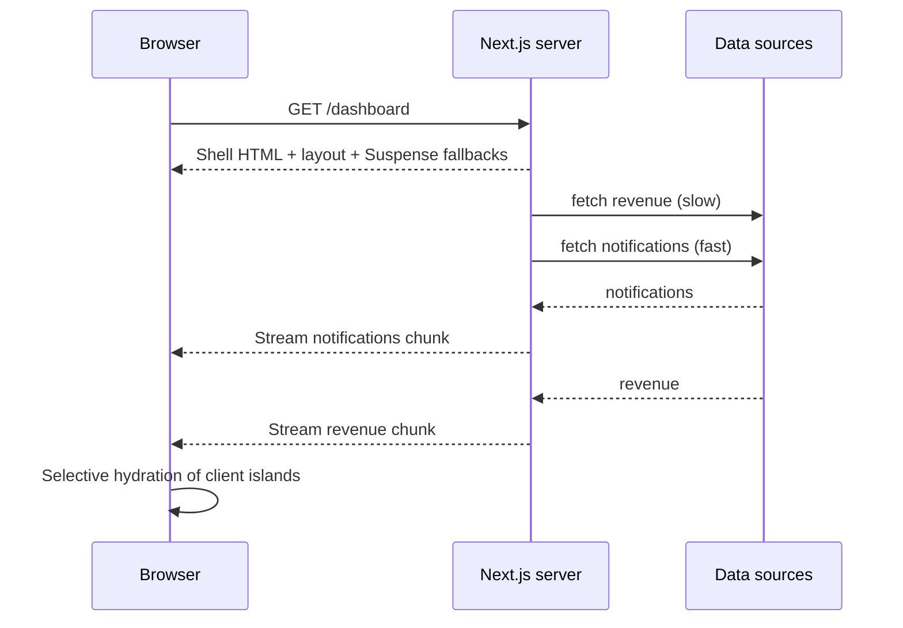

# 🧭 3. Routing & Navigation (Q21–27, Q65–66)

> **Reviewed:** 2026-09 · Modernized for Next.js 15/16 App Router. Legacy (Pages Router) topics are labeled.

---

## Q21. 🗺️ Nested routing in App Router

Nested routes create layouts that wrap child pages, with `layout.js` files defining shared UI - each folder can have its own layout, and layouts compose together for complex UIs. Common elements like navigation stay in place, and layouts don't re-render on navigation.

- **Trade-offs**: The catch is layouts persist across route changes, which provides better UX, but watch out - layouts compose together, so make sure your layout structure makes sense and doesn't create unnecessary nesting.

Example:

```javascript
// app/layout.js - root layout (wraps all pages)
export default function RootLayout({ children }) {
  return (
    <html>
      <body>
        <header>My App</header> {/* Shared header across all pages */}
        {children} {/* Child pages render here, layout persists on navigation */}
      </body>
    </html>
  );
}

```

---

## Q22. 💡 Parallel Routes and how to use them

Parallel routes render multiple independent pages in the same layout using `@slot` folders - the layout receives each slot as a prop alongside `children`. Each slot can have its own `loading.tsx`/`error.tsx`, so one panel can stream or fail without blocking the others. They're commonly combined with intercepting routes (Q23) to build modals.

- **Trade-offs**: The catch is slots enable dashboards and conditional UI (e.g. render `@admin` or `@user` based on role), but watch out - on a hard refresh Next.js can't recover a slot's state for unmatched URLs, so provide a `default.tsx` for each slot (required in Next 16, where builds fail without it).

Example:

```javascript
// app/dashboard/layout.tsx
export default function DashboardLayout({ children, analytics, team }) {
  return (
    <>
      {children}
      <section>{analytics}</section>
      <section>{team}</section>
    </>
  );
}

// app/dashboard/@analytics/page.tsx
export default async function Analytics() {
  const stats = await getStats();
  return <div>Analytics: {stats.visits}</div>;
}

// app/dashboard/@analytics/default.tsx - fallback for unmatched routes / hard refresh
export default function Default() {
  return null;
}

```

---

## Q23. 💡 Intercepting Routes and how to use them

Intercepting routes let a client-side navigation render a different route **in the context of the current page** - the classic example is clicking a photo in a feed: the URL updates to `/photos/123` (so it's shareable), but the photo opens in a modal over the feed. A hard refresh or opening the link directly renders the real `/photos/123` page. Conventions: `(.)` same level, `(..)` one level up, `(..)(..)` two levels up, `(...)` from the app root - based on route segments, not file-system folders. They're usually placed inside a parallel `@modal` slot.

- **Trade-offs**: The catch is you get Instagram-style modals with deep-linkable URLs and working back/forward, but watch out - you maintain two UIs for the same URL (modal vs full page), you need a `default.tsx` for the slot, and closing the modal should be `router.back()` so history stays consistent.

Example:

```javascript
// app/layout.tsx renders {children} and {modal}
// app/@modal/default.tsx          -> return null
// app/photos/[id]/page.tsx        -> full page (direct visit / refresh)

// app/@modal/(.)photos/[id]/page.tsx -> intercepted version (soft navigation)
import { Modal } from '@/components/modal'; // 'use client', closes with router.back()

export default async function PhotoModal({ params }) {
  const { id } = await params;
  return <Modal><Photo id={id} /></Modal>;
}

```

---

## Q24. 💡 Handling `not-found.tsx` and `error.tsx`

`not-found.tsx` renders when you call `notFound()` from `next/navigation` (or no route matches), `error.tsx` is a React error boundary for its segment (must be a Client Component; receives `error` and `reset`), and `global-error.tsx` catches errors in the root layout itself (it must render its own `<html>`/`<body>`). `loading.tsx` wraps the segment in Suspense (Q25, Q65). Nest them per route so failures stay local.

- **Trade-offs**: The catch is segment-level boundaries keep the rest of the layout usable when one part fails, but watch out - `error.tsx` doesn't catch errors in the `layout.tsx` of the same segment (it sits inside it), server error messages are redacted in production (use `error.digest` to correlate with server logs), and for **expected** errors (validation, "not allowed") return values from Server Actions instead of throwing.

Example:

```javascript
// app/not-found.tsx - 404 page
export default function NotFound() {
  return (
    <div>
      <h1>404 - Page Not Found</h1>
      <p>The page you're looking for doesn't exist.</p>
    </div>
  );
}

// app/error.tsx - error boundary
'use client';
export default function Error({ error, reset }) {
  return (
    <div>
      <h2>Something went wrong!</h2>
      <p>Reference: {error.digest}</p>
      <button onClick={() => reset()}>Try again</button>
    </div>
  );
}

// app/posts/[id]/page.tsx - trigger the nearest not-found.tsx
import { notFound } from 'next/navigation';
export default async function Post({ params }) {
  const post = await getPost((await params).id);
  if (!post) notFound();
  return <article>{post.title}</article>;
}

```

---

## Q25. 📦 Using `loading.tsx` for loading states

`loading.tsx` automatically wraps the segment's `page.tsx` (and nested children) in a `<Suspense>` boundary with your component as the fallback. It shows instantly on navigation (it's included in the prefetch for dynamic routes), and on first load the server streams it first, then the page content when ready. Shared layouts above it stay interactive.

- **Trade-offs**: The catch is one file gives you instant navigation feedback and streaming, but watch out - it's coarse (the whole page waits behind one fallback); for finer control put your own `<Suspense>` boundaries around slow components (Q65). It also doesn't wrap the `layout.tsx` in the same folder, so slow data in a layout still blocks.

Example:

```javascript
// app/loading.tsx
export default function Loading() {
  return <div>Loading...</div>;
}

```

---

## Q26. 💡 Using `useRouter()` and `router.push()`

In the App Router, import `useRouter` from **`next/navigation`** (in a Client Component) and call `push()` (adds a history entry), `replace()` (no entry), `back()`/`forward()`, `prefetch()`, or `refresh()` - which re-fetches the current route's Server Components without losing client state, not a full browser reload. Companion hooks replace fields of the old router object: `usePathname()`, `useSearchParams()`, `useParams()`. On the server, use `redirect()`/`permanentRedirect()` from `next/navigation` inside Server Components, Server Actions, or Route Handlers.

- **Trade-offs**: The catch is prefer `<Link>` for normal navigation (prefetching, accessibility, works without JS) and reserve `router.push` for post-action navigation, but watch out - `useSearchParams()` in a statically rendered route needs a Suspense boundary, and the App Router hooks have no `router.events`; track navigation with `usePathname`/`useSearchParams` in an effect instead.

> **Legacy note (2026):** Pages Router uses `useRouter` from `next/router` (with `router.query`, `router.asPath`, `router.events`). It's still supported in `pages/`, but it doesn't work inside `app/`.

Example:

```javascript
'use client';
import { useRouter } from 'next/navigation';

export default function Navigation() {
  const router = useRouter();

  return (
    <button onClick={() => router.push('/about')}>
      Go to About
    </button>
  );
}

// Server-side redirect (Server Component or Server Action)
import { redirect } from 'next/navigation';
export async function createOrder(formData) {
  'use server';
  const order = await saveOrder(formData);
  redirect(`/orders/${order.id}`);
}

```

---

## Q27. 💡 Implementing redirects and rewrites

Configure static redirects (`permanent: true` → 308, `false` → 307, which preserve the HTTP method unlike 301/302), rewrites (proxy a path to another path or external URL without changing the browser URL), and headers (security headers, CORS) in `next.config.js`. For request-dependent logic (geo, auth cookie, A/B bucket) use middleware - renamed `proxy.ts` in Next 16 (Q66). Inside rendering code use `redirect()` from `next/navigation`.

- **Trade-offs**: The catch is config-level rules are fast and declarative, but watch out - they run for every matching request before rendering, large redirect lists slow routing (for thousands of entries use a lookup in middleware/proxy), and rewrites to external origins make you responsible for that origin's caching and security.

Example:

```javascript
// next.config.js
const nextConfig = {
  async redirects() {
    return [
      { source: '/old', destination: '/new', permanent: true }
    ];
  },
  async rewrites() {
    return [
      { source: '/api/:path*', destination: '/api-proxy/:path*' }
    ];
  },
  async headers() {
    return [
      {
        source: '/:path*',
        headers: [
          { key: 'X-Frame-Options', value: 'DENY' }
        ]
      }
    ];
  }
};

```

---

## Q65. 🌊 Streaming with `loading.tsx` and Suspense boundaries

Streaming lets the server send HTML in chunks: the static shell and fast parts arrive immediately, and each `<Suspense>` boundary's fallback is later replaced by the real content as its data resolves - no client-side fetching required. `loading.tsx` is the route-level version (one boundary around the page); explicit `<Suspense>` boundaries give component-level control. React hydrates boundaries selectively, prioritizing the ones the user interacts with. Design boundaries around **independent data dependencies** and meaningful UI regions, not around every component.

- **Trade-offs**: The catch is streaming improves TTFB and perceived performance without giving up SSR/SEO (crawlers receive the full streamed HTML), but watch out - once streaming starts the HTTP status is already sent (usually 200), so call `notFound()`/`redirect()` before the first suspended boundary when possible; too many tiny boundaries cause layout pop-in; and awaiting data in a parent above the boundary still blocks everything below it.



Example:

```javascript
// app/dashboard/loading.tsx - route-level fallback (instant on navigation)
export default function Loading() {
  return <DashboardSkeleton />;
}

// app/dashboard/page.tsx - component-level boundaries
import { Suspense } from 'react';

export default function Dashboard() {
  return (
    <>
      <h1>Dashboard</h1>                       {/* in the first chunk */}
      <Suspense fallback={<CardSkeleton />}>
        <Revenue />                            {/* async Server Component, streams later */}
      </Suspense>
      <Suspense fallback={<ListSkeleton />}>
        <Notifications />
      </Suspense>
    </>
  );
}

async function Revenue() {
  const data = await getRevenue(); // slow query only blocks this boundary
  return <RevenueChart data={data} />;
}

```

---

## Q66. 🚦 Middleware (`proxy.ts`) vs Route Handlers

**Middleware** runs *before* routing for every matching request and can only rewrite, redirect, set headers/cookies, or return an early response - use it for coarse, fast decisions: locale detection, A/B bucketing, redirecting obviously unauthenticated users, bot filtering. In **Next.js 16 the file convention was renamed from `middleware.ts` to `proxy.ts`** (exported function `proxy`) to make that network-boundary role clearer; `middleware.ts` is deprecated. **Route Handlers** (`app/**/route.ts`) are actual endpoints that own a URL and return a response - use them for webhooks, REST/JSON APIs, file streaming, OAuth callbacks.

- **Trade-offs**: The catch is middleware/proxy is great for cheap per-request routing logic, but watch out - it is **not** a complete auth layer: a 2025 vulnerability (CVE-2025-29927) allowed middleware to be skipped via a crafted header on unpatched versions, and matchers are easy to misconfigure. Always re-check authorization where data is read or mutated (Server Components, Server Actions, Route Handlers, a data access layer). Keep middleware/proxy lean - it's on the critical path of every matched request - and avoid database calls there.

Example:

```javascript
// proxy.ts (Next 16) - was middleware.ts with `export function middleware`
import { NextResponse, type NextRequest } from 'next/server';

export function proxy(request: NextRequest) {
  const hasSession = request.cookies.has('session');
  if (!hasSession && request.nextUrl.pathname.startsWith('/dashboard')) {
    return NextResponse.redirect(new URL('/login', request.url)); // optimistic check only
  }
  return NextResponse.next();
}

export const config = { matcher: ['/dashboard/:path*'] };

// app/api/webhooks/stripe/route.ts - Route Handler owns the endpoint
export async function POST(request: Request) {
  const payload = await request.text();
  const event = verifyStripeSignature(payload, request.headers.get('stripe-signature'));
  await handleEvent(event);
  return new Response(null, { status: 204 });
}

```

---

