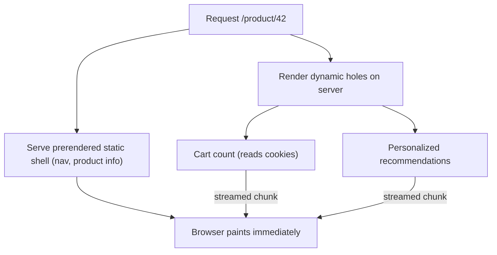

# ⚡ 4. Performance & Optimization (Q28–37, Q67)

> **Reviewed:** 2026-09 · Modernized for Next.js 15/16 App Router. Legacy (Pages Router) topics are labeled.

---

## Q28. ▲ ▲ ▲ Optimizing images with `next/image`

`next/image` resizes and converts images to modern formats (WebP/AVIF) on demand, lazy-loads by default, generates `srcset` so the browser picks an appropriate size, and reserves space to prevent layout shift. Mark the LCP image as high priority (`priority` prop; Next 16 introduces `preload` and deprecates `priority`), give `sizes` for responsive layouts, and use `fill` when the parent controls dimensions. `placeholder="blur"` works automatically for **statically imported** images; for string/remote URLs you must also pass `blurDataURL`.

- **Trade-offs**: The catch is you get responsive, lazy, modern-format images with one component, but watch out - remote images must be allow-listed with `images.remotePatterns` (the older `images.domains` is deprecated), optimization costs CPU/bandwidth on your server or platform (`unoptimized` or a custom `loader` for a CDN), and lazy-loading your hero image hurts LCP.

Example:

```javascript
import Image from 'next/image';
import hero from './hero.jpg'; // static import: width/height/blurDataURL inferred

export default function Hero() {
  return (
    <Image
      src={hero}
      alt="Hero"
      priority            // LCP image (Next 16: `preload`)
      placeholder="blur"  // works because of the static import
      sizes="100vw"
    />
  );
}

// Remote image
<Image src="https://cdn.example.com/p/1.jpg" alt="Product" width={400} height={400} />
// next.config.ts: images: { remotePatterns: [new URL('https://cdn.example.com/**')] }

```

> **Legacy note (2026):** Before Next 13, `next/image` used `layout="fill" | "responsive"` and `objectFit` props. That API lives on as `next/legacy/image` for old code; modern code uses `fill`, `sizes`, and CSS `style={{ objectFit: 'cover' }}`.

---

## Q29. 💡 Implementing code splitting and lazy loading

Next.js already code-splits per route, and in the App Router Server Components add **zero** client JS, so the first optimization is keeping heavy code on the server. For heavy Client Components that aren't needed immediately (charts, editors, maps), use `next/dynamic` (a wrapper around `React.lazy` + Suspense) or `React.lazy` directly; `ssr: false` skips server prerendering for browser-only libraries. You can also `await import('lib')` inside an event handler to load a library only on interaction.

- **Trade-offs**: The catch is lazy loading shrinks the initial bundle, but watch out - in the App Router `ssr: false` is only allowed inside a Client Component (it errors in Server Components), disabling SSR means no HTML for that part (bad for SEO/LCP if it's above the fold), and dynamically importing a Server Component only splits its client children, not the server code.

Example:

```javascript
// app/dashboard/chart-loader.tsx
'use client';
import dynamic from 'next/dynamic';

const Chart = dynamic(() => import('./heavy-chart'), {
  loading: () => <p>Loading chart…</p>,
  ssr: false, // browser-only library (uses window)
});

export function ChartLoader(props) {
  return <Chart {...props} />;
}

// Load on interaction
async function exportPdf() {
  const { jsPDF } = await import('jspdf');
  new jsPDF().save('report.pdf');
}

```

---

## Q30. ▲ ▲ ▲ Using `next/script` for third-party scripts

`next/script` controls when third-party scripts load: `afterInteractive` (default - after hydration begins; analytics, tag managers), `beforeInteractive` (injected into the initial HTML before hydration; only for truly critical scripts and must be placed in the root layout), `lazyOnload` (during browser idle time; chat widgets, social embeds), and `worker` (offloads to a web worker via Partytown - **experimental** and not supported in the App Router). Scripts are deduplicated across navigations.

- **Trade-offs**: The catch is choosing the right strategy protects INP and LCP from third-party code, but watch out - `beforeInteractive` delays interactivity, and for common vendors consider `@next/third-parties` (e.g. Google Tag Manager, YouTube embeds) which wraps recommended loading patterns.

Example:

```javascript
import Script from 'next/script';

export default function Page() {
  return (
    <div>
      <Script
        src="https://example.com/script.js"
        strategy="afterInteractive"
      />
    </div>
  );
}

```

---

## Q31. 💡 Core Web Vitals and how to optimize them

The three Core Web Vitals are **LCP** (Largest Contentful Paint, loading - "good" ≤ 2.5s), **INP** (Interaction to Next Paint, responsiveness - "good" ≤ 200ms; it replaced FID as a Core Web Vital in March 2024), and **CLS** (Cumulative Layout Shift, visual stability - "good" ≤ 0.1). In Next.js: improve LCP with static/streamed rendering, a prioritized `next/image` hero, and `next/font`; improve INP by shipping less client JS (Server Components, smaller `'use client'` islands), deferring third-party scripts, and using transitions for heavy updates; improve CLS with sized images, `next/font` fallback metrics, and skeletons that match final layout.

- **Trade-offs**: The catch is Next.js defaults handle a lot of CLS/LCP work for you, but watch out - lab scores (Lighthouse) differ from field data (CrUX/RUM); measure real users with `useReportWebVitals` or your platform's analytics, and remember INP is usually dominated by client-side JavaScript, not the server.

Example:

```javascript
import Image from 'next/image';

export default function Hero() {
  return (
    <div>
      <Image
        src="/hero.jpg"
        alt="Hero"
        width={1200}
        height={600}
        priority
      />
    </div>
  );
}

```

---

## Q32. ⚡ How SWC improves build performance

SWC is a Rust-based compiler that replaced Babel for transforming TypeScript/JSX in Next.js 12 and replaced Terser for minification (default since Next 13). It also powers Next.js-specific transforms (Server Actions, `next/font`, styled-components/emotion support via `compiler` options). Turbopack, the Rust bundler that is the default for `next dev` and `next build` in Next 16, uses SWC under the hood.

- **Trade-offs**: The catch is you get much faster compiles with no configuration, but watch out - adding a `.babelrc` opts that project out of SWC transforms (slower builds, and some features like `next/font` require SWC), and custom Babel plugins must be replaced with SWC plugins or `compiler` options. The React Compiler, when enabled, currently runs through a Babel plugin, which adds some build cost.

Example:

```javascript
// next.config.ts - modern SWC-related options
const nextConfig = {
  compiler: {
    removeConsole: { exclude: ['error'] }, // strip console.* in production
    styledComponents: true,
  },
  // No `swcMinify`: SWC minification became the default in Next 13
  // and the flag is deprecated/ignored in current versions
};
export default nextConfig;

```

---

## Q33. 🌊 Implementing streaming in SSR

Streaming sends HTML chunks as they're ready, improving Time to First Byte (TTFB) and providing better perceived performance - page loads progressively. In the App Router it's built in: `loading.tsx` or any `<Suspense>` boundary around an async Server Component becomes a streaming point (see Q65 for boundary design). Client Components inside streamed chunks are SSR'd too and hydrate when their code arrives.

- **Trade-offs**: The catch is streaming improves TTFB and provides better perceived performance with progressive loading, but watch out - data awaited *above* a boundary still blocks, the status code is committed once streaming starts, and some proxies/CDNs buffer responses (disable buffering for streamed routes).

> **Legacy note (2026):** Pages Router `getServerSideProps` must finish before any HTML is sent, so it can't stream per component; that's a common reason teams migrate slow pages to the App Router.

Example:

```javascript
import { Suspense } from 'react';

export default async function Page() {
  return (
    <div>
      <h1>Page Title</h1>
      <Suspense fallback={<p>Loading...</p>}>
        <SlowComponent />
      </Suspense>
    </div>
  );
}

```

---

## Q34. 💾 Different caching strategies in Next.js

Think in layers (Q63): **what to cache** (data, rendered routes, or components), **for how long** (time-based revalidation), and **how to invalidate** (tags/paths on mutation). In the App Router that means: static routes + `revalidate` for ISR-style pages, `fetch` cache options or (Next 16) `"use cache"` + `cacheLife` for data and components, `revalidateTag`/`updateTag`/`revalidatePath` for on-demand invalidation, React `cache()` for per-request dedupe, and HTTP `Cache-Control` headers on Route Handlers for CDN caching. Since Next 15 nothing is cached unless you opt in, so caching is a deliberate decision per data source.

- **Trade-offs**: The catch is aggressive caching makes pages cheap and fast, but watch out - every cache needs an invalidation story; prefer tag-based invalidation tied to mutations over short global TTLs, and never cache user-specific data in a shared cache (read cookies outside the cached scope and pass IDs in as arguments).

Example:

```javascript
// App Router - ISR-style route
// app/blog/page.tsx
export const revalidate = 60; // regenerate at most once a minute

export default async function Blog() {
  const posts = await fetch('https://api.example.com/posts', {
    next: { revalidate: 60, tags: ['posts'] },
  }).then(r => r.json());
  return <PostList posts={posts} />;
}

// Route Handler with CDN caching
export async function GET() {
  const data = await getPublicStats();
  return Response.json(data, {
    headers: { 'Cache-Control': 'public, s-maxage=300, stale-while-revalidate=60' },
  });
}

// Legacy Pages Router ISR (still supported)
export async function getStaticProps() {
  const data = await fetch('https://api.example.com/posts').then(r => r.json());
  return { props: { data }, revalidate: 60 };
}

```

---

## Q35. 🎨 Optimizing fonts and CSS in Next.js

Use `next/font` (`next/font/google` or `next/font/local`) - it downloads Google Fonts at **build time** and self-hosts them (no runtime request to Google), preloads them, and generates fallback font metrics (`size-adjust`) to minimize layout shift. Expose fonts as CSS variables to use them with Tailwind. For CSS, prefer CSS Modules or Tailwind (zero-runtime) in the App Router; runtime CSS-in-JS libraries need `'use client'` and a style registry, which adds client work.

- **Trade-offs**: The catch is `next/font` reduces layout shifts and improves loading performance, but watch out - you need to configure `font-display` properly (use 'swap' for better UX), and inline critical CSS can increase HTML size slightly.

Example:

```javascript
import { Inter } from 'next/font/google';

const inter = Inter({
  subsets: ['latin'],
  display: 'swap',
});

export default function RootLayout({ children }) {
  return (
    <html className={inter.className}>
      <body>{children}</body>
    </html>
  );
}

```

---

## Q36. ⚡ Monitoring performance in Next.js applications

Combine real-user monitoring (Vercel Speed Insights/Analytics, or `useReportWebVitals` from `next/web-vitals` sending to your own endpoint), server observability via `instrumentation.ts` (stable since Next 15; register OpenTelemetry or Sentry there, and `onRequestError` to capture server errors), and error tracking (Sentry etc.). Track Core Web Vitals from the field, set performance budgets, and watch server render times for dynamic routes.

- **Trade-offs**: The catch is performance monitoring is essential for optimization, and you should monitor Core Web Vitals in production, but watch out - different tools provide different insights, so choose based on your needs (Vercel Analytics for Next.js-specific metrics, Sentry for errors and performance).

Example:

```javascript
import { Analytics } from '@vercel/analytics/next';

export default function RootLayout({ children }) {
  return (
    <html lang="en">
      <body>
        {children}
        <Analytics />
      </body>
    </html>
  );
}

// instrumentation.ts - server-side observability
export async function register() {
  if (process.env.NEXT_RUNTIME === 'nodejs') {
    await import('./otel-setup'); // e.g. @vercel/otel or Sentry init
  }
}
export async function onRequestError(err, request, context) {
  await reportToErrorTracker(err, { path: request.path, route: context.routePath });
}

```

---

## Q37. ⚡ Common performance anti-patterns to avoid

Common App Router anti-patterns: `'use client'` at the top of pages/layouts (ships the whole tree as client JS), sequential `await`s that create server waterfalls, reading `cookies()`/`headers()` in the root layout (makes every route dynamic), fetching your own Route Handlers from Server Components (an unnecessary HTTP hop - call the function directly), `useEffect` fetching for data the server could render, lazy-loading the LCP image, and assuming data is cached (it isn't by default in Next 15+). Measure with bundle analysis and field Web Vitals before micro-optimizing with `memo`/`useMemo` (or let the React Compiler handle memoization where enabled).

- **Trade-offs**: The catch is avoid these patterns for better performance, and use Server Components when possible to reduce client-side JS, but watch out - over-optimization can make code harder to maintain, so optimize based on actual performance metrics, not assumptions.

Example:

```javascript
// ❌ Anti-pattern: blocking waterfall + calling your own API over HTTP
export default async function Page() {
  const user = await fetch('http://localhost:3000/api/user').then(r => r.json());
  const orders = await fetch(`http://localhost:3000/api/orders?u=${user.id}`).then(r => r.json());
  const recs = await getRecommendations(user.id); // slow, blocks whole page
  return <View user={user} orders={orders} recs={recs} />;
}

// ✅ Better: call data functions directly, parallelize, stream slow parts
import { Suspense } from 'react';
export default async function Page() {
  const user = await getUser();                       // direct call, no HTTP hop
  const ordersPromise = getOrders(user.id);           // start early
  return (
    <>
      <Orders ordersPromise={ordersPromise} />
      <Suspense fallback={<RecsSkeleton />}>
        <Recommendations userId={user.id} />          {/* streams independently */}
      </Suspense>
    </>
  );
}

// Legacy equivalent of the anti-pattern: a slow getServerSideProps blocks all HTML

```

---

## Q67. 🧩 Partial Prerendering (PPR) and Cache Components

Partial Prerendering serves a **static shell** for a route instantly (from the edge/CDN) and streams **dynamic holes** into it in the same HTTP response. The holes are the parts wrapped in `<Suspense>` that read request data (`cookies()`, `headers()`, `searchParams`) or uncached data; everything outside them is prerendered at build or revalidation time. This removes the old all-or-nothing choice where one dynamic read made the whole route dynamic. **Status**: PPR was experimental in Next 14 and 15 (`experimental.ppr` and `experimental_ppr`). In Next 16 those flags were removed and the model ships through **Cache Components** (`cacheComponents: true`): by default nothing is cached, dynamic code must sit inside Suspense, and anything you want in the static shell is either free of request data or marked `"use cache"`.

- **Trade-offs**: The catch is you get static-site TTFB and dynamic personalization on one page, but watch out - it's still a young model (check your hosting platform's support, since it relies on streaming into a cached shell), it forces discipline about where request data is read, and Suspense fallbacks become part of your design system (poor skeletons mean visible layout shift).



Example:

```javascript
// next.config.ts (Next 16)
export default { cacheComponents: true };

// app/product/[id]/page.tsx
import { Suspense } from 'react';
import { cookies } from 'next/headers';
import { cacheLife } from 'next/cache';

async function ProductInfo({ id }: { id: string }) {
  'use cache';               // part of the static shell, revalidated per cacheLife
  cacheLife('hours');
  const product = await db.product.findUnique({ where: { id } });
  return <h1>{product.name}</h1>;
}

async function CartCount() {
  const cartId = (await cookies()).get('cart')?.value; // request data -> dynamic hole
  const count = await getCartCount(cartId);
  return <span>{count}</span>;
}

// Known params at build time; without this, read params inside a Suspense boundary too
export async function generateStaticParams() {
  return (await getTopProductIds()).map(id => ({ id }));
}

export default async function Page({ params }) {
  const { id } = await params;
  return (
    <>
      <ProductInfo id={id} />
      <Suspense fallback={<span>–</span>}>
        <CartCount />
      </Suspense>
    </>
  );
}

```

---

