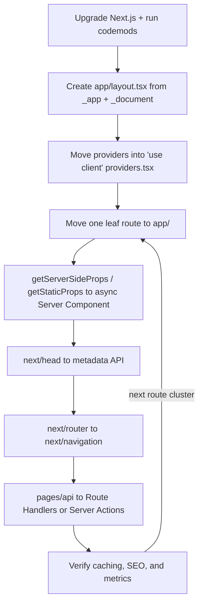

# 🚀 6. Deployment & DevOps (Q49–60, Q68)

> **Reviewed:** 2026-09 · Modernized for Next.js 15/16 App Router. Legacy (Pages Router) topics are labeled.

---

## Q49. ▲ ▲ ▲ Deploying Next.js applications to Vercel

Vercel provides zero-config deployment with automatic deployments on git push, automatic image optimization, edge functions that run at edge locations, global content delivery via CDN, and built-in performance monitoring with analytics - optimized for Next.js.

- **Trade-offs**: The catch is Vercel provides zero-config deployment with preview URLs per branch and first-class support for streaming, ISR, and PPR, but watch out - usage-based pricing (functions, image optimization, bandwidth) needs monitoring, custom servers aren't supported, and some features map to Vercel-specific infrastructure. Next.js also runs on any Node.js host or container (`output: 'standalone'`), and other platforms support it through adapters (e.g. OpenNext for AWS/Cloudflare).

Example:

```javascript
// Usually no vercel.json is needed - Vercel detects Next.js automatically.
// Optional vercel.json for platform settings:
{
  "regions": ["iad1"],
  "crons": [{ "path": "/api/cron/cleanup", "schedule": "0 3 * * *" }]
}

```

---

## Q50. 🖥️ Creating custom servers for Next.js

Create a custom server using `next()` with Node's `http` module or Express - only when you truly need something Next.js can't do in-process, like attaching a WebSocket server to the same port or embedding Next.js in an existing Node app. Most former reasons (custom routing, headers, auth gating, APIs) are now covered by Route Handlers, middleware/`proxy.ts`, and `next.config` rewrites/headers.

- **Trade-offs**: The catch is custom servers give full control of the HTTP layer, but watch out - they can't be deployed to Vercel, they bypass the optimized `standalone` output server, and you own performance and upgrades. For real-time features, a separate WebSocket service is often cleaner.

Example:

```javascript
const express = require('express');
const next = require('next');

const dev = process.env.NODE_ENV !== 'production';
const app = next({ dev });
const handle = app.getRequestHandler();

app.prepare().then(() => {
  const server = express();
  server.get('*', (req, res) => handle(req, res));
  server.listen(3000);
});

```

---

## Q51. 🏷️ Different build output types

The `output` option in `next.config` has three values: **default** (unset - `.next` build run with `next start`, full feature set), **`'standalone'`** (copies only the needed files and a minimal `server.js` into `.next/standalone`, ideal for Docker images), and **`'export'`** (fully static HTML/CSS/JS in `out/` for any static host, with limited features - Q55). Edge runtime is not an output type; it's a per-route `runtime` setting, and platforms package it themselves.

- **Trade-offs**: The catch is `standalone` produces much smaller container images, but watch out - it doesn't copy `public/` or `.next/static` for you (copy them in the Dockerfile or serve from a CDN), and for self-hosting with multiple instances you should configure a shared cache handler so ISR/`revalidateTag` stays consistent across replicas.

Example:

```javascript
// next.config.js
const nextConfig = {
  output: 'standalone', // Self-contained build for Docker
};

```

---

## Q52. 💡 Handling environment-specific settings

Use `.env` / `.env.development` / `.env.production` for non-secret defaults (Next.js loads only the file matching `NODE_ENV`, so there's no built-in `.env.staging` - use `@next/env`/`dotenv` or, better, set real environment variables per environment in your platform or CI/CD), keep secrets in `.env.local` (git-ignored) or a secret manager, and validate required variables at startup (e.g. with Zod or `@t3-oss/env-nextjs`). Remember `NEXT_PUBLIC_` values are baked in at build time, so staging and production need separate builds if they differ.

- **Trade-offs**: The catch is different configs per environment and set environment variables in CI/CD pipeline, but watch out - never commit secrets to version control, and always validate environment variables to catch missing ones early.

Example:

```javascript
// .env.local (local development)
NEXT_PUBLIC_API_URL=http://localhost:3000/api
DATABASE_URL=postgresql://localhost:5432/dev_db

// .env.production (production defaults, committed, no secrets)
NEXT_PUBLIC_API_URL=https://api.example.com

// Staging: set NEXT_PUBLIC_API_URL=https://staging-api.example.com in the
// staging environment/CI before `next build` (NODE_ENV is still "production")

// env.ts - fail fast on missing config
import { z } from 'zod';
export const env = z.object({
  DATABASE_URL: z.string().url(),
  NEXT_PUBLIC_API_URL: z.string().url(),
}).parse(process.env);

```

---

## Q53. 📘 Integrating ESLint and TypeScript

`create-next-app` sets up TypeScript by default (`next.config.ts` is supported since Next 15, and typed routes can catch broken `<Link href>`s). For linting, use ESLint's **flat config** (`eslint.config.mjs`) with `eslint-config-next` (includes React, React Hooks, and Next.js rules; `core-web-vitals` preset recommended). In Next 16 the `next lint` command was removed and `next build` no longer runs the linter - run `eslint .` (or Biome) as its own script/CI step. `next build` still type-checks.

- **Trade-offs**: The catch is type-checking and linting in CI catch bugs early, but watch out - after upgrading to Next 16 builds won't fail on lint errors anymore unless you add a separate lint step, and the React Hooks lint rules are especially valuable if you adopt the React Compiler (they flag code the compiler can't optimize).

Example:

```bash
npm install --save-dev typescript @types/react @types/node eslint eslint-config-next

# package.json scripts
#   "lint": "eslint .",
#   "typecheck": "tsc --noEmit"

```

```javascript
// eslint.config.mjs (flat config)
import nextVitals from 'eslint-config-next/core-web-vitals';
export default [...nextVitals, { ignores: ['.next/**'] }];

```

---

## Q54. ▲ ▲ ▲ Setting up CI/CD for Next.js applications

Next.js works with various CI/CD platforms - GitHub Actions (popular CI/CD platform), Vercel (automatic deployments from Git), Docker (containerized deployment) - CI/CD improves development workflow with automated testing and deployment. Fail builds on errors for quality gates.

- **Trade-offs**: The catch is CI/CD improves development workflow with automated testing and deployment, but watch out - run tests in CI pipeline, and fail builds on errors to catch issues early before deployment.

Example:

```yaml

# .github/workflows/deploy.yml

name: Deploy to Vercel
on:
  push:
    branches: [main]
jobs:
  ci:
    runs-on: ubuntu-latest
    steps:
      - uses: actions/checkout@v4
      - uses: actions/setup-node@v4
        with:
          node-version: 22
          cache: npm
      - run: npm ci
      - run: npm run lint        # separate step: next build no longer lints in Next 16
      - run: npm run typecheck
      - run: npm test
      - run: npm run build
      # Cache .next/cache between runs to speed up builds
      # Deploy step: Vercel Git integration, `vercel deploy --prebuilt`, or push a Docker image

```

---

## Q55. 💡 Implementing static export with `exportPathMap`

Static export (`output: 'export'` in `next.config`) runs `next build` and writes plain HTML/CSS/JS to `out/` for any static host (S3, GitHub Pages, nginx). **Server Components do work** - they run once at build time - as do GET Route Handlers that produce static files, and client-side data fetching. What doesn't work is anything needing a server at request time: `cookies()`/`headers()`, dynamic routes without `generateStaticParams`, ISR/revalidation, Server Actions, middleware/proxy, rewrites/redirects/headers config, and the default image optimizer.

- **Trade-offs**: The catch is you get CDN-only hosting with no server costs, but watch out - you lose on-demand rendering and revalidation entirely, so content updates require a rebuild; use a custom image loader or `images.unoptimized`.

> **Legacy note (2026):** The `next export` CLI command and `exportPathMap` are legacy: `next export` was removed in Next 14 in favor of `output: 'export'`, and `exportPathMap` isn't supported in the App Router — use `generateStaticParams` to list paths.

Example:

```javascript
// next.config.js
const nextConfig = {
  output: 'export',
  trailingSlash: true,
  images: {
    unoptimized: true
  }
};

```

---

## Q56. 🐛 Debugging and profiling Next.js applications

Debug client code with browser DevTools and React DevTools (Profiler, plus the Performance panel's React tracks in React 19.2+), and server code with `NODE_OPTIONS='--inspect' next dev` attached to Chrome DevTools or your editor. Use the Next.js dev overlay/error messages, `@next/bundle-analyzer` (webpack builds) or Turbopack's bundle analysis tooling to find heavy client dependencies, and OpenTelemetry via `instrumentation.ts` to trace slow server renders and fetches in production. Enable browser source maps in production only if you're comfortable exposing source (or upload them privately to your error tracker).

- **Trade-offs**: The catch is debugging tools improve development experience, and enable source maps for better debugging, but watch out - monitor Core Web Vitals in production, and use Next.js built-in analyzers to identify performance bottlenecks.

Example:

```javascript
// next.config.js
const nextConfig = {
  productionBrowserSourceMaps: true,
};

```

---

## Q57. 🎨 Implementing partial prerendering and streaming

Streaming (stable since Next 13) sends HTML chunks as Suspense boundaries resolve. Partial prerendering goes further: the static parts of the route are **prerendered at build time** into a shell served instantly, and only the Suspense-wrapped dynamic parts render per request and stream into it. PPR was experimental in Next 14/15 and in Next 16 is enabled via `cacheComponents: true` (see Q67 for details and Q65 for streaming boundaries). From a deployment perspective, your host must support streaming responses and serving a cached shell plus a dynamic stream.

- **Trade-offs**: The catch is page loads progressively and improves TTFB, but watch out - Suspense boundaries define what's static vs dynamic, so a request-time API read outside a boundary makes more of the page dynamic (with Cache Components it's a build error, which is a helpful guardrail).

Example:

```javascript
import { Suspense } from 'react';

export default function Page() {
  return (
    <div>
      <header>
        <h1>Static Header</h1>
      </header>
      <Suspense fallback={<p>Loading...</p>}>
        <DynamicContent />
      </Suspense>
    </div>
  );
}

```

---

## Q58. 💡 Using Turbopack for faster development

Turbopack is Next.js's Rust-based incremental bundler. Timeline: `next dev --turbo` became stable in Next 15, production builds (`next build --turbopack`) reached beta in 15.x, and **in Next 16 Turbopack is the default for both `next dev` and `next build`**. It supports many common webpack loaders via `turbopack.rules`, and configuration moved from `experimental.turbo` to a top-level `turbopack` key.

- **Trade-offs**: The catch is much faster dev startup and HMR on large apps with no config, but watch out - custom webpack plugins (as opposed to loaders) aren't supported, so projects with a `webpack()` config may need to opt out with `next build --webpack` until they migrate; verify any build-time plugins (e.g. some monitoring SDKs) have Turbopack support.

Example:

```javascript
// next.config.ts (Next 15.3+/16)
const nextConfig = {
  turbopack: {
    rules: {
      '*.svg': { loaders: ['@svgr/webpack'], as: '*.js' },
    },
    resolveAlias: { underscore: 'lodash' },
  },
};
export default nextConfig;

// Legacy (Next 13–15.2): experimental: { turbo: { ... } }

```

---

## Q59. ▲ ▲ ▲ Migrating from Next.js 12 to Next.js 14

> **Update (2026):** The same approach applies to upgrading to Next 15/16 today; the version-specific breaking changes are listed below. For the Pages → App Router architecture migration see Q68.

Upgrade the framework first, then migrate architecture incrementally. **Framework upgrade:** bump one major at a time and run the official codemods (`npx @next/codemod@latest upgrade`). Key breaking changes along the way: 13 - new `next/link` (no child `<a>`), new `next/image` (old one moved to `next/legacy/image`), minimum React 18; 14 - `next export` removed in favor of `output: 'export'`, higher Node minimum; 15 - async `params`/`searchParams`/`cookies()`/`headers()`, `fetch` and GET Route Handlers uncached by default, React 19 for the App Router; 16 - Turbopack default, `middleware.ts` → `proxy.ts`, `next lint` removed, synchronous request-API access removed, `experimental.ppr` replaced by `cacheComponents`. **Architecture:** move routes from `pages/` to `app/` one at a time (Q68).

- **Trade-offs**: The catch is codemods automate most mechanical changes, but watch out - behavior changes (especially caching defaults in 15) don't show up as compile errors, so load-test and watch origin traffic after upgrading. Upgrade React-dependent libraries alongside Next.js.

Example:

```bash
# Upgrade Next.js, React, and types + run relevant codemods interactively
npx @next/codemod@latest upgrade latest

# Individual codemods
npx @next/codemod@latest next-async-request-api .   # Next 15 async APIs
npx @next/codemod@latest new-link .                 # Next 13 <Link> without <a>

```

---

## Q60. 🚀 Best practices for Next.js deployment

Use proper build configuration, optimize assets, enable compression and caching, disable powered-by header, generate ETags, and monitor performance in production - follow deployment best practices for production readiness. For self-hosting in 2026 also: use `output: 'standalone'` in a multi-stage Docker image on a current Node LTS, put a CDN in front for `/_next/static` (immutable, long-cached), configure a shared cache handler (e.g. Redis) when running multiple instances so ISR/tag revalidation is consistent, disable proxy buffering for streaming, set a stable `deploymentId`/build ID for skew protection across rolling deploys, and keep Next.js patched for security advisories.

- **Trade-offs**: The catch is enable compression and caching for better performance, and follow deployment best practices for production readiness, but watch out - always monitor performance in production to catch issues early and ensure optimal user experience.

Example:

```javascript
// next.config.js
const nextConfig = {
  output: 'standalone',
  compress: true,
  poweredByHeader: false,
  generateEtags: true,
};

```

---

## Q68. 🔀 Migrating from Pages Router to App Router

Both routers run side by side in one app, so migrate **route by route** instead of a big-bang rewrite. Start by creating `app/layout.tsx` (merge `_app.tsx` and `_document.tsx` into it, moving global providers into a `'use client'` `providers.tsx`), then move low-risk leaf pages first. For each route: `pages/x.tsx` → `app/x/page.tsx`; `getStaticProps`/`getServerSideProps` → fetch inside the async Server Component (with explicit caching); `getStaticPaths` → `generateStaticParams`; `next/head` → `metadata`/`generateMetadata`; `next/router` → `next/navigation` hooks; `pages/api/*` → Route Handlers or Server Actions; interactive parts → small `'use client'` components. A route can't exist in both directories at once.

- **Trade-offs**: The catch is incremental migration keeps shipping while you modernize, but watch out - navigating between a Pages route and an App route is a hard navigation (full page load), so migrate clusters of related routes together; shared components that use `next/router` need a version that works in both (or `next/compat/router`); and caching semantics differ, so compare origin traffic before and after each batch.



Example:

```javascript
// BEFORE - pages/blog/[slug].tsx (Pages Router)
import Head from 'next/head';
import { useRouter } from 'next/router';

export async function getStaticPaths() {
  const slugs = await getAllSlugs();
  return { paths: slugs.map(slug => ({ params: { slug } })), fallback: 'blocking' };
}
export async function getStaticProps({ params }) {
  const post = await getPost(params.slug);
  if (!post) return { notFound: true };
  return { props: { post }, revalidate: 300 };
}
export default function Post({ post }) {
  const router = useRouter();
  return (
    <>
      <Head><title>{post.title}</title></Head>
      <article>{post.body}</article>
      <button onClick={() => router.back()}>Back</button>
    </>
  );
}

// AFTER - app/blog/[slug]/page.tsx (App Router)
import { notFound } from 'next/navigation';
import { BackButton } from './back-button'; // 'use client', uses next/navigation

export const revalidate = 300;

export async function generateStaticParams() {
  return (await getAllSlugs()).map(slug => ({ slug }));
}

export async function generateMetadata({ params }) {
  const post = await getPost((await params).slug);
  return { title: post?.title };
}

export default async function Post({ params }) {
  const post = await getPost((await params).slug); // dedupe with React cache() if needed
  if (!post) notFound();
  return (
    <>
      <article>{post.body}</article>
      <BackButton />
    </>
  );
}

```

---

