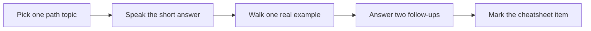

# Paths

> **Reviewed:** 2026-09 · **Level:** Senior / Tech Lead

Choose one shelf and stay on it until you can explain each step out loud. Legacy topics are labeled in the notes; prefer modern defaults unless the company still runs an older stack.

## 1. Frontend Interview Path

HTML → CSS → [JavaScript](../fundamentals/javascript/question-index.md) → [TypeScript](../fundamentals/typescript/question-index.md) → [React](../frontend/react/question-index.md) → [Next.js](../frontend/nextjs/question-index.md) → [Frontend architecture](../frontend/architecture/question-index.md)

Optional: [React Native](../frontend/react-native/question-index.md)

**Use for:** Frontend Senior / Architect loops. Pair React drills with React Internals, not as two separate curricula.

## 2. Full-Stack Path

[JavaScript](../fundamentals/javascript/question-index.md) → **Node or Python** → [SQL](../backend/sql/question-index.md) → [MongoDB](../backend/mongodb/question-index.md) → [Celery](../backend/celery/index.md) / [RabbitMQ](../backend/rabbitmq/index.md) / [MinIO](../backend/minio/index.md) → [Backend architecture](../backend/architecture/question-index.md) → [DevOps](../devops/index.md)

- Node track: [Node.js & Express](../backend/node-express/question-index.md)
- Python track: [Python Top 100](../backend/python/index.md)

**Use for:** Full-stack Senior loops that mix APIs, data, and async jobs.

## 3. System Design Path

[Backend architecture](../backend/architecture/question-index.md) → [Frontend architecture](../frontend/architecture/question-index.md) → [Case studies](../case-studies/index.md) → [DevOps telemetry and reliability](../devops/index.md)

Start with Wave-1 case studies: URL Shortener, Chat, Feed, Payment, Notification.

**Use for:** 45–60 minute design rounds. Practice RADIO on the frontend side and capacity/failure modes on the backend side.

## 4. DevOps & Production Path

[Git](../devops/git-and-collaboration/index.md) → [Docker](../devops/containers/index.md) → [CI/CD](../devops/ci-cd-and-releases/index.md) → [Cloud](../devops/cloud/index.md) → [Kubernetes](../devops/orchestration/index.md) → [Telemetry](../devops/telemetry/index.md) → [Reliability](../devops/reliability-and-incidents/index.md) → [Security](../devops/security-and-supply-chain/index.md)

**Use for:** Production ownership questions and Tech Lead “how do you ship safely?” rounds.

## 5. AI Engineering Path

[LLM fundamentals](../ai/llm-fundamentals/01-tokens-context-sampling.md) → [RAG](../ai/rag-and-retrieval/01-rag-pipeline-and-chunking.md) → [Evaluation and safety](../ai/evaluation-and-safety/01-evaluation-and-monitoring.md) → [AI app architecture](../ai/ai-app-architecture.md) → [AI-assisted development](../ai/ai-assisted-development/index.md)

**Use for:** AI feature design and “how do you use AI at work?” questions. Deep agent systems live in the next path.

## 6. Agentic Workflows Path

[Foundations](../agentic-workflows/foundations/01-what-is-an-agent.md) → [Tools and MCP](../agentic-workflows/tools-and-mcp/01-tool-calling-and-design.md) → [Orchestration](../agentic-workflows/orchestration-patterns/01-workflow-patterns.md) → [Evaluation](../agentic-workflows/evaluation-and-reliability/01-evaluating-agents.md) → [Human gates](../agentic-workflows/human-in-the-loop/01-approvals-and-escalation.md) → [Production](../agentic-workflows/production-and-ops/01-observability-and-cost.md)

**Use for:** Agent vs workflow judgment, tool design, and human-in-the-loop interviews.

## 7. Tech Lead Path

[Code reviews](../leadership/code-reviews/manual-review-guide.md) → [Automated review](../leadership/code-reviews/automated-review-process.md) → [Technical leadership](../leadership/tech-lead/01-architecture-decisions.md) → [Behavioral STAR](../leadership/behavioral/01-star-method.md) → [Case studies](../case-studies/index.md)

**Use for:** Design reviews, mentoring, incidents, and behavioral rounds.

## Daily practice loop

If you only have 30 minutes: one drill file + the matching cheatsheet. If you have 90 minutes: one case study out loud with a timer.
