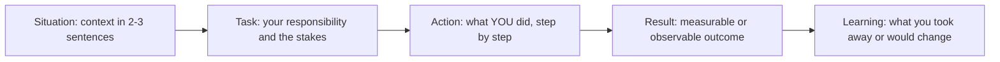

# The STAR(L) Method

> **Reviewed:** 2026-09 · **Level:** Senior / Tech Lead · **Type:** Foundational

Behavioral questions ("Tell me about a time when...") are how interviewers assess leadership, judgment and collaboration. They are looking for evidence from your past, not hypothetical answers. STAR gives your story a structure; adding **L for Learning** (or Takeaway) shows the reflection expected at senior levels.

---

## The structure



| Step | What to say | Share of a 2-minute answer |
| --- | --- | --- |
| Situation | Team, product, timeframe, the problem. Only context that matters. | About 15 percent |
| Task | Your role and what was at stake. Why it was hard. | About 10 percent |
| Action | The decisions you made and why, the people you involved, the obstacles. Use "I", not "we". | About 50 percent |
| Result | Outcome, ideally with a real measure you can back up; impact on users, team or business. | About 15 percent |
| Learning | What you learned, what you would do differently, how you applied it later. | About 10 percent |

---

## Structuring a 2-minute answer

1. **Headline first (one sentence).** "This is about how I got two teams to agree on an API contract that had blocked a launch for a month."
2. **Situation and task (about 30 seconds).** Just enough context to understand the stakes.
3. **Actions (about 60 seconds).** Two to four concrete actions, each with a *why*. This is where seniority shows: trade-offs, influence, judgment.
4. **Result (about 15 seconds).** Concrete, honest outcome. Only use numbers you actually know.
5. **Learning (about 15 seconds).** One genuine reflection.
6. **Stop.** Let the interviewer ask follow-ups. They will dig into what interests them.

> **Interview tip:** Senior interviewers deliberately probe with "what exactly did you do?" and "what would you do differently?". Prepare the layer of detail beneath each story, not just the summary.

---

## Building a story bank

Prepare 8 to 12 stories that you can adapt to many questions. A good story bank covers different competencies, projects, time periods and outcomes, including at least two failures.

Template for each story (keep it in your own notes):

```markdown
### Story: <short memorable title>
- **When / where:** <team, company, timeframe>
- **Headline (one sentence):**
- **Situation:**
- **Task / stakes:**
- **Actions (3-4 bullets, with why):**
  1.
  2.
  3.
- **Result (only facts you can defend):**
- **Learning / what I'd change:**
- **Competencies it shows:** leadership / conflict / ownership / failure / influence / ambiguity / pressure / mentoring
- **Likely follow-ups and my answers:**
```

Tips:

- Pick stories where **you** made a difference; avoid ones where you were a bystander.
- Prefer recent stories (last few years) at the scope of the role you are targeting.
- Include the messy parts: the disagreement, the mistake, the trade-off. Perfect stories sound rehearsed and unconvincing.
- Rehearse out loud and time yourself. Record once and listen back.

---

## Mapping stories to competencies

Fill a matrix like this with your own stories. Aim for every competency to have at least two stories, and no single story used for more than three competencies in the same interview loop.

| Competency | What interviewers look for | Story A | Story B | Story C |
| --- | --- | --- | --- | --- |
| Leadership | Setting direction, raising the bar, owning outcomes |  |  |  |
| Conflict | Handling disagreement constructively, reaching decisions |  |  |  |
| Ownership | Going beyond your remit, following through |  |  |  |
| Failure | Honesty, accountability, learning |  |  |  |
| Influence without authority | Persuading peers and other teams with data and empathy |  |  |  |
| Ambiguity | Structuring unclear problems, making progress with incomplete information |  |  |  |
| Delivery under pressure | Prioritizing, trade-offs, protecting quality and people |  |  |  |
| Mentoring | Growing others, delegation, feedback |  |  |  |
| Technical judgment | Trade-offs, architecture decisions, risk management |  |  |  |
| Customer focus | Connecting technical work to user and business outcomes |  |  |  |

The question-by-question guide in the [question bank](./02-question-bank.md) uses the same competency groups.

---

## Common mistakes

| Mistake | Why it hurts | Fix |
| --- | --- | --- |
| "We" for everything | Interviewer cannot tell what you did | Say "I" for your actions; credit the team for theirs |
| Long situation, short action | Most signal is in the action | Keep context to about 30 seconds |
| Hypothetical answers ("I would...") | Behavioral rounds want evidence | Start with a real example, then add what you would do now |
| No result or vague result | Story feels unfinished | State the outcome, even if it was mixed |
| Invented or inflated numbers | Falls apart under follow-ups and damages trust | Use only numbers you can explain; qualitative outcomes are fine |
| Blaming others | Signals low ownership | Describe others' actions neutrally; focus on your response |
| Fake failure ("I work too hard") | Reads as evasive | Choose a real mistake with real consequences and a real learning |
| Same story for everything | Looks like limited experience | Use your story bank's range |
| Rambling past 3 minutes | Loses the interviewer | Headline first, then stop at the learning |
| No reflection | Misses the senior signal | Always close with the learning |

---

## Q1. Why do interviewers ask behavioral questions for technical leadership roles?

**Short answer:** Because past behavior in similar situations is one of the better predictors of future behavior, and leadership skills such as handling conflict, influencing, prioritizing and owning failure are hard to test with coding exercises. Structured behavioral questions let interviewers compare candidates on the same competencies using concrete evidence.

**How to think about it:** Each question maps to one or two competencies on the interviewer's rubric. Identify the competency and make sure your story gives evidence for it.

**Example:** "Tell me about a disagreement with a peer" is assessing conflict resolution, communication and ego management, not whether you were right.

**Trade-offs and pitfalls:** Treating it as a storytelling contest rather than an evidence-gathering exercise leads to polished but shallow answers.

**Remember:** Identify the competency, give evidence, show reflection.

## Q2. How do you answer when you do not have a directly matching experience?

**Short answer:** Say so briefly, then offer the closest real example and explain how it relates, followed by how you would approach the exact situation now. Never invent a story; interviewers probe details and fabrications fall apart.

**How to think about it:** Honesty plus transferable evidence beats a fabricated perfect match.

**Example:** "I haven't managed a team through a layoff, but I did lead the team through a reorganization where two engineers moved teams. Here is what I did and what I'd apply."

**Trade-offs and pitfalls:** Too many "I haven't done that" answers can signal the role is a stretch; prepare a broad story bank.

**Remember:** Be honest, bridge to a real story, add your approach now.

---

## References

- [StaffEng guides](https://staffeng.com/guides/)
- [StaffEng: Staff archetypes](https://staffeng.com/guides/staff-archetypes/)
