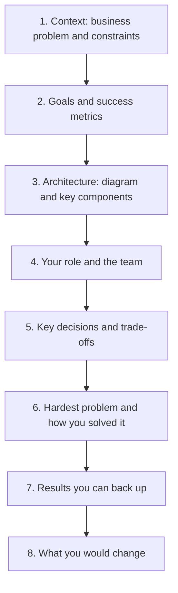

# Project Deep Dives

> **Reviewed:** 2026-09 · **Level:** Senior / Tech Lead · **Type:** Foundational

In a project deep dive the interviewer asks you to walk through a significant project you worked on, then digs into decisions, trade-offs and your personal contribution. It combines system design with behavioral assessment, and it is where seniority is most visible.

---

## Outline



Suggested timing for a 15-minute presentation followed by questions:

| Section | Time | Goal |
| --- | --- | --- |
| Context and goals | 2 min | Interviewer understands why the project mattered |
| Architecture | 3-4 min | Clear mental model: one diagram, main flows |
| Your role | 1 min | Precise scope of your ownership |
| Decisions and trade-offs | 4 min | Two or three decisions with alternatives and reasoning |
| Hardest problem | 2 min | Depth and persistence |
| Results | 1 min | Outcome for users, business and team |
| Hindsight | 1 min | Reflection and growth |

---

## Choosing the project

- **Recent and relevant:** ideally within the last few years and at the scope of the role you want.
- **Real ownership:** you made or strongly shaped key decisions.
- **Technical substance:** there were real trade-offs, not just implementing a spec.
- **Leadership signal:** for Tech Lead roles, pick a project where you led people or coordinated teams.
- **Knowable details:** you can answer questions about scale, failure modes, data model and why alternatives were rejected.
- **Confidentiality:** remove or generalize confidential names and numbers. Saying "I can't share the exact figure, but it was in the order of..." is fine.

---

## Fill-in template

Copy this into your notes and fill it in for one or two projects. Do not memorize a script; memorize the structure and key facts.

```markdown
# Project deep dive: <project name, generalized if confidential>

## 1. Context
- Company / product area:
- Business problem (one sentence):
- Why now (trigger, deadline, pain):
- Constraints (time, team, legacy, compliance, budget):

## 2. Goals and success metrics
- Primary goal:
- Success metrics (only ones I can explain):
- Non-goals:

## 3. Architecture
- Diagram (draw it on the whiteboard in under a minute):
- Main components and responsibilities:
- Key data flows (happy path and one failure path):
- Scale characteristics (users, requests, data size, as far as I can share):

## 4. My role
- Title and team size:
- What I personally owned:
- What others owned:
- How I worked with product, design, other teams:

## 5. Key decisions (2-3)
### Decision A:
- Options considered:
- Criteria:
- Choice and why:
- What we gave up:
### Decision B:
- ...

## 6. Hardest problem
- Symptom / challenge:
- What I tried, including what didn't work:
- Resolution:

## 7. Results
- Delivery outcome:
- User / business impact (facts I can defend):
- Team impact (skills, process, morale):

## 8. What I would change
- Technical:
- Process / leadership:

## Likely follow-ups and my answers
- How did it scale / fail?
- Why not <alternative>?
- What would you do with 10x the load?
- What was your biggest mistake on this project?
```

---

## Q1. How do you present a project deep dive effectively?

**Short answer:** I start with a one-sentence summary of the problem and why it mattered, then show one clear architecture diagram, then state my exact role. Most of the time goes on two or three key decisions: the options, the criteria and why we chose what we did, including what we gave up. I finish with results I can back up and what I would do differently, then invite questions.

**How to think about it:** The interviewer is looking for depth of understanding, quality of judgment and your personal contribution. Structure makes all three easy to see.

**Example:** "We replaced a nightly batch pricing job with an event-driven pipeline so price changes reached the storefront within minutes instead of the next day. I led the design and a team of four."

**Trade-offs and pitfalls:** Spending ten minutes on context; describing the whole system at one level of detail; saying "we" throughout so your contribution is invisible.

**Remember:** Problem, diagram, role, decisions, results, hindsight.

## Q2. How do you handle deep follow-up questions you cannot answer?

**Short answer:** I say honestly what I know and what I don't, explain how I would find out or reason about it now, and avoid guessing numbers. If it was owned by someone else, I say so and explain the interface I had with that part.

**How to think about it:** Interviewers deliberately probe until you reach the edge of your knowledge. How you behave at that edge is part of the signal.

**Example:** "I didn't own the database tuning, a colleague did. What I know is that we moved the hot queries to a read replica. If I were doing it now, I'd start by checking the slow query log and index usage."

**Trade-offs and pitfalls:** Bluffing is quickly exposed. Saying "I don't know" too often suggests the project was not really yours; choose a project you know deeply.

**Remember:** Honest edges, reason out loud, name the owner.

## Q3. How do you make your contribution clear without dismissing the team?

**Short answer:** I describe the team and what others owned in one sentence, then use "I" for my own decisions and actions, and "we" for joint outcomes. I explicitly credit specific people for key contributions.

**How to think about it:** Interviewers need to evaluate you, not your team. Clear attribution shows both leadership and honesty.

**Example:** "The team was five engineers. I designed the event schema and the rollout plan and led the cross-team review; Sam built the consumer service and Ana owned the load testing."

**Trade-offs and pitfalls:** Over-claiming is exposed by follow-ups; under-claiming undersells you.

**Remember:** Credit others specifically, own your part with "I".

## Q4. What should the "what would you change" section contain?

**Short answer:** One technical and one process or leadership change, each with the reasoning and what you learned. It shows you reflect and grow, and that you understand the trade-offs better now than at the time.

**How to think about it:** Hindsight answers are a strong seniority signal because they show judgment has improved.

**Example:** "Technically, I'd introduce the schema registry from the start; we added it later at higher cost. As a lead, I'd bring the partner team into the design review earlier; late involvement cost us a month."

**Trade-offs and pitfalls:** "Nothing" signals lack of reflection; a long list of regrets makes the project sound like a failure.

**Remember:** One technical, one leadership, both with reasoning.

---

## References

- [StaffEng guides](https://staffeng.com/guides/)
- [ADR GitHub organization](https://adr.github.io/)
- For system design practice to strengthen the architecture part, see the [case studies](../../case-studies/index.md).
