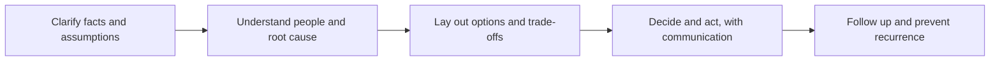

# Tech Lead Scenario Questions

> **Reviewed:** 2026-09 · **Level:** Senior / Tech Lead · **Type:** Foundational

Scenario questions ask "what would you do if...". Unlike behavioral questions, they test your approach rather than your history, though the strongest answers still reference a real experience briefly. For deeper background on each area, see [Technical leadership](../tech-lead/index.md).

A reliable structure for any scenario:

> **Interview tip:** Start with one or two clarifying questions or state your assumptions. It shows you do not jump to conclusions, which is exactly the trait interviewers are testing.

---

## Q1. A senior engineer keeps missing deadlines

**Short answer:** I would talk privately first, bringing specific examples, and ask what is going on before assuming anything. Causes range from unclear scope, over-commitment and hidden complexity to personal issues or disengagement. Based on the cause, we agree a plan: better breakdown and estimation, earlier check-ins, reducing their load, or clearer expectations. I would involve their manager if it is a performance or personal matter, and follow up regularly.

**How to think about it:** Separate the *system* (estimation, scope, interruptions) from the *individual* (skills, motivation, circumstances). Often it is the system.

**Example:** It turns out they are the go-to person for production issues and lose half their week to interruptions. Fix: an on-call rotation and visible interrupt tracking.

**Trade-offs and pitfalls:** Jumping to performance management without understanding causes; avoiding the conversation for too long.

**Remember:** Private, specific, understand the cause, agreed plan, follow up.

## Q2. Product wants a feature in 2 weeks that the team estimates at 6

**Short answer:** I would first understand the goal behind the date: is it a launch, a customer commitment, a demo? Then I would present options: a smaller version that delivers the core outcome in two weeks, the full feature with a later date, or a phased plan. I would explain what cannot be compressed, such as testing and security review for risky paths, and let product make the scope call with full information. Whatever is agreed gets written down.

**How to think about it:** Treat it as a joint problem: fixed date means flexible scope.

**Example:** "In two weeks we can deliver the invite flow for existing users. Bulk import and SSO provisioning follow in weeks three to six."

**Trade-offs and pitfalls:** Agreeing and then working the team into burnout; saying no without options; adding people late, which rarely speeds up a short project.

**Remember:** Goal behind the date, options, protect quality, written agreement.

## Q3. Two teams disagree on who owns an API

**Short answer:** I would get both teams' leads together with the facts: who the consumers are, where the domain logic lives, who is on call for it, and who has the capacity. Ownership usually follows the domain: the team that owns the underlying data and business rules should own the API. If the leads cannot agree, escalate to the shared manager or architecture forum with a written proposal. Record the decision and update CODEOWNERS, the service catalog and on-call.

**How to think about it:** Unclear ownership leads to incidents and neglect. A decision, even imperfect, is better than ongoing ambiguity.

**Example:** The orders team and payments team both modify a refund API. Decision: payments owns it because refunds are payment-domain logic; orders gets a contract and a clear change process.

**Trade-offs and pitfalls:** Shared ownership usually means no ownership. Deciding by which team is louder damages trust.

**Remember:** Domain decides, clear criteria, escalate if stuck, record and update tooling.

## Q4. Production outage during a major launch

**Short answer:** Declare an incident immediately and assign roles: incident commander, technical lead, communications. Mitigate first: roll back, disable the feature flag, or scale; do not debug in production while users are down if a rollback exists. Keep stakeholders updated on a fixed cadence with honest status. Once stable, decide with product whether and when to relaunch. Then run a blameless postmortem focused on why the launch process allowed this.

**How to think about it:** During the incident the only goal is restoring service. Launch pressure is exactly why a pre-agreed rollback plan matters.

**Example:** The new checkout causes errors under load. The flag is turned off, traffic returns to the old flow, the launch is paused and communicated, and the relaunch happens after a load test.

**Trade-offs and pitfalls:** Pushing forward with fixes under pressure instead of rolling back; silence toward leadership; blame after the fact.

**Remember:** Declare, roles, mitigate, communicate, blameless postmortem.

## Q5. You inherit a team with low morale

**Short answer:** Listen first: one-to-ones with everyone to understand the causes, such as unclear direction, constant firefighting, lack of recognition, or tech debt pain. Pick one or two changes that address the most common complaints and deliver them visibly, like reducing on-call pain or clarifying priorities. Communicate openly, recognize good work, and involve the team in decisions.

**How to think about it:** Trust is built through listening and then acting on what you heard, not through big speeches.

**Example:** The top complaint is being pulled into unplanned work. Fix: a single intake channel and a protected-focus agreement with product.

**Trade-offs and pitfalls:** Making sweeping changes before understanding; promising things you cannot deliver.

**Remember:** Listen, act on top issues, visible wins, involve the team.

## Q6. A junior engineer's PR introduces a serious security issue just before release

**Short answer:** Block the merge or the release, clearly and calmly, and explain the risk. Help fix it, pairing with the junior engineer so it becomes a learning moment rather than a public failure. Then look at the system: why did the pipeline and review allow it? Add a SAST rule, a test or a checklist item so it is caught automatically next time.

**How to think about it:** Security issues are non-negotiable, but the response should be about the process gap, not the individual.

**Example:** An endpoint missing an authorization check. Fix before release, add an integration test for tenant isolation and a lint or Semgrep rule for unprotected handlers.

**Trade-offs and pitfalls:** Shipping anyway because of the date; publicly criticizing the junior engineer.

**Remember:** Block, fix together, teach privately, close the process gap.

## Q7. Your manager asks you to cut testing to hit a date

**Short answer:** I would explain the specific risks of cutting specific tests, in business terms, and offer alternatives: cut scope instead, ship behind a flag to a small cohort, or keep tests on high-risk paths and defer lower-risk ones with a tracked follow-up. If they still decide to accept the risk, I would make sure it is an explicit, documented decision and put mitigations like monitoring and rollback in place.

**How to think about it:** You are advising on risk, not refusing. Make the trade-off explicit and owned.

**Example:** "Skipping integration tests on refunds risks double refunds in production. We can hit the date by releasing refunds to internal users first while tests are finished."

**Trade-offs and pitfalls:** Silent compliance; flat refusal without alternatives.

**Remember:** Name the risk, offer alternatives, make it an explicit decision.

## Q8. Two strong engineers on your team are in constant conflict

**Short answer:** Talk to each privately to understand their perspective, then look for the root cause: overlapping ownership, different standards, communication styles or personal friction. Clarify roles and decision rights, set expectations for respectful behavior, and facilitate a joint conversation if it helps. If behavior crosses a line, address it directly and involve their manager.

**How to think about it:** Many conflicts are structural (unclear ownership) and dissolve once roles are clear.

**Example:** Both think they own the frontend architecture. Split ownership explicitly: one owns the design system, the other owns data-fetching and state; architecture decisions go through a short ADR process.

**Trade-offs and pitfalls:** Taking sides; ignoring it until the team is affected.

**Remember:** Understand both, fix structure, set expectations, escalate behavior issues.

## Q9. Leadership wants to rewrite the system in a new technology

**Short answer:** I would understand the underlying problem the rewrite is meant to solve, whether it is hiring, performance, or delivery speed, and then evaluate whether a rewrite is the best way to solve it. Usually an incremental migration using the strangler fig pattern is lower risk. I would present options with costs, risks and timelines, and if a migration proceeds, propose a pilot on one bounded component first.

**How to think about it:** Rewrites frequently take longer than planned and freeze feature work. Question the goal, not the leader.

**Example:** The goal is faster page loads. Profiling shows most of the cost is in data fetching and bundle size, which can be fixed without changing frameworks.

**Trade-offs and pitfalls:** Dismissing the idea without analysis; agreeing to a big-bang rewrite without a pilot.

**Remember:** Understand the goal, compare options, pilot, prefer incremental.

## Q10. A key engineer resigns in the middle of a critical project

**Short answer:** Understand their reasons, and if appropriate, see whether anything can change, but respect the decision. Plan the handover immediately: document their areas, pair them with successors, record walkthroughs. Reassess the project plan and communicate any impact on timelines to stakeholders early. Afterwards, reduce single points of knowledge across the team.

**How to think about it:** The resignation reveals a bus-factor risk that existed before.

**Example:** A structured handover plan: list of owned systems, one pairing session per system, runbooks updated, and successors shadowing on-call before the last day.

**Trade-offs and pitfalls:** Hiding the impact from stakeholders; overloading the remaining team without re-planning.

**Remember:** Respect, handover plan, re-plan, communicate, reduce bus factor.

## Q11. The team keeps getting interrupted by production issues and never finishes planned work

**Short answer:** Make the interrupt load visible by tracking it for a few sprints. Then introduce an on-call or "interrupt shield" rotation so one person handles incoming issues while the rest focus, and invest in fixing the top recurring causes. Agree with product on a capacity allocation for operational work so planning reflects reality.

**How to think about it:** Unplanned work is a signal of reliability debt; treat the root causes as product work.

**Example:** Tracking shows most interruptions come from two noisy alerts and one flaky batch job. Fixing those frees significant capacity.

**Trade-offs and pitfalls:** Heroics that hide the problem; ignoring it in planning.

**Remember:** Measure, shield, fix top causes, plan for reality.

## Q12. An engineer on your team disagrees with your architecture decision and keeps reopening it

**Short answer:** Meet them privately, acknowledge their concerns, and check whether there is new information that warrants revisiting. If yes, revisit openly. If not, explain that the decision was made through a fair process, point to the ADR and its revisit triggers, and ask them to commit. If they continue, treat it as a behavior issue affecting the team.

**How to think about it:** Healthy teams allow disagreement before decisions and commitment after them.

**Example:** "If our load tests show latency above the target, we'll revisit as the ADR says. Until then I need you fully behind this approach."

**Trade-offs and pitfalls:** Refusing to ever revisit decisions; letting relitigation stall the team.

**Remember:** Listen, new information reopens, otherwise commit.

## Q13. You are asked to lead a team working in a technology you do not know well

**Short answer:** Be open about it, lean on the team's expertise for implementation decisions, and focus my contribution on what transfers: direction, priorities, architecture principles, quality practices and communication. Invest time learning quickly through pairing, code reading and small contributions, and ask good questions in reviews.

**How to think about it:** A Tech Lead's value is not being the best coder in every technology; it is making the team effective.

**Example:** Leading a mobile team as a web engineer: pair with the senior mobile engineer, own release process and cross-team API design, ship a small feature within the first month.

**Trade-offs and pitfalls:** Pretending to know; making technical calls in areas where the team knows better.

**Remember:** Honest, leverage the team, contribute what transfers, learn fast.

## Q14. Your team's code review process has become a bottleneck

**Short answer:** Measure where the delay is: time to first review, number of rounds, PR size or CI time. Then address the biggest cause: a review SLA, load-balanced auto-assignment, smaller or stacked PRs, more automation for mechanical checks, and earlier design discussions so reviews are not where architecture is debated.

**How to think about it:** Review delay is usually queueing, not reviewing.

**Example:** See [metrics and team adoption](../code-reviews/05-metrics-and-team-adoption.md) and [automated review process](../code-reviews/automated-review-process.md).

**Trade-offs and pitfalls:** Speeding up by rubber-stamping; blaming individual reviewers.

**Remember:** Measure, fix the biggest queue, automate the mechanical.

## Q15. A stakeholder escalates to your manager that your team is "too slow"

**Short answer:** Don't get defensive. Meet the stakeholder to understand what they expected and what they experienced, then look at the data: lead time, what was delivered, what was blocking. Often the issue is visibility or expectations rather than speed. Share a clear plan: better status updates, clearer prioritization with product, and any real bottlenecks you will fix. Keep your manager informed.

**How to think about it:** Perception of speed is shaped by communication as much as by throughput.

**Example:** The stakeholder's requests sat in a backlog they could not see. Fix: a shared roadmap view and a monthly review with them.

**Trade-offs and pitfalls:** Dismissing the complaint; promising faster delivery without changing anything.

**Remember:** Listen, data, fix visibility and real bottlenecks, communicate.

---

## References

- [Google SRE Book: Managing Incidents](https://sre.google/sre-book/managing-incidents/)
- [Google SRE Book: Postmortem Culture](https://sre.google/sre-book/postmortem-culture/)
- [Martin Fowler: Strangler Fig Application](https://martinfowler.com/bliki/StranglerFigApplication.html)
- [StaffEng guides](https://staffeng.com/guides/)
