# CI Quality Gates

> **Reviewed:** 2026-09 · **Level:** Senior / Tech Lead · **Type:** Foundational

A quality gate is a check that must pass before code can move forward. This page details each gate from the [automated review pipeline](./automated-review-process.md) with example configuration, and then explains how to introduce gates on a legacy codebase without stopping delivery.

---

## Gate overview

| Gate | Tool examples | Blocking? | Typical runtime |
| --- | --- | --- | --- |
| Formatting | Prettier, Biome | Yes | Seconds |
| Lint | ESLint, Biome, Ruff | Yes (errors), ratchet warnings | Seconds to a minute |
| Typecheck | `tsc --noEmit`, mypy | Yes | Seconds to minutes |
| Unit and integration tests | Vitest, Jest, pytest | Yes | Minutes |
| Coverage | V8 / Istanbul via Vitest or Jest | Yes on changed code | Included in tests |
| E2E smoke | Playwright, Cypress | Yes for smoke, advisory or nightly for full | Minutes |
| SAST | CodeQL, Semgrep | Yes for new high severity | Minutes |
| Dependencies | Dependabot, Renovate, dependency review | Yes for new critical/high | Seconds |
| Secrets | gitleaks, GitHub push protection | Always | Seconds |
| Bundle size | size-limit, bundlewatch | Yes with override label | Seconds after build |

Runtimes depend heavily on repository size and caching; measure your own and set a pipeline time budget (for example "PR checks finish in under N minutes") as a team goal.

---

## Formatting

```json
// package.json (excerpt)
{
  "scripts": {
    "format": "prettier --write .",
    "format:check": "prettier --check ."
  }
}
```

Run `format:check` in CI, `format` in a pre-commit hook via lint-staged. Format the whole repository once in a single dedicated commit, and add that commit hash to `.git-blame-ignore-revs` so `git blame` stays useful.

---

## ESLint (flat config)

```js
// eslint.config.js
import js from "@eslint/js";
import tseslint from "typescript-eslint";
import reactHooks from "eslint-plugin-react-hooks";
import jsxA11y from "eslint-plugin-jsx-a11y";

export default tseslint.config(
  { ignores: ["dist/**", "coverage/**", "**/*.generated.ts"] },
  js.configs.recommended,
  ...tseslint.configs.recommendedTypeChecked,
  {
    languageOptions: {
      parserOptions: { projectService: true, tsconfigRootDir: import.meta.dirname },
    },
    plugins: { "react-hooks": reactHooks, "jsx-a11y": jsxA11y },
    rules: {
      ...reactHooks.configs.recommended.rules,
      ...jsxA11y.configs.recommended.rules,
      "@typescript-eslint/no-explicit-any": "error",
      "@typescript-eslint/no-floating-promises": "error",
      "no-console": ["warn", { allow: ["warn", "error"] }],
      "no-restricted-imports": [
        "error",
        { patterns: [{ group: ["../../*"], message: "Use the @/ path alias for deep imports." }] },
      ],
    },
  },
);
```

CI command:

```bash
npx eslint . --max-warnings=0
```

Tips:

- Encode review comments that keep recurring as lint rules. If three reviewers wrote "don't import from another feature's internals", that is an `eslint-plugin-boundaries` or `no-restricted-imports` rule.
- Type-aware rules (`no-floating-promises`, `no-misused-promises`) catch real bugs but are slower; cache with `--cache` locally.
- Prefer autofixable rules; they cost the team almost nothing.

---

## Typecheck

```bash
npx tsc --noEmit
# monorepo with project references
npx tsc -b --pretty
```

Recommended `tsconfig.json` strictness for new code:

```json
{
  "compilerOptions": {
    "strict": true,
    "noUncheckedIndexedAccess": true,
    "exactOptionalPropertyTypes": true,
    "noImplicitOverride": true,
    "noFallthroughCasesInSwitch": true,
    "skipLibCheck": true
  }
}
```

Bundlers such as Vite, esbuild and SWC strip types without checking them, so a green build does **not** mean the types are valid. `tsc --noEmit` must be its own gate.

---

## Unit and integration tests with coverage thresholds

### Vitest

```ts
// vitest.config.ts
import { defineConfig } from "vitest/config";

export default defineConfig({
  test: {
    environment: "jsdom",
    coverage: {
      provider: "v8",
      reporter: ["text", "json-summary", "lcov"],
      include: ["src/**/*.{ts,tsx}"],
      exclude: ["src/**/*.stories.tsx", "src/**/*.d.ts"],
      thresholds: {
        lines: 80,
        branches: 75,
        functions: 80,
        statements: 80,
        autoUpdate: false,
      },
    },
  },
});
```

### Jest

```js
// jest.config.js
module.exports = {
  collectCoverageFrom: ["src/**/*.{ts,tsx}", "!src/**/*.stories.tsx"],
  coverageThreshold: {
    global: { lines: 80, branches: 75, functions: 80, statements: 80 },
    "./src/payments/": { lines: 90, branches: 90 },
  },
};
```

The numbers above are placeholders to illustrate syntax, not recommendations. Pick thresholds from your current baseline and raise them over time.

Guidance:

- **Changed-code coverage** (diff coverage, reported by tools such as Codecov or a custom script over lcov) is a better gate than global coverage on a legacy repo.
- Coverage proves that lines *executed*, not that behavior was *asserted*. Reviewers still judge test quality; mutation testing (for example Stryker) can measure assertion strength on critical modules.
- Keep unit tests hermetic: no network, fixed clock, seeded randomness. Flaky tests in a required gate destroy trust.

---

## E2E smoke tests with Playwright

```ts
// playwright.config.ts
import { defineConfig, devices } from "@playwright/test";

export default defineConfig({
  testDir: "./e2e",
  retries: process.env.CI ? 1 : 0,
  forbidOnly: !!process.env.CI,
  reporter: process.env.CI ? [["github"], ["html", { open: "never" }]] : "list",
  use: {
    baseURL: process.env.BASE_URL ?? "http://localhost:3000",
    trace: "on-first-retry",
  },
  webServer: {
    command: "npm run start",
    url: "http://localhost:3000",
    reuseExistingServer: !process.env.CI,
  },
  projects: [{ name: "chromium", use: { ...devices["Desktop Chrome"] } }],
});
```

```ts
// e2e/checkout.spec.ts
import { test, expect } from "@playwright/test";

test("guest can reach payment step @smoke", async ({ page }) => {
  await page.goto("/products/sample-sku");
  await page.getByRole("button", { name: "Add to cart" }).click();
  await page.getByRole("link", { name: "Checkout" }).click();
  await expect(page.getByRole("heading", { name: "Payment" })).toBeVisible();
});
```

Run `npx playwright test --grep @smoke` on PRs; the full suite in the merge queue or nightly. Keep the smoke suite to the handful of journeys that would be a production incident if broken (login, checkout, core create/read flow). Track retries: a test that only passes on retry is flaky and should be quarantined and fixed.

---

## SAST: Semgrep and CodeQL

### Semgrep

```yaml
# .semgrep.yml (custom rules alongside a registry ruleset)
rules:
  - id: no-dangerously-set-inner-html-without-sanitize
    languages: [typescript, javascript]
    severity: ERROR
    message: "dangerouslySetInnerHTML must receive DOMPurify.sanitize(...) output."
    patterns:
      - pattern: <$EL dangerouslySetInnerHTML={{ __html: $X }} />
      - pattern-not: <$EL dangerouslySetInnerHTML={{ __html: DOMPurify.sanitize(...) }} />
```

```bash
# Only report findings introduced relative to main
semgrep ci --config p/typescript --config .semgrep.yml
```

In CI on a pull request, `semgrep ci` reports findings introduced by the diff, which is the natural way to baseline a legacy repo.

### CodeQL

CodeQL builds a database from the code and runs queries for data-flow issues such as injection, path traversal and unsafe deserialization. On GitHub, enable default setup or use `github/codeql-action` (see the workflow in [automated review process](./automated-review-process.md)). Results appear as code scanning alerts, and a branch ruleset can block merges on new alerts above a chosen severity.

Semgrep is fast and easy to extend with team-specific rules; CodeQL's strength is deeper inter-procedural data-flow analysis. Many teams run both.

---

## Dependencies: Dependabot and Renovate

### Dependabot

```yaml
# .github/dependabot.yml
version: 2
updates:
  - package-ecosystem: npm
    directory: "/"
    schedule:
      interval: weekly
    open-pull-requests-limit: 5
    groups:
      dev-dependencies:
        dependency-type: development
        update-types: [minor, patch]
  - package-ecosystem: github-actions
    directory: "/"
    schedule:
      interval: monthly
```

### Renovate

```json
{
  "$schema": "https://docs.renovatebot.com/renovate-schema.json",
  "extends": ["config:recommended"],
  "schedule": ["before 6am on monday"],
  "prConcurrentLimit": 5,
  "packageRules": [
    {
      "matchDepTypes": ["devDependencies"],
      "matchUpdateTypes": ["minor", "patch"],
      "groupName": "dev dependencies (non-major)",
      "automerge": true
    },
    {
      "matchUpdateTypes": ["major"],
      "labels": ["breaking-upgrade"],
      "automerge": false
    }
  ],
  "vulnerabilityAlerts": { "labels": ["security"], "schedule": ["at any time"] }
}
```

Pair update bots with `actions/dependency-review-action` on PRs, which fails when a PR *introduces* a dependency with a known vulnerability or disallowed license.

---

## Secrets: gitleaks

```toml
# .gitleaks.toml
[extend]
useDefault = true

[allowlist]
description = "Test fixtures with fake keys"
paths = ['''tests/fixtures/.*''']
```

- Run gitleaks in pre-commit **and** CI (hooks can be bypassed).
- Enable GitHub secret scanning with push protection where available, so secrets are rejected at push time.
- If a secret is committed, **rotate it**. Rewriting history does not un-leak a credential that has been pushed.

---

## Bundle size: size-limit

```json
// .size-limit.json
[
  { "name": "Main bundle", "path": "dist/assets/index-*.js", "limit": "180 kB", "gzip": true },
  { "name": "Checkout route", "path": "dist/assets/checkout-*.js", "limit": "60 kB", "gzip": true }
]
```

```bash
npx size-limit
```

The limits above are examples. Set them slightly above the current size and treat every increase as a conscious decision: the PR must carry an override label approved by a code owner, and the limit is updated in the same PR. Report size deltas in a single PR comment so reviewers see the cost of a new dependency.

---

## Rolling out gates on a legacy repository

Turning on strict gates overnight on a large legacy codebase produces thousands of failures and a revolt. The pattern that works is **baseline, then ratchet**.

```mermaid
flowchart LR
    measure["Measure current state"] --> baseline["Record baseline of existing violations"]
    baseline --> advisory["Run gate as advisory"]
    advisory --> tune["Tune rules, remove noisy ones"]
    tune --> blockNew["Block new violations only"]
    blockNew --> ratchet["Ratchet: baseline can only shrink"]
    ratchet --> cleanup["Scheduled cleanup of old violations"]
    cleanup --> fullGate["Full blocking gate"]
```



Techniques by gate:

- **Lint:** ESLint's bulk suppressions feature (in recent ESLint versions) or tools like `eslint-nibble` / `betterer` record existing violations; CI fails only if the count increases. Alternatively apply strict rules only to changed files via lint-staged plus a per-directory `overrides` block for new code.
- **TypeScript strict mode:** enable strict in a separate `tsconfig.strict.json` that includes only migrated folders; grow the include list. Or use `// @ts-expect-error` markers generated once, and ban new ones via lint.
- **Coverage:** gate on diff coverage for new and changed code; raise the global threshold only to the new achieved level (a ratchet).
- **SAST and dependencies:** baseline existing alerts, block only new ones, and create tracked issues with owners for the backlog.
- **Bundle size:** set the limit to today's size plus a small margin; any increase requires an explicit decision.

Communication matters as much as tooling: announce the gate, the date it becomes blocking, the escape hatch, and who to ask for help. Share a weekly trend of the baseline shrinking so the effort is visible.

> **Interview tip:** "Baseline, block new violations, ratchet" is the phrase to use. It shows you can improve quality without freezing delivery.

---

## Interview questions

## Q1. You join a team with no CI checks and 5,000 lint errors. What do you do?

**Short answer:** I would not turn everything on at once. First, add formatting (one mechanical commit) and a typecheck so the build is trustworthy. Then run lint in CI as advisory, record a baseline, and block only new violations. Fix the backlog incrementally, prioritizing rules that catch real bugs, and publish the trend. Once the count is near zero, make the gate fully blocking.

**How to think about it:** Separate *stop the bleeding* (no new violations) from *pay down the debt* (existing ones). The first is cheap and immediate; the second is scheduled work.

**Example:** Enable `@typescript-eslint/no-floating-promises` only for new files first, because it catches production bugs, while leaving stylistic rules for later.

**Trade-offs and pitfalls:** Big-bang cleanups create huge PRs that are hard to review and cause merge conflicts for everyone. Blocking too early without a baseline makes the gate the enemy.

**Remember:** Baseline, block new, ratchet down.

## Q2. Why keep `tsc --noEmit` as a separate gate if the build passes?

**Short answer:** Modern bundlers transpile TypeScript by stripping types without checking them, for speed. A green build proves the code can be bundled, not that it type-checks. The typecheck must be its own required step.

**How to think about it:** Know what each tool actually guarantees rather than assuming.

**Example:** A Vite build succeeds while a component receives a prop of the wrong type; only `tsc --noEmit` fails.

**Trade-offs and pitfalls:** Typechecking large monorepos can be slow; use project references and incremental builds (`tsc -b`) and cache in CI.

**Remember:** Bundling is not typechecking.

## Q3. Is a coverage threshold a good quality gate?

**Short answer:** It is a useful floor, not a measure of quality. I prefer diff coverage on changed code over global coverage, set thresholds from the current baseline, and rely on reviewers and, for critical modules, mutation testing to judge whether tests assert meaningful behavior.

**How to think about it:** Goodhart's law applies: when coverage becomes the target, people write assertion-free tests.

**Example:** A payment module gets a higher per-directory threshold than UI glue code.

**Trade-offs and pitfalls:** Global thresholds punish people who delete tested code or touch legacy files; diff coverage avoids that.

**Remember:** Coverage shows what ran, not what was verified.

## Q4. How do you deal with flaky e2e tests in a required check?

**Short answer:** Quarantine them immediately so they stop blocking merges, assign an owner to fix or delete each one, track flake rate over time, and keep the required e2e suite small and focused on critical journeys. Retries hide flakiness, so I monitor tests that pass only on retry.

**How to think about it:** A flaky required gate is worse than no gate, because it teaches people to ignore red.

**Example:** Tag flaky tests with `@quarantine`, exclude them from the required job, run them in a nightly job and report their pass rate.

**Trade-offs and pitfalls:** Quarantine can become a graveyard; put a time limit on it.

**Remember:** Required checks must be trustworthy.

---

## References

- [ESLint: Configuration files](https://eslint.org/docs/latest/use/configure/configuration-files)
- [typescript-eslint](https://typescript-eslint.io/)
- [TypeScript TSConfig reference](https://www.typescriptlang.org/tsconfig/)
- [Vitest: Coverage](https://vitest.dev/guide/coverage)
- [Jest: coverageThreshold](https://jestjs.io/docs/configuration#coveragethreshold-object)
- [Playwright: Test configuration](https://playwright.dev/docs/test-configuration)
- [Semgrep documentation](https://semgrep.dev/docs/)
- [CodeQL documentation](https://codeql.github.com/docs/)
- [GitHub Docs: Dependabot options reference](https://docs.github.com/en/code-security/dependabot/working-with-dependabot/dependabot-options-reference)
- [Renovate documentation](https://docs.renovatebot.com/)
- [gitleaks](https://github.com/gitleaks/gitleaks)
- [size-limit](https://github.com/ai/size-limit)
