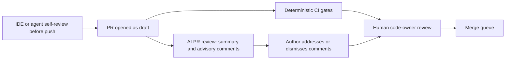

# AI-Assisted Code Review

> **Reviewed:** 2026-09 · **Level:** Senior / Tech Lead · **Type:** Emerging

AI reviewers (PR bots that comment on diffs, and review features inside the IDE or coding agent) are now a normal part of many pipelines. They are useful as a **first pass** and a **second pair of eyes**, not as an approver. This page covers where they fit, how to configure them, the guardrails a Tech Lead should insist on, and how to measure whether they are helping.

This area changes quickly. Treat tool capabilities as things to verify in a trial on your own codebase, not as fixed facts. For broader context see [AI-assisted development](../../ai/ai-assisted-development/index.md) and [Agentic workflows](../../agentic-workflows/index.md).

---

## Where AI review fits



Two placements:

- **Author-side (IDE, local agent):** the author asks for a review before pushing. Cheapest place to fix problems, and nobody else's time is spent.
- **PR-side (bot):** runs on every PR, posts a summary and inline comments. Good for consistency and for PRs whose authors did not self-review.

Neither placement replaces deterministic gates. If a rule can be a lint rule or a Semgrep rule, make it one: it is faster, cheaper, reproducible and does not vary between runs.

---

## What AI review tends to catch well vs poorly

These are qualitative patterns reported widely by teams; validate them on your own code.

| Tends to do well | Tends to do poorly |
| --- | --- |
| Summarizing what a PR changes | Knowing whether the change solves the *right* problem |
| Obvious logic slips: off-by-one, inverted condition, missing `await`, unhandled null | Business rules and domain invariants not visible in the diff |
| Missing error handling, missing input validation | Cross-service or cross-repo impact |
| Inconsistent naming, dead code, copy-paste mistakes | Architecture fit and long-term maintainability trade-offs |
| Suggesting tests for untested branches | Judging whether tests are meaningful vs superficial |
| Common security smells (string-built SQL, unsafe HTML) | Authorization model and data-exposure design flaws |
| Documentation and comment drift | Performance under real production data and traffic |
| Explaining unfamiliar code to a reviewer | Organizational context: deprecations, team agreements, roadmap |

Failure modes to expect:

- **Confident but wrong** comments (hallucinated APIs, incorrect claims about library behavior).
- **Noise:** stylistic nitpicks that duplicate the linter.
- **Inconsistency:** different comments on re-runs of the same diff.
- **Limited context:** only the diff and a few nearby files, unless configured with more.

---

## Configuring rules and context

Most AI review tools accept some combination of:

- **Repository instructions** (a rules or guidelines file checked into the repo): team conventions, architecture boundaries, "do not comment on formatting, the linter owns that".
- **Path-scoped rules:** stricter guidance for `services/payments/**`, lighter for `docs/**`.
- **Severity and volume controls:** only comment on likely bugs and security issues; limit comments per PR.
- **Ignore lists:** generated code, lockfiles, snapshots, vendored code.
- **Context sources:** linked issue, design doc, related files, past review comments.

Example of a repository review-guidelines file (format varies by tool):

```markdown
# Review guidelines for AI reviewers

## Scope
- Comment only on: correctness bugs, security issues, missing error handling,
  missing tests for new branches, breaking API changes.
- Do NOT comment on formatting, import order or naming style; ESLint and Prettier own those.
- Skip generated files: `**/*.generated.ts`, `**/__snapshots__/**`, lockfiles.

## Architecture rules
- Feature modules under `src/features/*` must not import each other's internals;
  cross-feature access goes through `src/features/<name>/index.ts`.
- All network calls go through `src/lib/http.ts` (handles auth, retries, tracing).
- Server-only modules must not be imported from client components.

## Security
- Treat any use of `dangerouslySetInnerHTML`, `eval`, or string-built SQL as high severity.
- Never log tokens, passwords or full personal data.

## Tone
- Be concise. One comment per issue. Include a suggested fix when confident.
- If unsure, phrase as a question and say why.
```

Security and privacy checklist before enabling a tool:

- Where is code sent and retained? Is it used for training? Does it meet your data-handling policy?
- Least-privilege tokens: the bot can comment, not approve or merge.
- Prompt-injection awareness: PR content (including from external contributors) can contain instructions aimed at the bot. The bot must not have permissions that make that dangerous.

---

## Guardrails a Tech Lead should insist on

1. **Human approval is always required.** The AI reviewer is never a required approver and never counts toward the approval count.
2. **Never auto-merge on AI review alone for production paths.** Auto-merge is acceptable only for narrowly defined low-risk changes (for example patch-level dev-dependency bumps with green deterministic checks), and that decision is based on the deterministic checks, not the AI comment.
3. **Advisory, not blocking.** AI comments should not be required checks: they are non-deterministic.
4. **Author owns the resolution.** Authors reply or resolve each AI comment; reviewers can see what was dismissed and why.
5. **AI-generated code gets the same review bar** as human code, including tests. Reviewers should be especially careful with large AI-generated diffs, which are easy to skim and approve.
6. **Accountability stays with people.** "The bot didn't flag it" is never a postmortem root cause.

> **Interview tip:** Interviewers are probing judgment. A strong answer is enthusiastic about the productivity gain and clear about the boundary: AI can suggest, humans decide, deterministic checks enforce.

---

## Measuring usefulness

Do not rely on vendor claims or on feelings. Run a time-boxed trial and measure. Define the metrics before the trial.

| Metric | How to collect | What it tells you |
| --- | --- | --- |
| Accepted-comment rate | Comments that led to a code change or were marked helpful, divided by total comments | Signal vs noise |
| False-positive rate | Comments dismissed as wrong, sampled and labeled by reviewers | Trust; high values mean people will stop reading |
| Duplicate-of-linter rate | Comments that a lint rule already covers | Configuration quality |
| Unique catches | Issues found by AI that humans and CI missed, sampled | Real added value |
| Review turnaround | Time from ready-for-review to first human review and to merge | Whether it speeds up or slows down the flow |
| Escaped defects | Production bugs in categories the AI is meant to catch | Outcome, measured over longer periods |
| Developer sentiment | Short survey at the end of the trial | Adoption and trust |

Practical approach:

- Pick a few representative repositories and run the tool for a fixed period.
- Have reviewers label a sample of AI comments (useful / wrong / noise).
- Compare turnaround and escaped defects against the period before, being honest about confounders (team changes, release cycles).
- Decide explicitly: keep, tune, or remove. Revisit periodically because tools change quickly.

---

## Interview questions

## Q1. Would you let an AI bot approve pull requests?

**Short answer:** No, not for production code. I use AI review as an advisory first pass: it summarizes the change and flags likely bugs so the human reviewer can focus on design and risk. Approval stays with a human code owner, and merge is gated on deterministic checks. The only automated merges I allow are narrow, low-risk categories like patch-level dev-dependency updates, and those rely on tests passing, not on an AI opinion.

**How to think about it:** Separate *suggestion*, *enforcement* and *accountability*. AI is good at suggestion, deterministic tools at enforcement, and only people can be accountable.

**Example:** A bot flags a missing `await` in a payment handler; the author fixes it; the payments code owner still reviews the idempotency logic, which the bot cannot judge.

**Trade-offs and pitfalls:** Over-trusting AI leads to rubber-stamp reviews of large diffs. Under-using it wastes a cheap first pass.

**Remember:** AI suggests, CI enforces, humans approve.

## Q2. How would you evaluate whether an AI review tool is worth it?

**Short answer:** Run a time-boxed trial on representative repos with metrics defined up front: accepted-comment rate, false-positive rate from labeled samples, unique catches, review turnaround and developer sentiment. Check security and data-handling first. Then make an explicit keep, tune or drop decision.

**How to think about it:** Treat it like any tool adoption: hypothesis, measurement, decision. Avoid anchoring on vendor numbers.

**Example:** After the trial, the team keeps the bot but restricts it to bug and security categories because most style comments were dismissed.

**Trade-offs and pitfalls:** Short trials are noisy; confounders like release crunches skew turnaround metrics.

**Remember:** Measure signal vs noise before rolling out widely.

## Q3. What changes in code review when a large share of code is AI-generated?

**Short answer:** Diffs get larger and more plausible-looking, so the risk shifts to reviewers skimming. I push harder on small PRs, require the author to explain and own every change, insist on tests that encode the intended behavior, and strengthen deterministic gates. The review bar does not drop because a tool wrote the code.

**How to think about it:** Code generation is cheap; verification is the bottleneck. Invest in verification.

**Example:** A team rule: an author must be able to walk a reviewer through any AI-generated section, and the PR description states what was generated and how it was verified.

**Trade-offs and pitfalls:** Banning AI tools drives usage underground; ignoring the shift leads to quality erosion.

**Remember:** The author is accountable for every line, no matter who or what typed it.

<details>
<summary>Follow-up questions</summary>

- How do you protect against prompt injection in PR content? (Least-privilege bot tokens, no ability to approve, merge or access secrets; treat PR text as untrusted input.)
- What do you put in a repository review-guidelines file? (Scope, architecture rules, security priorities, what to ignore, tone.)
- How do you avoid duplicate comments between the linter and the AI bot? (Tell the bot explicitly what the linter owns, and measure the duplicate rate.)

</details>

---

## References

- [Google Engineering Practices: Code Review](https://google.github.io/eng-practices/review/)
- [GitHub Docs: About code owners](https://docs.github.com/en/repositories/managing-your-repositorys-settings-and-features/customizing-your-repository/about-code-owners)
- [OWASP Top 10 for Large Language Model Applications](https://owasp.org/www-project-top-10-for-large-language-model-applications/)
- [DORA research](https://dora.dev/)
