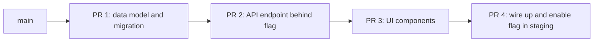
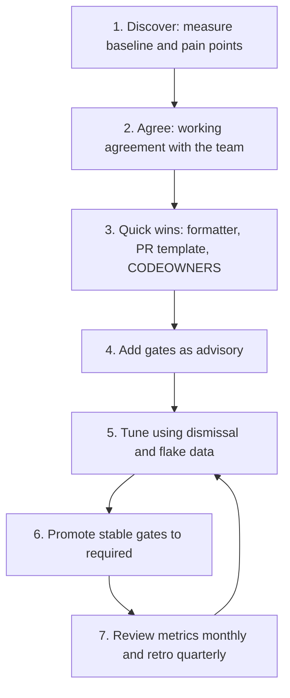

# Review Metrics and Team Adoption

> **Reviewed:** 2026-09 · **Level:** Senior / Tech Lead · **Type:** Foundational

Tools do not fix review culture on their own. This page covers what to measure, which norms make reviews fast and useful, and a step-by-step playbook for a Tech Lead rolling out review automation to a team.

---

## What to measure

Use metrics to find bottlenecks in the *system*, never to rank individuals. The moment review metrics show up in performance reviews, people game them.

| Metric | Definition | Why it matters | Watch out for |
| --- | --- | --- | --- |
| Time to first review | Ready-for-review to first human review comment or approval | Waiting is the biggest source of review delay | Drive-by "LGTM" to hit the number |
| Review turnaround (cycle time) | Ready-for-review to merge | End-to-end flow | Large PRs dominate the average; use medians and percentiles |
| PR size | Lines changed (excluding generated files, lockfiles) | Smaller PRs get faster and better reviews | Splitting into meaningless fragments |
| Review rounds | Number of change-request cycles | Unclear requirements or late design feedback | Low rounds can also mean rubber-stamping |
| Review depth | Substantive comments per PR, share of PRs with any discussion | Detects rubber-stamping | Nitpick volume is not depth |
| Escaped defects | Production bugs traced to a merged change, by category | Outcome of the whole quality system | Attribution is fuzzy; look at trends |
| Reviewer load | Reviews per person per week, distribution | Detects hero reviewers and bottlenecks | Seniority naturally skews load somewhat |
| Change failure rate | Share of deployments causing a failure needing remediation (DORA) | Links review and CI quality to production outcomes | Needs a clear definition of "failure" |

These connect directly to the DORA delivery metrics (lead time for changes, deployment frequency, change failure rate, time to restore service). Review wait time is often a large part of lead time.

Where to get data: the Git hosting platform's API, engineering-analytics tools, or a simple script that pulls PR events weekly. Start with medians and 85th/90th percentiles, not averages.

---

## Team norms that make reviews work

### Review SLA

Agree a team expectation such as "first response within one working day" (Google's guidance is that a response should come within one business day at most, and ideally much sooner). The norm is about *first response*, not full approval.

- Reviews take priority over starting new work, but not over interrupting deep focus mid-task. Batch reviews at natural breaks (start of day, after lunch).
- If you cannot review in time, say so and hand it off.
- Time zones: pair each author with at least one reviewer who overlaps working hours.

### Small PRs

- Target a size a reviewer can review thoroughly in one sitting. Many teams use a soft limit of a few hundred changed lines; pick a number and enforce it with a warning, not a hard failure.
- One logical change per PR. Refactors and behavior changes in separate PRs.
- Use feature flags so incomplete features can merge safely.

### Stacked PRs

For a large feature, create a chain of small dependent PRs, each reviewable on its own:

- Each PR targets the previous PR's branch; merge bottom-up.
- Tools such as Graphite, ghstack, git-branchless or `git rebase --update-refs` reduce the rebase pain.
- The first PR in the stack describes the overall plan and links to the design doc.

### Comment conventions

- Prefix to signal weight: `blocking:`, `suggestion:`, `nit:`, `question:`, `praise:` (similar to the Conventional Comments format).
- Approve with nits when only nits remain; do not block on preferences.
- Move long debates to a call; summarize the outcome in the PR.

### Reviewer load balancing

- CODEOWNERS on teams plus round-robin or load-balanced assignment.
- Visible review queue per person; the Tech Lead checks weekly for overload.
- Rotate the "review buddy" for juniors so knowledge spreads.
- Include reviews in planning: review is real work, not overhead.

---

## Tech Lead rollout playbook for review automation

1. **Discover.** Pull a few weeks of PR data: time to first review, PR size, rounds, CI duration, flake rate. Talk to the team: what slows you down, what frustrates you about reviews?
2. **Agree.** Write a short working agreement (review SLA, PR size guideline, comment prefixes, when to use drafts). Get the team to co-author it; imposed norms get ignored.
3. **Quick wins.** Formatter (one bulk commit plus `.git-blame-ignore-revs`), PR template, CODEOWNERS with team handles, auto-assignment. These remove friction immediately and build credibility.
4. **Add gates as advisory.** Lint, typecheck, tests, security scanning, bundle budgets, optionally AI review. Baseline legacy issues (see [CI quality gates](./03-ci-quality-gates.md)).
5. **Tune.** Remove noisy rules, fix flaky tests, speed up the pipeline (caching, affected-only runs, parallel jobs).
6. **Enforce.** Promote stable, fast, deterministic checks to required. Announce dates in advance. Document the break-glass process.
7. **Review and iterate.** Share metrics trends monthly, run a short retro on the review process each quarter, and keep adjusting.

Change-management tips:

- Lead by example: your own PRs are small, well described, and you review promptly.
- Pair automation with *removal* of manual steps, so the team feels a net gain.
- Celebrate outcomes ("median time to first review dropped") rather than activity ("we added 12 rules").
- Expect a temporary slowdown when gates become required; plan for it.

---

## Interview questions

## Q1. How do you measure whether your code review process is healthy?

**Short answer:** I look at flow and outcomes together. Flow: time to first review, review cycle time, PR size and number of rounds, using medians and percentiles. Outcomes: escaped defects and change failure rate. Health: reviewer load distribution and review depth, to catch both bottlenecks and rubber-stamping. I use these to find system problems, never to rank people.

**How to think about it:** Any single metric can be gamed; a small balanced set is harder to game and tells a fuller story.

**Example:** Time to first review is high but cycle time after that is short, so the fix is review scheduling and load balancing, not stricter checks.

**Trade-offs and pitfalls:** Metrics tied to performance evaluation get gamed; averages hide the long tail.

**Remember:** Balanced metrics, system-level, trends over time.

## Q2. One senior engineer does half of all reviews. Is that a problem?

**Short answer:** Yes, it is a bottleneck and a single point of failure, and that engineer likely has less time for their own work. I would spread ownership through CODEOWNERS on teams, load-balanced assignment, pairing juniors as second reviewers so they build confidence, and documenting the tacit knowledge that makes that person the default reviewer.

**How to think about it:** Knowledge concentration is a risk to delivery and to the person's growth and wellbeing.

**Example:** Introduce a rotation where the senior engineer reviews with a mid-level engineer for a few weeks, after which the mid-level engineer becomes a primary reviewer for that area.

**Trade-offs and pitfalls:** Removing the expert too fast can lower quality in critical areas; phase it.

**Remember:** Bus factor applies to reviews too.

## Q3. How would you introduce stacked PRs to a team used to large PRs?

**Short answer:** Start by explaining the benefit in terms the team feels: faster reviews and fewer painful rebases. Demonstrate on one real feature, provide tooling and a short guide, pair with the first few people, and add a soft PR size warning. Combine with feature flags so partial work can merge safely.

**How to think about it:** Behavior change needs a visible win, low friction and a role model.

**Example:** Split a feature into model, API, UI and wiring PRs, each merged within a day.

**Trade-offs and pitfalls:** Stacks add rebase overhead without tooling; very deep stacks become fragile.

**Remember:** Small PRs are a team habit, taught by example.

---

## References

- [Google Engineering Practices: Speed of code reviews](https://google.github.io/eng-practices/review/reviewer/speed.html)
- [Google Engineering Practices: Small CLs](https://google.github.io/eng-practices/review/developer/small-cls.html)
- [DORA research](https://dora.dev/)
- [Conventional Comments](https://conventionalcomments.org/)
- [GitHub Docs: Managing code review settings for your team](https://docs.github.com/en/organizations/organizing-members-into-teams/managing-code-review-settings-for-your-team)
