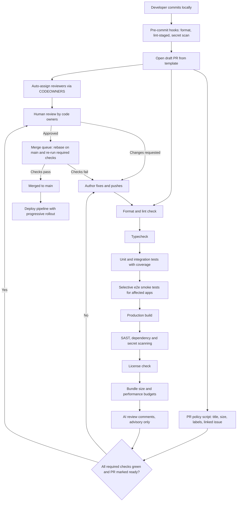

# Automated Code Review Process

> **Reviewed:** 2026-09 · **Level:** Senior / Tech Lead · **Type:** Foundational

Automation removes the mechanical parts of code review so humans can spend their attention on intent, design and risk. This page covers what to automate, how to layer the pipeline, the GitHub platform features that make it enforceable, and how to keep bots from drowning the team in noise.

Related pages: [Manual review guide](./manual-review-guide.md) · [CI quality gates in detail](./03-ci-quality-gates.md) · [AI-assisted review](./04-ai-assisted-review.md) · [Metrics and team adoption](./05-metrics-and-team-adoption.md) · [Question index](./question-index.md)

---

## Automate vs keep human

The rule of thumb: **if a check can be expressed as a deterministic rule, a machine should own it. If it requires understanding intent, context or trade-offs, a human must own it.**

| Concern | Automate | Keep human | Notes |
| --- | --- | --- | --- |
| Formatting, import order | Yes (Prettier, Biome, gofmt) | No | Never argue about formatting in a review comment |
| Lint rules, hooks rules, unused code | Yes (ESLint, Ruff) | No | Encode team conventions as rules, not tribal knowledge |
| Type correctness | Yes (`tsc --noEmit`, mypy) | No | Blocking check |
| Unit and integration tests pass | Yes | Partly | Humans judge whether the *right* things are tested |
| Coverage threshold on changed code | Yes | Partly | Coverage says code ran, not that it was asserted |
| Known vulnerable dependencies | Yes (Dependabot, Renovate, `npm audit`) | Triage only | Humans decide on upgrades that are breaking |
| Leaked secrets | Yes (gitleaks, push protection) | No | Fail closed, always |
| Static security patterns (SAST) | Yes (CodeQL, Semgrep) | Triage | Humans confirm true positives |
| License compliance | Yes | Exceptions only | Legal decides on exceptions |
| Bundle size and performance budgets | Yes (size-limit, Lighthouse CI) | Exceptions | Humans approve intentional budget increases |
| Summaries, obvious bug patterns | AI review (advisory) | Yes | Never the sole approver |
| Does this solve the right problem? | No | Yes | Requires product context |
| Architecture and boundaries | Partly (dependency rules) | Yes | Tools can enforce layering, not judge it |
| Naming, readability, abstractions | No | Yes | Taste and team context |
| Security design (authz model, data exposure) | No | Yes | Tools find patterns, humans find design flaws |
| Rollout, migration and rollback plan | No | Yes | Needs operational judgment |
| Knowledge sharing and mentoring | No | Yes | One of the main purposes of review |

> **Interview tip:** Say explicitly that the goal of automation is not fewer reviews but *better* reviews: "machines handle the checklist, humans handle the judgment."

---

## The layered pipeline

Order the checks from **cheapest and fastest** to **slowest and most expensive**, so authors get the quickest possible signal and expensive runners are not wasted on code that does not even compile.



### Layer by layer

1. **Local (pre-commit / pre-push):** fast feedback, but *never* the enforcement point, because hooks can be skipped with `--no-verify`. Re-run everything in CI.
2. **Formatting and lint:** seconds. Fail closed. Use `--max-warnings=0` once the baseline is clean.
3. **Typecheck:** `tsc --noEmit` or project references with `tsc -b`. Fail closed.
4. **Unit and integration tests:** run only affected packages in a monorepo (Nx, Turborepo, or `vitest --changed`), enforce a coverage floor on changed lines.
5. **Selective e2e:** a small smoke suite on every PR; the full suite on merge queue or nightly. Full e2e on every PR is the most common cause of slow, flaky pipelines.
6. **Build:** proves the artifact can be produced; also produces the input for bundle-size checks.
7. **Security scanning:** SAST (CodeQL, Semgrep), dependency review, secret scanning. New high-severity findings fail closed; existing findings are baselined.
8. **License check:** block copyleft or unknown licenses where your policy requires it.
9. **Budgets:** bundle size, Lighthouse CI, or backend benchmark thresholds. Fail on regressions beyond an agreed delta, with an override label that requires a code owner.
10. **AI review:** advisory comments only. See [AI-assisted review](./04-ai-assisted-review.md).
11. **Human review:** code owners approve. Focus on intent, design, risk, tests, rollout.
12. **Merge queue:** re-runs required checks against the latest `main` so two individually-green PRs cannot break `main` together.

Details and example configs for each gate: [CI quality gates](./03-ci-quality-gates.md).

---

## Platform features that make it enforceable

### CODEOWNERS

A `CODEOWNERS` file maps paths to owners. With branch protection "Require review from Code Owners", a PR touching a path cannot merge without approval from that path's owner. The **last matching pattern wins**, so put broad rules first and specific ones later.

```text
# .github/CODEOWNERS
# Default owners for everything not matched below
*                               @acme/platform-leads

# Frontend apps
/apps/web/                      @acme/web-team
/apps/mobile/                   @acme/mobile-team

# Shared design system: needs design-system maintainers
/packages/ui/                   @acme/design-system

# Backend services
/services/payments/             @acme/payments-team @acme/security-reviewers
/services/auth/                 @acme/identity-team @acme/security-reviewers

# Infrastructure and CI: changes here affect everyone
/infra/                         @acme/platform-team
/.github/workflows/             @acme/platform-team
/.github/CODEOWNERS             @acme/platform-leads

# Database migrations always need a data owner
**/migrations/                  @acme/data-owners
```

Tips:

- Use **teams**, not individuals, so ownership survives vacations and attrition.
- Protect the `CODEOWNERS` file itself and the workflow directory.
- Keep ownership granular enough that a team can actually review it, but not so granular that every PR needs five approvals.

### Branch protection and rulesets

On the default branch (GitHub branch protection or the newer repository rulesets):

- Require a pull request before merging, with at least one approval (two for high-risk paths).
- Require review from code owners.
- Dismiss stale approvals when new commits are pushed (or require re-approval of the most recent push).
- Require status checks to pass, and mark the specific jobs as **required**.
- Require branches to be up to date, or use a **merge queue** instead (better at scale).
- Require conversation resolution before merging.
- Block force pushes and deletions; restrict who can bypass (break-glass only, audited).
- Optionally require signed commits and linear history.

Rulesets can be applied across many repositories at the organization level, which is how a Tech Lead enforces a baseline without editing each repo.

### Required checks

Only mark checks as required when they are **deterministic and reliably fast**. A flaky required check trains people to hit "re-run" and eventually to seek bypasses. Put flaky or slow checks into an advisory lane until they are fixed.

### Auto-assign and load balancing

- CODEOWNERS requests the owning team automatically.
- GitHub team review settings can route the request to one or two members using round robin or load balancing, instead of pinging the whole team.
- Exclude people on leave or on-call from rotation.

### Draft PRs

Draft PRs let authors run CI and get early feedback without triggering review requests. Convention: CI runs on drafts, reviewers are only requested on "ready for review", and AI review can run on drafts so the author fixes trivial issues before a human sees the PR.

### PR templates

```markdown
<!-- .github/pull_request_template.md -->
## What and why
<!-- Link the issue. What problem does this solve? -->

## How
<!-- Key design decisions; anything reviewers should look at first -->

## Risk and rollout
- [ ] Behind a feature flag (name: )
- [ ] Database migration (backward compatible?)
- [ ] Rollback plan:

## Testing
- [ ] Unit / integration tests added or updated
- [ ] Manually verified (steps / screenshots)

## Checklist
- [ ] PR is under ~400 changed lines or is split into a stack
- [ ] No secrets, no debug logging of personal data
```

### Conventional commits

Conventional Commits (`feat:`, `fix:`, `chore:`, `feat!:` for breaking changes) make history scannable and enable automated changelogs and semantic versioning. With squash merges, enforce the convention on the **PR title** (which becomes the commit message) rather than on every intermediate commit.

### Danger-style PR policy scripts

Danger (or a small custom script / GitHub Action) runs in CI and comments on PR *hygiene* that linters cannot see:

```ts
// dangerfile.ts
import { danger, warn, fail, message } from "danger";

const pr = danger.github.pr;
const changed = [...danger.git.modified_files, ...danger.git.created_files];
const linesChanged = pr.additions + pr.deletions;

if (!/^(feat|fix|chore|docs|refactor|perf|test|build|ci)(\(.+\))?!?: .+/.test(pr.title)) {
  fail("PR title must follow Conventional Commits, e.g. `feat(cart): add coupon support`.");
}

if (linesChanged > 600) {
  warn(`This PR changes ${linesChanged} lines. Consider splitting it into a stack of smaller PRs.`);
}

if (!pr.body || pr.body.length < 50) {
  warn("Please describe what and why in the PR description.");
}

const touchesSrc = changed.some((f) => f.startsWith("src/"));
const touchesTests = changed.some((f) => /\.(test|spec)\.[jt]sx?$/.test(f));
if (touchesSrc && !touchesTests) {
  warn("Source changed without test changes. Is that intentional?");
}

if (changed.some((f) => f.includes("/migrations/"))) {
  message("Migration detected: confirm it is backward compatible and has a rollback plan.");
}

if (changed.includes("package.json") && !changed.includes("package-lock.json")) {
  fail("package.json changed but the lockfile did not.");
}
```

Use `fail` sparingly (objective policy) and `warn` / `message` for nudges.

---

## Example GitHub Actions workflow for PR checks

```yaml
# .github/workflows/pr-checks.yml
name: PR checks

on:
  pull_request:
    types: [opened, synchronize, reopened, ready_for_review]
  merge_group:

concurrency:
  group: pr-${{ github.event.pull_request.number || github.ref }}
  cancel-in-progress: true

permissions:
  contents: read

jobs:
  lint-and-types:
    runs-on: ubuntu-latest
    timeout-minutes: 10
    steps:
      - uses: actions/checkout@v4
      - uses: actions/setup-node@v4
        with:
          node-version: 22
          cache: npm
      - run: npm ci
      - run: npx prettier --check .
      - run: npx eslint . --max-warnings=0
      - run: npx tsc --noEmit

  test:
    needs: lint-and-types
    runs-on: ubuntu-latest
    timeout-minutes: 15
    steps:
      - uses: actions/checkout@v4
      - uses: actions/setup-node@v4
        with:
          node-version: 22
          cache: npm
      - run: npm ci
      - run: npx vitest run --coverage
      - uses: actions/upload-artifact@v4
        if: always()
        with:
          name: coverage
          path: coverage/

  build-and-budgets:
    needs: lint-and-types
    runs-on: ubuntu-latest
    timeout-minutes: 15
    steps:
      - uses: actions/checkout@v4
      - uses: actions/setup-node@v4
        with:
          node-version: 22
          cache: npm
      - run: npm ci
      - run: npm run build
      - run: npx size-limit

  e2e-smoke:
    needs: build-and-budgets
    if: github.event.pull_request.draft == false || github.event_name == 'merge_group'
    runs-on: ubuntu-latest
    timeout-minutes: 20
    steps:
      - uses: actions/checkout@v4
      - uses: actions/setup-node@v4
        with:
          node-version: 22
          cache: npm
      - run: npm ci
      - run: npx playwright install --with-deps chromium
      - run: npx playwright test --grep @smoke

  security:
    runs-on: ubuntu-latest
    timeout-minutes: 15
    permissions:
      contents: read
      security-events: write
    steps:
      - uses: actions/checkout@v4
        with:
          fetch-depth: 0
      - uses: gitleaks/gitleaks-action@v2
        env:
          GITHUB_TOKEN: ${{ secrets.GITHUB_TOKEN }}
      - uses: actions/dependency-review-action@v4
        if: github.event_name == 'pull_request'
        with:
          fail-on-severity: high
          deny-licenses: GPL-3.0, AGPL-3.0
      - uses: github/codeql-action/init@v3
        with:
          languages: javascript-typescript
      - uses: github/codeql-action/analyze@v3
```

Key design choices in this workflow:

- `concurrency` with `cancel-in-progress` stops wasting runners on superseded pushes.
- `merge_group` lets the same workflow run in the merge queue.
- Least-privilege `permissions` at the top, widened per job only where needed.
- Cheap jobs first (`needs:`), expensive e2e only when the PR is ready.
- `timeout-minutes` on every job so a hung test does not block a runner for hours.
- In production, pin third-party actions to a full commit SHA rather than a tag.

---

## Fail-closed vs advisory checks

| Type | Behavior | Use for |
| --- | --- | --- |
| Fail closed (required) | Blocks merge on failure *or* if the check did not run | Secrets, typecheck, tests, lint errors, new high-severity vulnerabilities, license violations |
| Fail open | Blocks on failure, but lets merges proceed if the tool itself is unavailable | Rare; only for non-critical external services with an outage |
| Advisory | Comments or annotations, never blocks | AI review, style suggestions, complexity warnings, new checks during rollout |
| Override with approval | Blocks, but a labeled override by a code owner is allowed | Bundle-size budget increases, coverage dips for deleted code |

A check that is "required" but can silently skip (for example a path filter that means it never reports) is a hole: GitHub will wait forever or, depending on configuration, the gap gets bypassed. Make required jobs always report a status, even if they short-circuit.

---

## Keeping bots from creating noise

Noisy automation is worse than no automation, because people learn to ignore *all* bot output, including the important parts.

- **One summary comment per bot, updated in place**, instead of a new comment per push.
- **Annotate only changed lines.** Pre-existing issues go into a baseline, not into every PR.
- **Severity thresholds:** only blocking or high-confidence findings as inline comments; the rest in a collapsible summary.
- **Group dependency updates** (Renovate/Dependabot groups, schedules, automerge for patch-level dev dependencies with green checks).
- **Do not duplicate:** if ESLint already reports it, the AI reviewer should be told not to.
- **Measure** dismissed vs acted-on comments per bot, and turn off rules nobody acts on.
- **Quiet hours and batching** for non-urgent bots.
- **Clear ownership:** every bot has an owning team that tunes it.

---

## Interview questions

## Q1. Walk me through how you would design an automated PR pipeline

**Short answer:** I would layer checks from cheapest to most expensive: formatting and lint, typecheck, affected unit and integration tests, a small e2e smoke suite, build, security and dependency scanning, license check and performance budgets, then advisory AI review. Required checks are deterministic and fast; everything else is advisory. CODEOWNERS routes the PR to the right humans, branch protection enforces approvals and green checks, and a merge queue re-validates against the latest main before merging.

**How to think about it:** Optimize for *time to first useful signal* and *trust in the signal*. Fast failures first, flaky checks never required, and human reviewers only engaged once the machine checks pass.

**Example:** On a monorepo, the pipeline uses the build tool's affected-graph so a CSS change in one app does not run the entire backend test suite; the full e2e suite runs in the merge queue.

**Trade-offs and pitfalls:** Too many required checks slow merges and invite bypasses; too few let regressions into main. Running full e2e on every PR is the classic cause of 40-minute pipelines. Local hooks are a convenience, not a control.

**Remember:** Cheap to expensive, deterministic checks block, judgment stays human, merge queue protects main.

## Q2. What is the difference between fail-closed and advisory checks, and how do you decide?

**Short answer:** A fail-closed check blocks the merge if it fails or does not run; an advisory check only informs. I make a check blocking when it is objective, reliable and the cost of a miss is high: secrets, types, tests, critical vulnerabilities. New checks start advisory, get tuned until false positives are rare, then get promoted.

**How to think about it:** Blocking status is a trust contract. Every false positive on a blocking check spends team goodwill.

**Example:** A new Semgrep ruleset runs advisory for two sprints; rules with high dismissal rates are removed; the remainder becomes required for new findings only.

**Trade-offs and pitfalls:** Advisory forever means nobody reads it; blocking too early creates bypass culture.

**Remember:** Start advisory, measure, promote.

## Q3. How do you stop automation from making reviews noisier?

**Short answer:** One updated summary comment per bot, inline comments only on changed lines and only above a severity threshold, baselines for legacy findings, grouped dependency updates, no duplication between tools, and regular pruning of rules whose comments are consistently dismissed.

**How to think about it:** Attention is the scarce resource. Treat bot output like alerts: every one should be actionable.

**Example:** Renovate grouped into a weekly batch with automerge for passing dev-dependency patches cut the number of dependency PRs reviewers had to open.

**Trade-offs and pitfalls:** Over-filtering can hide real issues; keep a full report available as an artifact.

**Remember:** If people ignore the bot, the bot is broken.

<details>
<summary>Follow-up questions</summary>

- How do you handle a required check that is flaky? (Quarantine the flaky tests, move the check to advisory temporarily, track a fix with an owner and date.)
- Who is allowed to bypass branch protection? (A small break-glass group, audited, with a post-hoc review.)
- How do merge queues differ from "require branch up to date"? (Queues batch and re-test automatically instead of making every author rebase and wait.)

</details>

---

## References

- [Google Engineering Practices: Code Review](https://google.github.io/eng-practices/review/)
- [GitHub Docs: About code owners](https://docs.github.com/en/repositories/managing-your-repositorys-settings-and-features/customizing-your-repository/about-code-owners)
- [GitHub Docs: About protected branches](https://docs.github.com/en/repositories/configuring-branches-and-merges-in-your-repository/managing-protected-branches/about-protected-branches)
- [GitHub Docs: Managing a merge queue](https://docs.github.com/en/repositories/configuring-branches-and-merges-in-your-repository/configuring-pull-request-merges/managing-a-merge-queue)
- [Conventional Commits](https://www.conventionalcommits.org/)
- [Danger JS](https://danger.systems/js/)
- [CodeQL documentation](https://codeql.github.com/docs/)
- [Semgrep documentation](https://semgrep.dev/docs/)
