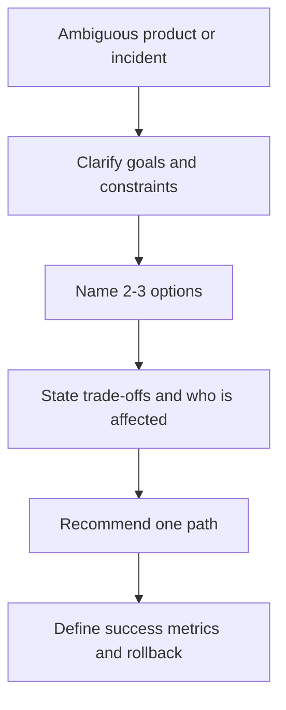

# Tech Lead & Leadership

> **Reviewed:** 2026-09 · **Level:** Tech Lead / Senior

This track covers the interviews that are not “what is a closure.” They test judgment: how you review work, make architecture decisions, mentor people, handle incidents, and talk about your own projects.

## Sections

| Section | What to practise |
| --- | --- |
| [Code reviews](./code-reviews/manual-review-guide.md) | Human review mindset and checklist |
| [Automated review process](./code-reviews/automated-review-process.md) | CI gates, PR policy, AI review as advisory |
| [Technical leadership](./tech-lead/01-architecture-decisions.md) | ADRs, design reviews, planning, delegation |
| [Behavioral](./behavioral/index.md) | STAR stories for ownership, conflict, failure, mentoring |

## Interview framing

A strong Tech Lead answer names the decision, the alternatives, the risk, and how you would know you were wrong.

## Related

- [Case studies](../case-studies/index.md) for project deep dives
- [DevOps reliability](../devops/reliability-and-incidents/index.md) for incident leadership
- [AI-assisted development playbook](../ai/ai-assisted-development/08-tech-lead-adoption-playbook.md) for introducing AI to a team
