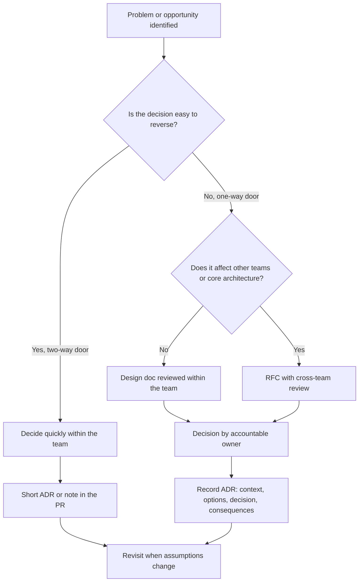

# Architecture Decisions

> **Reviewed:** 2026-09 · **Level:** Senior / Tech Lead · **Type:** Foundational

A Tech Lead is judged less on whether every decision was right and more on whether decisions were **made deliberately, at the right speed, with the right people, and recorded** so the team can revisit them. This page covers the tools (ADRs, RFCs, design docs) and the thinking (trade-offs, build vs buy, reversibility).

---

## Decision flow



---

## Q1. What is an ADR and when do you write one?

**Short answer:** An Architecture Decision Record is a short document capturing one significant decision: the context, the options considered, the decision, and its consequences. I write one whenever a decision is expensive to reverse, affects more than one team, or is likely to be questioned later, for example choosing a state management approach, a database, an API style or a monorepo tool. ADRs live in the repo next to the code, are numbered, and are never edited to change history; a new ADR supersedes an old one.

**How to think about it:** ADRs are for your future team, including new hires asking "why on earth did we do it this way?". The value is in the context and the rejected options, not the decision line.

**Example:**

```markdown
# ADR 0012: Use TanStack Query for server state in the web app

Status: Accepted (supersedes ADR 0004)
Date: 2026-09-01

## Context
Server data is cached in a global Redux store; we have repeated bugs with stale data,
duplicate requests and hand-written loading states.

## Options considered
1. Keep Redux, add RTK Query
2. TanStack Query for server state, keep a small client-state store
3. Move data fetching to server components only

## Decision
Option 2. Server state moves to TanStack Query; Redux remains for a small amount of UI state.

## Consequences
+ Caching, deduplication and retries handled by the library
+ Less boilerplate per endpoint
- Two state tools to learn; migration will take several sprints
- Need lint rules to prevent new server data in Redux
```

**Trade-offs and pitfalls:** Writing ADRs for trivial choices creates bureaucracy; not writing them for big ones leads to repeated debates. ADRs that are never linked from code or onboarding docs get forgotten.

**Remember:** Context, options, decision, consequences; immutable, superseded not edited.

## Q2. What is the difference between an ADR, an RFC and a design doc?

**Short answer:** A design doc explains how we will build something: problem, goals and non-goals, proposed design, alternatives, risks, rollout. An RFC is a design doc circulated for broader feedback, usually across teams, with a defined review period and decision owner. An ADR is the short, durable record of a decision that came out of either, or out of a smaller discussion.

**How to think about it:** Design doc and RFC are for *thinking and aligning before*; ADR is for *remembering after*.

**Example:** An RFC proposes moving from REST to GraphQL for the mobile BFF, collects feedback from three teams over two weeks, and results in ADR 0015 recording the decision and constraints.

**Trade-offs and pitfalls:** RFCs without a named decision owner and deadline drag on indefinitely. Design docs written after the code is done are documentation, not design.

**Remember:** Design doc to think, RFC to align, ADR to remember.

## Q3. How do you evaluate trade-offs between two technical options?

**Short answer:** I make the criteria explicit before comparing options: requirements that are hard constraints, then weighted qualities such as reliability, performance, team familiarity, operational cost, time to deliver and reversibility. I compare options against the criteria, ideally with a small spike or prototype for the riskiest unknown, and I state what we are giving up with the chosen option. Then I record it.

**How to think about it:** Most architecture debates are really disagreements about priorities. Getting agreement on criteria first makes the choice much easier.

**Example:**

| Criterion (weight) | Option A: Postgres + queue table | Option B: Managed message broker |
| --- | --- | --- |
| Delivery guarantees (high) | Good with transactions | Good, at-least-once |
| Operational burden (high) | Low, already run Postgres | Medium, new system to operate |
| Throughput headroom (medium) | Enough for current scale | Much higher |
| Team familiarity (medium) | High | Low |
| Reversibility (medium) | Easy to migrate later behind an interface | Harder once many consumers exist |

The decision might be Option A now, behind an interface, with a documented trigger for revisiting (for example sustained load beyond a measured threshold).

**Trade-offs and pitfalls:** Weighted scoring can create false precision; use it to structure discussion, not to replace judgment. Beware "resume-driven development" and choosing the familiar option by default.

**Remember:** Agree criteria first, spike the biggest unknown, name what you give up.

## Q4. How do you approach a build vs buy decision?

**Short answer:** Buy (or adopt open source) when the capability is not a differentiator, a mature product exists, and total cost of ownership is lower. Build when it is core to the product's competitive advantage, when requirements are unusual, or when vendor lock-in or compliance risks are unacceptable. I compare total cost over a few years: licensing, integration, operation, on-call, upgrades, and the opportunity cost of engineers not working on the product.

**How to think about it:** Ask "is this our core business?" and "who will maintain this in three years?".

**Example:** Authentication: buy an identity provider, because building secure auth, MFA and compliance is costly and not differentiating. Pricing engine for a marketplace: build, because it is the product.

**Trade-offs and pitfalls:** Build decisions underestimate maintenance; buy decisions underestimate integration effort, customization limits and exit cost. Always have an exit strategy: an abstraction layer or data export path.

**Remember:** Differentiator: build. Commodity: buy. Always count maintenance and exit cost.

## Q5. How do you treat reversible vs irreversible decisions differently?

**Short answer:** Two-way-door decisions, which are cheap to undo, should be made quickly by the people closest to the work, with a light record. One-way-door decisions, such as a public API contract, a database choice for core data, or a data model that clients depend on, deserve a design doc, wider review and a deliberate decision. A big part of the job is also turning one-way doors into two-way doors: interfaces, feature flags, versioned APIs, dual writes during migrations.

**How to think about it:** Match process weight to the cost of being wrong. Slowness on reversible decisions is itself a cost.

**Example:** Choosing a date library: team decision in a day. Choosing the event schema that five consumer teams will read: RFC with versioning strategy.

**Trade-offs and pitfalls:** Treating everything as irreversible creates analysis paralysis; treating everything as reversible creates expensive migrations.

**Remember:** Fast on two-way doors, careful on one-way doors, and make doors two-way where you can.

## Q6. The team is split between two architectures and you must decide. How do you do it?

**Short answer:** I make sure both options are understood by steel-manning each, agree on the criteria, and time-box the discussion. If data can settle it, I run a short spike. If it is still a judgment call, I make the decision as the accountable owner, explain the reasoning and what would make us revisit, record it in an ADR, and ask everyone to commit. I also follow up later to check whether the assumptions held.

**How to think about it:** The worst outcome is usually no decision. A clear decision with a known review trigger beats weeks of debate.

**Example:** Monorepo vs polyrepo: agree criteria (shared code, CI time, ownership, tooling cost), spike CI time on a monorepo prototype, decide, record the "revisit if CI exceeds our agreed budget" trigger.

**Trade-offs and pitfalls:** Deciding by seniority or loudness damages trust. Consensus is nice but not required; commitment is.

**Remember:** Steel-man, criteria, time-box, decide, record, commit, revisit.

<details>
<summary>Follow-up questions</summary>

- What if you turn out to be wrong? (Say so openly, use the revisit trigger, write a superseding ADR, and treat it as learning.)
- How do you involve stakeholders outside engineering? (Translate options into cost, risk and time-to-market terms.)
- Where do ADRs live? (In the repo, for example `docs/adr/`, so they are versioned and reviewed like code.)

</details>

---

## References

- [ADR GitHub organization: Architectural Decision Records](https://adr.github.io/)
- [Michael Nygard: Documenting Architecture Decisions](https://cognitect.com/blog/2011/11/15/documenting-architecture-decisions)
- [StaffEng guides](https://staffeng.com/guides/)
- [Google Engineering Practices](https://google.github.io/eng-practices/)
