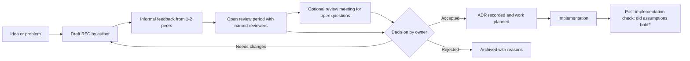

# Design Reviews and Engineering Standards

> **Reviewed:** 2026-09 · **Level:** Senior / Tech Lead · **Type:** Foundational

Design reviews catch expensive mistakes while they are still cheap: on paper instead of in production. Engineering standards and a tech radar keep many small decisions consistent without the Tech Lead being in every conversation. For recording decisions, see [Architecture decisions](./01-architecture-decisions.md).

---

## RFC lifecycle



---

## Q1. How do you run a design review that is actually useful?

**Short answer:** The author circulates a written design doc in advance with a clear problem statement, goals and non-goals, the proposed design, alternatives considered, risks, and rollout and rollback plans. Reviewers comment asynchronously first. The meeting, if needed, is only for unresolved questions, with a named decision owner and a time box. Outcomes and action items are written back into the doc, and the decision goes into an ADR.

**How to think about it:** Writing forces clarity, async review scales across time zones, and a meeting is a tool for disagreements, not for reading the doc aloud.

**Example:** A typical design doc template:

```markdown
# Design: <feature or system>
Author · Reviewers · Decision owner · Status · Review deadline

## Problem and context
## Goals / Non-goals
## Proposed design (diagrams, data model, APIs)
## Alternatives considered (and why not)
## Risks and mitigations (security, performance, data, cost)
## Rollout plan (flags, migration, backward compatibility)
## Rollback plan
## Observability (metrics, alerts, dashboards)
## Open questions
```

**Trade-offs and pitfalls:** Reviews that happen after code is written become rubber stamps or painful rewrites. Too many reviewers dilute accountability; invite the people whose systems are affected plus one or two experienced generalists.

**Remember:** Write first, review async, meet only for disagreements, decide and record.

## Q2. When does a change need a design review, and when is it overkill?

**Short answer:** It needs one when the change is hard to reverse, crosses team or service boundaries, introduces a new technology or data store, changes a public API or data contract, has significant security or privacy implications, or will take more than a few weeks of work. It is overkill for local, reversible changes that follow existing patterns; a good PR description is enough there.

**How to think about it:** Match process to risk and blast radius. Publish the criteria so engineers do not have to guess.

**Example:** New caching layer in front of the pricing service: design review. Adding a column with a default and a backfill using the standard migration pattern: PR only.

**Trade-offs and pitfalls:** Mandatory reviews for everything slow teams and drive people around the process. No reviews at all lead to inconsistent architecture.

**Remember:** Publish clear triggers based on reversibility and blast radius.

## Q3. How do you create engineering standards that people actually follow?

**Short answer:** Keep standards few, short and justified, co-write them with the engineers who will follow them, and automate as many as possible through linters, templates, scaffolding and CI. Each standard explains the why and has an owner and a process for proposing changes. Standards that cannot be automated go into review checklists and onboarding.

**How to think about it:** The best standard is the one that happens by default. "Paved road" tooling beats policy documents.

**Example:** Instead of a wiki page saying "all services must expose health checks and structured logs", provide a service template that already does, and a CI check that verifies it.

**Trade-offs and pitfalls:** Standards written by one person in isolation get ignored. Too many "musts" make every exception a fight; distinguish must, should and may.

**Remember:** Few, justified, co-owned, automated.

## Q4. What is a tech radar and how would you use one?

**Short answer:** A tech radar is a periodically updated view of technologies, tools and practices placed into rings such as Adopt, Trial, Assess and Hold, popularized by Thoughtworks. Internally it tells teams what is recommended, what is being experimented with, and what should not be used for new work. I would maintain it with a small group of senior engineers, update it on a regular cadence, and link each entry to a short rationale or ADR.

**How to think about it:** A radar reduces decision fatigue and sprawl while leaving room for experimentation in the Trial and Assess rings.

**Example:** Adopt: TypeScript strict mode, Playwright. Trial: a new build tool in one team. Assess: a new state library. Hold: a deprecated UI kit, with a migration guide.

**Trade-offs and pitfalls:** A stale radar is worse than none. A radar used as a hard ban list with no path to propose new tools discourages innovation.

**Remember:** Adopt, Trial, Assess, Hold, with rationale and a regular cadence.

## Q5. A senior engineer on another team keeps bypassing the design review process. What do you do?

**Short answer:** I talk to them privately first to understand why: often the process feels slow or irrelevant to their work. If the process is the problem, I fix it with lighter paths for low-risk changes and faster turnaround. If the risk is real, I explain the concrete impact of skipped reviews on other teams, and if it continues, involve their lead. I also make the process easier to follow than to skip.

**How to think about it:** Process non-compliance is feedback about the process as well as about the person.

**Example:** Introduce a "lightweight design note" option with a 48-hour async review for medium-risk changes, keeping full RFCs for cross-team changes.

**Trade-offs and pitfalls:** Public shaming damages relationships; ignoring it signals the process is optional.

**Remember:** Understand, fix the process, then hold the line.

<details>
<summary>Follow-up questions</summary>

- How do you keep design docs from going stale? (Mark status, link to ADRs for decisions, and treat the code and ADRs as the long-term source of truth.)
- How do you run design reviews across time zones? (Async-first with a review deadline; meetings recorded or rotated.)
- How do you make sure junior engineers participate? (Assign them as reviewers with a specific focus, such as testing or observability.)

</details>

---

## References

- [Thoughtworks Technology Radar](https://www.thoughtworks.com/radar)
- [ADR GitHub organization](https://adr.github.io/)
- [StaffEng guides](https://staffeng.com/guides/)
- [Google Engineering Practices](https://google.github.io/eng-practices/)
