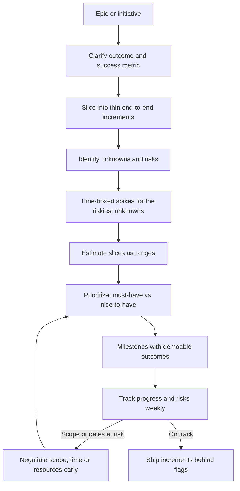

# Planning, Estimation and Delivery

> **Reviewed:** 2026-09 · **Level:** Senior / Tech Lead · **Type:** Foundational

A Tech Lead is accountable for the team delivering the right thing, predictably, without burning out. Interviewers probe whether you can turn ambiguity into a plan, communicate uncertainty honestly, and protect scope and quality under pressure.

---

## From epic to delivery

---

## Q1. How do you estimate a large piece of work with lots of unknowns?

**Short answer:** I break it into thin slices, estimate each as a range rather than a single number, and call out the unknowns explicitly. For the biggest unknowns I run time-boxed spikes first. I give a confidence level with the estimate, and I re-estimate as we learn. For larger initiatives I compare against similar past work, which is usually more accurate than bottom-up guessing.

**How to think about it:** An estimate is a probability distribution, not a promise. Communicate it with its uncertainty, and reduce uncertainty early by tackling the riskiest parts first.

**Example:** "Based on similar migrations, this is 6 to 10 weeks. The main uncertainty is the legacy billing integration; after a one-week spike we can narrow the range."

**Trade-offs and pitfalls:** Single-point estimates become deadlines. Padding silently erodes trust; stating ranges openly builds it. Story points compared across teams are meaningless.

**Remember:** Slice, range, confidence, spike the unknowns, re-estimate.

## Q2. Which estimation techniques do you know and when do you use them?

**Short answer:** Relative sizing such as story points or t-shirt sizes for backlog items within a stable team; three-point estimates of optimistic, likely and pessimistic for key tasks; reference-class estimation, comparing with similar past projects, for large initiatives; and throughput-based forecasting, counting how many similarly sized items the team typically completes, for release planning. For roadmap-level planning, t-shirt sizes are usually enough.

**How to think about it:** Choose the cheapest technique that gives the precision the decision actually needs.

**Example:** Quarterly planning uses t-shirt sizes; sprint planning uses points; a date commitment to a client uses throughput-based forecasting with a range.

**Trade-offs and pitfalls:** Over-investing in estimation is waste. Points used as productivity metrics get inflated.

**Remember:** Precision should match the decision.

## Q3. How do you break down an epic?

**Short answer:** I start from the user outcome and slice vertically: each slice delivers a thin, working, end-to-end piece that can be demoed and ideally released behind a flag. I separate out enabling work such as data migrations and infrastructure, identify dependencies on other teams early, and order slices to reduce the biggest risks first.

**How to think about it:** Vertical slices give early feedback and reduce integration risk; horizontal layers (all backend, then all frontend) delay learning until the end.

**Example:** "Saved payment methods" slices: (1) save a card at checkout for one provider, (2) list and select saved cards, (3) delete a card, (4) second provider, (5) default card and expiry reminders.

**Trade-offs and pitfalls:** Slices that are too thin create overhead; slices that are too big hide risk. Forgetting non-functional work such as observability and security review until the end is common.

**Remember:** Vertical, demoable, risk-first, dependencies surfaced early.

## Q4. How do you prioritize when everything is urgent?

**Short answer:** I make the trade-offs visible. I list the requests with their impact on users or the business, cost, urgency and risk of delay, and use a simple framework such as impact vs effort or cost of delay. Then I agree priority with the product manager and stakeholders instead of deciding alone. I protect a small capacity for operational work and tech debt so it does not always lose.

**How to think about it:** If everything is priority one, nothing is. Prioritization is a conversation with explicit criteria, not a private ranking.

**Example:** Three "urgent" asks: a security fix, a sales-requested feature and a performance improvement. The security fix goes first because of risk, the feature is scheduled with the PM based on revenue impact, and the performance work is scoped to its most impactful part.

**Trade-offs and pitfalls:** Prioritizing by who shouts loudest; constantly switching priorities, which destroys throughput.

**Remember:** Explicit criteria, shared decision, protected capacity.

## Q5. How do you delegate as a Tech Lead?

**Short answer:** I delegate outcomes, not tasks: I explain the goal, constraints and what good looks like, agree on checkpoints, and let the person choose the approach. I match the level of support to their experience with that kind of work. I stay accountable for the result and support them if it gets difficult, rather than taking the work back.

**How to think about it:** A lead who keeps all the interesting or critical work becomes the bottleneck and stops the team from growing.

**Example:** Delegating the design of a new notifications service to a senior engineer: the lead sets goals and constraints, reviews the design doc, and meets weekly; the engineer owns decisions and presents to stakeholders.

**Trade-offs and pitfalls:** Delegating without context sets people up to fail; micromanaging after delegating removes ownership. Delegating only boring work is not delegation.

**Remember:** Outcome, context, checkpoints, support, stay accountable.

## Q6. How do you manage delivery risk on a project?

**Short answer:** I keep a short, visible risk list with likelihood, impact, owner and mitigation, and review it weekly. I front-load risky work, use feature flags and incremental releases to reduce the cost of problems, watch leading indicators like scope growth and blocked work, and escalate early with options rather than late with surprises.

**How to think about it:** Risk management is about surfacing bad news early, when there are still choices.

**Example:**

| Risk | Likelihood | Impact | Mitigation | Owner |
| --- | --- | --- | --- | --- |
| Third-party API rate limits | Medium | High | Early load test, caching, request batching | Backend lead |
| Designer availability | High | Medium | Freeze designs for first two milestones | PM |
| Data migration complexity | Medium | High | Spike in sprint 1, dual-write plan | Tech Lead |

**Trade-offs and pitfalls:** A risk register nobody reads is theater. Escalating without options just transfers anxiety.

**Remember:** Visible risks, owners, front-load, escalate early with options.

## Q7. Product wants more scope than fits the deadline. How do you negotiate?

**Short answer:** I start from the shared goal: what outcome must be true on that date? Then I present options with their trade-offs: reduce scope to the must-haves, move the date, add people only if the work parallelizes well, or accept specific risks. I never silently cut quality or testing to hit a date. The decision is shared with product, and I write down what was agreed.

**How to think about it:** Scope, time, resources and quality are linked; if one is fixed, another must move. Make it a joint problem, not a fight.

**Example:** "We can ship guest checkout and card payments by the launch date. Wallet payments and saved addresses would follow two weeks later. Is that acceptable for launch goals?"

**Trade-offs and pitfalls:** Saying yes to everything leads to missed dates and burnout. Adding people late often slows a project down in the short term.

**Remember:** Shared goal, options with trade-offs, joint decision, written down.

Follow-up questions

- The team missed three sprint goals in a row. What do you do? (Look at the data: unplanned work, estimation, dependencies, WIP. Fix the system, not the people.)
- How do you handle a dependency on another team that is late? (Escalate early, decouple with contracts or mocks, and adjust sequencing.)
- How do you balance feature work with tech debt in planning? (A protected capacity allocation plus debt items tied to business impact.)

---

## References

- [DORA research](https://dora.dev/)
- [StaffEng guides](https://staffeng.com/guides/)
- [Google SRE Book: Embracing Risk](https://sre.google/sre-book/embracing-risk/)
