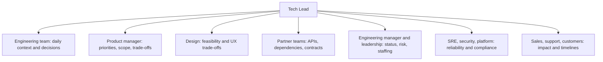

# Stakeholders and Communication

> **Reviewed:** 2026-09 · **Level:** Senior / Tech Lead · **Type:** Foundational

Much of a Tech Lead's impact comes from communication: aligning people who do not report to you, translating between technical and business language, and making status and risk visible without drama.

---

## Stakeholder map



---

## Q1. How do you manage stakeholders with different priorities?

**Short answer:** I first map who they are, what they care about and how much influence they have. I communicate with each in their own terms, keep a regular cadence, and make trade-offs explicit when priorities collide. When there is a genuine conflict I bring the parties together with the facts and options rather than negotiating separately, and escalate to whoever owns the priority if needed.

**How to think about it:** Stakeholders are rarely unreasonable; they usually lack context or have different incentives. Shared context reduces conflict.

**Example:** Sales wants a feature for a key customer; support wants stability fixes. Present both with impact data to the product manager and agree on a split plan: stability fix this sprint, feature scoped for the next.

**Trade-offs and pitfalls:** Telling each stakeholder what they want to hear creates bigger conflicts later. Over-communicating with everyone at the same depth wastes time.

**Remember:** Map, tailor, cadence, surface conflicts with options.

## Q2. How do you say no to a request from a senior stakeholder?

**Short answer:** I say "not now" or "yes, if", rather than a flat no. I acknowledge the goal behind the request, explain the concrete cost in terms of what else would slip or what risk it adds, and offer alternatives: a smaller version, a later date, or a workaround. If they still want it, I make the trade-off explicit and ask them to make the priority call with the product owner, and I document the decision.

**How to think about it:** Saying no is about protecting commitments and focus. The answer should help them reach their goal another way.

**Example:** "We can do the export feature, but it would delay the payments migration by about three weeks, which puts the compliance deadline at risk. Could a CSV export from the admin tool cover the immediate need?"

**Trade-offs and pitfalls:** Always saying yes destroys predictability. Saying no without alternatives damages relationships.

**Remember:** Acknowledge the goal, show the cost, offer alternatives, make the trade-off explicit.

## Q3. How do you communicate effectively across teams?

**Short answer:** Write things down: design docs, API contracts, decision records and short status notes in shared channels. Establish clear owners and points of contact for each dependency, agree on interfaces early, and have a regular sync only while the dependency is active. When something changes, communicate proactively instead of waiting to be asked.

**How to think about it:** Cross-team work fails at the boundaries. Contracts, owners and written context reduce boundary friction.

**Example:** For a shared API, the teams agree an OpenAPI or schema contract first, use contract tests and a mock server, and hold a short weekly sync until launch.

**Trade-offs and pitfalls:** Relying on hallway conversations excludes remote colleagues and loses decisions. Too many meetings slow everyone down.

**Remember:** Written, owned, contract-first, proactive.

## Q4. How do you write a good status update?

**Short answer:** Lead with the bottom line: status (on track, at risk, off track), what changed since last time, and any decision or help needed. Then progress against milestones, top risks with mitigations, and next steps. Keep it short, consistent in format, and honest; bad news goes at the top, not buried.

**How to think about it:** Readers skim. The first two lines should tell a busy leader whether they need to act.

**Example:**

```markdown
**Checkout redesign: At risk** (was: On track)

**Summary:** Payment provider sandbox issues have blocked integration testing for 4 days.
Launch date holds only if resolved by Friday.
**Decision needed:** Approve fallback to the existing provider for launch (keeps the date, defers new wallet support).

**Progress:** Milestones 1-2 done; 3 (payments) blocked; 4 (analytics) on track.
**Risks:** Provider sandbox (high; escalated to vendor); load test not yet run (medium; scheduled Tuesday).
**Next:** Vendor call Wednesday; decision on fallback by Thursday.
```

**Trade-offs and pitfalls:** Watermelon status reports, green outside and red inside, destroy trust once discovered. Very long updates do not get read.

**Remember:** Bottom line first, decisions needed, risks honest, consistent format.

## Q5. How do you explain a technical problem to non-technical stakeholders?

**Short answer:** I focus on impact, options and decisions rather than mechanism: what it means for users, revenue, risk or timelines, what the options are, and what I recommend. I use an analogy only if it helps, avoid jargon, and check understanding by asking what questions they have.

**How to think about it:** Stakeholders need enough understanding to make a decision, not to implement it.

**Example:** Instead of "our database is hitting connection limits", say "during peak sales, some customers can't check out. We have a quick fix that reduces the risk this week, and a proper fix that takes three weeks. I recommend doing both."

**Trade-offs and pitfalls:** Over-simplifying can hide real risk; oversharing detail loses the audience.

**Remember:** Impact, options, recommendation, check understanding.

<details>
<summary>Follow-up questions</summary>

- A stakeholder goes around you to ask engineers directly for work. What do you do? (Talk to them privately, explain the cost of unplanned work, and give them a clear, fast intake path.)
- How do you build trust with a new product manager? (Early one-to-one, shared goals, deliver on small commitments, share risks early.)
- How do you handle a leader who wants daily status updates? (Understand the concern, offer a concise written update and a dashboard, and agree a cadence.)

</details>

---

## References

- [StaffEng guides](https://staffeng.com/guides/)
- [Google Engineering Practices](https://google.github.io/eng-practices/)
