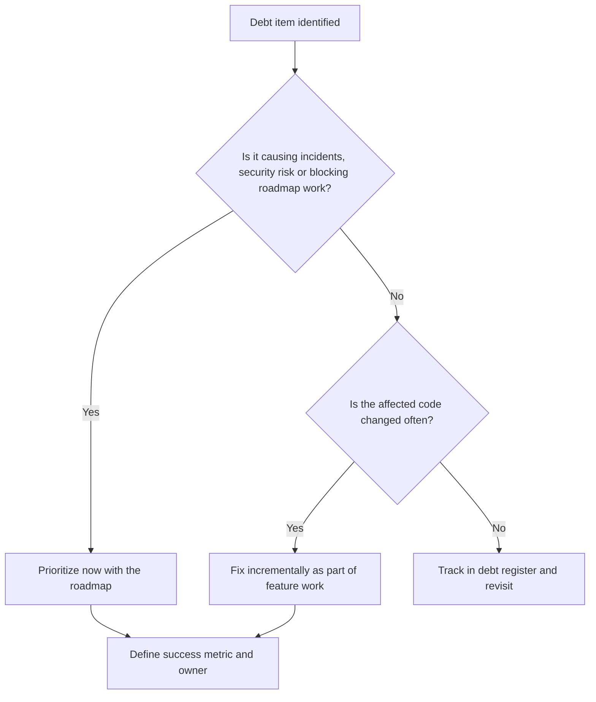
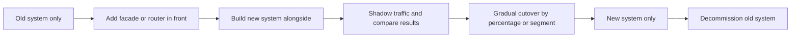

# Tech Debt, Quality and Migrations

> **Reviewed:** 2026-09 · **Level:** Senior / Tech Lead · **Type:** Foundational

Every team has tech debt. Interviewers want to see that you can make it visible, connect it to business impact, pay it down continuously, and run migrations without stopping delivery or breaking production.

---

## Tech debt triage

---

## Q1. How do you manage technical debt on your team?

**Short answer:** I make it visible in a lightweight debt register with impact, affected areas and rough cost, then prioritize by business impact: incidents caused, developer time lost, roadmap work blocked, security risk. I pay it down continuously with a protected share of capacity, fix debt opportunistically in code we are already changing, and schedule larger items like any other project with a clear goal.

**How to think about it:** Debt is not inherently bad; unmanaged, invisible debt is. Prioritize debt in areas that are changed often or cause pain; debt in stable, rarely-touched code can often wait.

**Example:** "Our checkout module causes a disproportionate share of incidents and every change there takes longer than elsewhere. Refactoring its state handling is the top debt item this quarter."

**Trade-offs and pitfalls:** A "tech debt sprint" once a year rarely works; continuous allocation does. Labeling every disliked pattern as debt dilutes the concept.

**Remember:** Visible, impact-ranked, continuous, tied to business outcomes.

## Q2. How do you convince product or leadership to invest in tech debt?

**Short answer:** Translate it into outcomes they care about: slower feature delivery, incident frequency and cost, customer impact, security or compliance risk, and onboarding time. Bring data where available, propose a scoped investment with a measurable result, and tie it to upcoming roadmap work that the debt blocks or slows.

**How to think about it:** "The code is messy" persuades no one. "This change will make the next three roadmap features faster and reduce checkout incidents" does.

**Example:** "Each new payment method currently takes several weeks because of duplicated integration logic. A four-week refactor to a provider interface makes the two methods planned for next quarter much cheaper."

**Trade-offs and pitfalls:** Overpromising the benefit of a refactor damages credibility when it lands. Hiding refactors inside feature estimates erodes trust if discovered.

**Remember:** Speak in delivery speed, risk and cost; propose scoped, measurable work.

## Q3. How do you balance speed, quality and reliability?

**Short answer:** I make the trade-off explicit per situation instead of having one fixed rule. For experiments and reversible features, speed wins with a minimum bar of tests and monitoring, and we record any shortcuts as debt. For payments, data integrity or security, quality and reliability win. Service level objectives and error budgets help: if we are within budget we can move faster; if we burn it, reliability work takes priority.

**How to think about it:** Quality practices such as tests, CI and small changes are what *enable* sustained speed. DORA research consistently finds that speed and stability tend to go together rather than trade off.

**Example:** A marketing landing page ships behind a flag with basic tests. A change to ledger calculations requires design review, thorough tests and a staged rollout.

**Trade-offs and pitfalls:** Always choosing speed accumulates fragility; always choosing quality misses market windows.

**Remember:** Risk-based bar, explicit shortcuts, error budgets, quality enables speed.

## Q4. How do you lead a large migration?

**Short answer:** Start with a clear why and an end state, then plan an incremental path: build the new system alongside the old, route traffic or usage gradually behind flags, run both in parallel where needed to compare results, migrate consumers in waves, and finally remove the old system. Make progress visible, automate the repetitive parts with codemods or scripts, and define rollback at each step.

**How to think about it:** The strangler fig pattern: grow the new system around the old one until the old one can be removed. Avoid big-bang cutovers.

**Example:**

**Trade-offs and pitfalls:** The most common failure is never finishing, leaving two systems to maintain forever. Budget explicitly for the last 20 percent and for decommissioning.

**Remember:** Why, end state, incremental, reversible, visible progress, finish the job.

## Q5. How do you migrate a large frontend codebase, for example from JavaScript to TypeScript or to a new framework version?

**Short answer:** Enable the new setup to coexist with the old, so new code starts on the target immediately. Migrate incrementally by module, prioritizing high-change and high-risk areas, use codemods for mechanical changes, and add a lint rule or CI check that prevents new code in the old style. Track the percentage migrated and celebrate milestones.

**How to think about it:** Stop the bleeding, then migrate the hot paths, then the long tail.

**Example:** For TypeScript: enable `allowJs`, write new files in TypeScript, turn on strict mode per folder, ban new `.js` files in CI, migrate the most-changed modules first.

**Trade-offs and pitfalls:** Loosening types just to "finish" the migration (lots of `any`) moves the debt rather than removing it.

**Remember:** Coexist, prevent new old-style code, migrate hot paths first, track progress.

## Q6. How do you raise quality on a team that ships a lot of bugs?

**Short answer:** First understand the pattern using incident and bug data: where do bugs come from, and what kinds are they? Then fix the system: better tests at the right level, CI gates, smaller PRs, clearer acceptance criteria, feature flags and staged rollouts, and blameless postmortems that produce real action items. I avoid blaming individuals and track escaped defects and change failure rate over time.

**How to think about it:** Quality is a property of the process, not just of individual care.

**Example:** Analysis shows most bugs come from missing edge cases in integration with a partner API. Adding contract tests and a sandbox-based integration suite addresses the largest category.

**Trade-offs and pitfalls:** Adding a QA gate at the end slows delivery without fixing root causes. Coverage targets alone produce low-value tests.

**Remember:** Data, root causes, system fixes, measure outcomes.

Follow-up questions

- When would you choose a rewrite over a refactor? (Rarely: only when the old system cannot meet essential requirements and incremental change is impossible; still deliver incrementally.)
- How do you handle debt you inherited from a previous lead? (Assess without judgment, understand the context in which it was created, then prioritize the same way.)
- What is an error budget? (The allowed unreliability implied by an SLO; when it is spent, reliability work takes priority over features.)

---

## References

- [Martin Fowler: Technical Debt Quadrant](https://martinfowler.com/bliki/TechnicalDebtQuadrant.html)
- [Martin Fowler: Strangler Fig Application](https://martinfowler.com/bliki/StranglerFigApplication.html)
- [DORA research](https://dora.dev/)
- [Google SRE Book: Embracing Risk](https://sre.google/sre-book/embracing-risk/)
