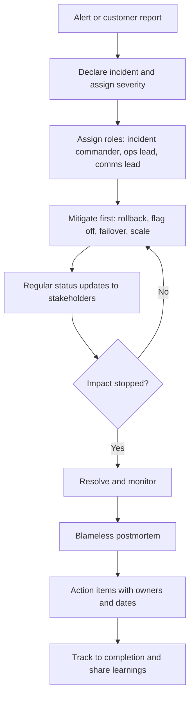

# Incidents and Disagreements

> **Reviewed:** 2026-09 · **Level:** Senior / Tech Lead · **Type:** Foundational

How a lead behaves under pressure, during outages and during heated technical debates, says a lot about their maturity. Interviewers look for calm structure, clear roles, blameless learning and the ability to reach decisions without damaging relationships. For reliability and on-call practices in more depth, see [DevOps and production engineering](../../devops/index.md).

---

## Incident flow



---

## Q1. How do you lead a production incident?

**Short answer:** Declare the incident early and set a severity. Assign clear roles: an incident commander who coordinates rather than debugs, people working the technical problem, and someone handling communication. Focus on mitigation before root cause: roll back, turn off a feature flag, fail over or scale. Keep a timeline in a shared channel, post regular updates to stakeholders at an agreed cadence, and declare resolution only when impact has stopped and metrics are stable. Then schedule a blameless postmortem.

**How to think about it:** The goal during an incident is to reduce customer impact as fast as possible. Understanding comes later.

**Example:** Error rate spikes after a deploy. The commander asks: "What changed?" The deploy is rolled back within minutes; errors drop; the team then investigates the diff in a calmer setting.

**Trade-offs and pitfalls:** The most senior engineer acting as both commander and debugger loses the big picture. Silence toward stakeholders creates panic and escalations.

**Remember:** Declare, roles, mitigate first, communicate on a cadence, postmortem.

## Q2. What makes a postmortem blameless, and why does it matter?

**Short answer:** A blameless postmortem assumes people acted reasonably with the information and tools they had, and asks how the system allowed the failure rather than who caused it. It matters because blame makes people hide information, and without honest information you cannot fix the real causes. Blameless does not mean no accountability: owners are accountable for completing the action items.

**How to think about it:** Replace "why did Alex push a bad config?" with "why was it possible to push a config that took down production without validation or a staged rollout?"

**Example:** A postmortem outline:

```markdown
# Postmortem: <title> (Severity N)
## Summary (impact, duration, customers affected)
## Timeline (detection, key decisions, mitigation, resolution)
## Contributing factors (technical, process, organizational)
## What went well / what went poorly / where we got lucky
## Action items (owner, due date, priority): prevent, detect, mitigate
## Lessons learned
```

**Trade-offs and pitfalls:** Postmortems that produce many low-value action items that never get done. "Human error" as a root cause means the analysis stopped too early.

**Remember:** Systems not people, honest timeline, few high-value actions with owners.

## Q3. How do you make sure postmortem action items actually get done?

**Short answer:** Keep the list short and prioritized, give each item a single owner and a due date, track them in the normal backlog rather than a separate document, and review open items in a regular reliability or operations review. Repeat incidents with unfinished action items are escalated.

**How to think about it:** A postmortem without completed actions is just a story.

**Example:** A monthly review shows postmortem items older than their due date; the Tech Lead negotiates capacity for the top ones with the product manager.

**Trade-offs and pitfalls:** Assigning actions to teams instead of people means nobody owns them.

**Remember:** Few, owned, dated, tracked, reviewed.

## Q4. Two senior engineers strongly disagree about a technical approach. How do you resolve it?

**Short answer:** I get each to write down their proposal and the reasoning, and ask each to state the other's position in a way the other agrees with. Then we agree the decision criteria and look for data, perhaps a short spike or benchmark. Often the disagreement is really about priorities or assumptions, and making those explicit resolves it. If it does not, the decision owner decides, explains why, records it, and asks for commitment.

**How to think about it:** Separate the people from the problem. Make the disagreement about criteria and evidence, not status.

**Example:** One wants event-driven integration, the other synchronous APIs. Clarifying criteria (consistency needs, latency, team experience) shows the real question is how stale the data can be; product confirms a delay of a few seconds is fine, which favors events.

**Trade-offs and pitfalls:** Letting it drag on hurts the team more than a suboptimal choice. Always siding with one person damages the other's trust.

**Remember:** Write it down, steel-man, criteria, evidence, decide, commit.

## Q5. What does "disagree and commit" mean, and when would you use it?

**Short answer:** It means voicing disagreement fully during the decision, then, once a decision is made, committing to make it succeed as if it were your own idea. I use it when a decision has been made through a fair process, the concerns were heard, and it is not an ethical, legal or safety issue. I make my concerns and the signals that would change my mind explicit, then commit.

**How to think about it:** Teams move faster when people can disagree openly without relitigating decisions afterwards.

**Example:** "I preferred the other database, and I've documented why. We've decided on this one, so I'll help make it work. If write latency exceeds our target in load testing, let's revisit."

**Trade-offs and pitfalls:** It does not mean staying silent, or committing to something unethical or unsafe. Performative commitment with quiet sabotage is worse than open disagreement.

**Remember:** Disagree openly, commit fully, name the revisit trigger, escalate only for ethics or safety.

## Q6. You made a technical decision that turned out badly. How do you handle it?

**Short answer:** I acknowledge it openly and quickly, focus on limiting the impact, and explain what we will do now. I look at why the decision seemed right at the time and what information was missing, share the learning, and update the process or the ADR. Owning mistakes as a lead makes it safe for the team to do the same.

**How to think about it:** Leaders model the culture. A lead who hides mistakes teaches the team to hide theirs.

**Example:** A caching strategy caused stale prices. The lead explains the issue to stakeholders, switches to a shorter TTL with event-based invalidation, and writes a superseding ADR noting the missed requirement.

**Trade-offs and pitfalls:** Over-apologizing without a plan does not help; defensiveness destroys trust.

**Remember:** Own it, fix it, learn, share.

<details>
<summary>Follow-up questions</summary>

- How do you decide incident severity? (Predefined criteria based on user impact, data risk and scope, so severity is not debated during the incident.)
- What do you do when an engineer is repeatedly involved in incidents? (Look for systemic factors first: tooling, review, ownership load; then offer support and coaching privately.)
- How do you handle a disagreement with your own manager? (Bring data and options privately, understand their constraints, then disagree and commit if appropriate.)

</details>

---

## References

- [Google SRE Book: Postmortem Culture](https://sre.google/sre-book/postmortem-culture/)
- [Google SRE Book: Managing Incidents](https://sre.google/sre-book/managing-incidents/)
- [DORA research](https://dora.dev/)
- [StaffEng guides](https://staffeng.com/guides/)
